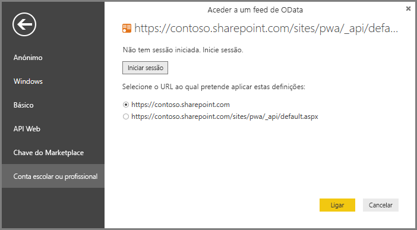

# Ligar a dados do Project Online através do Power BI Desktop
Pode ligar aos dados no Project Online a partir do Power BI Desktop.

## Passo 1: Transferir o Power BI Desktop
1. [Transfira o Power BI Desktop](https://go.microsoft.com/fwlink/?LinkID=521662) e, em seguida, execute o instalador para obter o **Power BI Desktop** no seu computador.

## Passo 2: Ligar ao Project Online com o OData
1. Abra o **Power BI Desktop**.
2. No ecrã de *Boas-vindas*, selecione **Obter Dados**.
3. Selecione **Feed OData** e selecione **Ligar**.
4. Introduza o endereço para o feed OData na caixa URL e, em seguida, clique em OK.
   
   Se o endereço do seu site Project Web App for semelhante a *https://\<nomeinquilino\>.sharepoint.com/sites/pwa*, o endereço que vai introduzir para o Feed OData é *https://\<nomeinquilino\>.sharepoint.com/sites/pwa/\_api/Projectdata*.
   
   No nosso exemplo, estamos a utilizar:

    `https://contoso.sharepoint.com/sites/pwa/default.aspx`

5. O Power BI Desktop pedirá para se autenticar com a sua conta do Office 365. Selecione Conta organizacional e, em seguida, introduza as suas credenciais.
   
   

A conta que utiliza para se ligar ao feed OData tem de ter pelo menos acesso ao Visualizador de Portefólio para o site do Project Web App. 

Aqui, pode escolher as tabelas às quais quer ligar e criar uma consulta.  Quer uma ideia de como começar?  A mensagem de blogue seguinte mostra como criar um gráfico de evolução com base nos dados do Project Online.  A mensagem de blogue refere-se à utilização do Power Query para ligar ao Project Online, mas isto aplica-se também ao Power BI Desktop.

[Criar gráficos de evolução para o Project através do Power Pivot e do Power Query](https://blogs.office.com/2014/03/24/creating-burndown-charts-for-project-using-power-pivot-and-power-query/)

