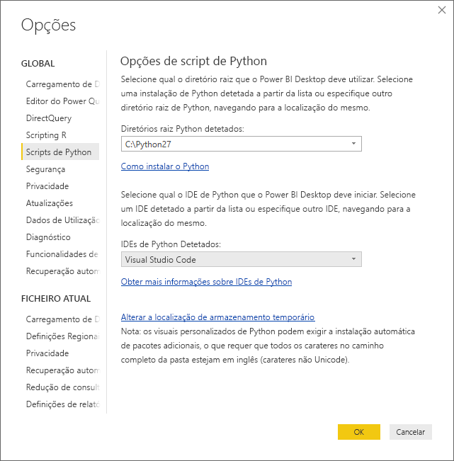

# Utilizar um IDE de Python externo com o Power BI
Com o **Power BI Desktop**, pode utilizar o IDE (Integrated Development Environment, Ambiente de Desenvolvimento Integrado) de Python externo para criar e refinar os scripts de Python e, depois, utilizar esses scripts no Power BI.

## Ativar um IDE de Python externo
Pode iniciar o IDE de Python externo a partir do **Power BI Desktop** e fazer com que os dados sejam automaticamente importados e apresentados no IDE de Python. A partir daí, pode modificar o script nesse IDE de Python externo e colá-lo novamente no **Power BI Desktop** para criar elementos visuais e relatórios do Power BI.

Pode especificar o IDE de Python que pretende utilizar e fazer com que seja iniciado automaticamente a partir do **Power BI Desktop**.

### Requirements
Para utilizar esta funcionalidade, tem de instalar um **IDE de Python** no seu computador local. O **Power BI Desktop** não inclui, implementa nem instala o mecanismo de Python, pelo que é necessário instalar separadamente o **Python** no seu computador local. Pode escolher o IDE de Python a utilizar com as seguintes opções:

* Pode instalar o seu IDE de Python favorito, muitos dos quais estão disponíveis gratuitamente, tal como o [Visual Studio Code (página de transferência)](https://code.visualstudio.com/download/).
* O **Power BI Desktop** também suporta o **Visual Studio**.
* Também pode instalar um IDE de Python diferente e fazer com que o **Power BI Desktop** inicie esse **IDE de Python** ao seguir um dos seguintes passos:
  
  * Pode associar ficheiros **.PY** ao IDE externo que pretende que o **Power BI Desktop** inicie.
  * Pode especificar o .exe que o **Power BI Desktop** deve iniciar ao selecionar *Outros* na secção **Opções de Script de Python** na caixa de diálogo **Opções**. Pode apresentar a caixa de diálogo **Ppções** ao aceder a **Ficheiro > Opções e definições > Opções**.
    
    

Se tiver múltiplos IDEs de Python instalados, pode especificar o que será iniciado ao selecioná-lo no menu pendente *IDEs de Python Detetados* na caixa de diálogo **Opções**.

Por predefinição, o **Power BI Desktop** iniciará o **Visual Studio Code** como IDE de Python externo se estiver instalado no computador local; se o **Visual Studio Code** não estiver instalado e tiver o **Visual Studio**, será esse o iniciado. Se nenhum desses IDEs de Python estiver instalado, será iniciada a aplicação associada aos ficheiros **.PY**.

Se não existir nenhuma associação de ficheiros **.PY**, é possível especificar um caminho para um IDE personalizado na secção *Navegue até ao seu IDE de Python preferido* da caixa de diálogo **Opções**. Também pode iniciar um IDE de Python diferente ao selecionar o ícone de engrenagem **Definições** junto ao ícone de seta **Iniciar IDE de Python**, no **Power BI Desktop**.

## Iniciar um IDE de Python a partir do Power BI Desktop
Para iniciar um IDE de Python a partir do **Power BI Desktop**, siga os seguintes passos:

1. Carregue os dados para o **Power BI Desktop**.
2. Selecione alguns campos no painel **Campos** com que quer trabalhar. Se ainda não tiver ativado os elementos visuais do script, ser-lhe-á pedido que o faça.
   
   
3. Quando os elementos visuais do script estiverem ativados, pode selecionar um elemento visual do Python no painel **Visualizações**, o qual cria um elemento visual do Python em branco que está pronto para apresentar os resultados do seu script. Também é apresentado o painel **Editor de scripts de Python**.
   
   
4. Agora, pode selecionar os campos que pretende utilizar no script de Python. Quando selecionar um campo, o campo **Editor de scripts de Python** cria automaticamente o código de script com base no campo ou campos que selecionar. Pode criar (ou colar) o script de Python diretamente no painel **Editor de scripts de Python** ou pode deixá-lo em branco.
   
   
   
   > [!NOTE]
   > O tipo de agregação predefinido para elementos visuais do Python é *não resumir*.
   > 
   > 
5. Agora, pode iniciar o IDE de Python diretamente a partir do **Power BI Desktop**. Selecione o botão **Iniciar IDE de Python** no lado direito da barra de título do **Editor de scripts de Python**, conforme mostrado abaixo.
   
   
6. O IDE de Python especificado é iniciado pelo Power BI Desktop, conforme mostrado na imagem seguinte (nesta imagem, o **Visual Studio Code** é o IDE de Python predefinido).
   
   
   
   > [!NOTE]
   > O **Power BI Desktop** adiciona as primeiras três linhas do script para poder importar os dados a partir do **Power BI Desktop**, depois de executar o script.
   > 
   > 
7. Qualquer script que tenha criado no painel **Editor de scripts de Python** do **Power BI Desktop** aparecerá a partir da linha 4 no IDE de Python. Neste momento, pode criar o script de Python no IDE de Python. Assim que o script de Python estiver concluído no IDE de Python, terá de o copiar e colar novamente no painel **Editor de scripts de Python** no **Power BI Desktop**, *excluindo* as primeiras três linhas do script geradas automaticamente pelo **Power BI Desktop**. Não copie as primeiras três linhas de script novamente para o **Power BI Desktop**; estas linhas só foram utilizadas para importar os dados para o IDE de Python a partir do **Power BI Desktop**.

### Limitações conhecidas
Iniciar um IDE de Python diretamente a partir do Power BI Desktop tem algumas limitações:

* A exportação automática do script do IDE de Python para o **Power BI Desktop** não é suportada.

## Próximos passos
Veja as seguintes informações adicionais sobre o Python no Power BI.

* [Executar scripts de Python no Power BI Desktop](desktop-python-scripts.md)
* [Criar elementos visuais do Power BI através de Python](desktop-python-visuals.md)

