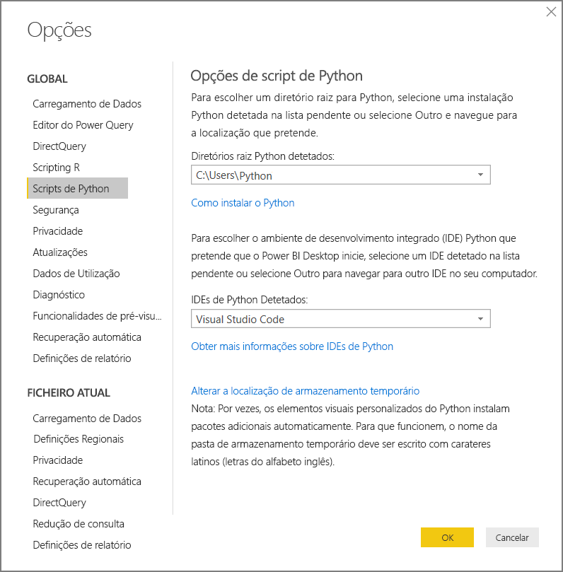
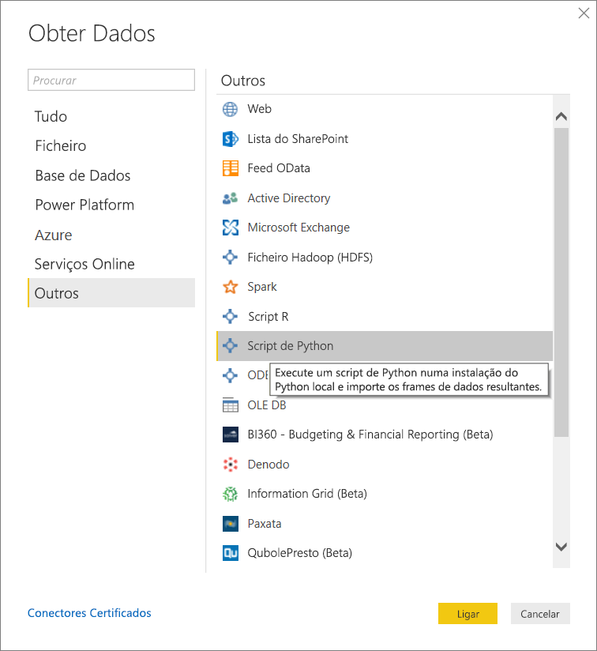
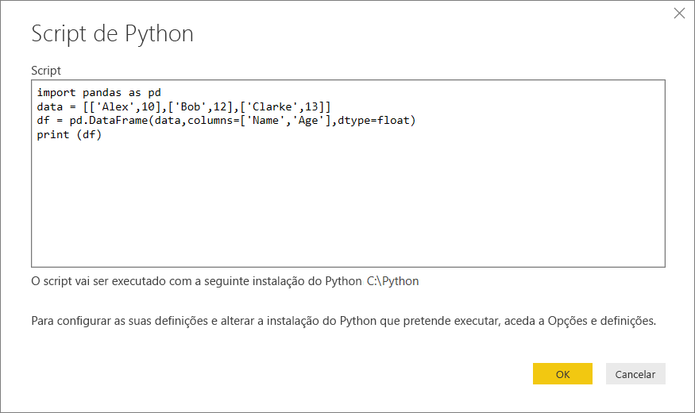
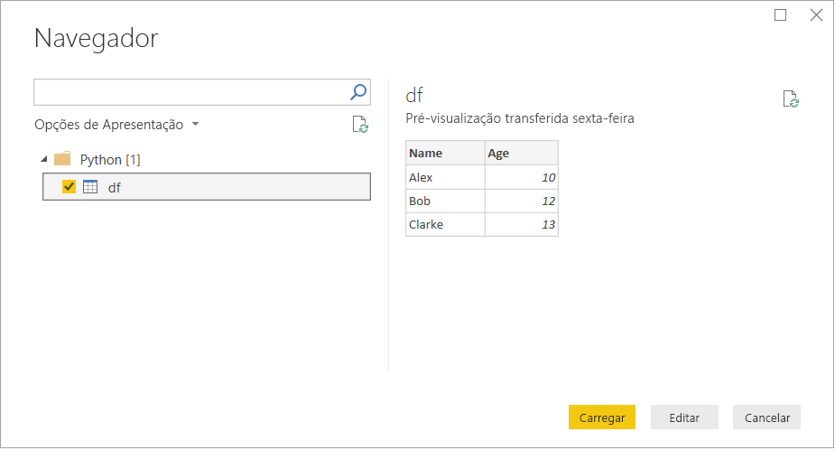
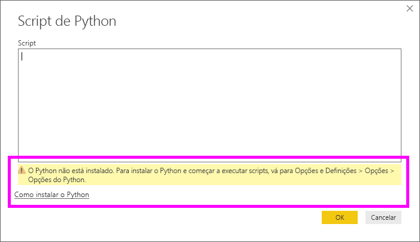

# <a name="run-python-scripts-in-power-bi-desktop"></a>Executar scripts de Python no Power BI Desktop

Pode executar scripts Python diretamente no Power BI Desktop e importar os conjuntos de dados resultantes para um modelo de dados do Power BI Desktop.

## <a name="install-python"></a>Instalar o Python

Para executar scripts Python no Power BI Desktop, tem de instalar o Python no computador local. Pode transferir o Python a partir do [Site do Python](https://www.python.org/). A versão atual dos scripts de Python suporta carateres e espaços Unicode no caminho de instalação.

### <a name="install-required-python-packages"></a>Instalar pacotes Python necessários

A integração do Python no Power BI necessita da instalação de dois pacotes de Python:

* [Pandas](https://pandas.pydata.org/). Uma biblioteca de software para análise e manipulação de dados. Oferece operações e estruturas de dados para manipular séries temporais e tabelas numéricas. Os seus dados importados têm de estar num [pacote de dados Pandas](https://www.tutorialspoint.com/python_pandas/python_pandas_dataframe.htm). Um pacote de dados é uma estrutura de dados bidimensional. Por exemplo, os dados são alinhados em linhas e colunas de tabela.
* [Matplotlib](https://matplotlib.org/). Uma biblioteca de gráficos para Python e a sua extensão numérica de expressões matemáticas [NumPy](https://www.numpy.org/). Fornece uma API orientada por objetos para incorporar gráficos em aplicações através de toolkits GUI para fins gerais, como o Tkinter, wxPython, Qt ou GTK+.

Numa consola ou shell, utilize a ferramenta de linha de comandos [pip](https://pip.pypa.io/en/stable/) para instalar os dois pacotes. A ferramenta pip inclui versões de Python mais recentes.

```CMD
pip install pandas
pip install matplotlib
```

## <a name="enable-python-scripting"></a>Ativar scripts de Python

Para ativar scripts de Python:

1. No Power BI Desktop, selecione **Ficheiro** > **Opções e Definições** > **Opções** > **Scripts de Python**. A página **Opções de scripts Python** será apresentada.

   

1. Se necessário, especifique o caminho de instalação local do Python nos **Diretórios raiz do Python detetados**.

   Na imagem acima, o caminho local de instalação de Python é *C:\Python*. Certifique-se de que o caminho aponta para a instalação local de Python que pretende que o Power BI Desktop utilize.

1. Selecione **OK**.

Depois de especificar a sua instalação de Python, estará tudo pronto para começar a executar scripts de Python no Power BI Desktop.

## <a name="run-python-scripts"></a>Executar scripts de Python

Pode executar scripts de Python e criar um modelo de dados em apenas alguns passos. A partir deste modelo, pode criar relatórios e partilhá-los no serviço Power BI.

### <a name="prepare-a-python-script"></a>Preparar um script de Python

Em primeiro lugar, crie um script no seu ambiente de desenvolvimento local de Python e certifique-se de que é executado com êxito. Por exemplo, eis um script de Python simples que importa a biblioteca Pandas e utiliza um pacote de dados:

```python
import pandas as pd
data = [['Alex',10],['Bob',12],['Clarke',13]]
df = pd.DataFrame(data,columns=['Name','Age'],dtype=float)
print (df)
```

Quando executado, este script devolve:

```python
     Name   Age
0    Alex  10.0
1     Bob  12.0
2  Clarke  13.0
```

Quando preparar e executar um script de Python no Power BI Desktop, existem algumas limitações:

* Apenas os pacotes de dados Pandas são importados, pelo que deve certificar-se de que os dados que pretende importar para o Power BI estão representados num pacote de dados
* Qualquer script de Python executado durante mais de 30 minutos expira
* As chamadas interativas no script de Python, como aguardar a entrada do utilizador, interrompem a execução do script
* Quando definir o diretório de trabalho no script de Python, é *necessário* definir um caminho completo para o diretório de trabalho, em vez de um caminho relativo
* Atualmente, não são suportadas tabelas aninhadas

### <a name="run-your-python-script-and-import-data"></a>Executar o script de Python e importar dados

Para executar o seu Script de Python no Power BI Desktop:

1. No friso Base, selecione **Obter Dados** > **Outros**.

1. Selecione **Outras** > **Script de Python**, conforme mostrado na seguinte imagem:

   

1. Selecione **Ligar**. A versão do Python mais recente instalada localmente será selecionada como o motor do Python. Copie o script para a caixa de diálogo **Script do Python** apresentada. Aqui, introduzimos o script de Python simples mostrado anteriormente.

   

1. Selecione **OK**. Se o script for executado com êxito, será apresentado o **Navegador** e poderá carregar e utilizar os dados. Por exemplo, selecione **df**, como mostrado na imagem, e selecione **Carregar**.

    

### <a name="troubleshooting"></a>Resolução de problemas

Se o Python não estiver instalado ou identificado, será apresentado um aviso. Também poderá ser apresentado um aviso caso tenha múltiplas instalações no computador local. Veja novamente as secções anteriores sobre como instalar e ativar os scripts de Python.



#### <a name="using-custom-python-distributions"></a>Utilizar distribuições Python personalizadas

O Power BI executa scripts diretamente ao utilizar o executável python.exe a partir de um diretório fornecido pelo utilizador (fornecido através da página de definições). As distribuições que requerem um passo adicional para preparar o ambiente (por exemplo, Conda) podem encontrar um problema quando a sua execução falhar.

Recomendamos a utilização da distribuição Python oficial de https://www.python.org/ para evitar problemas relacionados.

Como solução possível, pode iniciar o Power BI Desktop a partir do seu pedido de ambiente Python personalizado.

### <a name="refresh"></a>Atualizar

Pode atualizar um script de Python no Power BI Desktop. Para atualizar, aceda ao friso **Home Page** e selecione **Atualizar**. Quando atualizar um script de Python, o Power BI Desktop executará o script de Python novamente.

## <a name="known-limitations"></a>Limitações Conhecidas

Atualmente, não é possível utilizar scripts do Python em relatórios criados com a funcionalidade **Metadados Melhorados (Pré-visualização)** ativada. Os relatórios existentes continuarão a funcionar. Para obter mais informações, consulte [Utilizar metadados de conjuntos de dados otimizados (pré-visualização)](desktop-enhanced-dataset-metadata.md). 

## <a name="next-steps"></a>Próximos passos

Veja as seguintes informações adicionais sobre o Python no Power BI.

* [Criar Elementos Visuais do Python no Power BI Desktop](desktop-python-visuals.md)
* [Utilizar um IDE de Python externo com o Power BI](desktop-python-ide.md)
