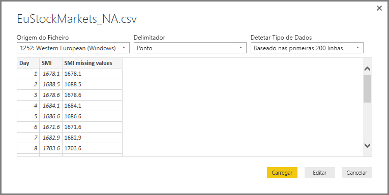
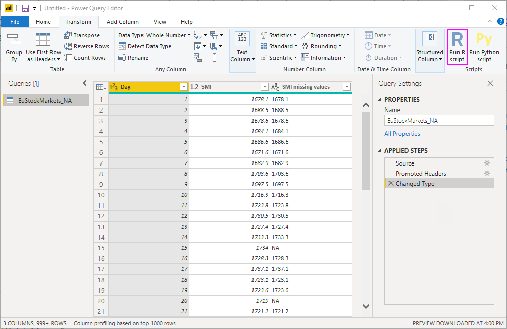

# <a name="use-r-in-power-query-editor"></a>Utilizar o R no Editor do Power Query

A [linguagem do R](https://mran.microsoft.com/documents/what-is-r) é uma linguagem de programação avançada que muitos estatísticos, cientistas de dados e analistas de dados utilizam. Pode utilizar o R no Editor do Power Query no Power BI Desktop para:

* Preparar modelos de dados.

* Criar relatórios.

* Efetuar limpeza de dados, formatação de dados avançada e análise de conjuntos de dados, que incluem a conclusão de dados em falta, predições, clustering e mais.  

## <a name="install-r"></a>Instalar o R

Pode transferir o R gratuitamente a partir da [página de transferência do Revolution R Open](https://mran.revolutionanalytics.com/download/) e do [Repositório CRAN](https://cran.r-project.org/bin/windows/base/).

## <a name="install-mice"></a>Instalar a biblioteca mice

Como pré-requisito, tem de instalar a [biblioteca mice](https://www.rdocumentation.org/packages/mice/versions/3.5.0/topics/mice) no seu ambiente R. Sem a biblioteca mice, o código de script de exemplo não irá funcionar corretamente. O pacote de mice implementa um método para lidar com os dados em falta.

Para instalar a biblioteca mice:

1. Inicie o programa R.exe (por exemplo, C:\Program Files\Microsoft\R Open\R-3.5.3\bin\R.exe).  

2. Executar o comando de instalação a partir do pedido R:

   ``` 
   install.packages('mice') 
   ```

## <a name="use-r-in-power-query-editor"></a>Utilizar o R no Editor do Power Query

Para demonstrar a utilização de R no Editor do Power Query, iremos utilizar um conjunto de dados da bolsa de valores contido num ficheiro .csv e trabalhar no mesmo através dos seguintes passos:

1. [Transfira o ficheiro EuStockMarkets_NA.csv](https://download.microsoft.com/download/F/8/A/F8AA9DC9-8545-4AAE-9305-27AD1D01DC03/EuStockMarkets_NA.csv). Lembre-se de onde o guardou.

1. Carregue o ficheiro para o Power BI Desktop. No separador **Base**, selecione **Obter Dados** > **Texto/CSV**.

   

1. Selecione o ficheiro EuStockMarkets_NA.csv e selecione **Abrir**. Os dados CSV são apresentados na caixa de diálogo **Ficheiro de Texto/CSV**.

   

1. Selecione **Carregar** para carregar os dados a partir do ficheiro. Depois de o Power BI ter carregado os dados, a nova tabela aparece no painel **Campos**.

   

1. Para abrir o Editor do Power Query, no friso **Base** selecione **Editar Consultas**.

   

1. No separador **Transformar**, selecione **Executar script do R**. É apresentado o editor **Executar script do R**. As linhas 15 e 20 têm dados em falta, bem como outras linhas que não são visíveis na imagem. Os seguintes passos mostram como o R completa essas linhas automaticamente.

   

1. Para este exemplo, introduza o seguinte código de script na caixa **Script** da janela **Executar script do R**. Substitua *&lt;O Caminho do Ficheiro&gt;* pelo caminho para EuStockMarkets_NA.csv no seu sistema de ficheiros local, por exemplo, C:/Users/Guilherme Sarmento/Documents/Microsoft/EuStockMarkets_NA.csv.

    ```r
       dataset <- read.csv(file="<Your File Path>/EuStockMarkets_NA.csv", header=TRUE, sep=",")
       library(mice)
       tempData <- mice(dataset,m=1,maxit=50,meth='pmm',seed=100)
       completedData <- complete(tempData,1)
       output <- dataset
       output$completedValues <- completedData$"SMI missing values"
    ```

    > [!NOTE]
    > Poderá ter de substituir uma variável chamada *saída* para criar corretamente o novo conjunto de dados com os filtros aplicados.

7. Selecione **OK**. O Editor do Power Query apresenta um aviso sobre a privacidade dos dados.

   
8. Dentro da mensagem de aviso, selecione **Continuar**. Na caixa de diálogo **Níveis de privacidade** que aparece, defina todas as origens de dados para **Público** para que os scripts do R funcionem corretamente no serviço Power BI. 

   

   Para obter mais informações sobre as definições de privacidade e as respetivas implicações, veja [Níveis de privacidade do Power BI Desktop](../admin/desktop-privacy-levels.md).

 9. Selecione **Guardar** para executar o script. 

   Repare na nova coluna no painel **Campos** com o nome **completedValues**. Existem alguns elementos de dados em falta nesta coluna, tal como nas linhas 15 e 18. Veja como o R processa isto na secção seguinte.

   Com apenas cinco linhas de script R, o Editor do Power Query preencheu os valores em falta com um modelo preditivo.

## <a name="create-visuals-from-r-script-data"></a>Criar elementos visuais a partir de dados de scripts R

Podemos agora criar um elemento visual para ver como o código de script do R com a biblioteca mice preenche os valores em falta.


Pode guardar todos os elementos visuais concluídos num ficheiro .pbix do Power BI Desktop e utilizar o modelo de dados e os respetivos scripts R no serviço Power BI.

> [!NOTE]
> Pode [transferir um ficheiro .pbix](https://download.microsoft.com/download/F/8/A/F8AA9DC9-8545-4AAE-9305-27AD1D01DC03/Complete%20Values%20with%20R%20in%20PQ.pbix) quando tiver concluído todos estes passos.

Após carregar o ficheiro .pbix para o serviço Power BI, precisa de seguir passos adicionais para ativar a atualização de dados de serviço e a apresentação de elementos visuais atualizados:  

* **Ativar a atualização agendada para o conjunto de dados**: Para ativar a atualização agendada para o livro que contém o seu conjunto de dados com scripts do R, veja como [Configurar a atualização agendada](refresh-scheduled-refresh.md). Este artigo também inclui informações sobre gateways pessoais.

* **Instalar um gateway pessoal**: precisa de ter um gateway pessoal instalado numa máquina onde estejam localizados o ficheiro e o R. O serviço Power BI acede a esse livro e recompõe os elementos visuais atualizados. Para obter mais informações, veja como [Utilizar gateways pessoais no Power BI](service-gateway-personal-mode.md).

## <a name="limitations"></a>Limitações

Existem algumas limitações a consultas que incluem scripts do R criados no Editor do Power Query:

* Todas as definições de origens de dados R têm de estar definidas como **Públicas**. Todos os outros passos numa consulta do Editor do Power Query também têm de estar públicos. 

   Para aceder às definições da origem de dados, no Power BI Desktop, selecione **Ficheiro** > **Opções e definições** > **Definições da origem de dados**.

   

   Na caixa de diálogo **Definições da origem de dados**, selecione uma ou mais origens de dados e, em seguida, selecione **Editar Permissões**. Defina o **Nível de Privacidade** como **Público**.

     
  
* Para agendar a atualização dos elementos visuais do R ou do conjunto de dados, ative a atualização agendada e instale um gateway pessoal no computador que contém o livro e o R. 

Há inúmeras coisas que pode fazer com o R e as consultas personalizadas. Explore e molde os seus dados da forma que pretende que apareçam.

## <a name="next-steps"></a>Próximos Passos

* [Introdução ao R](https://mran.microsoft.com/documents/what-is-r) 

* [Executar scripts R no Power BI Desktop](desktop-r-scripts.md) 

* [Utilizar um IDE R externo com o Power BI](desktop-r-ide.md) 

* [Criar elementos visuais com pacotes R no serviço Power BI](service-r-packages-support.md)
