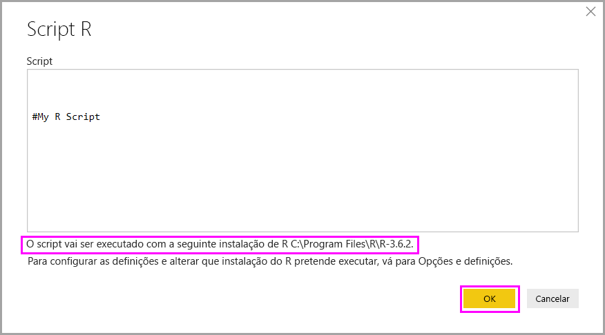

# Executar scripts R no Power BI Desktop

Pode executar scripts R diretamente no Power BI Desktop e importar os conjuntos de dados resultantes para um modelo de dados do Power BI Desktop.

## Instalar o R

Para executar scripts R no Power BI Desktop, tem de instalar o R no computador local. Pode transferir e instalar o R gratuitamente a partir de muitas localizações, incluindo a [Microsoft R Application Network](https://mran.revolutionanalytics.com/download/) e o [Repositório CRAN](https://cran.r-project.org/bin/windows/base/). A versão atual suporta carateres Unicode e espaços (caracteres vazios) no caminho de instalação.

## Executar scripts R

Com apenas alguns passos no Power BI Desktop, pode executar scripts R e criar um modelo de dados. Com o modelo de dados, pode criar relatórios e partilhá-los no serviço Power BI. O scripting R no Power BI Desktop suporta agora formatos numéricos com decimais (.) e vírgulas (,).

### Preparar um script R

Para executar um script R no Power BI Desktop, crie o script no seu ambiente de desenvolvimento local do R e certifique-se de que é executado com êxito.

Para executar o script no Power BI Desktop, verifique se é executado com êxito numa área de trabalho nova e não modificada. Este pré-requisito significa que todos os pacotes e dependências têm de ser explicitamente carregados e executados. Pode utilizar `source()` para executar os scripts dependentes.

Quando prepara e executa um script R no Power BI Desktop, existem algumas limitações:

* Uma vez que apenas os pacotes de dados são importados, lembre-se de representar os dados que quer importar para o Power BI num pacote de dados.
* As colunas escritas como Complexas e Vetoriais não são importadas e são substituídas por valores de erro na tabela criada.
* Os valores `N/A` são convertidos em valores `NULL` no Power BI Desktop.
* Se algum script R for executado durante mais de 30 minutos, expirará.
* As chamadas interativas no script R, como aguardar a entrada do utilizador, interrompem a execução do script.
* Quando definir o diretório de trabalho no script R, *tem* de definir um caminho completo para o diretório de trabalho, em vez de um caminho relativo.

### Executar o script R e importar dados

Agora pode executar o script R para importar dados para o Power BI Desktop:

1. No Power BI Desktop, selecione **Obter Dados**, escolha **Outro** > **Script R** e, em seguida, selecione **Ligar**:

    

2. Se o R estiver instalado no computador local, bastará copiar o script para a janela de scripts e selecionar **OK**. A versão mais recente instalada é apresentada como o motor R.

    

3. Selecione **OK** para executar o Script R. Quando o script é executado com êxito, pode escolher os pacotes de dados resultantes a adicionar ao modelo do Power BI.

Pode controlar qual a instalação R a utilizar para executar o script. Para especificar as definições de instalação do R, escolha **Ficheiro** > **Opções e definições** > **Opções** e, em seguida, selecione **Script R**. Em **Opções do script R**, a lista pendente **Diretórios raiz do R detetados** mostra as opções de instalação atuais do R. Se a instalação do R desejada não estiver listada, escolha **Outro** e, em seguida, navegue ou introduza a pasta de instalação do R preferencial em **Definir um diretório de raiz do R**.

### Atualizar

Pode atualizar um script R no Power BI Desktop. Quando atualiza um script R, o Power BI Desktop executa-o novamente no respetivo ambiente.

## Próximas etapas

Veja as seguintes informações adicionais sobre o R no Power BI.

* [Criar elementos visuais do Power BI através da linguagem R](../create-reports/desktop-r-visuals.md)
* [Utilizar um IDE do R externo com o Power BI](desktop-r-ide.md)
