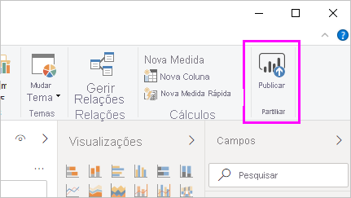
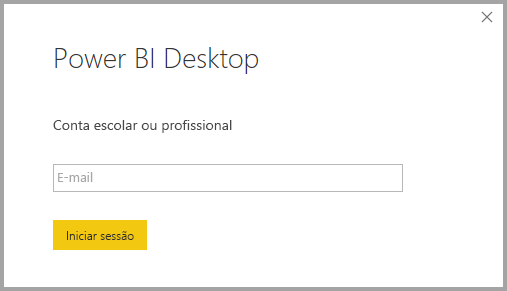
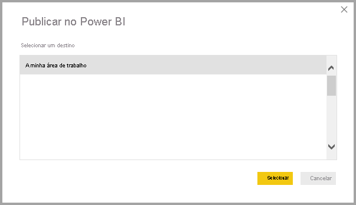
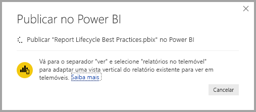
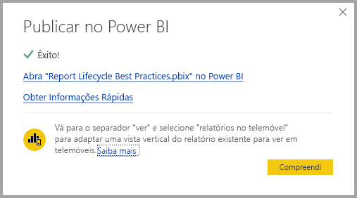
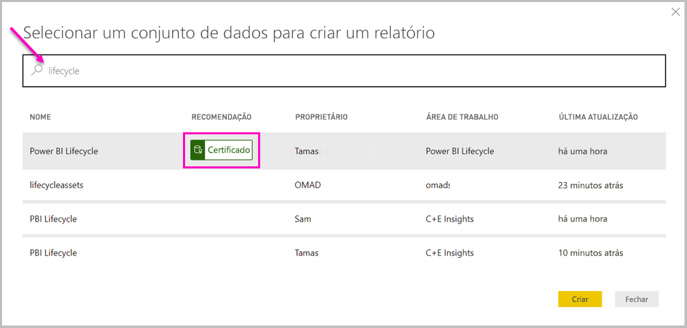
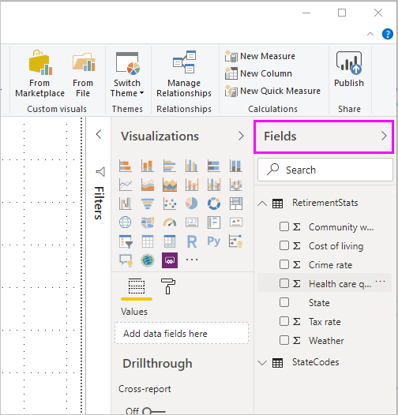

# Ligar a conjuntos de dados no serviço Power BI a partir do Power BI Desktop

Pode estabelecer uma ligação em direto com um conjunto de dados partilhado no *serviço Power BI* e criar muitos relatórios diferentes a partir do mesmo conjunto de dados. Pode criar o seu modelo de dados ideal no Power BI Desktop e publicá-lo no serviço Power BI. Em seguida, poderá (assim como outros utilizadores) criar vários relatórios diferentes em ficheiros *.pbix* separados a partir desse modelo de dados comum e guardá-los em diferentes áreas de trabalho. Esta funcionalidade é denominada *Ligação em direto do serviço Power BI*.

Esta funcionalidade tem todos os tipos de vantagens, incluindo as melhores práticas, que vamos abordar durante este artigo. Recomendamos que reveja as [considerações e limitações](#limitations-and-considerations) desta funcionalidade.

## Utilizar uma ligação em direto do serviço Power BI para a gestão do ciclo de vida dos relatórios

Um desafio com a popularidade do Power BI é a proliferação de relatórios, dashboards e os respetivos modelos de dados subjacentes. É fácil criar relatórios apelativos no Power BI Desktop e, em seguida, [publicá-los](../create-reports/desktop-upload-desktop-files.md) no serviço Power BI e criar excelentes dashboards a partir desses conjuntos de dados. Uma vez que muitas pessoas procedem assim, frequentemente com os mesmos (ou praticamente os mesmos) conjuntos de dados, tornou-se num desafio saber que relatório se baseava em qual conjunto de dados e quão recente era cada conjunto de dados. A ligação em direto do serviço Power BI aborda este desafio e torna a criação, partilha e expansão dos relatórios e dashboards de conjuntos de dados comuns mais fáceis e consistentes.

### Criar um conjunto de dados que todos possam utilizar e partilhar

Vamos supor que Ana é analista de negócios na sua equipa. É competente na criação de bons modelos de dados, muitas vezes chamados conjuntos de dados. Ana consegue criar um conjunto de dados e relatório e, em seguida, partilhar esse relatório no serviço Power BI.

Todas as pessoas adoram o relatório e o conjunto de dados da Ana. Era aí que começariam os problemas. Todas as pessoas na equipa da Ana iriam tentar criar *a sua própria versão* desse conjunto de dados e, em seguida, partilhar os próprios relatórios com a equipa. De repente, existiriam inúmeros relatórios de diferentes conjuntos de dados na área de trabalho da equipa no serviço Power BI. Qual era o mais recente? Os conjuntos de dados foram os mesmos ou apenas quase? Quais eram as diferenças? Com a funcionalidade ligação em direto do serviço Power BI, tudo isto pode melhorar. Na secção seguinte, vamos ver como as outras pessoas podem utilizar o conjunto de dados publicado da Ana para os seus próprios relatórios (e nas respetivas áreas de trabalho) e permitir a todos utilizar o mesmo conjunto de dados sólido, aprovado e publicado para criar relatórios exclusivos.

### Ligar a um conjunto de dados do serviço Power BI através de uma ligação em direto

A Ana cria um relatório e cria o conjunto de dados em que se baseia. Em seguida, publica-o no serviço Power BI. O relatório aparece na área de trabalho da equipa no serviço Power BI. Se a Ana o guardar numa *nova experiência de área de trabalho*, será possível definir a *Permissão de compilação* para disponibilizar o relatório para visualização e utilização para todas as pessoas que estiverem dentro e fora da sua área de trabalho.

Para saber mais sobre a nova experiência de áreas de trabalho, veja [áreas de trabalho](../collaborate-share/service-new-workspaces.md).

Os outros membros dentro e fora da área de trabalho da Ana podem agora estabelecer uma ligação em direto ao modelo de dados partilhado da Ana, através da funcionalidade ligação em direto do serviço Power BI. Podem criar os seus próprios relatórios exclusivos, a partir do *conjunto de dados original* na *sua nova experiência de áreas de trabalho*.

Na imagem seguinte, pode ver como a Ana cria um relatório do Power BI Desktop e o publica, o qual inclui o modelo de dados, no serviço Power BI. Em seguida, as pessoas podem ligar ao modelo de dados da Ana através da ligação em direto do serviço Power BI e criar relatórios exclusivos nas suas áreas de trabalho com base no conjunto de dados da Ana.

> [!NOTE]
> Se guardar o seu conjunto de dados numa [área de trabalho partilhada clássica](../collaborate-share/service-create-workspaces.md), apenas os membros dessa área de trabalho podem criar relatórios no seu conjunto de dados. Para estabelecer uma ligação em direto do serviço Power BI, o conjunto de dados ao qual ligar deve estar numa área de trabalho partilhada, da qual seja membro.
> 
> 

## Passo a passo para utilizar a ligação em direto do serviço Power BI

Agora que sabemos como a ligação em direto do serviço Power BI é útil e como a pode utilizar como uma abordagem recomendada para a gestão do ciclo de vida dos relatórios, vamos percorrer os passos que nos levam desde o excelente relatório e conjunto de dados da Ana até um conjunto de dados partilhado que os colegas na sua área de trabalho do Power BI podem utilizar.

### Publicar um relatório e conjunto de dados do Power BI

O primeiro passo na gestão do ciclo de vida dos relatórios com uma ligação em direto do serviço Power BI é ter um relatório e um conjunto de dados que os colegas queiram utilizar. Assim, a Ana tem de *publicar* primeiro o relatório no Power BI Desktop. Selecione **Publicar** no friso **Página Inicial** do Power BI Desktop.

Se a Ana não tiver sessão iniciada na conta do serviço Power BI, ser-lhe-á pedido para iniciar sessão.

A partir daí, a Ana pode escolher o destino da área de trabalho onde o relatório e o conjunto de dados serão publicados. Tenha em atenção que, se ela o guardar numa nova experiência de área de trabalho, todas as pessoas com permissão de Compilação poderão ter acesso a esse conjunto de dados. A permissão de Compilação é definida no serviço Power BI após a publicação. Se o trabalho for guardado numa área de trabalho clássica, apenas os membros com acesso à área de trabalho onde foi publicado um relatório poderão aceder ao conjunto de dados através de uma ligação em direto do serviço Power BI.

O processo de publicação é iniciado e o Power BI Desktop mostra o progresso.

Depois de concluído, o Power BI Desktop mostra se foi bem sucedido e fornece algumas as ligações para aceder ao relatório propriamente dito no serviço Power BI e uma ligação para obter informações rápidas sobre o relatório.

Agora que o relatório com o conjunto de dados está no serviço Power BI, também o pode *promover*. Promoção significa que atesta a sua qualidade e fiabilidade. Pode ainda pedir que o relatório seja *certificado* por uma autoridade central no seu inquilino do Power BI. Com uma destas recomendações, o seu conjunto de dados é sempre apresentado na parte superior da lista quando as pessoas estiverem à procura de conjuntos de dados. Para obter mais informações, veja [Promover o conjunto de dados](service-datasets-promote.md).

O último passo é definir a Permissão de compilação do conjunto de dados em que o relatório se baseia. A Permissão de compilação determina quem pode ver e utilizar o seu conjunto de dados. Pode vê-la na área de trabalho em si ou ao partilhar uma aplicação a partir da área de trabalho. Para obter mais informações, veja [Permissão de compilação dos conjuntos de dados partilhados](service-datasets-build-permissions.md).

Em seguida, vamos ver como outros colegas com acesso à área de trabalho onde o relatório e o conjunto de dados foram publicados podem ligar ao conjunto de dados e compilar os seus próprios relatórios.

### Estabelecer uma ligação em direto do serviço Power BI com o conjunto de dados publicado

Para estabelecer uma ligação ao relatório publicado e criar o seu próprio relatório baseado no conjunto de dados publicado, selecione **Obter Dados** no friso **Página Inicial** do Power BI Desktop, selecione **Power Platform** no painel esquerdo e, em seguida, selecione **Conjuntos de dados do Power BI**.

Se não tiver sessão iniciada, o Power BI pedirá para a iniciar. Uma vez iniciada a sessão, o Power BI mostra quais as áreas de trabalho de que é membro. Pode selecionar qual a área de trabalho que contém o conjunto de dados ao qual quer estabelecer a ligação em direto do serviço Power BI.

Os conjuntos de dados na lista são todos os conjuntos de dados partilhados para os quais tiver Permissão de compilação em qualquer área de trabalho. Pode procurar um conjunto de dados específico e ver o respetivo nome, proprietário, a área de trabalho onde se encontra e quando o mesmo foi atualizado pela última vez. Também pode ver a **RECOMENDAÇÃO** dos conjuntos de dados, quer sejam certificados ou promovidos, na parte superior da lista.

Quando selecionar **Criar**, estabelece uma ligação em direto ao conjunto de dados selecionado. O Power BI Desktop carrega os campos e os valores que vê no Power BI Desktop em tempo real.

Agora, o utilizador e as outras pessoas podem criar e partilhar relatórios personalizados, tudo a partir do mesmo conjunto de dados. Esta abordagem é uma ótima forma de ter uma pessoa com conhecimentos a criar um conjunto de dados bem formado, tal como o que a Ana faz. Muitos colegas da equipa podem utilizar este conjunto de dados partilhado para criar os seus próprios relatórios.

## Limitações e considerações

Quando utilizar a ligação em direto do serviço Power BI, existem algumas limitações e considerações a não esquecer.

* Apenas os utilizadores com Permissão de compilação de um conjunto de dados podem ligar a um conjunto de dados publicado através da ligação em direto do serviço Power BI.
* Os utilizadores com licenças gratuitas apenas veem os conjuntos de dados em **A Minha Área de Trabalho** e nas áreas de trabalho Premium deles.
* Uma vez que esta ligação é uma ligação em direto, a navegação à esquerda e a modelação estão desativadas. Apenas se pode ligar a um conjunto de dados em cada relatório. Este comportamento é semelhante ao comportamento quando está ligado aos *SQL Server Analysis Services*.
* Uma vez que esta ligação é uma ligação em direto, é aplicada uma segurança ao nível da linha (RLS), assim como outros comportamentos de ligação deste tipo. Ou seja, é o mesmo como quando estabelece ligação aos SQL Server Analysis Services.
* Se o proprietário modificar o ficheiro *.pbix* partilhado original, o conjunto de dados e o relatório partilhados no serviço Power BI serão substituídos. Os relatórios baseados nesse conjunto de dados não serão substituídos, mas as alterações feitas ao conjunto de dados serão refletidas no relatório.
* Os membros de uma área de trabalho não podem substituir o relatório partilhado originalmente. As tentativas para o fazer resultam num aviso que lhe pede para mudar o nome do ficheiro e publicar.
* Se eliminar o conjunto de dados partilhado no serviço Power BI, os restantes relatórios baseados nesse conjunto de dados deixarão de funcionar corretamente ou de apresentar os elementos visuais.
* Para Pacotes de Conteúdo, tem de criar primeiro uma cópia de um pacote de conteúdo antes de o utilizar como base para partilhar um relatório *.pbix* e o conjunto de dados no serviço Power BI.
* Para Pacotes de Conteúdo de *A Minha Organização*, depois de copiado, não pode substituir o relatório criado no serviço ou um relatório criado como parte da cópia de um Pacote de Conteúdo com uma ligação em direto. As tentativas para o fazer resultam num aviso que lhe pede para mudar o nome do ficheiro e publicar. Nesta situação, apenas pode substituir os relatórios ligados em direto publicados.
* Eliminar um conjunto de dados partilhado no serviço Power BI significa que todas as pessoas perderão o acesso a este conjunto de dados a partir do Power BI Desktop.
* Os relatórios que partilham um conjunto de dados no serviço Power BI não suportam implementações automatizadas que utilizam a API REST do Power BI.
