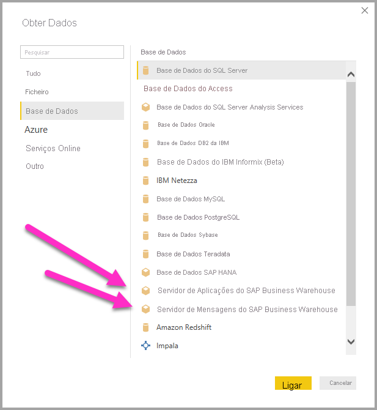
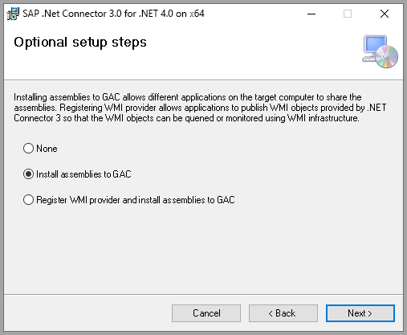
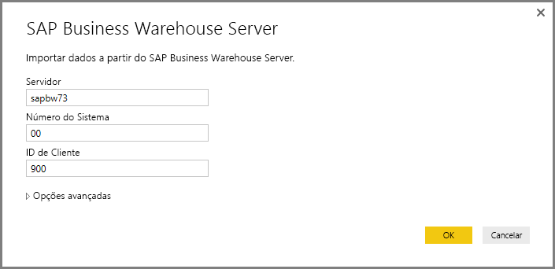
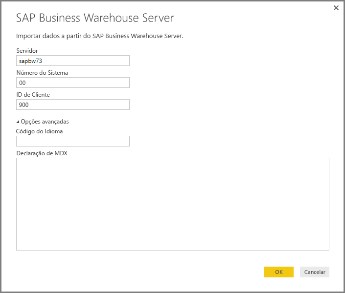
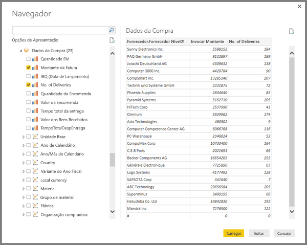
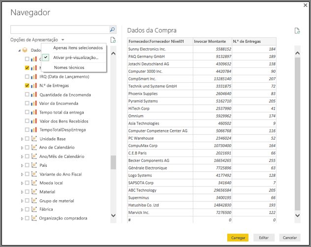
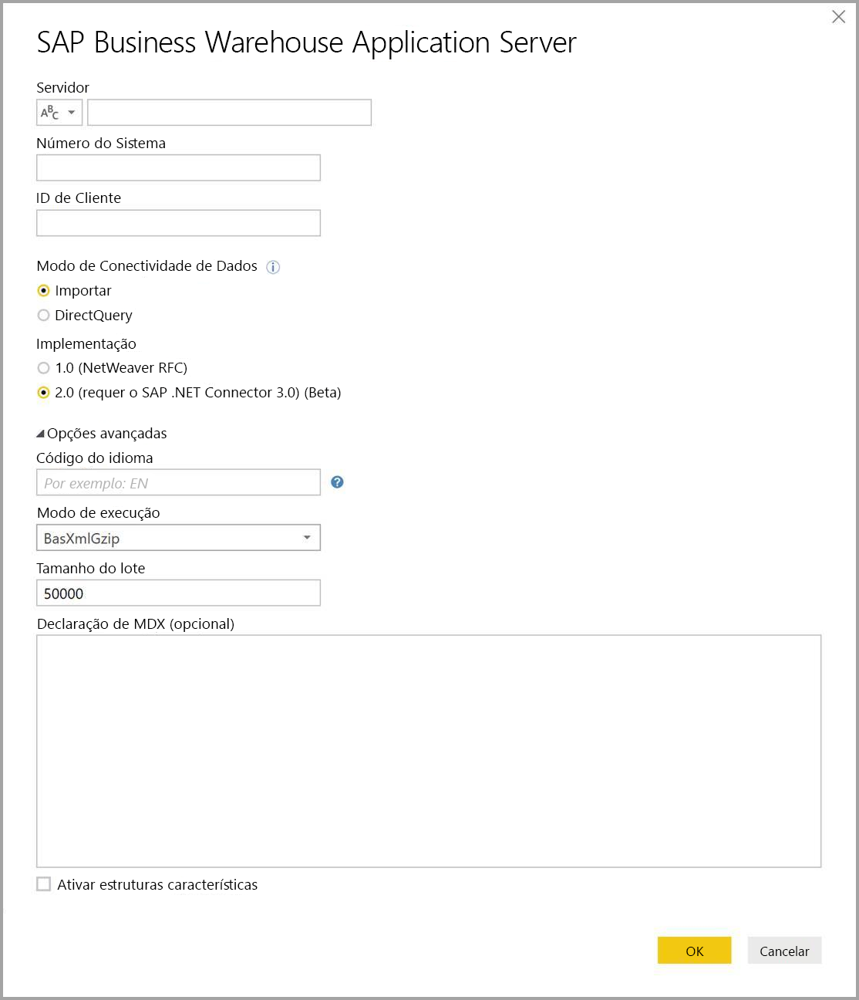
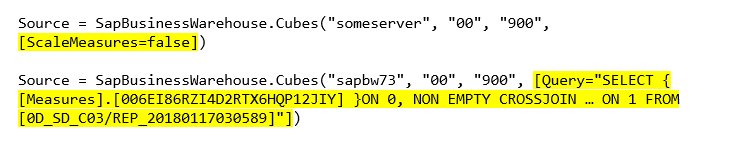
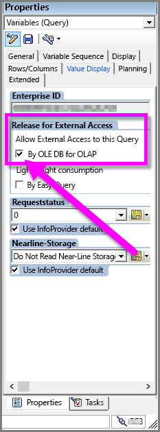

# <a name="use-the-sap-business-warehouse-connector-in-power-bi-desktop"></a>Utilizar o conector SAP Business Warehouse no Power BI Desktop

Com o Power BI Desktop, pode aceder aos dados do *SAP Business Warehouse (BW)* .

Para obter informações sobre como os clientes SAP podem beneficiar da ligação do Power BI aos sistemas SAP BW existentes, veja o [Power BI and SAP BW whitepaper](https://aka.ms/powerbiandsapbw) (Documento técnico do Power BI e do SAP BW). Para obter detalhes sobre a utilização do DirectQuery com o SAP BW, veja [DirectQuery e SAP Business Warehouse (BW)](desktop-directquery-sap-bw.md).

A partir da versão de junho de 2018 do Power BI Desktop, posteriormente disponibilizado na generalidade em outubro de 2018, pode utilizar o *conector SAP BW* com uma implementação que possui melhorias significativas no desempenho e nas funcionalidades. A Microsoft desenvolveu a *Implementação 2.0* do conector SAP BW. Selecione a versão 1 do Conector SAP BW ou a Implementação 2.0 do Conector SAP. As secções seguintes descrevem a instalação de cada versão, uma a uma. Pode selecionar um dos dois conectores ao ligar ao SAP BW a partir do Power BI Desktop.

Sugerimos que utilize a Implementação 2.0 do Conector SAP sempre que possível.

## <a name="installation-of-version-1-of-the-sap-bw-connector"></a>Instalação da versão 1 do Conector SAP BW

Recomendamos que utilize a Implementação 2.0 do Conector SAP sempre que possível. Esta secção descreve a instalação da versão 1 do Conector SAP BW.

1. Instale a biblioteca *SAP NetWeaver* no computador local. Pode obter a biblioteca SAP NetWeaver ajunto do seu administrador SAP ou diretamente do [SAP Software Download Center](https://support.sap.com/swdc) (Centro de Transferências de Software SAP). Visto que o Centro de Transferências de Software SAP muda a sua estrutura com frequência, não estão disponíveis orientações mais específicas para navegar no site. A biblioteca SAP NetWeaver é normalmente incluída na instalação das Ferramentas de Cliente SAP.

   Pode procurar a *Nota SAP n.º 1025361* para obter a localização onde se pode transferir a versão mais recente. Verifique se a arquitetura da biblioteca SAP NetWeaver (32 bits ou 64 bits) corresponde à instalação do Power BI Desktop. Instale todos os ficheiros incluídos no *SDK RFC SAP NetWeaver* de acordo com a Nota SAP.
2. No Power BI Desktop, selecione **Obter Dados** . A opção **Base de dados** inclui *SAP Business Warehouse Application Server* e *SAP Business Warehouse Message Server* .

   

## <a name="installation-of-implementation-20-sap-connector"></a>Instalação da Implementação 2.0 do Conector SAP

A Implementação 2.0 do Conector SAP necessita do .NET Conector 3.0 do SAP. É necessário um utilizador S válido para aceder à transferência. Contacte a equipa SAP Basis para obter o Conector .NET 3.0 do SAP.

Pode transferir o [.NET Conector 3.0 do SAP](https://support.sap.com/en/product/connectors/msnet.html) a partir do SAP.

O conector é disponibilizado nas versões de 32 bits e de 64 bits. Escolha a versão que corresponde à sua instalação do Power BI Desktop. Atualmente, o site apresenta duas versões do .NET 4.0 framework:

* Conector SAP para Microsoft .NET 3.0.22.0 para Windows de 32 bits (x86) como ficheiro zip (6896 KB), 1 de junho de 2019
* Conector SAP para Microsoft .NET 3.0.22.0 para Windows de 64 bits (x64) como ficheiro zip (7180 KB), 1 de junho de 2019

Quando instalar, nos **Passos de configuração opcionais** , confirme que seleciona *Instalar conjuntos para GAC* .



> [!NOTE]
> A primeira versão da implementação do SAP BW necessita dos DLLs do NetWeaver. Se estiver a utilizar a Implementação 2.0 do Conector SAP e não estiver a utilizar a primeira versão, os DLLs do Netweaver não serão necessários.

## <a name="version-1-sap-bw-connector-features"></a>Funcionalidades da versão 1 do Conector SAP BW

A versão 1 do Conector SAP BW no Power BI Desktop permite-lhe importar dados dos cubos do *SAP Business Warehouse Server* ou utilizar o DirectQuery.

Para saber mais sobre o Conector SAP BW e como o utilizar com o DirectQuery, veja [DirectQuery e SAP Business Warehouse (BW)](desktop-directquery-sap-bw.md).

Quando ligar, especifique um **Servidor** , o **Número de Sistema** e o **ID de Cliente** para estabelecer a ligação.



Também pode especificar duas **Opções avançadas** adicionais: o **Código de idioma** e uma **Instrução MDX** personalizada para executar no servidor especificado.



Se não especificar uma instrução MDX, a definição da ligação apresentará a lista de cubos disponíveis no servidor. Pode desagregar e selecionar itens dos cubos disponíveis, incluindo dimensões e medidas. O Power BI expõe as consultas e os cubos expostos pelas [Interfaces Open Analysis](https://help.sap.com/saphelp_nw70/helpdata/en/d9/ed8c3c59021315e10000000a114084/content.htm).

Ao selecionar um ou mais itens do servidor, a caixa de diálogo Navegador cria uma pré-visualização da tabela de saída.



A caixa de diálogo **Navegador** também fornece opções de apresentação:

* **Apresentar apenas itens selecionados** . por predefinição, o **Navegador** apresenta todos os itens.  esta opção é útil para verificar o conjunto final de itens selecionados. Uma abordagem alternativa para ver os itens selecionados é selecionar os nomes das colunas na área de pré-visualização.
* **Ativar pré-visualizações dos dados** . este valor é a predefinição. Apresenta a pré-visualização dos dados. A desativação das pré-visualizações de dados reduz o número de chamadas do servidor, uma vez que este não pede dados para as pré-visualizações.
* **Nomes técnicos** . o SAP BW suporta o conceito de *nomes técnicos* para objetos num cubo. Os nomes técnicos permitem que um proprietário de cubo exponha *nomes amigáveis* para objetos do cubo, em vez de apenas expor os *nomes físicos* desses objetos no cubo.



Depois de selecionar todos os objetos necessários, pode decidir o que fazer a seguir ao selecionar uma das seguintes opções:

* Selecione **Carregar** para carregar todo o conjunto de linhas para a tabela de saída no modelo de dados do Power BI Desktop. É apresentada a vista **Relatório** . Pode começar a visualizar os dados ou a fazer mais modificações com as vistas **Dados** ou **Relações** .
* Selecione **Editar** para abrir o **Editor de Consultas** . Especifique a transformação de dados adicional e os passos de filtragem antes de todo o conjunto de linhas ser colocado no modelo de dados do Power BI Desktop.

Além de importar os dados dos cubos do SAP BW, também pode importar os dados de uma ampla variedade de outras origens de dados no Power BI Desktop e combiná-los num único relatório. Esta capacidade apresenta todos os tipos de cenários interessantes para relatórios e análises dos dados do SAP BW.

## <a name="using-implementation-20-sap-bw-connector"></a>Utilizar a Implementação 2.0 do Conector SAP BW

Crie uma nova ligação para utilizar a Implementação 2.0 do Conector SAP BW. Para criar uma nova ligação, siga os seguintes passos.

1. Selecione **Obter Dados** . Selecione **SAP Business Warehouse Application Server** ou **SAP Business Warehouse Message Server** e, em seguida, estabeleça ligação.

2. Na nova caixa de diálogo de ligação, selecione a implementação. Ao selecionar **2.0** para a **Implementação** , como apresentado na seguinte imagem, ativa o **Modo de execução** , o **Tamanho do lote** e **Ativar estruturas características** .

    

3. Selecione **OK** . A partir daqui, a experiência é igual à descrita nas [Funcionalidades da versão 1 do Conector SAP BW](#version-1-sap-bw-connector-features) para a versão 1 do Conector BW SAP.

### <a name="new-options-for-implementation-20"></a>Novas opções para a Implementação 2.0

A Implementação 2.0 suporta as seguintes opções:

* *ExecutionMode* especifica a interface MDX utilizada para executar consultas no servidor. As seguintes opções são válidas:

  * `SapBusinessWarehouseExecutionMode.BasXml`
  * `SapBusinessWarehouseExecutionMode.BasXmlGzip`
  * `SapBusinessWarehouseExecutionMode.DataStream`

    O valor predefinido é `SapBusinessWarehouseExecutionMode.BasXmlGzip`.

    Utilizar o `SapBusinessWarehouseExecutionMode.BasXmlGzip` pode melhorar o desempenho quando ocorre latência elevada em grandes conjuntos de dados.

* *BatchSize* especifica o número máximo de linhas a obter numa determinada altura ao executar uma instrução MDX. Um pequeno número traduz-se em mais chamadas para o servidor ao obter um grande conjunto de dados. Um grande número de linhas poderá melhorar o desempenho, mas pode causar problemas de memória no servidor SAP BW. O valor predefinido é de 50 000 linhas.

* *EnableStructures* indica se as estruturas características são reconhecidas. O valor predefinido para esta opção é falso. Afeta a lista de objetos disponíveis para seleção. Não é suportado no modo de consulta Nativa.

A opção *ScaleMeasures* foi preterida nesta implementação. O comportamento é agora o mesmo que definir *ScaleMeasures* como falso, o que mostra sempre os valores sem escala.

### <a name="additional-improvements-for-implementation-20"></a>Melhorias adicionais para a Implementação 2.0

A seguinte lista descreve algumas das melhorias adicionais fornecidas com a nova implementação:

* Desempenho melhorado.
* Capacidade para obter vários milhões de linhas de dados e otimização através do parâmetro de tamanho do lote.
* Capacidade para mudar de modos de execução.
* Suporte para o modo comprimido. Especialmente vantajoso para ligações de latência elevada ou grandes conjuntos de dados.
* Deteção melhorada de variáveis `Date`.
* [Experimental] Expor dimensões de `Date` (DATS tipo ABAP) e `Time` (TIMS tipo ABAP) como datas e horas, respetivamente, em vez de valores de texto.
* Melhor processamento de exceções. Os erros que ocorrem nas chamadas BAPI são agora apresentados.
* Dobragem de colunas nos modos BasXml e BasXmlGzip. Por exemplo, se a consulta MDX gerada obtiver 40 colunas, mas a seleção atual precisar apenas de 10, este pedido será transmitido ao servidor para obter um conjunto de dados mais pequeno.

### <a name="changing-existing-reports-to-use-implementation-20"></a>Alteração de relatórios existentes para utilizar a Implementação 2.0

A alteração dos relatórios existentes para utilizar a Implementação 2.0 só é possível no modo de importação. Siga estes passos.

1. Abra um relatório existente, selecione **Editar Consultas** no friso e, em seguida, selecione a consulta SAP Business Warehouse a atualizar.

1. Clique com o botão direito do rato na consulta e selecione **Editor Avançado** .

1. No **Editor Avançado** , altere a chamada `SapBusinessWarehouse.Cubes` da seguinte forma:

    Determine se a consulta já contém um registo de opção, tal como no seguinte exemplo:

    

    Em caso afirmativo, adicione a opção `Implementation` 2.0 e remova a opção `ScaleMeasures`, se existir, como mostrado:

    

    Se a consulta ainda não incluir um registo de opções, bastará adicioná-lo. Para a opção seguinte:

    

    Basta alterá-lo para:

    

Foram feitos todos os esforços para tornar a Implementação 2.0 do Conector SAP BW compatível com a versão 1. No entanto, podem existir algumas diferenças devido aos diferentes modos de execução do SAP BW MDX que estão a ser utilizados. Para resolver discrepâncias, experimente alternar entre os modos de execução.

## <a name="troubleshooting"></a>Resolução de problemas

Esta secção apresenta situações de resolução de problemas (e soluções) para trabalhar com o conector SAP BW.

1. Os dados numéricos no SAP BW devolvem casas decimais com pontos em vez de vírgulas. Por exemplo, o número 1,000,000 é devolvido como 1.000.000.

   O SAP BW devolve dados decimais com `,` (vírgula) ou `.` (ponto) como separador decimal. Para especificar qual a definição do SAP BW que deve utilizar como separador decimal, o controlador utilizado pelo Power BI Desktop faz uma chamada para `BAPI_USER_GET_DETAIL`. Esta chamada devolve uma estrutura intitulada `DEFAULTS`, que tem um campo chamado `DCPFM`, que armazena a *Notação em Formato Decimal* . O campo recebe um dos seguintes valores:

   * “ ” (espaço) = o ponto decimal é uma vírgula: N.NNN,NN
   * “X” = o ponto decimal é um ponto: N,NNN.NN
   * “Y” = o ponto decimal é N NNN NNN,NN

   Os clientes que reportaram este problema descobriram que a chamada para `BAPI_USER_GET_DETAIL` está a falhar para um utilizador específico, o qual está a mostrar dados incorretos, com uma mensagem de erro semelhante à mensagem seguinte:

   ```xml
    You are not authorized to display users in group TI:
        <item>
            <TYPE>E</TYPE>
            <ID>01</ID>
            <NUMBER>512</NUMBER>
            <MESSAGE>You are not authorized to display users in group TI</MESSAGE>
            <LOG_NO/>
            <LOG_MSG_NO>000000</LOG_MSG_NO>
            <MESSAGE_V1>TI</MESSAGE_V1>
            <MESSAGE_V2/>
            <MESSAGE_V3/>
            <MESSAGE_V4/>
            <PARAMETER/>
            <ROW>0</ROW>
            <FIELD>BNAME</FIELD>
            <SYSTEM>CLNTPW1400</SYSTEM>
        </item>
   ```

   Para resolver este erro, os utilizadores têm de pedir ao administrador SAP que conceda o direito de executar `BAPI_USER_GET_DETAIL` ao utilizador SAP BW a ser utilizado no Power BI. Também é importante verificar se o utilizador tem o valor `DCPFM` necessário, conforme descrito anteriormente nesta solução de resolução de problemas.

2. Conectividade para consultas SAP BEx
   
   Pode executar consultas BEx no Power BI Desktop ao ativar uma propriedade específica, conforme mostrado na seguinte imagem:
   
   
   
3. A janela **Navegador** não mostra uma pré-visualização dos dados, mas sim uma mensagem de erro *a referência do objeto não foi definida como uma instância de um objeto* .
   
   Os utilizadores de SAP necessitam de acesso a módulos de função BAPI específicos para obter metadados e recuperar dados dos InfoProviders da SAP BW. Estes módulos incluem:

   * BAPI_MDPROVIDER_GET_CATALOGS
   * BAPI_MDPROVIDER_GET_CUBES
   * BAPI_MDPROVIDER_GET_DIMENSIONS
   * BAPI_MDPROVIDER_GET_HIERARCHYS
   * BAPI_MDPROVIDER_GET_LEVELS
   * BAPI_MDPROVIDER_GET_MEASURES
   * BAPI_MDPROVIDER_GET_MEMBERS
   * BAPI_MDPROVIDER_GET_VARIABLES
   * BAPI_IOBJ_GETDETAIL

   Para resolver o problema, confirme se o utilizador tem acesso aos diversos módulos MDPROVIDER e `BAPI_IOBJ_GETDETAIL`. Para obter mais informações sobre a resolução deste problema ou de outros semelhantes, pode ativar o rastreio. **Selecionar Ficheiro** > **Opções e definições** > **Opções** . Em **Opções** , selecione **Diagnóstico** e, em seguida, selecione **Ativar rastreio** . Tente recuperar os dados do SAP BW enquanto o rastreio estiver ativo e examine o ficheiro de rastreio para obter mais detalhes.

## <a name="sap-bw-connection-support"></a>Suporte para Ligações SAP BW

A seguinte tabela fornece detalhes sobre o suporte atual para SAP BW.

|Produto  |Modo  |Autenticação  |Conector  |Biblioteca SNC  |Suportado  |
|---------|---------|---------|---------|---------|---------|
|Power BI Desktop     |Qualquer         | Utilizador/palavra-passe  | Servidor de Aplicações | N/D  | Sim  |
|Power BI Desktop     |Qualquer         | Windows          | Servidor de Aplicações | sapcrypto + gsskrb5/gx64krb5  | Sim  |
|Power BI Desktop     |Qualquer         | Representação do Windows | Servidor de Aplicações | sapcrypto + gsskrb5/gx64krb5  | Sim  |
|Power BI Desktop     |Qualquer         | Utilizador/palavra-passe        | Servidor de Mensagens | N/D  | Sim  |
|Power BI Desktop     |Qualquer         | Windows        | Servidor de Mensagens | sapcrypto + gsskrb5/gx64krb5  | Sim  |
|Power BI Desktop     |Qualquer         | Representação do Windows | Servidor de Mensagens | sapcrypto + gsskrb5/gx64krb5  | Sim  |
|Power BI Gateway     |Importar      | Igual ao Power BI Desktop |         |   |   |
|Power BI Gateway     |DirectQuery | Utilizador/palavra-passe        | Servidor de Aplicações | N/D  | Sim  |
|Power BI Gateway     |DirectQuery | Representação do Windows (utilizador fixo, sem SSO) | Servidor de Aplicações | sapcrypto + gsskrb5/gx64krb5  | Sim  |
|Power BI Gateway     |DirectQuery | Opção Utilizar SSO através de Kerberos para consultas de DirectQuery | Servidor de Aplicações | sapcrypto + gsskrb5/gx64krb5   | Sim  |
|Power BI Gateway     |DirectQuery | Utilizador/palavra-passe        | Servidor de Mensagens | N/D  | Sim  |
|Power BI Gateway     |DirectQuery | Representação do Windows (utilizador fixo, sem SSO) | Servidor de Mensagens | sapcrypto + gsskrb5/gx64krb5  | Sim  |
|Power BI Gateway     |DirectQuery | Opção Utilizar SSO através de Kerberos para consultas de DirectQuery | Servidor de Mensagens | gsskrb5/gx64krb5  | Não  |
|Power BI Gateway     |DirectQuery | Opção Utilizar SSO através de Kerberos para consultas de DirectQuery | Servidor de Mensagens | sapcrypto  | Sim  |

## <a name="next-steps"></a>Próximos passos

Para obter mais informações sobre o SAP e o DirectQuery, veja os seguintes recursos:

* [DirectQuery and SAP HANA](desktop-directquery-sap-hana.md) (DirectQuery e SAP HANA)
* [DirectQuery e SAP Business Warehouse (BW)](desktop-directquery-sap-bw.md)
* [Utilizar o DirectQuery no Power BI](desktop-directquery-about.md)
* [Origens de dados do Power BI](power-bi-data-sources.md)
* [Documento técnico do Power BI e do SAP BW](https://aka.ms/powerbiandsapbw)
