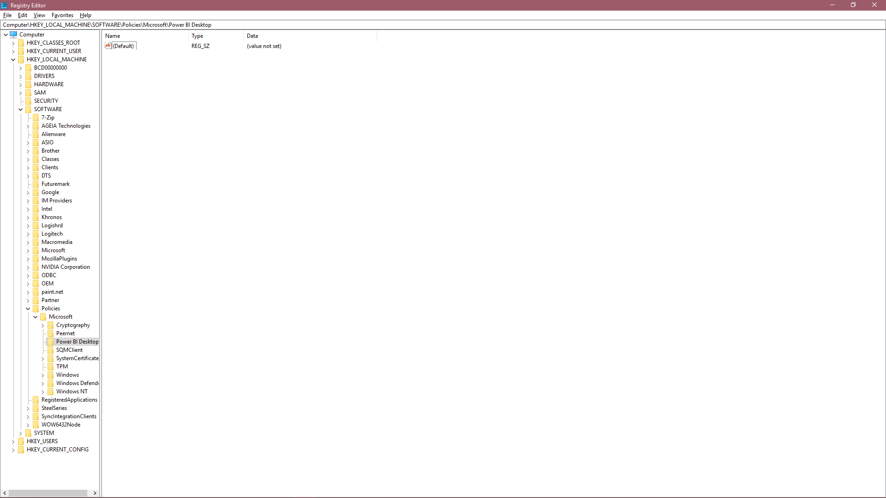

# Conectores de terceiros fidedignos

## Por que precisa de conectores de terceiros fidedignos?

No Power BI, regra geral, recomendamos que mantenha o seu nível de "Segurança de extensões de dados" no nível mais elevado, o que impede o carregamento de código não certificado pela Microsoft. No entanto, pode haver muitos casos em que pretende carregar conectores específicos: os que escreveu ou os que lhe foram fornecidos por um consultor ou fornecedor fora do percurso de certificação da Microsoft.

O programador de um determinado conector pode assiná-lo com um certificado e fornecer-lhe as informações de que precisa para carregá-los de forma segura sem reduzir as suas definições de segurança.

Se quiser saber mais sobre definições de segurança, pode ler sobre as mesmas [aqui](./desktop-connector-extensibility.md).

## Utilizar o registo para confiar em conectores de terceiros

Para confiar em conectores de terceiros no Power BI, liste o thumbprint do certificado em que pretende confiar num valor de registo especificado. Se este thumbprint corresponder ao thumbprint do certificado no conector que pretende carregar, poderá carregá-lo no nível de segurança "Recomendado" do Power BI. 

O caminho do registo é HKEY_LOCAL_MACHINE\Software\Policies\Microsoft\Power BI Desktop. Certifique-se de que o caminho existe ou crie-o. Escolhemos esta localização porque é principalmente controlada pela política das TI, além de exigir acesso de administrador do computador local para editar. 

Adicione um novo valor no caminho especificado acima. O tipo deverá ser "Multi-String Value" (REG_MULTI_SZ) e deverá ter o nome "TrustedCertificateThumbprints" 

Adicione os thumbprints dos certificados em que pretende confiar. Pode adicionar diversos certificados utilizando "\0" como delimitador. Em alternativa, no editor de registo, clique com o botão direito do rato -> modificar e coloque cada thumbprint numa nova linha. Exemplo de thumbprint retirado de um certificado autoassinado. 

 

Se tiver seguido corretamente as instruções e tiver recebido o thumbprint adequado do seu programador, deverá agora poder confiar em segurança nos conectores assinados com o certificado associado.

## Como Assinar Conectores

Se tiver um conector que você ou um programador precisem de assinar, pode ler sobre o mesmo na documentação do Power Query [aqui](/power-query/handlingconnectorsigning).