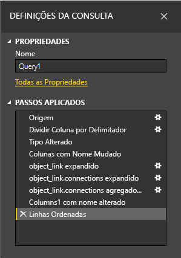

# Tutorial: Analisar dados do Facebook com o Power BI Desktop

Neste tutorial, irá aprender a importar dados do Facebook e a utilizá-los no Power BI Desktop. Vai ligar e importar dados da página do Facebook do Power BI, aplicar transformações aos dados importados e utilizar os dados em visualizações de relatórios.

> [!WARNING]
> Devido às restrições das permissões da Aplicação do Facebook, as funções de conector descritas neste artigo não estão atualmente a funcionar corretamente. Estamos a trabalhar com o Facebook para disponibilizar esta funcionalidade o mais rapidamente possível.

## Ligar a uma página do Facebook

Este tutorial utiliza dados da [página do Facebook do Microsoft Power BI](https://www.facebook.com/microsoftbi). Não precisa de credenciais especiais para se ligar e importar dados desta página, a não ser as de uma conta pessoal do Facebook.

1. Abra o Power BI Desktop e selecione **Obter dados** na caixa de diálogo **Introdução** ou no separador **Home Page** do friso, selecione **Obter Dados** e, em seguida, selecione **Mais**.
   
2. Na caixa de diálogo **Obter Dados**, selecione **Facebook** no grupo **Serviços Online** e, em seguida, selecione **Ligar**.
   
   
   
   É apresentada uma caixa de diálogo que o alerta sobre os riscos de utilização de um serviço de terceiros.
   
   
   
3. Selecione **Continuar**. 
   
4. Na caixa de diálogo **Facebook**, introduza o nome da página **microsoftbi** como **nome de utilizador**, selecione **Publicações** a partir do menu pendente **Ligação** e, em seguida, selecione **OK**.
   
   
   
5. Quando lhe forem pedidas as credenciais, inicie sessão na sua conta do Facebook e permita que o Power BI aceda à mesma.
   
   

   Depois de se ligar à página do Facebook do Power BI, é apresentada uma pré-visualização dos dados das publicações da página. 
   
   
   
## Formatar e transformar os dados importados

Imagine que pretende ver e mostrar as publicações com o maior número de comentários ao longo do tempo, mas reparou na pré-visualização de dados das mensagens que os dados na coluna **created_time** são difíceis de ler e compreender e não existem dados de comentários. Para tirar o máximo partido, formate e limpe os dados. Para tal, utilize o Editor do Power Query do Power BI Desktop para editar os dados antes ou depois de importá-los para o Power BI Desktop. 

### Dividir a coluna de data e hora

Primeiro, separe os valores de data e hora na coluna **created_time** para ser mais legível. 

1. Na pré-visualização dos dados do Facebook, selecione **Editar**. 
   
   
   
   O Editor do Power Query do Power BI Desktop abre numa nova janela e apresenta a pré-visualização dos dados da página do Facebook do Power BI. 
   
   
   
2. Selecione a coluna **created_time**. Trata-se de um tipos de dados de **Texto**, conforme indicado pelo ícone **ABC** no cabeçalho da coluna. Clique com o botão direito do rato no cabeçalho e selecione **Dividir Coluna** > **Pelo Delimitador** na lista do menu pendente. Em alternativa, selecione **Dividir Coluna** > **Pelo Delimitador** no grupo **Transformar** no separador **Home Page** do friso.  
   
   
   
3. Na caixa de diálogo **Dividir Coluna por Delimitador**, selecione **Personalizada** na lista pendente, introduza **T** (o caráter que inicia a parte correspondente à hora dos valores da coluna **created_time**) no campo de entrada e, em seguida, selecione **OK**. 
   
   
   
   A coluna é dividida em duas colunas diferentes que contêm as cadeias antes e depois do delimitador *T*. As novas colunas têm o nome **created_time.1** e **created_time.2** respetivamente. O Power BI detetou e alterou automaticamente os tipos de dados para **Data** na primeira coluna e para **Hora** na segunda coluna e formatou os valores de data e hora para serem mais legíveis.
   
4. Mude o nome das duas colunas. Selecione a coluna **created_time.1** e, em seguida, selecione **Mudar o nome** no grupo **Qualquer Coluna** do separador **Transformar** do friso. Em alternativa, faça duplo clique no cabeçalho da coluna e introduza o novo nome da coluna: **created_date**. Repita o mesmo processo para a coluna **created_time.2** e mude o nome da mesma para **created_time**.
   
   
   
### Expandir a coluna aninhada

Agora que os dados de data e hora estão como pretende, pode expor os dados dos comentários ao expandir uma coluna aninhada. 

1. Selecione o ícone  na parte superior da coluna **object_link** para abrir a caixa de diálogo **Expandir/Agregar**. Selecione **ligações** e **OK**. 
   
   
   
   O cabeçalho da coluna é alterado para **object_link.connections**.
2. Selecione o ícone  na parte superior da coluna **object_link.connections**, selecione **comentários** e, em seguida, selecione **OK**. O cabeçalho da coluna é alterado para **object_link.connections.comments**.
   
3. Selecione o ícone  na parte superior da coluna **object_link.connections.comments** e, desta vez, selecione **Agregar** ao invés de **Expandir** na caixa de diálogo. Selecione **# Contagem de ID** e, em seguida, selecione **OK**. 
   
   
   
   A coluna mostra agora o número de comentários de cada mensagem. 
   
4. Mude o nome da coluna **Contagem de object_link.connections.comments.id** para **Número de comentários**.
   
5. Selecione a seta para baixo junto ao cabeçalho da coluna **Número de comentários** e selecione **Ordenação Descendente** para ver as publicações ordenadas da mais comentada à menos comentada. 
   
   
   
### Rever os passos da consulta

À medida que formata e transforma os dados no Editor do Power Query, cada passo é registado na área **Passos Aplicados** do painel **Definições da Consulta** no lado direito da janela do **Editor do Power Query**. Pode recuar nos **Passos Aplicados** para ver as alterações efetuadas e editar, eliminar ou reorganizá-las, se for necessário. Tenha cuidado ao modificar estes passos, pois a alteração de passos anteriores pode afetar os passos seguintes. 

Depois de aplicar as transformações de dados, os **Passos Aplicados** deverão ter o seguinte aspeto:
   
   
   
   >[!TIP]
   >Os **Passos Aplicados** são fórmulas escritas na [linguagem de fórmulas do Power Query M](/powerquery-m/quick-tour-of-the-power-query-m-formula-language). Para ver e editar as fórmulas, selecione **Editor Avançado** no grupo **Consulta** do separador **Home Page** do friso. 

### Importar os dados transformados

Quando estiver satisfeito com os dados, selecione **Fechar e Aplicar** > **Fechar e Aplicar** no separador **Home Page** do friso para importar os dados para o Power BI Desktop. 
   
   
   
   Uma caixa de diálogo apresenta o progresso do carregamento dos dados para o modelo de dados do Power BI Desktop. 
   
   
   
   Quando o carregamento estiver concluído, os dados serão apresentados na vista **Relatório** como uma nova consulta no painel **Campos**.
   
   
   
## Utilizar os dados nas visualizações de relatórios 

Agora que importou os dados da página do Facebook, poderá rápida e facilmente obter informações sobre os seus dados com as visualizações. Criar uma visualização é fácil. Basta selecionar um campo ou arrastá-lo do painel **Campos** para a tela do relatório.

### Criar um gráfico de barras

1. Na vista **Relatório** do Power BI Desktop, selecione **mensagem** no painel **Campos** ou arraste-a para a tela do relatório. Uma tabela que mostra todas as mensagens é apresentada na tela. 
   
   
   
2. Com essa tabela selecionada, selecione também **Número de comentários** no painel **Campos** ou arraste-o para a tabela. 
   
3. Selecione o ícone **Gráfico de barras empilhadas** no painel **Visualizações**. A tabela é alterada para um gráfico de barras que mostra o número de comentários por mensagem. 
   
   
   
4. Selecione **Mais opções** (…) junto à visualização e, em seguida, selecione **Ordenar por** > **Número de comentários** para ordenar a tabela pelo número de comentários por ordem descendente. 

   A maioria dos comentários foi associada a mensagens **(Em branco)** (estas publicações podem ter sido histórias, ligações, vídeos ou outros conteúdos sem texto). 
   
5. Para filtrar as linhas em branco, selecione **a mensagem é (Todas)** no painel **Filtros**, selecione **Selecionar tudo** e, em seguida, selecione **(Em branco)** para desselecionar. 

   A entrada do painel **Filtros** muda para **a mensagem não está (Em branco)** e a linha **Em branco** desaparece da visualização do gráfico.
   
   
   
### Formatar o gráfico

A visualização está a ficar mais interessante, mas não consegue ver grande parte do texto da mensagem no gráfico. Para mostrar mais do texto da publicação:

1. Utilize os identificadores na visualização do gráfico para redimensionar o gráfico para ser tão grande quanto possível. 
   
2. Com o gráfico selecionado, selecione o ícone **Formato** (rolo de pintura) no painel **Visualizações**.
   
3. Selecione a seta para baixo junto ao **Eixo Y** e arraste o controlo de deslize **Tamanho máximo** o máximo para a direita (**50%** ). 
4. Reduza o **Tamanho do texto** para **10 pt** para que caiba mais texto.
   
   
   
   O gráfico mostra agora mais do conteúdo da mensagem. 
   
   
   
O eixo X (número de comentários) do gráfico não mostra os valores exatos e parece perdido na parte inferior do gráfico. Utilizemos etiquetas de dados: 

1. Selecione o ícone **Formato** e, em seguida, defina o controlo de deslize do **Eixo X** como **Desativado**. 
   
2. Defina o controlo de deslize **Etiquetas de dados** como **Ativado**. 

   Agora, o gráfico mostra o número exato de comentários de cada mensagem.
   
   
   
### Editar o tipo de dados

Agora está melhor, mas todas as etiquetas de dados possuem uma casa decimal **0,0**, o que pode criar confusão e levar ao engano, pois o **Número de publicações** tem de ser um número inteiro. Para corrigir as etiquetas, terá de alterar o tipo de dados da coluna **Número de publicações** para **Número inteiro**:

1. Clique com o botão direito em **Query1**, no painel **Campos**, ou paire o rato sobre o mesmo e selecione **Mais opções** (...). 

2. No menu de contexto, selecione **Editar consulta**. Em alternativa, selecione **Editar Consultas** > **Editar Consultas** no grupo **Dados externos** do separador **Home Page** do friso. 
   
3. A partir da janela **Editor do Power Query**, selecione a coluna **Número de comentários** e altere o tipo de dados ao seguir um destes passos: 
   - Selecione o ícone **1.2** junto ao cabeçalho da coluna **Número de comentários** e, em seguida, **Número Inteiro** na lista pendente
   - Clique com o botão direito do rato no cabeçalho da coluna e, em seguida, selecione **Alterar Tipo** > **Número Inteiro**.
   - Selecione **Tipo de dados: Número Decimal** no grupo **Transformar** do separador **Home Page** ou no grupo **Qualquer Coluna** do separador **Transformar** e, em seguida, selecione **Número Inteiro**.
   
   O ícone no cabeçalho da coluna é alterado para **123**, o que indica um tipo de dados de **Número Inteiro**.
   
   
   
3. Para aplicar as alterações, selecione **Ficheiro** > **Fechar e Aplicar** ou **Ficheiro** > **Aplicar** para manter a janela **Editor do Power Query** aberta. 

   Depois de carregar as alterações, as etiquetas de dados no gráfico tornam-se números inteiros.
   
   
   
### Criar uma segmentação de dados de data

Suponha que pretende visualizar o número de comentários nas publicações ao longo do tempo. Pode criar uma visualização da segmentação de dados para filtrar os dados do gráfico para períodos de tempo diferentes. 

1. Selecione uma área da tela em branco e, em seguida, selecione o ícone **Segmentação de dados** no painel **Visualizações**. 

   É apresentada uma visualização da segmentação de dados em branco.
   
   
   
2. Selecione o campo **created_date** no painel **Campos** ou arraste-o para a nova segmentação de dados. 

   A segmentação de dados é alterada para um controlo de deslize do intervalo de datas, com base no tipo de dados **Data** do campo.
   
   
   
3. Desloque os identificadores do controlo de deslize para selecionar intervalos de datas diferentes e observe a forma como os dados do gráfico são filtrados em conformidade. Também pode selecionar os campos de data na segmentação de dados e o tipo em datas específicas ou escolhê-los num pop-up de calendário.
    
   
   
### Formatar as visualizações

Dê ao gráfico um título mais descritivo e apelativo: 

1. Com o gráfico selecionado, selecione o ícone **Formato** no painel **Visualizações** e, em seguida, selecione a seta de lista pendente junto ao **Título** para expandi-lo.

2. Altere o **Texto do título** para **Comentários por mensagem**. 

3. Selecione a seta de lista pendente junto a **Cor do tipo de letra** e selecione a cor verde para corresponder às barras verdes da visualização.

4. Aumente o **Tamanho do texto** para **10 pt** e altere a **Família do tipo de letra** para **Segoe (Negrito)** .

5. Experimente outras opções e definições de formatação para alterar o aspeto das visualizações. 

   

## Criar mais visualizações

Como pode ver, é fácil personalizar visualizações no relatório para apresentar os dados da forma que pretende. Por exemplo, experimente utilizar os dados importados do Facebook para criar este gráfico de linhas que mostra o número de comentários ao longo do tempo.

O Power BI Desktop fornece uma experiência perfeita de ponta a ponta, desde a obtenção de dados por meio de uma ampla variedade de origens de dados e a modelação desses dados para atender às suas necessidades de análise para a visualização de tais dados de maneiras avançadas e interativas. Quando o seu relatório estiver pronto, pode [carregá-lo para o serviço Power BI](../create-reports/desktop-upload-desktop-files.md) e criar dashboards com base no mesmo para partilhar com outros utilizadores do Power BI.

## Próximos passos
* [Microsoft Learn para Power BI](/learn/powerplatform/power-bi?WT.mc_id=powerbi_landingpage-docs-link)
* [Visitar o Fórum do Power BI](https://go.microsoft.com/fwlink/?LinkID=519326)
* [Ler o Blogue do Power BI](https://go.microsoft.com/fwlink/?LinkID=519327)