# Tutorial: Analisar dados de páginas Web com o Power BI Desktop

Sendo um adepto de futebol há muito tempo, quer elaborar um relatório sobre os vencedores do Campeonato Europeu de Futebol da UEFA (Campeonato da Europa) ao longo dos anos. Com o Power BI Desktop, pode importar estes dados de uma página Web para um relatório e criar visualizações que mostram os dados. Neste tutorial, vai aprender a utilizar o Power BI Desktop para:

- Ligar a uma origem de dados da Web e navegar nas tabelas disponíveis.
- Formatar e transformar dados no Editor do Power Query.
- Dar um nome a uma consulta e importá-la para um relatório do Power BI Desktop.
- Criar e personalizar um mapa e uma visualização de gráfico circular.

## Ligar a uma origem de dados na Web

Pode obter os dados dos vencedores do Campeonato da UEFA na tabela de resultados da página da Wikipédia sobre o Campeonato Europeu de Futebol da UEFA em https://en.wikipedia.org/wiki/UEFA_European_Football_Championship. 

As ligações Web só são estabelecidas através da autenticação básica. Os sites que necessitam de autenticação podem não funcionar corretamente com o conector Web.

Para importar os dados:

1. No separador do friso **Base** do Power BI Desktop, clique na seta pendente junto a **Obter Dados** e, em seguida, selecione **Web**.

   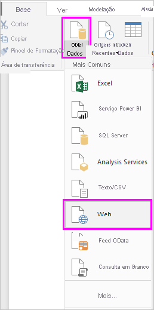 

   >[!NOTE]
   >Também pode selecionar o próprio item **Obter Dados** ou selecionar **Obter Dados** na caixa de diálogo Introdução do Power BI Desktop, selecionar **Web** na secção **Tudo** ou **Outros** da caixa de diálogo **Obter Dados** e, em seguida, selecionar **Ligar**.

1. Na caixa de diálogo **Da Web**, cole o URL `https://en.wikipedia.org/wiki/UEFA_European_Football_Championship` na caixa de texto **URL** e, em seguida, selecione **OK**.

    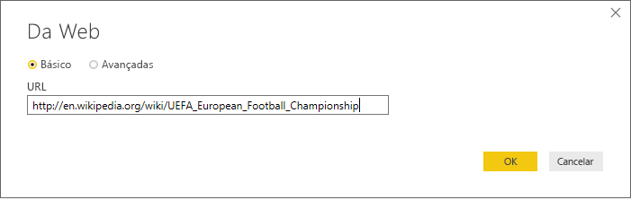

   Depois de se ligar à página Web da Wikipédia, a caixa de diálogo **Navegador** mostra uma lista de tabelas disponíveis na página. Pode selecionar qualquer um dos nomes de tabela para pré-visualizar os dados. A tabela **Resultados[editar]** tem os dados que quer, embora não estejam exatamente no formato pretendido. Vai reformatar e limpar os dados antes de os carregar para o relatório.

   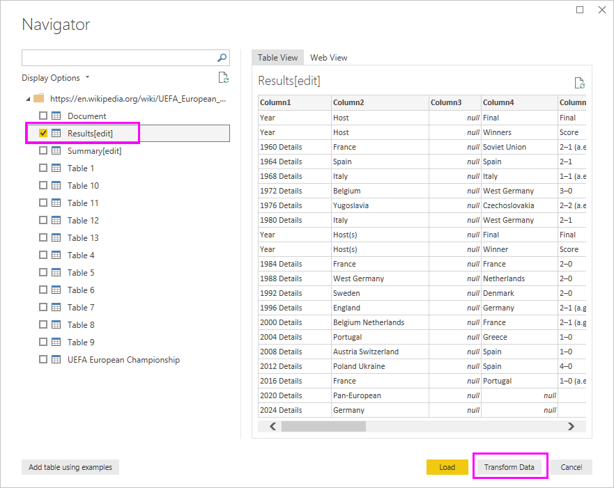

   >[!NOTE]
   >O painel **Pré-visualização** mostra a tabela mais recente selecionada, mas todas as tabelas selecionadas serão carregadas para o Editor do Power Query quando selecionar **Transformar Dados** ou **Carregar**.

1. Selecione a tabela **Resultados[editar]** na lista **Navegador** e, em seguida, selecione **Transformar Dados**.

   É apresentada uma pré-visualização da tabela no **Editor do Power Query**, onde pode aplicar transformações para limpar os dados.

   

## Formatar dados no Editor do Power Query

Quer que os dados sejam mais fáceis de analisar ao apresentar apenas os anos e os países que ganharam. Pode utilizar o Editor do Power Query para realizar estes passos de formatação e limpeza de dados.

Primeiro, remova todas as colunas da tabela, deixando apenas duas. Mude o nome destas colunas para *Ano* e *País* mais tarde no processo.

1. Na grelha **Editor do Power Query**, selecione as colunas. Selecione Ctrl para selecionar vários itens.

1. Clique com botão direito do rato e selecione **Remover Outras Colunas** ou selecione **Remover Colunas** > **Remover Outras Colunas** no grupo **Gerir Colunas** do separador **Página Inicial** do friso, para remover todas as outras colunas da tabela.

   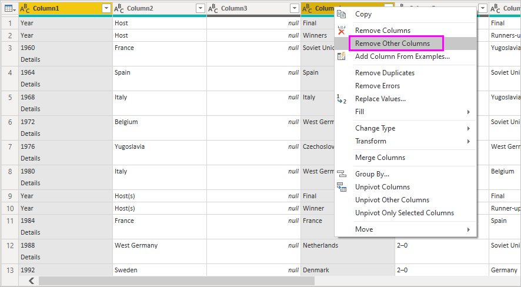

   ou

   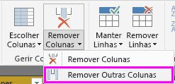

Em seguida, remova a palavra extra *Detalhes* das células da primeira coluna.

1. Selecione a primeira coluna.

1. Clique com o botão direito do rato e selecione **Substituir Valores** ou selecione **Substituir Valores** no grupo **Transformar** do separador **Página Inicial** do friso. Também pode encontrar esta opção no grupo **Qualquer Coluna** no separador **Transformar**.

   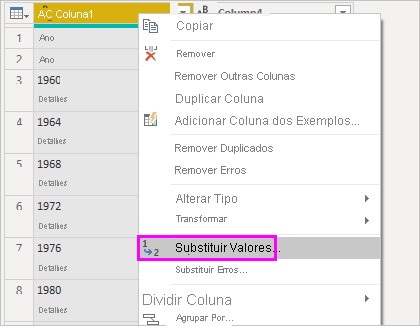 

   ou

   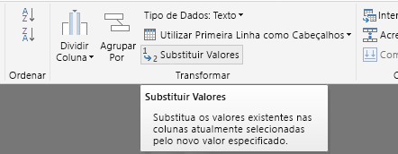

1. Na caixa de diálogo **Substituir Valores**, escreva **Detalhes** na caixa de texto **Valor a Localizar**, esvazie a caixa de texto **Substituir Por** e, em seguida, selecione **OK** para eliminar a palavra *Detalhes* desta coluna.

   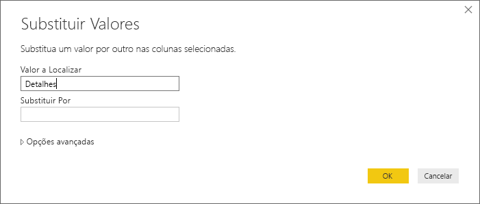

Algumas células contêm a palavra “Ano”, em vez de valores de anos. Pode filtrar a coluna para mostrar apenas as linhas que não contêm a palavra “Ano”.

1. Selecione a seta para baixo do filtro na coluna.

1. No menu pendente, desloque-se para baixo e limpe a caixa de verificação junto à opção **Ano** e, em seguida, selecione **OK**.

   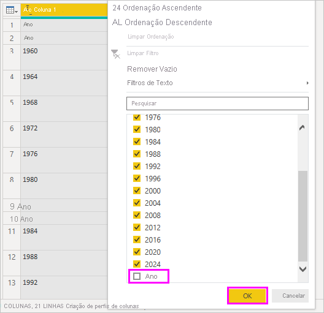

Uma vez que está apenas a ver os dados dos vencedores da final, poderá mudar o nome da segunda coluna para **País**. Para mudar o nome da coluna:

1. Faça duplo clique ou toque sem soltar no cabeçalho da segunda coluna ou
   - Clique com o botão direito do rato no cabeçalho da coluna e selecione **Mudar o Nome** ou
   - Selecione a *coluna e selecione **Mudar o Nome** no grupo **Qualquer Coluna** no separador **Transformar** do friso.

   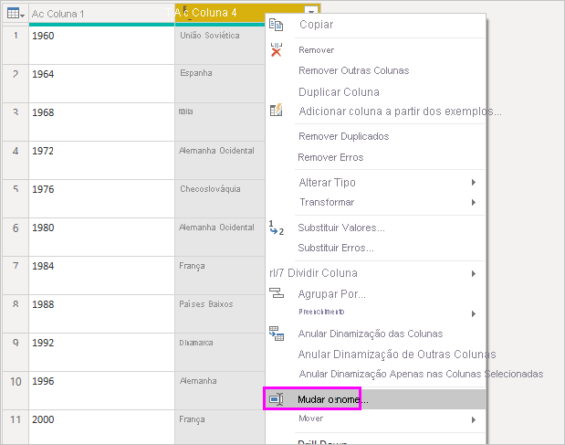 
  
   ou

   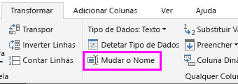

1. Escreva **País** no cabeçalho e prima **Enter** para mudar o nome da coluna.

Também pode querer filtrar linhas como "2020", que têm valores nulos na coluna **País**. Pode utilizar o menu de filtro como fez com os valores **Ano** ou:

1. Clique com o botão direito do rato na célula **País** na linha **2020**, que tem o valor *nulo*.

1. Selecione **Filtros de Texto** > **Não é Igual a** no menu de contexto para remover quaisquer linhas que contenham o valor dessa célula.

   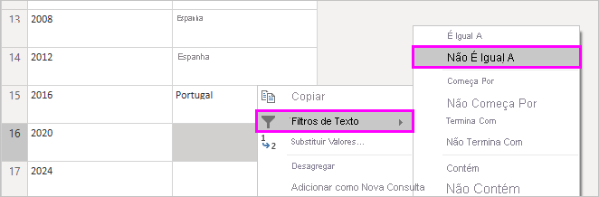

## Importar a consulta para a Vista de Relatório

Agora que formatou os dados da forma que quer, está pronto para atribuir à consulta o nome "Vencedores do Europeu" e importá-la para o relatório.

1. No painel **Definições de Consulta**, na caixa de texto **Nome**, introduza **Vencedores do Campeonato Europeu**.

   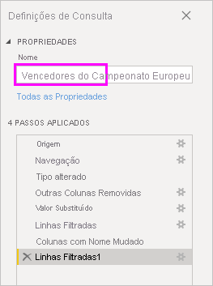

1. Selecione **Fechar e Aplicar** > **Fechar e Aplicar** no separador **Base** do friso.

   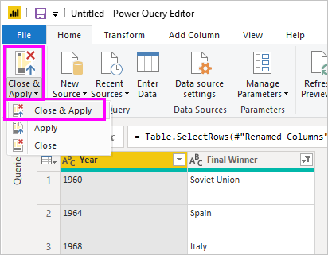

A consulta é carregada para a vista *Relatório* do Power BI Desktop, onde a pode ver no painel **Campos**.

   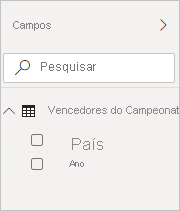

>[!TIP]
>Pode sempre voltar ao Editor do Power Query para editar e refinar a consulta ao:
>- Selecionar as reticências ( **...** ) **Mais opções** junto a **Vencedores do Campeonato Europeu** no painel **Campos** e selecionar **Editar Consulta** ou
>- Selecionar **Editar Consultas** > **Editar Consultas** no grupo **Dados externos** do separador do friso **Base** na vista de Relatório. 

## Criar uma visualização

Para criar uma visualização com base nos seus dados:

1. Selecione o campo **País** no painel **Campos** ou arraste-o para a tela de relatórios. O Power BI Desktop reconhece os dados como nomes de país e cria automaticamente uma visualização de **Mapa**.

   

1. Aumente o mapa ao arrastar as alças nos cantos para que todos os nomes de países vencedores fiquem visíveis.  

   

1. O mapa mostra os pontos de dados idênticos para cada país que tenha vencido um torneio do Campeonato da Europa. Para fazer com que o tamanho de cada ponto de dados reflita a frequência com que o país venceu, arraste o campo **Ano** para **Arrastar campos de dados para aqui** em **Tamanho** na parte inferior do painel **Visualizações**. O campo muda automaticamente para uma medida **Contagem de Ano** e a visualização do mapa passa a mostrar os pontos de dados maiores para países que tenham vencido mais torneios.

   

## Personalizar a visualização

Como pode ver, é muito fácil criar visualizações baseadas nos dados. Também é fácil personalizar as suas visualizações para apresentar melhor os dados das formas que quer.

### Formatar o texto

Pode alterar o aspeto de uma visualização ao selecioná-la e, em seguida, selecionar o ícone **Formatar** (rolo de tinta) no painel **Visualizações**. Por exemplo, os pontos de dados “Alemanha” na visualização podem ser enganadores, porque a Alemanha Ocidental venceu dois torneios e a Alemanha venceu um, sendo que o mapa sobrepõe os dois pontos em vez de os separar ou adicionar. Pode colorir estes dois pontos de forma diferente para realçar este aspeto. Também pode atribuir ao mapa um título mais descritivo e apelativo.

1. Com a visualização selecionada, selecione o ícone **Formatar** e, em seguida, selecione **Cores de dados** para expandir as opções de cores de dados.

   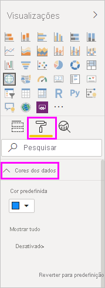

1. Defina **Mostrar Tudo** como **Ligado** e, em seguida, selecione o menu pendente junto a **Alemanha Ocidental** e escolha uma cor amarela.

   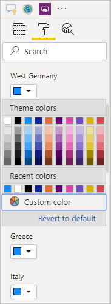

1. Selecione **Título** para expandir as opções de título e, no campo **Texto do título**, escreva **Vencedores do Campeonato Europeu** em vez do título atual.

1. Altere a **Cor do tipo de letra** para vermelho, **Tamanho do texto**  para **12**e **Família do tipo de letra** para **Segoe (Negrito)** .

   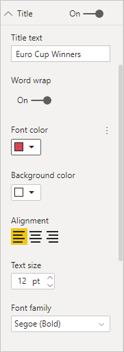

A sua visualização de mapa passa a ter este aspeto:

### Alterar o tipo de visualização

Pode alterar o tipo de uma visualização ao selecioná-la e, em seguida, selecionar um ícone diferente na parte superior do painel **Visualização**. Por exemplo, os dados da ex-União Soviética e da Checoslováquia estão em falta na sua visualização de mapa porque esses países já não existem no mapa do mundo. Outro tipo de visualização, como um gráfico treemap ou um gráfico circular poderá ser mais exato, porque mostra todos os valores.

Para alterar o mapa para um gráfico circular, selecione o mapa e, em seguida, selecione o ícone **Gráfico circular** no painel **Visualização**.

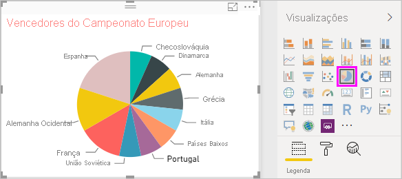

>[!TIP]
>- Pode utilizar as opções de formatação **Cores de dados** para atribuir a mesma cor a "Alemanha" e "Alemanha Ocidental". 
>- Para agrupar os países com mais vitórias em conjunto no gráfico circular, selecione as reticências ( **...** ) no canto superior direito da visualização e, em seguida, selecione **Ordenar por Contagem de Ano**.

O Power BI Desktop fornece uma experiência perfeita de ponta a ponta, desde a obtenção de dados por meio de uma ampla variedade de origens de dados e a modelação desses dados para atender às suas necessidades de análise para a visualização de tais dados de maneiras avançadas e interativas. Quando o seu relatório estiver pronto, poderá [carregá-lo para o Power BI](../create-reports/desktop-upload-desktop-files.md) e criar dashboards com base no mesmo, que pode partilhar com outros utilizadores do Power BI.

## Veja também

* [Microsoft Learn para Power BI](/learn/powerplatform/power-bi?WT.mc_id=powerbi_landingpage-docs-link)
* [Ver vídeos do Power BI Desktop](../fundamentals/desktop-videos.md)
* [Visitar o Fórum do Power BI](https://go.microsoft.com/fwlink/?LinkID=519326)
* [Ler o Blogue do Power BI](https://go.microsoft.com/fwlink/?LinkID=519327)