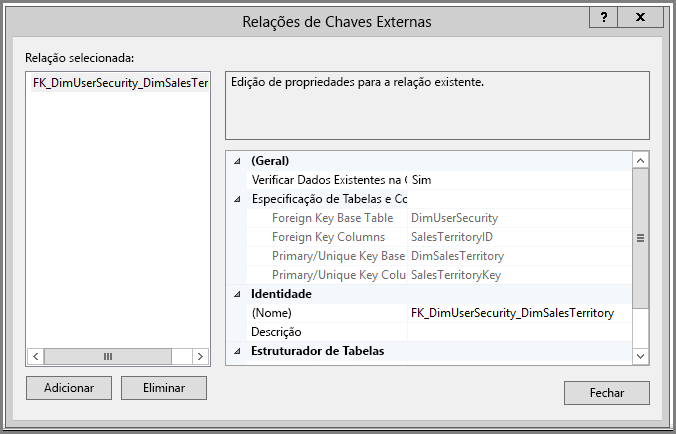
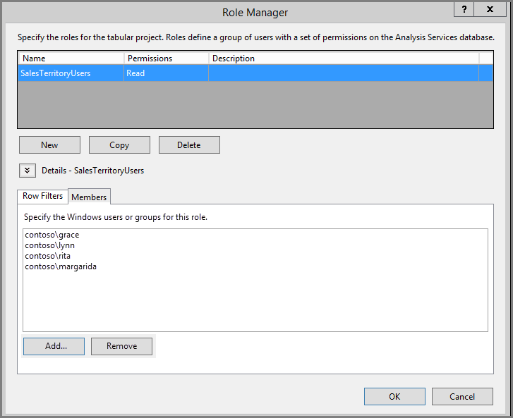
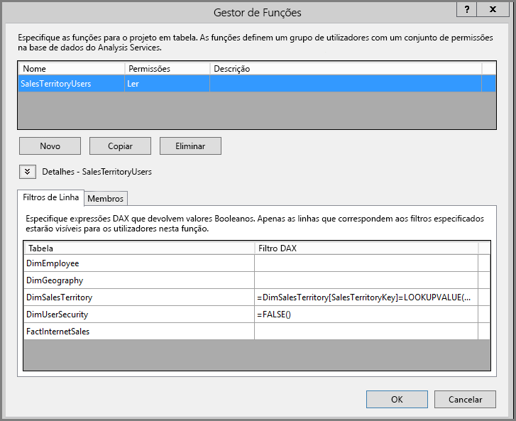
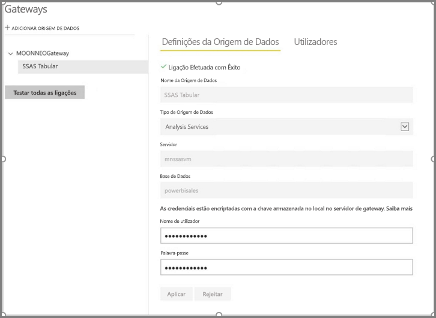
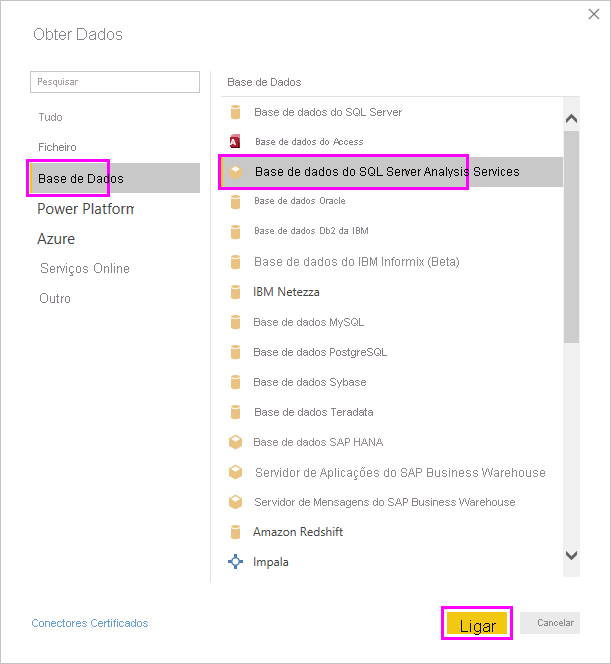
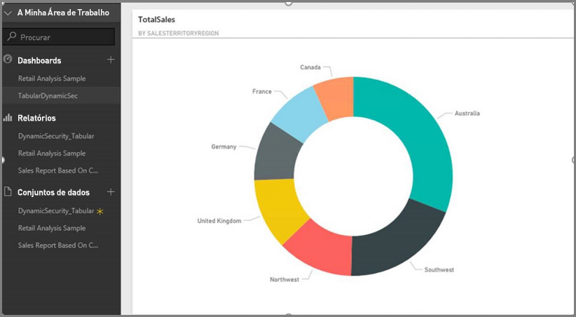

# <a name="implement-row-level-security-in-an-on-premises-analysis-services-tabular-model"></a>Implementar segurança ao nível da linha num modelo em tabela do Analysis Services no local

Com um conjunto de dados de exemplo para executar os passos abaixo, este tutorial mostra-lhe como implementar [**segurança ao nível da linha**](../admin/service-admin-rls.md) num *Modelo de Tabela do Analysis Services no local* e utilizá-lo num relatório do Power BI.

* Criar uma nova tabela de segurança na [base de dados AdventureworksDW2012](https://github.com/Microsoft/sql-server-samples/releases/tag/adventureworks)
* Criar o modelo de tabela com os factos e as dimensões de tabela necessários
* Definir funções e permissões de utilizadores
* Implementar o modelo numa instância *em tabela do Analysis Services*
* Criar um relatório do Power BI Desktop que apresenta dados personalizados ao utilizador que acede ao relatório
* Implementar o relatório no *serviço Power BI*
* Criar um novo dashboard com base no relatório
* Partilhar o dashboard com os colegas

Este tutorial necessita da [base de dados AdventureworksDW2012](https://github.com/Microsoft/sql-server-samples/releases/tag/adventureworks).

## <a name="task-1-create-the-user-security-table-and-define-data-relationship"></a>Tarefa 1: Criar a tabela de segurança de utilizador e definir a relação de dados

Pode encontrar muitos artigos que descrevem como definir a segurança dinâmica ao nível da linha com o *modelo de tabela do SQL Server Analysis Services (SSAS)* . No nosso exemplo, utilizamos o artigo [Implement Dynamic Security by Using Row Filters](/analysis-services/tutorial-tabular-1200/supplemental-lesson-implement-dynamic-security-by-using-row-filters) (Implementar Segurança Dinâmica com Filtros de Linha).

Os passos aqui descritos necessitam da utilização da base de dados relacional AdventureworksDW2012.

1. Em AdventureworksDW2012, crie a tabela`DimUserSecurity` conforme ilustrado abaixo. Pode utilizar o [SQL Server Management Studio (SSMS)](/sql/ssms/download-sql-server-management-studio-ssms) para criar a tabela.

   

1. Após criar e guardar a tabela, tem de estabelecer uma relação entre a coluna `DimUserSecurity` da tabela `SalesTerritoryID` e a coluna `DimSalesTerritory` da tabela `SalesTerritoryKey`, como ilustrado abaixo.

   No SSMS, clique com o botão direito em **DimUserSecurity** e selecione **Design** (Estrutura). Em seguida, selecione **Table Designer** >  **-> Relationships...** (Estruturador de Tabelas > Relações...). Quando tiver terminado, guarde a tabela.

   

1. Adicionar utilizadores à tabela. Clique com o botão direito em **DimUserSecurity** e selecione **Edit Top 200 Rows**  (Editar as Primeiras 200 Linhas). Após ter adicionado utilizadores, a tabela `DimUserSecurity` deve ter um aspeto semelhante ao seguinte exemplo:

   

   Verá estes utilizadores em tarefas futuras.

1. Em seguida, efetue uma *associação interna* com a tabela `DimSalesTerritory`, que mostra os detalhes de região associados ao utilizador. O código SQL aqui faz a associação interna e a imagem mostra como a tabela é depois apresentada.

    ```sql
    select b.SalesTerritoryCountry, b.SalesTerritoryRegion, a.EmployeeID, a.FirstName, a.LastName, a.UserName from [dbo].[DimUserSecurity] as a join [dbo].[DimSalesTerritory] as b on a.[SalesTerritoryID] = b.[SalesTerritoryKey]
    ```

   A tabela unida mostra quem é responsável por cada região de vendas, graças à relação criada no Passo 2. Por exemplo, pode ver que *Rita Santos* é responsável pela região *Australia*.

## <a name="task-2-create-the-tabular-model-with-facts-and-dimension-tables"></a>Tarefa 2: Criar o modelo de tabela com os factos e as tabelas de dimensão

Assim que o armazém de dados relacional estiver implementado, precisa de definir o modelo de tabela. Pode criar o modelo com o [SQL Server Data Tools](/sql/ssdt/sql-server-data-tools) (SSDT). Para obter mais informações, veja [Create a New Tabular Model Project](/analysis-services/tutorial-tabular-1400/as-lesson-1-create-a-new-tabular-model-project) (Criar um Novo Projeto de Modelo de Tabela).

1. Importe todas as tabelas necessárias para o modelo, conforme mostrado abaixo.

    

1. Assim que tiver importado as tabelas necessárias, tem de definir uma função chamada *SalesTerritoryUsers* com permissão de Leitura. Selecione o menu **Model** (Modelo) no SQL Server Data Tools e, em seguida, selecione **Roles** (Funções). Em **Role Manager** (Gestor de Funções), selecione **New** (Novo).

1. Em **Members** (Membros) do **Role Manager** (Gestor de Funções), adicione os utilizadores que definiu na tabela `DimUserSecurity` na [Tarefa 1](#task-1-create-the-user-security-table-and-define-data-relationship).

    

1. Em seguida, adicione as funções adequadas para as tabelas `DimSalesTerritory` e `DimUserSecurity`, conforme mostrado por baixo do separador **Row Filters** (Filtros de Linha).

    

1. A função `LOOKUPVALUE` devolve os valores de uma coluna na qual o nome de utilizador do Windows corresponde ao que a função `USERNAME` devolve. Em seguida, pode restringir as consultas aos casos em que os valores devolvidos por `LOOKUPVALUE` correspondem aos valores na mesma tabela ou numa tabela relacionada. Na coluna **Filtro DAX**, escreva a seguinte fórmula:

    ```dax
        =DimSalesTerritory[SalesTerritoryKey]=LOOKUPVALUE(DimUserSecurity[SalesTerritoryID], DimUserSecurity[UserName], USERNAME(), DimUserSecurity[SalesTerritoryID], DimSalesTerritory[SalesTerritoryKey])
    ```

    Nesta fórmula, a função `LOOKUPVALUE` devolve todos os valores para a coluna `DimUserSecurity[SalesTerritoryID]`, onde o `DimUserSecurity[UserName]` é o mesmo que o nome de utilizador do Windows com sessão atualmente iniciada e `DimUserSecurity[SalesTerritoryID]` é o mesmo que o `DimSalesTerritory[SalesTerritoryKey]`.

    > [!IMPORTANT]
    > Ao utilizar segurança ao nível da linha, a função DAX [USERELATIONSHIP](/dax/userelationship-function-dax) não é suportada.

   O conjunto de resultados de `LOOKUPVALUE` de `SalesTerritoryKey` de Sales (Vendas) é então utilizado para restringir as linhas apresentadas em `DimSalesTerritory`. Apenas as linhas em que o valor `SalesTerritoryKey` está nos IDs que a função `LOOKUPVALUE` devolve são apresentadas.

1. Para a tabela `DimUserSecurity` na coluna **DAX Filter** (Filtro DAX), adicione a seguinte fórmula:

    ```dax
        =FALSE()
    ```

    Esta fórmula especifica que todas as colunas resolvem para `false`; o que significa que as colunas da tabela `DimUserSecurity` não podem ser consultadas.

Agora, é necessário processar e implementar o modelo. Para obter mais informações, veja [Implementar](/analysis-services/tutorial-tabular-1200/lesson-13-deploy).

## <a name="task-3-add-data-sources-within-your-on-premises-data-gateway"></a>Tarefa 3: Adicionar Origens de Dados no Gateway de dados no local

Depois de o seu modelo de tabela estar implementado e pronto para utilizar, tem de adicionar uma ligação de origem de dados ao servidor da tabela no local do Analysis Services.

1. Para permitir que o serviço Power BI aceda ao seu serviço de análise no local, tem de ter um [gateway de dados no local](service-gateway-onprem.md) instalado e configurado no seu ambiente.

1. Depois de o gateway estar configurado corretamente, tem de criar uma ligação à origem de dados para a sua instância de tabela do *Analysis Services*. Para mais informações, veja [Gerir a sua origem de dados – Analysis Services](service-gateway-enterprise-manage-ssas.md).

   

Com este procedimento concluído, o gateway está configurado e pronto para interagir com a sua origem de dados do Analysis Services no local.

## <a name="task-4-create-report-based-on-analysis-services-tabular-model-using-power-bi-desktop"></a>Tarefa 4: Criar o relatório baseado no modelo de tabela de serviços de análise, com o Power BI Desktop

1. Inicie o Power BI Desktop e selecione **Obter Dados**  > **Base de Dados**.

1. Na lista de origens de dados, selecione **Base de Dados do SQL Server Analysis Services** e selecione **Ligar**.

   

1. Preencha os detalhes de instância de tabela do Analysis Services e selecione **Ligar em direto**. Em seguida, selecione **OK**.
  
   

   No Power BI, a segurança dinâmica funciona apenas com uma ligação em direto.

1. Pode observar que o modelo implementado está na instância do Analysis Services. Selecione o modelo e selecione **OK**.

   O Power BI Desktop apresenta agora todos os campos disponíveis à direita da tela do painel **Campos**.

1. No painel **Campos**, selecione a medida **SalesAmount** da tabela **FactInternetSales** e a dimensão **SalesTerritoryRegion** da tabela **SalesTerritory**.

1. Para manter este relatório simples, de momento, não iremos adicionar mais colunas. Para obter uma representação mais significativa dos dados, altere a visualização para **Gráfico em anel**.

   

1. Assim que o relatório estiver pronto, pode publicá-lo diretamente no portal do Power BI. No friso **Base** do Power BI Desktop, selecione **Publicar**.

## <a name="task-5-create-and-share-a-dashboard"></a>Tarefa 5: Criar e partilhar um dashboard

Criou o relatório e publicou-o no serviço **Power BI**. Agora, pode utilizar o exemplo criado nos passos anteriores para demonstrar o cenário de segurança do modelo.

Na função *Gestor de Vendas*, a utilizadora Grace pode ver os dados de todas as regiões de vendas diferentes. A Grace cria este relatório e publica-o no serviço Power BI. Este relatório foi criado nas tarefas anteriores.

Assim que a Grace publica o relatório, o próximo passo consiste em criar um dashboard no serviço Power BI chamado *TabularDynamicSec* com base nesse relatório. Na seguinte imagem, repare que a Grace consegue ver os dados correspondentes a toda a região de vendas.

   

Agora, a Grace partilha o dashboard com a sua colega, Rita, que é responsável pelas vendas na região da Austrália.

   

Quando a Rita iniciar sessão no serviço Power BI e vir o dashboard partilhado que a Grace criou, deverá ver apenas as vendas da região da Austrália.

Parabéns! O serviço Power BI mostra a segurança ao nível da linha dinâmica definida no modelo de tabela local do Analysis Services. O Power BI utiliza a propriedade `EffectiveUserName` para enviar a credencial do utilizador atual do Power BI à origem de dados no local para executar as consultas.

## <a name="task-6-understand-what-happens-behind-the-scenes"></a>Tarefa 6: Compreender o que acontece em segundo plano

Esta tarefa pressupõe que está familiarizado com o [SQL Server Profiler](/sql/tools/sql-server-profiler/sql-server-profiler), uma vez que é necessário capturar um rastreio de gerador de perfis do SQL Server na sua instância de tabela do SSAS no local.

A sessão é inicializada assim que a utilizadora (Rita) acede ao dashboard do serviço Power BI. Pode ver que a função **salesterritoryusers** tem efeito imediato com o nome de utilizador efetivo como **<EffectiveUserName>rita@contoso.com</EffectiveUserName>**
```
       <PropertyList><Catalog>DefinedSalesTabular</Catalog><Timeout>600</Timeout><Content>SchemaData</Content><Format>Tabular</Format><AxisFormat>TupleFormat</AxisFormat><BeginRange>-1</BeginRange><EndRange>-1</EndRange><ShowHiddenCubes>false</ShowHiddenCubes><VisualMode>0</VisualMode><DbpropMsmdFlattened2>true</DbpropMsmdFlattened2><SspropInitAppName>PowerBI</SspropInitAppName><SecuredCellValue>0</SecuredCellValue><ImpactAnalysis>false</ImpactAnalysis><SQLQueryMode>Calculated</SQLQueryMode><ClientProcessID>6408</ClientProcessID><Cube>Model</Cube><ReturnCellProperties>true</ReturnCellProperties><CommitTimeout>0</CommitTimeout><ForceCommitTimeout>0</ForceCommitTimeout><ExecutionMode>Execute</ExecutionMode><RealTimeOlap>false</RealTimeOlap><MdxMissingMemberMode>Default</MdxMissingMemberMode><DisablePrefetchFacts>false</DisablePrefetchFacts><UpdateIsolationLevel>2</UpdateIsolationLevel><DbpropMsmdOptimizeResponse>0</DbpropMsmdOptimizeResponse><ResponseEncoding>Default</ResponseEncoding><DirectQueryMode>Default</DirectQueryMode><DbpropMsmdActivityID>4ea2a372-dd2f-4edd-a8ca-1b909b4165b5</DbpropMsmdActivityID><DbpropMsmdRequestID>2313cf77-b881-015d-e6da-eda9846d42db</DbpropMsmdRequestID><LocaleIdentifier>1033</LocaleIdentifier><EffectiveUserName>rita@contoso.com</EffectiveUserName></PropertyList>
```
Com base no pedido do nome de utilizador efetivo, o Analysis Services converte o pedido para a credencial `contoso\rita` atual, depois de consultar o Active Directory local. Quando o Analysis Services obtiver a credencial, o Analysis Services devolve os dados que o utilizador tem permissão para ver e aceder.

Se ocorrer mais atividade no dashboard, com o SQL Profiler irá ver uma consulta específica, que regressa ao modelo em tabela do Analysis Services com uma consulta DAX. Por exemplo, se Rita passar do dashboard para o relatório subjacente, ocorre a seguinte consulta.

   

Também pode ver abaixo a consulta DAX que está a ser executada para preencher os dados do relatório.
   
   ```dax
   EVALUATE
     ROW(
       "SumEmployeeKey", CALCULATE(SUM(Employee[EmployeeKey]))
     )
   
   <PropertyList xmlns="urn:schemas-microsoft-com:xml-analysis">``
             <Catalog>DefinedSalesTabular</Catalog>
             <Cube>Model</Cube>
             <SspropInitAppName>PowerBI</SspropInitAppName>
             <EffectiveUserName>rita@contoso.com</EffectiveUserName>
             <LocaleIdentifier>1033</LocaleIdentifier>
             <ClientProcessID>6408</ClientProcessID>
             <Format>Tabular</Format>
             <Content>SchemaData</Content>
             <Timeout>600</Timeout>
             <DbpropMsmdRequestID>8510d758-f07b-a025-8fb3-a0540189ff79</DbpropMsmdRequestID>
             <DbPropMsmdActivityID>f2dbe8a3-ef51-4d70-a879-5f02a502b2c3</DbPropMsmdActivityID>
             <ReturnCellProperties>true</ReturnCellProperties>
             <DbpropMsmdFlattened2>true</DbpropMsmdFlattened2>
             <DbpropMsmdActivityID>f2dbe8a3-ef51-4d70-a879-5f02a502b2c3</DbpropMsmdActivityID>
           </PropertyList>
   ```

## <a name="considerations"></a>Considerações

* A segurança ao nível da linha no local com o Power BI só está disponível com uma ligação em direto.

* Quaisquer alterações nos dados após o processamento do modelo ficariam imediatamente disponíveis para os utilizadores que acedessem ao relatório através da ligação em direto do serviço Power BI.
