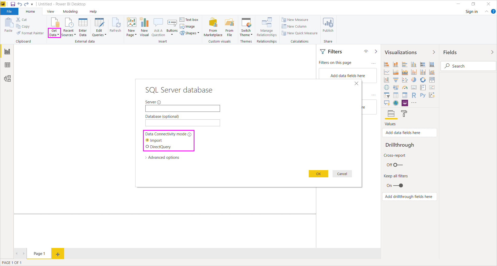

# <a name="use-directquery-in-power-bi-desktop"></a>Utilizar o DirectQuery no Power BI Desktop
Com o *Power BI Desktop*, ao ligar à origem de dados, pode sempre importar uma cópia dos dados para o Power BI Desktop. Para algumas origens de dados, está disponível uma abordagem alternativa: ligar-se diretamente à origem de dados com o DirectQuery.

## <a name="supported-data-sources"></a>Supported data sources (Origens de dados suportadas)
Para obter uma lista completa das origens de dados que suportam o DirectQuery, veja [Origens de dados suportadas pelo DirectQuery](power-bi-data-sources.md).

## <a name="how-to-connect-using-directquery"></a>Como ligar com o DirectQuery
Quando utiliza a opção **Obter Dados** para ligar a uma origem de dados suportada pelo DirectQuery, é apresentada uma caixa de diálogo de ligação que lhe permite selecionar a forma como se quer ligar. Por exemplo, no Power BI Desktop, no friso **Home page**, selecione **Obter Dados** > **SQL Server**. Na caixa de diálogo **Base de Dados do SQL Server**, o **Modo de Conectividade de Dados** apresenta as opções **Importar** e **DirectQuery**:



As diferenças entre selecionar **Importar** e **DirectQuery** são as seguintes:

- **Importação**: as tabelas e as colunas selecionadas são importadas para o Power BI Desktop. Conforme cria ou interage com uma visualização, o Power BI Desktop utiliza os dados importados. Para ver todas as alterações ocorridas nos dados subjacentes desde a importação inicial ou a atualização mais recente, tem de atualizar os dados, o que importa o conjunto de dados completo novamente.

- **DirectQuery**: nenhum dado é importado ou copiado para o Power BI Desktop. Para origens relacionais, as tabelas e colunas selecionadas aparecem na lista **Campos**. Para origens multidimensionais, como o SAP Business Warehouse, as dimensões e medidas do cubo selecionado são apresentadas na lista **Campos**. Conforme cria ou interage com uma visualização, o Power BI Desktop consulta a fonte de dados subjacente, por isso está sempre a ver dados atuais.

Muitas modelações e transformações de dados estão disponíveis ao utilizar o DirectQuery, embora com algumas limitações. Ao criar ou interagir com uma visualização, tem de consultar a origem subjacente. O tempo necessário para atualizar a visualização depende do desempenho da origem de dados subjacente. Quando os dados necessários para responder ao pedido tiverem sido pedidos recentemente, o Power BI Desktop utiliza os dados recentes para reduzir o tempo necessário para apresentar a visualização. Se selecionar **Atualizar** no friso **Home Page**, todas as visualizações são atualizadas com os dados atuais.

O artigo [Power BI e DirectQuery](desktop-directquery-about.md) descreve o DirectQuery em detalhe. Para obter mais informações sobre as vantagens, limitações e considerações importantes ao utilizar o DirectQuery, veja as seguintes secções.

## <a name="benefits-of-using-directquery"></a>Benefícios da utilização do DirectQuery
Tem algumas vantagens ao utilizar o DirectQuery:

- O DirectQuery permite criar visualizações de conjuntos de dados muito grandes, nos casos em que, de outro modo, seria impraticável importar primeiro todos os dados com pré-agregação.
- As alterações dos dados subjacentes requerem uma atualização dos dados. Para alguns relatórios, a necessidade de apresentar os dados atuais pode exigir transferências de dados grandes, tornando impraticável uma nova importação de dados. Por outro lado, os relatórios do DirectQuery utilizam sempre dados atuais.
- A limitação do conjunto de dados de 1 GB *não* se aplica ao DirectQuery.

## <a name="limitations-of-directquery"></a>Limitações do DirectQuery
Atualmente, existem algumas limitações na utilização do DirectQuery:

- Se a consulta do **Editor de Consultas** for excessivamente complexa, ocorre um erro. Para corrigir esse erro, deve eliminar o passo que apresenta problemas no **Editor de Consultas** ou *Importar* os dados, em vez de utilizar o DirectQuery. Para origens multidimensionais, como o SAP Business Warehouse, não existe nenhum **Editor de Consultas**.

- Não estão disponíveis funcionalidades de análise de tempo no DirectQuery. Por exemplo, o tratamento especial de colunas de data (tais como ano, trimestre, mês ou dia) não é suportado no modo DirectQuery.

- As limitações são colocadas em expressões DAX permitidas em medidas para garantir que as consultas enviadas para a origem de dados subjacente têm um desempenho aceitável.

- Existe um limite de um milhão de linhas para devolver dados ao utilizar o DirectQuery, exceto se estiver a utilizar uma capacidade Premium. Isto não limita as agregações ou cálculos utilizados para criar o conjunto de dados devolvido com o DirectQuery. Afeta apenas as linhas devolvidas. As capacidades Premium podem definir os limites máximos de linhas, conforme descrito [nesta publicação](https://powerbi.microsoft.com/blog/five-new-power-bi-premium-capacity-settings-is-available-on-the-portal-preloaded-with-default-values-admin-can-review-and-override-the-defaults-with-their-preference-to-better-fence-their-capacity/). 

    Por exemplo, pode agregar 10 milhões de linhas com a consulta que é executada na origem de dados. A consulta devolve com precisão os resultados dessa agregação para o Power BI através do DirectQuery se os dados do Power BI devolvidos forem menos de 1 milhão de linhas. Se forem devolvidas mais de um milhão de linhas do DirectQuery, o Power BI apresentará um erro (exceto na capacidade Premium e se a contagem de linhas estiver abaixo do limite definido pelo administrador).


## <a name="important-considerations-when-using-directquery"></a>Considerações importantes ao utilizar o DirectQuery
Os seguintes três pontos devem ser considerados ao utilizar o DirectQuery:

- **Desempenho e carga**: todos os pedidos do DirectQuery são enviados para a base de dados de origem, pelo que o tempo preciso para atualizar um elemento visual depende de quanto tempo a origem de back-end demora a responder com os resultados da consulta (ou consultas). O tempo de resposta recomendado (com os dados solicitados a serem devolvidos) para utilizar o DirectQuery para elementos visuais é de cinco segundos ou menos. O tempo máximo recomendado é de 30 segundos. Se demorar mais tempo, a experiência de um utilizador que consuma o relatório torna-se inaceitavelmente fraca. Depois de um relatório ser publicado no serviço Power BI, qualquer consulta que demore mais do que alguns minutos excederá o tempo limite e será apresentado um erro ao utilizador.
  
    A carga na base de dados de origem também deve ser considerada, com base no número de utilizadores do Power BI que irão consumir o relatório publicado. A utilização da **Segurança ao Nível da Linha** (RLS) pode ter igualmente um impacto significativo. Um mosaico do dashboard sem RLS que seja partilhado por vários utilizadores resulta numa única consulta para a base de dados. No entanto, a utilização de um mosaico do dashboard sem RLS significa que a atualização de um mosaico requer uma consulta *por utilizador*, o que aumenta de forma significativa a carga na base de dados de origem e poderá afetar o desempenho.
  
    O Power BI cria consultas que são tão eficientes quanto possível. No entanto, em determinadas situações, a consulta gerada pode não ser suficientemente eficiente para evitar uma falha da atualização. Um exemplo desta situação é quando uma consulta gerada obtém um número excessivamente grande de linhas da origem de dados de back-end. Neste caso, ocorre o erro seguinte:

    ```output
    The resultset of a query to external data source has exceeded
    ```
  
    Esta situação pode ocorrer com um gráfico simples que inclui uma coluna de cardinalidade muito elevada, com a opção de agregação definida como **Não Resumir**. O elemento visual precisa de ter apenas colunas com uma cardinalidade abaixo de 1 milhão ou ter os filtros adequados aplicados.

- **Segurança**: por predefinição, todos os utilizadores que consomem um relatório publicado ligam à origem de dados de back-end com as credenciais introduzidas após a publicação no serviço Power BI. Este processo é idêntico para os dados importados: todos os utilizadores veem os mesmos dados, independentemente das regras de segurança definidas na origem de back-end.

    Os clientes que pretendam uma segurança por utilizador implementada com origens do DirectQuery deverão utilizar RLS para configurar a autenticação restrita do Kerberos relativamente à origem. O Kerberos não está disponível para todas as origens. [Saiba mais sobre o RLS](../admin/service-admin-rls.md). [Saiba mais sobre o Kerberos no DirectQuery](service-gateway-sso-kerberos.md).

- **Funcionalidades suportadas**: algumas das funcionalidades do Power BI Desktop não são suportadas no modo DirectQuery ou têm limitações. Além disso, existem algumas funcionalidades no serviço Power BI (como as *Informações Rápidas*) que não estão disponíveis para conjuntos de dados com o DirectQuery. Ao determinar se deve utilizar o DirectQuery, tenha em conta estas limitações de funcionalidades.

> [!NOTE]
> Ao utilizar o DirectQuery com uma Base de Dados SQL do Azure e um endereço IP privado, é necessário um gateway no local. 

## <a name="publish-to-the-power-bi-service"></a>Publicar no serviço Power BI
Os relatórios criados com o DirectQuery podem ser publicados no serviço Power BI.

Se a origem de dados utilizada não precisar do **Gateway de dados no local** (**Base de Dados SQL do Azure**, **Azure SQL Data Warehouse** ou **Redshift**) terá de fornecer as credenciais antes que o relatório publicado seja apresentado no serviço Power BI. Siga estas instruções para fornecer as credenciais:

1. Inicie sessão no [Power BI](https://www.powerbi.com/).
2. No serviço Power BI, selecione o ícone de engrenagem **Definições** e selecione o item de menu **Definições**.

    

3. Na página **Definições** do serviço Power BI, selecione o separador **Conjuntos de dados**, selecione o conjunto de dados que utiliza o DirectQuery e selecione **Editar credenciais**.

4. Adicione as credenciais. Caso contrário, ocorre um erro ao abrir um relatório publicado ou ao explorar um conjunto de dados criado com uma ligação DirectQuery.

Para fazer uma ligação de dados para origens de dados diferentes da **Base de Dados SQL do Azure**, do **Azure SQL Data Warehouse**, do **Redshift** ou do **Snowflake Data Warehouse** que utilizam o DirectQuery, instale um **Gateway de dados no local** e registe a origem de dados. Para obter mais informações, veja [O que é um gateway de dados no local?](service-gateway-onprem.md)

## <a name="next-steps"></a>Próximos passos
Para obter mais informações sobre o DirectQuery, consulte os seguintes recursos:

- [Utilizar o DirectQuery no Power BI](desktop-directquery-about.md)
- [Origens de dados suportadas pelo DirectQuery](power-bi-data-sources.md)
- [DirectQuery e SAP Business Warehouse (BW)](desktop-directquery-sap-bw.md)
- [DirectQuery and SAP HANA](desktop-directquery-sap-hana.md) (DirectQuery e SAP HANA)
- [What is an on-premises data gateway?](service-gateway-onprem.md) (O que é um gateway de dados no local?)
