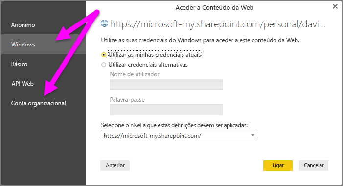

# Utilizar ligações do OneDrive for Business no Power BI Desktop
Muitas pessoas têm livros do Excel armazenados no OneDrive para Empresas que seriam adequados para utilização com o Power BI Desktop. No Power BI Desktop, pode utilizar ligações online para ficheiros do Excel armazenados no OneDrive para Empresas para criar relatórios e elementos visuais. Pode utilizar uma conta de grupo do OneDrive para Empresas ou a sua conta individual do OneDrive para Empresas.

Obter uma ligação online do OneDrive para Empresas requer passos específicos. As seguintes secções explicam esses passos, que lhe permitem partilhar a ligação para o ficheiro em grupos, em diferentes computadores e com os seus colegas.

## Obter uma ligação do Excel
1. Navegue para a sua localização do OneDrive para Empresas através de um browser. Clique com o botão direito do rato no ficheiro que pretende utilizar e selecione **Abrir no Excel**.
   
   > [!NOTE]
   > A sua interface de browser pode não ter um aspeto exatamente igual à imagem seguinte. Existem diversas formas de selecionar **Abrir no Excel** para ficheiros na sua interface de browser do OneDrive para Empresas. Pode utilizar qualquer opção que lhe permita abrir o ficheiro no Excel.
   
   

2. No Excel, selecione **Ficheiro** > **Informações** e, em seguida, selecione o botão **Copiar caminho**, conforme mostrado na imagem seguinte.
   
   

## Utilizar a ligação no Power BI Desktop
No Power BI Desktop, pode utilizar a ligação que copiou para a área de transferência. Siga estes passos:

1. No Power BI Desktop, selecione **Obter Dados** > **Web**.
   
   
2. Com a opção **Básico** selecionada, cole a ligação na caixa de diálogo **Da Web**.
3. Remova a cadeia *?web=1* no fim da ligação para que o Power BI Desktop consiga navegar até ao seu ficheiro e, em seguida, selecione **OK**.
   
     
4. Se o Power BI Desktop lhe pedir credenciais, selecione **Windows** (para sites do SharePoint no local) ou **Conta Organizacional** (para sites do Microsoft 365 ou OneDrive para Empresas).
   
   

   É apresentada uma caixa de diálogo do **Navegador**, que lhe permite selecionar da lista de tabelas, folhas e intervalos encontrados no livro do Excel. A partir daí, pode utilizar o ficheiro do OneDrive para Empresas da mesma forma que qualquer outro ficheiro Excel. Pode criar relatórios e utilizá-los em conjuntos de dados tal como faria com qualquer outra origem de dados.

> [!NOTE]
> Para utilizar um ficheiro do OneDrive para Empresas como uma origem de dados no serviço Power BI, com a **Atualização de Serviço** ativada para esse ficheiro, confirme que seleciona **OAuth2** como **Método de autenticação** ao configurar as definições de atualização. Caso contrário, pode ocorrer um erro (por exemplo, *Falha ao atualizar as credenciais da origem de dados*) ao tentar estabelecer ligação ou atualizar. Selecionar **OAuth2** como método de autenticação soluciona esse erro de credenciais.
>
