# <a name="data-refresh-in-power-bi"></a>Atualizar dados no Power BI

O Power BI permite-lhe utilizar os dados para obter informações e avançar para a ação rapidamente, mas tem de se certificar de que os dados nos seus relatórios e dashboards do Power BI são recentes. Saber como atualizar os dados é, muitas vezes, fundamental para obter resultados precisos.

Este artigo descreve as funcionalidades de atualização de dados do Power BI e as respetivas dependências a nível conceitual. Oferece também as práticas recomendadas e sugestões para evitar problemas de atualização comuns. Os conteúdos servem de base para ajudar a compreender como funciona a atualização de dados. Para obter instruções passo a passo direcionadas para configurar a atualização de dados, veja os tutoriais e manuais de instruções listados na secção Próximos passos, no final deste artigo.

## <a name="understanding-data-refresh"></a>Entendendo a atualização de dados

Sempre que atualiza os dados, o Power BI tem de consultar as origens de dados subjacentes, possivelmente carregar os dados de origem para um conjunto de dados e, em seguida, atualizar todas as visualizações nos seus relatórios ou dashboards que dependerem do conjunto de dados atualizado. Todo o processo consiste em múltiplas fases, consoante os modos de armazenamento dos conjuntos de dados, conforme explicado nas secções a seguir.

Para compreender de que forma o Power BI atualiza os conjuntos de dados, relatórios e dashboards, tem de ter em consideração os seguintes conceitos:

- **Modos de armazenamento e tipos de conjuntos de dados**: os modos de armazenamento e os tipos de conjuntos de dados que o Power BI suporta têm requisitos de atualização diferentes. Pode optar entre importar novamente os dados no Power BI para ver todas as alterações que ocorreram ou consultar os dados diretamente na origem.
- **Tipos de atualização do Power BI**: independentemente das especificações do conjunto de dados, conhecer os vários tipos de atualização pode ajudá-lo a compreender onde o Power BI pode gastar o seu tempo durante uma operação de atualização. Ao combinar estes detalhes com as informações específicas do modo de armazenamento ajuda a compreender o que o Power BI faz exatamente quando seleciona **Atualizar Agora** para um conjunto de dados.

### <a name="storage-modes-and-dataset-types"></a>Modos de armazenamento e tipos de conjuntos de dados

Um conjunto de dados do Power BI pode funcionar num dos seguintes modos para aceder aos dados a partir de uma diversidade de origens de dados. Para obter mais informações, veja [Modo de armazenamento no Power BI Desktop](../transform-model/desktop-storage-mode.md).

- Modo de importação
- Modo DirectQuery
- Modo LiveConnect
- Modo push

O seguinte diagrama ilustra os diferentes fluxos de dados, com base no modo de armazenamento. O ponto mais importante é que apenas os conjuntos de dados do Modo de importação necessitam de uma atualização dos dados de origem. A atualização é necessária porque apenas este tipo de conjunto de dados importa dados a partir das respetivas origens de dados e os dados importados podem ser atualizados regularmente ou caso a caso. Os conjuntos de dados do DirectQuery e os conjuntos de dados no modo LiveConnect para o Analysis Services não importam dados; consultam a origem de dados subjacente com cada interação do utilizador. Os conjuntos de dados no modo push não acedem diretamente a origens de dados, mas esperam que envie os dados para o Power BI. Os requisitos de atualização do conjunto de dados variam consoante o modo de armazenamento/tipo de conjunto de dados.

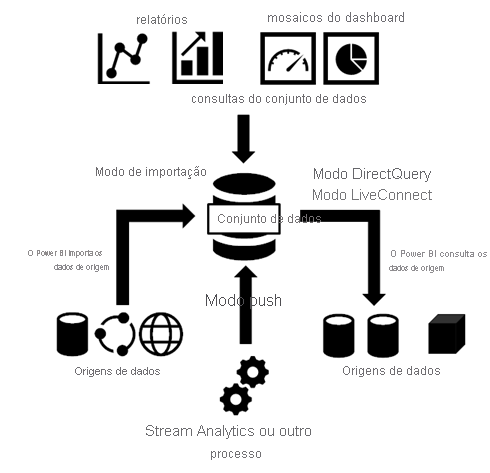

#### <a name="datasets-in-import-mode"></a>Conjuntos de dados no Modo de importação

O Power BI importa os dados das origens de dados originais para o conjunto de dados. As consultas de relatórios e dashboard do Power BI enviadas para o conjunto de dados devolvem resultados das tabelas e colunas importadas. Pode considerar um conjunto de dados deste tipo como uma cópia de um ponto anterior no tempo. Uma vez que o Power BI copia os dados, tem de atualizar o conjunto de dados para obter as alterações das origens de dados subjacentes.

Uma vez que o Power BI coloca os dados em cache, os tamanhos do conjunto de dados do Modo de importação podem ser substanciais. Consulte a seguinte tabela para saber quais os tamanhos máximos do conjunto de dados por capacidade. Mantenha o tamanho do conjunto de dados bem inferior aos tamanhos máximos do conjunto de dados para evitar problemas de atualização que possam ocorrer se os conjuntos de dados precisarem de mais do que os recursos máximos disponíveis durante uma operação de atualização.

| Tipo de capacidade | Tamanho máximo do conjunto de dados |
| --- | --- |
| Partilhado, A1, A2 ou A3 | 1 GB |
| A4 ou P1 | 3 GB |
| A5 ou P2 | 6 GB |
| A6 ou P3 | 10 GB |
| | |

#### <a name="datasets-in-directqueryliveconnect-mode"></a>Conjuntos de dados no modo DirectQuery/LiveConnect

O Power BI não importa dados através de ligações que operam no modo DirectQuery/LiveConnect. Em vez disso, o conjunto de dados devolve resultados da origem de dados subjacente sempre que um relatório ou dashboard consulta o conjunto de dados. O Power BI transforma e reencaminha as consultas para a origem de dados.

Embora o modo DirectQuery e o modo LiveConnect sejam semelhantes no sentido em que o Power BI reencaminha as consultas para a origem, é importante observar que o Power BI não tem de transformar consultas no modo LiveConnect. As consultas vão diretamente para a instância do Analysis Services que aloja a base de dados sem o consumo de recursos na capacidade partilhada ou capacidade Premium.

Uma vez que o Power BI não importa os dados, não precisa de executar uma atualização de dados. No entanto, o Power BI continua a fazer atualizações de mosaicos e, possivelmente, atualizações de relatório, como explica a próxima secção sobre os tipos de atualização. Um mosaico é um elemento visual do relatório afixado a um dashboard e as atualizações de mosaicos do dashboard ocorrem de hora a hora para que os mosaicos mostrem resultados recentes. Pode alterar a agenda de atualizações nas definições do conjunto de dados, tal como na captura de ecrã abaixo, ou forçar uma atualização de dashboard manualmente com a opção **Atualizar Agora**.

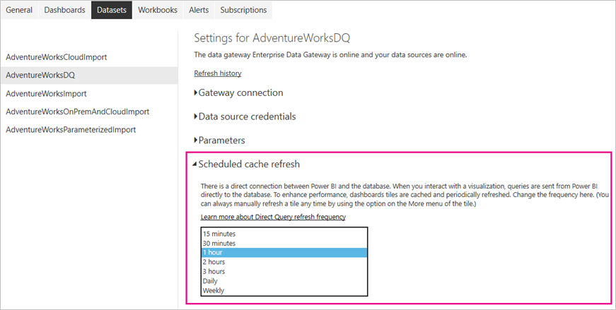

> [!NOTE]
> A secção **Atualização de cache agendada** do separador **Conjuntos de dados** não está disponível para conjuntos de dados no modo de importação. Estes conjuntos de dados não necessitam de uma atualização de mosaicos separada porque o Power BI atualiza automaticamente os mosaicos durante cada atualização de dados agendada ou a pedido.

#### <a name="push-datasets"></a>Conjuntos de dados push

Os conjuntos de dados push não contêm uma definição formal de uma origem de dados, por isso não necessitam que faça uma atualização de dados no Power BI. Atualiza-os ao enviar os seus dados para o conjunto de dados por meio de um serviço ou processo externo, como o Azure Stream Analytics. Esta é uma abordagem comum para a análise em tempo real com o Power BI. O Power BI continua a fazer atualizações da cache para os mosaicos utilizados sobre um conjunto de dados push. Para obter instruções detalhadas, veja [Tutorial: Stream Analytics e Power BI: Um dashboard de análise em tempo real para transmissão de dados em fluxo](/azure/stream-analytics/stream-analytics-power-bi-dashboard).

> [!NOTE]
> O Modo Push tem várias limitações, conforme documentado em [Limitações da API REST do Power BI](../developer/automation/api-rest-api-limitations.md).

### <a name="power-bi-refresh-types"></a>Tipos de atualização do Power BI

Uma operação de atualização do Power BI pode consistir em múltiplos tipos de atualização, incluindo atualização de dados, atualização do OneDrive, atualização das caches de consulta, atualização de mosaicos e atualização dos elementos visuais do relatório. Embora o Power BI determine automaticamente os passos de atualização necessários para um determinado conjunto de dados, deve saber de que forma contribuem para a complexidade e duração de uma operação de atualização. Para uma referência rápida, veja a seguinte tabela.

| Modo de armazenamento | Atualização de dados | Atualização do OneDrive | Caches de consulta | Atualização de mosaico | Elementos visuais do relatório |
| --- | --- | --- | --- | --- | --- |
| Importar | Agendada e a pedido | Sim, para conjuntos de dados ligados | Se estiver ativada na capacidade Premium | Automaticamente e a pedido | Não |
| DirectQuery | Não aplicável | Sim, para conjuntos de dados ligados | Se estiver ativada na capacidade Premium | Automaticamente e a pedido | Não |
| LiveConnect | Não aplicável | Sim, para conjuntos de dados ligados | Se estiver ativada na capacidade Premium | Automaticamente e a pedido | Sim |
| Push | Não aplicável | Não aplicável | Não é prática | Automaticamente e a pedido | Não |
| | | | | | |

#### <a name="data-refresh"></a>Atualização de dados

Para utilizadores do Power BI, atualizar dados significa normalmente importar dados das origens de dados originais para um conjunto de dados, com base numa agenda de atualização ou a pedido. Pode fazer múltiplas atualizações ao conjunto de dados diariamente, o que poderá ser necessário se a origem de dados subjacente for alterada com frequência. O Power BI limita os conjuntos de dados na capacidade partilhada a oito atualizações diárias. Se o conjunto de dados residir numa capacidade Premium, pode agendar até 48 atualizações por dia nas definições de conjuntos de dados. Para obter mais informações, veja [Configurar a atualização agendada](#configure-scheduled-refresh), mais adiante neste artigo. Conjuntos de dados numa capacidade Premium com o [ponto final XMLA](../admin/service-premium-connect-tools.md) ativado para operações de atualização ilimitadas de suporte de leitura/escrita quando configurados de forma programática com a TMSL ou o PowerShell.

É também importante destacar que a limitação de capacidade partilhada para atualizações diárias aplica-se conjuntamente a atualizações agendadas e atualizações de API. Pode também acionar uma atualização a pedido ao selecionar **Atualizar Agora** no menu do conjunto de dados, como ilustra a seguinte captura de ecrã. As atualizações a pedido não estão incluídas na limitação de atualizações. Tenha também em atenção que os conjuntos de dados numa capacidade Premium não impõem limitações para atualizações de API. Se estiver interessado em criar a sua própria solução de atualização com a API REST do Power BI, veja [Datasets - Refresh Dataset](/rest/api/power-bi/datasets/refreshdataset) (Conjuntos de Dados – Atualizar Conjunto de Dados).

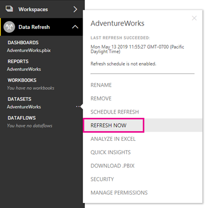

> [!NOTE]
> As atualizações de dados têm de ser concluídas em menos de 2 horas na capacidade partilhada. Se os conjuntos de dados necessitarem de operações de atualização mais longas, considere mover o conjunto de dados para uma capacidade Premium. No Premium, a duração máxima de atualização é de 5 horas.

#### <a name="onedrive-refresh"></a>Atualização do OneDrive

Se tiver criado os conjuntos de dados e os relatórios com base num ficheiro do Power BI Desktop, livro do Excel ou ficheiro .csv (valores separados por vírgulas) no OneDrive ou SharePoint Online, o Power BI faz outro tipo de atualização, conhecida como atualização do OneDrive. Para obter mais informações, veja [Obter dados de ficheiros para o Power BI](service-get-data-from-files.md).

Ao contrário de uma atualização do conjunto de dados, durante a qual o Power BI importa dados de uma origem de dados para um conjunto de dados, a atualização do OneDrive sincroniza os conjuntos de dados e relatórios com os respetivos ficheiros de origem. Por predefinição, o Power BI verifica de hora a hora se um conjunto de dados ligado a um ficheiro no OneDrive ou SharePoint Online necessita de sincronização.

O Power BI executa a atualização com base num ID de item no OneDrive, por isso, seja atencioso ao considerar as atualizações vs. substituição. Quando define um ficheiro do OneDrive como a origem de dados, o Power BI referencia o ID de item do ficheiro quando executa a atualização. Considere o cenário seguinte: tem um ficheiro principal _A_ e uma cópia de produção desse ficheiro _B_. Configura a atualização do OneDrive para o ficheiro B. Em seguida, se _copiar_ o ficheiro A em vez do ficheiro B, a operação de cópia eliminará o antigo ficheiro B e criará um novo ficheiro B com um ID de item diferente, o que interrompe a atualização do OneDrive. Para evitar esta situação, pode em vez disso carregar e substituir o ficheiro B, que mantém o mesmo ID de item.

Pode mover o ficheiro para outra localização (ao arrastar e soltar, por exemplo). A atualização continuará a funcionar porque o Power BI ainda conhece o ID do ficheiro. No entanto, se copiar esse ficheiro para outra localização, serão criados uma nova instância do ficheiro e um novo fileID. Como tal, a sua referência de ficheiro do Power BI já não será válida e a atualização irá falhar.

> [!NOTE]
> O Power BI pode demorar até 60 minutos a atualizar um conjunto de dados, mesmo depois de a sincronização ter terminado no computador local e depois de ter utilizado *Atualizar agora* no serviço Power BI.

Para rever os últimos ciclos de sincronização, consulte o separador OneDrive no histórico de atualizações. A seguinte captura de ecrã mostra um ciclo de sincronização concluído para um conjunto de dados de exemplo.

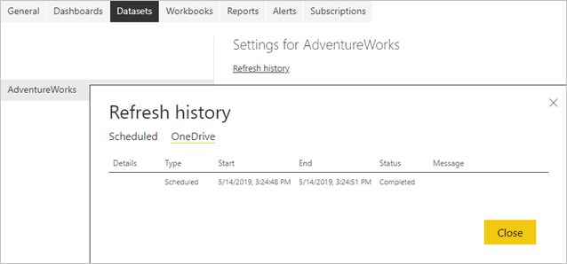

Como mostra a captura de ecrã acima, o Power BI identificou esta atualização do OneDrive como uma atualização **Agendada**, mas não é possível configurar o intervalo de atualização. A atualização do OneDrive só pode ser desativada nas definições do conjunto de dados. A desativação da atualização é útil se não quiser que os conjuntos de dados e os relatórios no Power BI detetem automaticamente as alterações dos ficheiros de origem.

Tenha em atenção que a página de definições do conjunto de dados só mostra as secções **Credenciais do OneDrive** e **Atualização do OneDrive** se o conjunto de dados estiver ligado a um ficheiro no OneDrive ou SharePoint Online, tal como na seguinte captura de ecrã. Os conjuntos de dados que não estiverem ligados ao ficheiro de origem no OneDrive ou SharePoint Online não mostram estas secções.

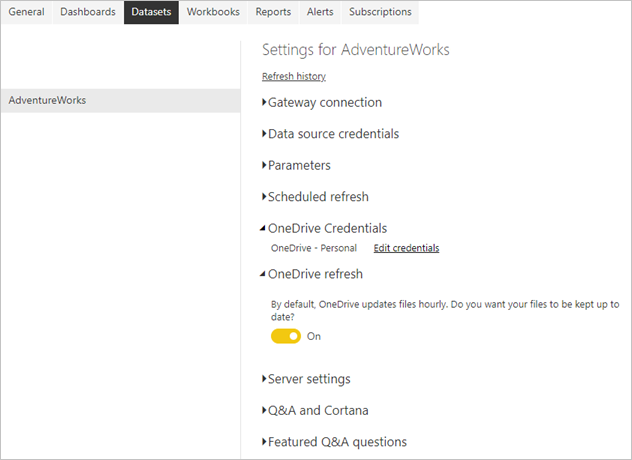

Se desativar a atualização do OneDrive para um conjunto de dados, ainda pode sincronizar o seu conjunto de dados a pedido ao selecionar **Atualizar Agora** no menu do conjunto de dados. Como parte da atualização a pedido, o Power BI verifica se o ficheiro de origem no OneDrive ou SharePoint Online é mais recente do que o conjunto de dados no Power BI e sincroniza o conjunto de dados, se for este o caso. O **Histórico de atualizações** lista estas atividades como atualizações a pedido no separador **OneDrive**.

Tenha em atenção que a atualização do OneDrive não solicita dados das origens de dados originais. A atualização do OneDrive só atualiza os recursos no Power BI com os metadados e dados do ficheiro .pbix, .xlsx ou .csv, como ilustrado no seguinte diagrama. Para garantir que o conjunto de dados tem os dados mais recentes das origens de dados, o Power BI aciona também uma atualização de dados como parte de uma atualização a pedido. Pode verificá-lo no **Histórico de atualizações** se mudar para o separador **Agendadas**.

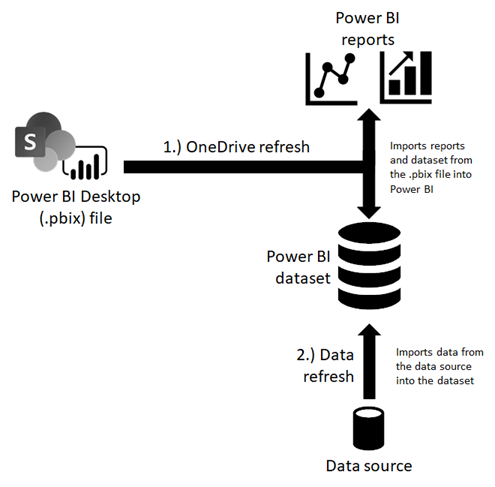

Se mantiver a atualização do OneDrive ativada para um conjunto de dados ligado ao OneDrive ou SharePoint Online e quiser fazer a atualização de dados de forma agendada, certifique-se de que configura a agenda para que o Power BI faça a atualização de dados após a atualização do OneDrive. Por exemplo, se tiver criado o seu próprio serviço ou processo para atualizar o ficheiro de origem no OneDrive ou SharePoint Online todas as noites à 1h da manhã, pode configurar a atualização agendada para as 2:30, para dar ao Power BI bastante tempo para concluir a atualização do OneDrive antes de iniciar a atualização de dados.

#### <a name="refresh-of-query-caches"></a>Atualização das caches de consulta

Se o conjunto de dados residir numa capacidade Premium, poderá conseguir melhorar o desempenho dos relatórios e dashboards associados ao ativar a colocação em cache da consulta, como se mostra na seguinte captura de ecrã. A colocação em cache de consultas dá instruções à capacidade Premium para utilizar o serviço de colocação em cache local para manter os resultados de consulta, evitando que a origem de dados subjacente efetue a computação desses resultados. Para obter mais informações, veja [Colocação de consultas em cache no Power BI Premium](power-bi-query-caching.md).

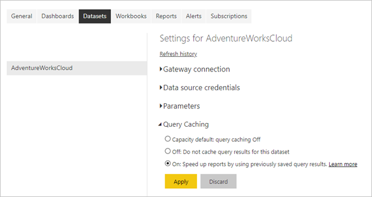

No entanto, após uma atualização de dados, os resultados de consultas anteriormente colocadas em cache já não são válidos. O Power BI elimina estes resultados em cache e tem de os recriar. Por esse motivo, a colocação de consultas em cache pode não ser tão vantajosa para relatórios e dashboards associados a conjuntos de dados que atualiza com frequência, por exemplo 48 vezes por dia.

#### <a name="tile-refresh"></a>Atualização de mosaico

O Power BI mantém uma cache para cada elemento visual de mosaico nos dashboards e atualiza proativamente as caches de mosaico quando os dados são alterados. Por outras palavras, a atualização de mosaicos ocorre automaticamente após uma atualização de dados. Isto é válido para ambas as operações de atualização, agendadas e a pedido. Também pode forçar uma atualização de mosaico ao selecionar **Mais opções** (...) no canto superior direito de um dashboard e selecionar **Atualizar mosaicos do dashboard**.

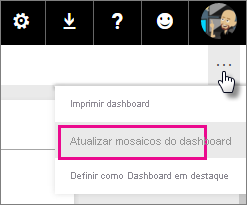

Uma vez que ocorre automaticamente, pode considerar a atualização de mosaicos uma parte intrínseca da atualização de dados. Entre outras coisas, poderá reparar que a duração da atualização aumenta com o número de mosaicos. A sobrecarga de atualizações de mosaicos pode ser significativa.

Por predefinição, o Power BI mantém uma única cache para cada mosaico, mas se utilizar a segurança dinâmica para restringir o acesso aos dados com base nas funções de utilizador, conforme descrito no artigo [segurança ao nível da linha (RLS) com o Power BI](../admin/service-admin-rls.md), o Power BI tem de manter uma cache para cada função e cada mosaico. O número de caches de mosaicos multiplica-se pelo número de funções.

A situação pode complicar-se ainda mais se o conjunto de dados utilizar uma ligação em direto para um modelo de dados do Analysis Services com RLS, conforme realçado no tutorial [Segurança dinâmica ao nível da linha com o modelo em tabela do Analysis Services](desktop-tutorial-row-level-security-onprem-ssas-tabular.md). Nesta situação, o Power BI tem de manter e atualizar uma cache para cada mosaico e para cada utilizador que já viu o dashboard. Não é invulgar que a parte da atualização de mosaico de uma operação de atualização de dados deste tipo ultrapasse significativamente o tempo necessário para obter os dados da origem. Para obter detalhes sobre a atualização de mosaicos, veja [Resolução de problemas de erros de mosaico](refresh-troubleshooting-tile-errors.md).

#### <a name="refresh-of-report-visuals"></a>Atualização de elementos visuais do relatório

Este processo de atualização é menos importante, porque só é relevante para ligações em direto ao Analysis Services. Para estas ligações, o Power BI coloca em cache o último estado dos elementos visuais do relatório para que, ao ver o relatório novamente, o Power BI não tenha de consultar o modelo em tabela do Analysis Services. Ao interagir com o relatório, tal como ao alterar um filtro de relatório, o Power BI consulta o modelo em tabela e atualiza automaticamente os elementos visuais do relatório. Se suspeitar que um relatório está a apresentar dados obsoletos, também pode selecionar o botão Atualizar do relatório para acionar uma atualização de todos os elementos visuais do relatório, como ilustra a seguinte captura de ecrã.

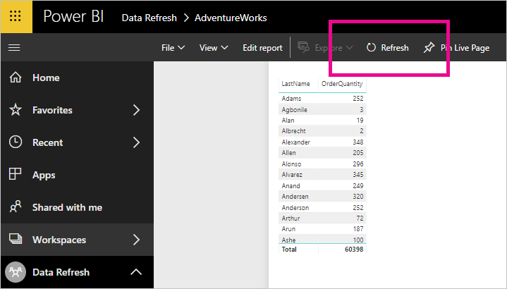

## <a name="review-data-infrastructure-dependencies"></a>Reveja as dependências de infraestrutura de dados

Independentemente dos modos de armazenamento, nenhuma atualização de dados poderá ter êxito a menos que as origens de dados subjacentes estejam acessíveis. Existem três cenários principais de acesso a dados:

- Um conjunto de dados utiliza origens de dados que residem no local
- Um conjunto de dados utiliza origens de dados na cloud
- Um conjunto de dados utiliza dados de ambos, origens no local e na cloud

### <a name="connecting-to-on-premises-data-sources"></a>Ligação a origens de dados no local

Se o conjunto de dados utilizar uma origem de dados à qual o Power BI não consegue aceder através de uma ligação de rede direta, tem de configurar uma ligação de gateway para este conjunto de dados antes de poder ativar uma agenda de atualização ou fazer uma atualização de dados a pedido. Para obter mais informações sobre gateways de dados e como funcionam, veja [O que são gateways de dados no local?](service-gateway-onprem.md)

Tem as seguintes opções:

- Escolha um gateway de dados empresarial com a definição de origem de dados necessária
- Implementar um gateway de dados pessoal

> [!NOTE]
> Pode encontrar uma lista de tipos de origens de dados que necessitem de um gateway de dados no artigo [Gerir a origem de dados – Importação/Atualização Agendada](service-gateway-enterprise-manage-scheduled-refresh.md).

#### <a name="using-an-enterprise-data-gateway"></a>Utilizar um gateway de dados empresarial

A Microsoft recomenda utilizar um gateway de dados empresarial em vez de um gateway pessoal para ligar um conjunto de dados a uma origem de dados no local. Certifique-se de que o gateway está corretamente configurado, o que significa que o gateway tem de ter as atualizações mais recentes e todas as definições de origem de dados necessárias. Uma definição de origem de dados fornece ao Power BI informações de ligação para uma determinada origem, incluindo pontos finais de ligações, modo de autenticação e credenciais. Para obter mais informações sobre a gestão de origens de dados num gateway, veja [Gerir a origem de dados - importação/atualização agendada](service-gateway-enterprise-manage-scheduled-refresh.md).

Ligar um conjunto de dados a um gateway empresarial é relativamente simples se for administrador de um gateway. Com permissões de administrador, pode atualizar de imediato o gateway e adicionar origens de dados em falta, se for necessário. Na verdade, pode adicionar uma origem de dados em falta ao seu gateway diretamente a partir da página de definições do conjunto de dados. Expanda o botão de alternar para ver as origens de dados e selecione a ligação **Adicionar ao gateway**, conforme apresentado na seguinte captura de ecrã. Se, por outro lado, não for administrador de gateway, tem de contactar um administrador de gateway para adicionar a definição da origem de dados necessária.

> [!NOTE]
> Apenas os administradores de gateway podem adicionar origens de dados a um gateway. Certifique-se também de que o administrador do gateway adiciona a sua conta de utilizador à lista de utilizadores com permissões para utilizar a origem de dados. A página de definições do conjunto de dados só lhe permite selecionar um gateway empresarial com uma origem de dados correspondente que tenha permissão para utilizar.

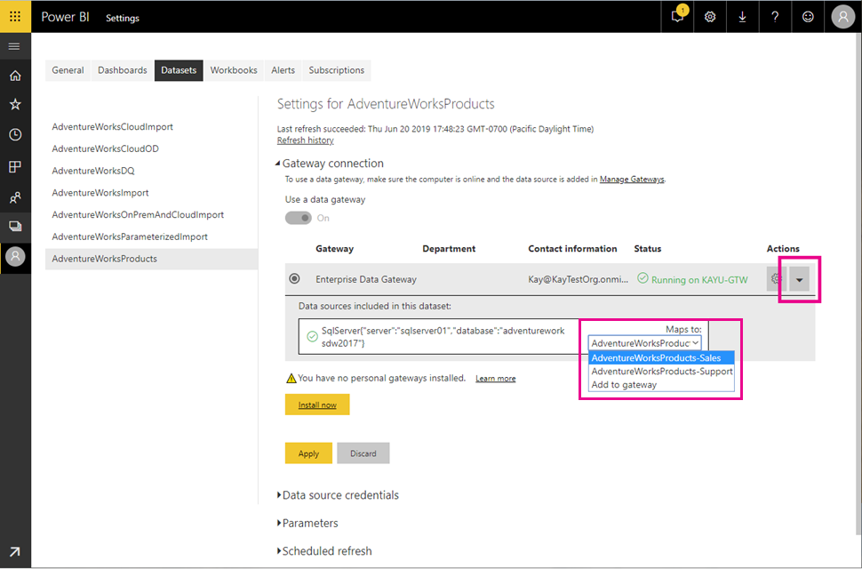

Certifique-se de que mapeia a definição da origem de dados correta à sua origem de dados. Como a captura de ecrã acima ilustra, os administradores do gateway podem criar múltiplas definições num único gateway ligado à mesma origem de dados – cada um com credenciais diferentes. Nos exemplos mostrados, um proprietário de um conjunto de dados do Departamento de Vendas escolheria a definição de origem de dados AdventureWorksProducts-Vendas, enquanto um proprietário de um conjunto de dados do Departamento de Suporte mapearia esse mesmo conjunto de dados à definição de origem de dados AdventureWorksProducts-Suporte. Se os nomes da definição da origem de dados não forem intuitivos, contacte o seu administrador do gateway para saber quais as definições que deve escolher.

> [!NOTE]
> Um conjunto de dados só pode utilizar uma única ligação de gateway. Por outras palavras, não é possível aceder a origens de dados no local através de múltiplas ligações de gateway. Da mesma forma, tem de adicionar todas as definições de origem de dados necessárias ao mesmo gateway.

#### <a name="deploying-a-personal-data-gateway"></a>Implementar um gateway de dados pessoal

Se não tem acesso a um gateway de dados empresarial e é a única pessoa que gere os conjuntos de dados, pelo que não precisa de partilhar origens de dados com outras pessoas, pode implementar um gateway de dados no modo pessoal. Na secção **Ligação de gateway**, em **Não tem gateways pessoais instalados**, selecione **Instalar agora**. O gateway de dados pessoal tem várias limitações, conforme documentado em [Gateway de dados no local (modo pessoal)](service-gateway-personal-mode.md).

Ao contrário de um gateway de dados empresarial, não precisa de adicionar definições de origem de dados a um gateway pessoal. Em vez disso, faz a gestão da configuração da origem de dados com a secção **Credenciais da origem de dados** nas definições do conjunto de dados, tal como ilustra a seguinte captura de ecrã.

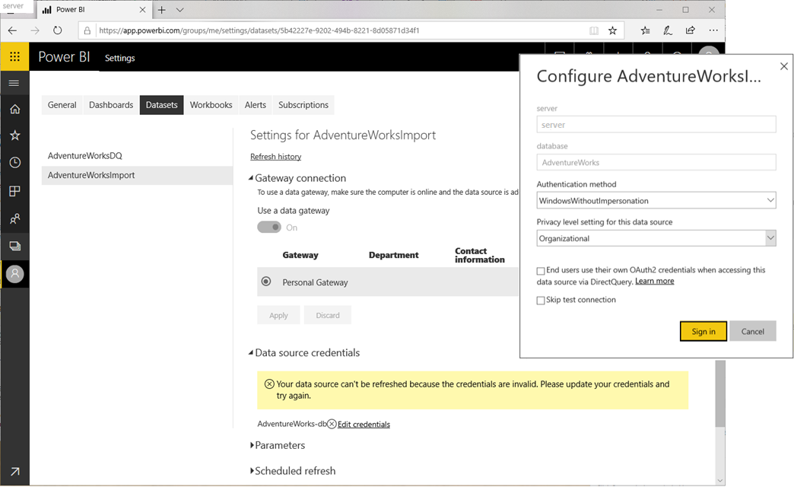


### <a name="accessing-cloud-data-sources"></a>Aceder a origens de dados na cloud

Os conjuntos de dados que utilizem origens de dados na cloud, como a DB SQL do Azure, não necessitam de um gateway de dados se o Power BI puder estabelecer uma ligação de rede direta à origem. Da mesma forma, pode gerir a configuração destas origens de dados com a secção **Credenciais da origem de dados** nas definições do conjunto de dados. Como mostra a seguinte captura de ecrã, não precisa de configurar uma ligação de gateway.

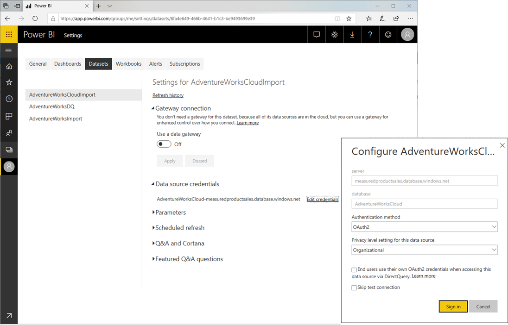

> [!NOTE]
> Cada utilizador só pode ter um conjunto de credenciais por origem de dados, em todos os conjuntos de dados que possuam, independentemente das áreas de trabalho onde residem os conjuntos de dados. 

### <a name="accessing-on-premises-and-cloud-sources-in-the-same-source-query"></a>Aceder a origens no local e na cloud na mesma consulta de origem

Um conjunto de dados pode obter dados de múltiplas origens e estas origens podem residir no local ou na cloud. No entanto, um conjunto de dados só pode utilizar uma única ligação de gateway, conforme mencionado anteriormente. Embora as origens de dados na cloud não precisem necessariamente um gateway, é necessário um gateway se um conjunto de dados se ligar a origens no local e na cloud numa única consulta de mashup. Neste cenário, o Power BI tem de utilizar um gateway também para as origens de dados na cloud. O seguinte diagrama ilustra a forma como um conjunto de dados deste tipo acede às respetivas origens de dados.

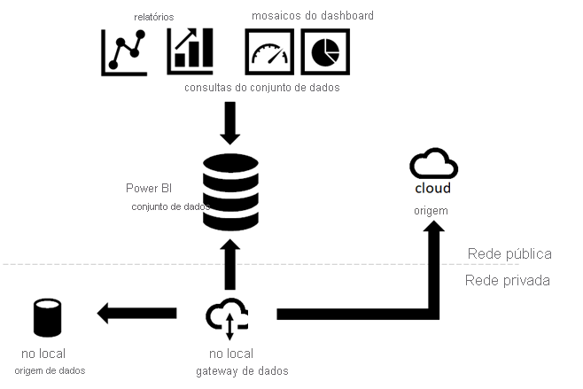

> [!NOTE]
> Se um conjunto de dados utiliza consultas de mashup separadas para ligar a origens no local e na cloud, o Power BI utiliza uma ligação de gateway para aceder às origens no local e uma ligação de rede direta para as origens na cloud. Se uma consulta de mashup intercalar ou acrescentar dados a partir de origens no local e na cloud, o Power BI muda para a ligação de gateway, mesmo para as origens na cloud.

Os conjuntos de dados do Power BI baseiam-se no Power Query para aceder e obter dados de origem. A seguinte listagem de mashup mostra um exemplo básico de uma consulta que intercala dados de uma origem no local e de uma origem na cloud.

```
Let

    OnPremSource = Sql.Database("on-premises-db", "AdventureWorks"),

    CloudSource = Sql.Databases("cloudsql.database.windows.net", "AdventureWorks"),

    TableData1 = OnPremSource{[Schema="Sales",Item="Customer"]}[Data],

    TableData2 = CloudSource {[Schema="Sales",Item="Customer"]}[Data],

    MergedData = Table.NestedJoin(TableData1, {"BusinessEntityID"}, TableData2, {"BusinessEntityID"}, "MergedData", JoinKind.Inner)

in

    MergedData
```

Existem duas opções para configurar um gateway de dados que suporte a intercalação ou anexação de dados de origens no local e na cloud:

- Adicione uma definição de origem de dados para a origem na cloud ao gateway de dados, além das origens de dados no local.
- Selecione a caixa de verificação **Permitir que as origens de dados de cloud do utilizador atualizem através deste cluster de gateway**.

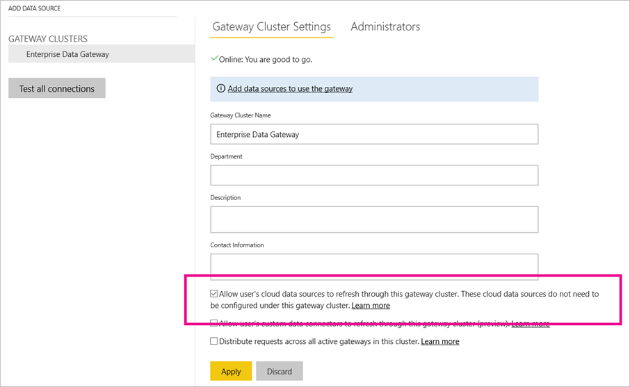

Caso selecione a caixa de verificação **Permitir que as origens de dados de cloud do utilizador atualizem através deste cluster de gateway na configuração do gateway**, tal como na captura de ecrã acima, o Power BI poderá utilizar a configuração que o utilizador definiu para a origem na cloud em **Credenciais da origem de dados** nas definições do conjunto de dados. Isto pode ajudar a reduzir a sobrecarga da configuração do gateway. Por outro lado, se quiser ter maior controlo sobre as ligações que o gateway estabelece, não deve ativar esta caixa de verificação. Neste caso, tem de adicionar uma definição de origem de dados explícita para cada origem na cloud para a qual pretenda suporte no seu gateway. Também é possível selecionar a caixa de verificação e adicionar definições de origem de dados explícitas para as origens na cloud a um gateway. Neste caso, o gateway utiliza as definições da origem de dados para todas as origens correspondentes.

### <a name="configuring-query-parameters"></a>Configurar parâmetros de consulta

As consultas de mashup ou M que cria ao utilizar o Power Query podem variar em complexidade, desde passos triviais a construções parametrizadas. A seguinte listagem mostra uma pequena consulta de mashup de exemplo que utiliza dois parâmetros chamados _SchemaName_ e _TableName_ para aceder a uma determinada tabela numa base de dados AdventureWorks.

```
let

    Source = Sql.Database("SqlServer01", "AdventureWorks"),

    TableData = Source{[Schema=SchemaName,Item=TableName]}[Data]

in

    TableData
```

> [!NOTE]
> Os parâmetros de consulta só são suportados para conjuntos de dados de Modo de importação. O modo DirectQuery/LiveConnect não suporta definições de parâmetros de consulta.

Para garantir que um conjunto de dados parametrizado acede aos dados corretos, tem de configurar os parâmetros de consulta de mashup nas definições do conjunto de dados. Também pode atualizar os parâmetros programaticamente ao utilizar a [API REST do Power BI](/rest/api/power-bi/datasets/updateparametersingroup). A seguinte captura de ecrã mostra a interface de utilizador para configurar os parâmetros de consulta para um conjunto de dados que utiliza a consulta de mashup acima.

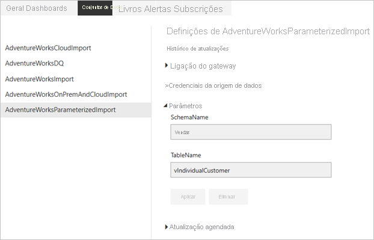


## <a name="refresh-and-dynamic-data-sources"></a>Atualizar e origens de dados dinâmicas
 
Uma *origem de dados dinâmica* é uma origem de dados em que algumas ou todas as informações necessárias para ligar não podem ser determinadas até que o Power Query execute a consulta, porque os dados são gerados em código ou devolvidos de outra origem de dados. Exemplos: o nome da instância e a base de dados de uma base de dados do SQL Server; o caminho de um ficheiro CSV; ou o URL de um serviço Web. 
 
Na maioria dos casos, os conjuntos de dados do Power BI que utilizam origens de dados dinâmicas não podem ser atualizados no serviço Power BI. Existem algumas exceções em que as origens de dados dinâmicas podem ser atualizadas no serviço Power BI, por exemplo, ao utilizar as opções RelativePath e Consulta com a função M de Web.Contents. As consultas que referenciam os parâmetros do Power Query também podem ser atualizadas.
 
Para determinar se a origem de dados dinâmica pode ser atualizada, abra a caixa de diálogo **Definições da Origem de Dados** no **Editor do Power Query** e selecione **Origens de Dados no Ficheiro Atual**. Na janela apresentada, procure a seguinte mensagem de aviso, conforme mostrado na seguinte imagem:
 
    Some data sources may not be listed because of hand-authored queries.

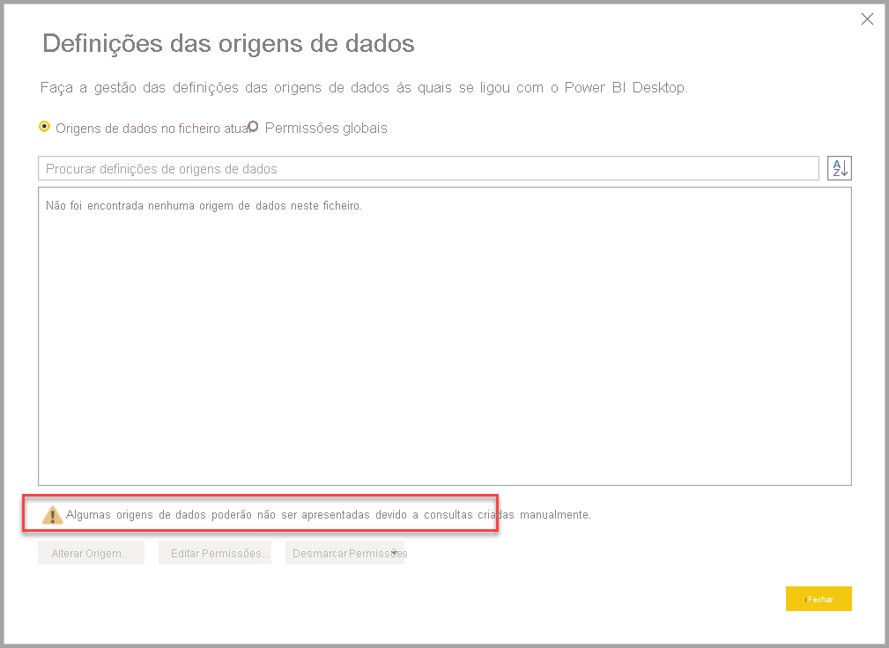

Se este aviso estiver presente na caixa de diálogo **Definições da Origem de Dados** apresentada, significa que está presente uma origem de dados dinâmica que não pode ser atualizada no serviço Power BI.

## <a name="configure-scheduled-refresh"></a>Configurar a atualização agendada

Estabelecer a conectividade entre o Power BI e as origens de dados é, de longe, a tarefa mais desafiante na configuração de uma atualização de dados. Os passos restantes são relativamente simples e incluem a definição da agenda de atualização e a ativação das notificações de falha de atualização. Para obter instruções passo a passo, veja o manual de instruções [Configurar a atualização agendada](refresh-scheduled-refresh.md).

### <a name="setting-a-refresh-schedule"></a>Definir uma agenda de atualização

A secção **Atualização agendada** é o local no qual define a frequência e o intervalo de tempo para atualizar um conjunto de dados. Como mencionado anteriormente, pode configurar até oito intervalos de tempo diários se o conjunto de dados estiver na capacidade partilhada ou 48 intervalos de tempo no Power BI Premium. A seguinte captura de ecrã mostra uma agenda de atualização num intervalo de doze horas.

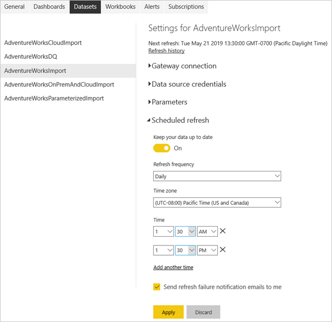

Depois de configurar uma agenda de atualização, a página de definições do conjunto de dados informa-o sobre a próxima hora de atualização, tal como na captura de ecrã acima. Se quiser atualizar os dados mais cedo, como para testar a configuração do gateway e da origem de dados, efetue uma atualização a pedido com a opção **Atualizar Agora** no menu do conjunto de dados no painel de navegação. As atualizações a pedido não afetam a nova hora de atualização agendada.

Tenha também em atenção que a hora de atualização configurada pode não ser a hora exata em que o Power BI inicia o processo agendado seguinte. O Power BI inicia as atualizações agendadas com base no melhor esforço. O objetivo é iniciar a atualização no espaço de 15 minutos do intervalo de tempo agendado, mas pode ocorrer um atraso de até uma hora, se o serviço não conseguir alocar os recursos necessários mais cedo.

> [!NOTE]
> O Power BI desativa a agenda de atualização após quatro falhas consecutivas ou quando o serviço detetar um erro irrecuperável que necessita de uma atualização de configuração, tal como credenciais inválidas ou expiradas. Não é possível alterar o limiar de falhas consecutivas.

### <a name="getting-refresh-failure-notifications"></a>Receber notificações de falha de atualização

Por predefinição, o Power BI envia notificações de falha de atualização por e-mail para o proprietário do conjunto de dados para que o proprietário possa agir atempadamente caso ocorram problemas de atualização. O Power BI também lhe envia uma notificação quando o serviço desativa a sua agenda devido a falhas consecutivas. A Microsoft recomenda que deixe a caixa de verificação **Enviar e-mails de notificação de falha de atualização para mim** selecionada.

Também é boa ideia especificar outros destinatários através da caixa de texto **Enviar e-mail a estes utilizadores quando a atualização falhar**. Neste caso, tanto o proprietário do conjunto de dados como os destinatários especificados recebem notificações de falha de atualização. Poderá, por exemplo, tratar-se de um colega que está encarregue de tratar dos seus conjuntos de dados durante as suas férias. Também pode ser o alias de e-mail da sua equipa de suporte que está a resolver problemas de atualização para o seu departamento ou organização. O envio de notificações de falha de atualização para outras pessoas além do proprietário do conjunto de dados ajuda a garantir que os problemas são considerados e resolvidos atempadamente.

Tenha em atenção que o Power BI não só envia notificações sobre falhas de atualização, mas também quando o serviço coloca em pausa uma atualização agendada devido a inatividade. Após dois meses, se nenhum utilizador tiver visitado nenhum dos dashboards ou relatórios incorporados no conjunto de dados, o Power BI considera o conjunto de dados inativo. Nesta situação, o Power BI envia uma mensagem de e-mail para o proprietário do conjunto de dados com a indicação de que o serviço colocou a agenda de atualização em pausa para o conjunto de dados. Veja a seguinte captura de ecrã para obter um exemplo de uma notificação desse tipo.

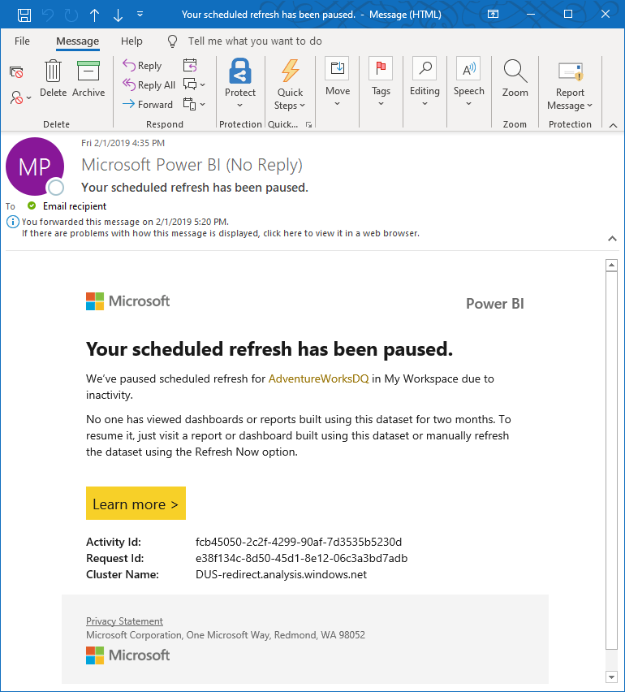

Para retomar a atualização agendada, visite um relatório ou dashboard criado com este conjunto de dados ou atualize manualmente o conjunto de dados através da opção **Atualizar Agora**.

### <a name="checking-refresh-status-and-history"></a>Verificar o estado e histórico de atualização

Além das notificações de falha, é boa ideia verificar os conjuntos de dados periodicamente quanto à existência de erros de atualização. Uma forma rápida consiste em ver a lista de conjuntos de dados numa área de trabalho. Os conjuntos de dados com erros apresentam um pequeno ícone de aviso. Selecione o ícone de aviso para obter informações adicionais, tal como na seguinte captura de ecrã. Para obter mais informações sobre a resolução de problemas de erros de atualização específicos, veja [Resolução de problemas de cenários de atualização](refresh-troubleshooting-refresh-scenarios.md).


O ícone de aviso ajuda a indicar problemas de conjuntos de dados atuais, mas também é boa ideia verificar o histórico de atualização ocasionalmente. Como o nome indica, o histórico de atualizações permite-lhe rever o estado de êxito ou falha de ciclos de sincronização anteriores. Por exemplo, o administrador de um gateway poderá ter atualizado um conjunto expirado de credenciais de base de dados. Como pode ver na seguinte captura de ecrã, o histórico de atualizações mostra a altura em que uma atualização afetada começa a funcionar novamente.


> [!NOTE]
> Encontrará uma ligação para apresentar o histórico de atualizações nas definições do conjunto de dados. Também pode obter o histórico de atualizações programaticamente ao utilizar a [API REST do Power BI](/rest/api/power-bi/datasets/getrefreshhistoryingroup). Ao utilizar uma solução personalizada, pode monitorizar o histórico de atualizações de múltiplos conjuntos de dados de forma centralizada.

## <a name="automatic-page-refresh"></a>Atualização automática de página

A atualização automática de página funciona ao nível da página de relatório e permite que os autores de relatórios definam um intervalo de atualização para os elementos visuais numa página que só está ativa quando está a ser consumida. A atualização automática de página só está disponível para origens de dados DirectQuery. O intervalo de atualização mínimo depende do tipo de área de trabalho na qual o relatório é publicado e das definições de administração de capacidades das áreas de trabalho Premium e das [áreas de trabalho incorporadas](../developer/embedded/embedding.md).

Saiba mais sobre a atualização automática de página no artigo de [atualização automática de página](../create-reports/desktop-automatic-page-refresh.md).

## <a name="best-practices"></a>Melhores práticas

Verificar o histórico de atualizações dos conjuntos de dados regularmente é uma das melhores práticas mais importantes que pode adotar para garantir que os relatórios e dashboards utilizam dados atuais. Se detetar problemas, resolva-os imediatamente e acompanhe os proprietários das origens de dados e os administradores de gateway, se necessário.

Além disso, considere as seguintes recomendações para estabelecer e manter processos de atualização de dados fiáveis para os conjuntos de dados:

- Agende as atualizações para horas menos ocupadas, especialmente se os conjuntos de dados estiverem no Power BI Premium. Se distribuir os ciclos de atualização dos conjuntos de dados por um intervalo de tempo mais abrangente, pode ajudar a evitar picos que, caso contrário, podem sobrecarregar os recursos disponíveis. Os atrasos no início de um ciclo de atualização são um indicador de sobrecarga de recursos. Se uma capacidade Premium estiver completamente esgotada, o Power BI pode até mesmo ignorar um ciclo de atualização.
- Tenha os limites de atualização em mente. Se os dados de origem forem alterados com frequência ou o volume de dados for substancial, considere utilizar o modo DirectQuery/LiveConnect em vez do Modo de importação se o aumento de carga na origem e o impacto no desempenho da consulta forem aceitáveis. Evite atualizar constantemente um conjunto de dados do Modo de importação. No entanto, o modo DirectQuery/LiveConnect tem várias limitações, como um limite de um milhão de linhas para devolução de dados e um limite de tempo de resposta de 225 segundos para executar consultas, conforme documentado em [Utilizar o DirectQuery no Power BI Desktop](desktop-use-directquery.md). Estas limitações podem exigir que utilize o Modo de importação, mesmo assim. Para volumes de dados muito grandes, considere utilizar [agregações no Power BI](../transform-model/desktop-aggregations.md).
- Certifique-se de que a hora de atualização do conjunto de dados não excede a duração máxima da atualização. Utilize o Power BI Desktop para verificar a duração da atualização. Se demorar mais de 2 horas, considere mover o conjunto de dados para o Power BI Premium. O conjunto de dados pode não poder ser atualizado na capacidade partilhada. Considere também utilizar a [atualização incremental no Power BI Premium](../admin/service-premium-incremental-refresh.md) para conjuntos de dados com mais de 1 GB ou que demoram várias horas a atualizar.
- Otimize os conjuntos de dados para incluir apenas as tabelas e colunas que são utilizadas pelos relatórios e dashboards. Otimize as consultas de mashup e, se possível, evite definições de origens de dados dinâmicas e cálculos DAX dispendiosos. Evite especificamente funções DAX que testam cada linha numa tabela devido ao elevado consumo de memória e sobrecarga de processamento.
- Aplique as mesmas definições de privacidade que no Power BI Desktop para se certificar de que o Power BI pode gerar consultas de origem eficazes. Tenha em atenção que o Power BI Desktop não publica definições de privacidade. Tem de voltar a aplicar manualmente as definições nas definições da origem de dados depois de publicar o conjunto de dados.
- Limite o número de elementos visuais nos dashboards, especialmente se utilizar a [segurança ao nível da linha (RLS)](../admin/service-admin-rls.md). Conforme explicado anteriormente neste artigo, um número excessivo de mosaicos do dashboard pode aumentar significativamente a duração da atualização.
- Utilize uma implementação de gateway de dados empresarial fiável para ligar os conjuntos de dados a origens de dados no local. Se observar falhas de atualização relacionadas com o gateway, tais como gateway indisponível ou sobrecarregado, acompanhe os administradores de gateway para adicionar gateways adicionais a um cluster existente ou implementar um novo cluster (aumento vertical em comparação com aumento horizontal).
- Utilize gateways de dados separados para conjuntos de dados de Importação e conjuntos de dados DirectQuery/LiveConnect, para que as importações de dados durante a atualização agendada não afetem o desempenho de relatórios e dashboards sobre conjuntos de dados DirectQuery/LiveConnect, que consultam as origens de dados com cada interação do utilizador.
- Certifique-se de que o Power BI pode enviar notificações de falha de atualização para sua caixa de correio. Os filtros de spam podem bloquear as mensagens de e-mail ou movê-las para uma pasta separada, onde poderá não reparar nelas imediatamente.


## <a name="next-steps"></a>Próximos passos

[Configurar a atualização agendada](refresh-scheduled-refresh.md)  
[Ferramentas para resolver problemas de atualização](service-gateway-onprem-tshoot.md)  
[Resolução de problemas de cenários de atualização](refresh-troubleshooting-refresh-scenarios.md)  

Mais perguntas? [Experimente perguntar à Comunidade do Power BI](https://community.powerbi.com/)
