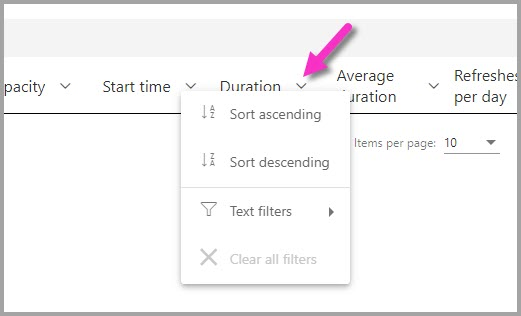

# Resumos de atualizações do Power BI

A página de **resumos de atualizações** no portal de administração do Power BI fornece controlo e informações sobre as agendas, capacidades e potenciais sobreposições na agenda de atualizações. Pode utilizar a página de resumos de atualizações para determinar se deve ajustar as agendas de atualizações, saber mais sobre os códigos de erros associados a problemas de atualização e gerir devidamente o agendamento de atualização dos dados. 

A página de resumos de atualizações tem duas vistas:

* **Histórico** – apresenta o histórico do resumo de atualizações das capacidades do Power BI Premium que administra.

* **Agenda** – mostra a vista de agenda da atualização agendada, que também pode revelar problemas relacionados com períodos de horas sobrecarregados.

Também pode exportar informações sobre um evento de atualização para um ficheiro .CSV, o que pode fornecer informações significativas sobre eventos ou erros de atualizações que podem estar a afetar o desempenho ou a conclusão de eventos de atualizações agendadas.

As seguintes secções analisam estas vistas individualmente. 

## Histórico de atualizações

Pode selecionar a vista **Histórico** ao clicar em **Histórico** na página de resumos de atualizações.

O Histórico fornece uma descrição geral dos resultados de atualizações recentemente agendadas nas capacidades para as quais tem privilégios de administrador. Pode ordenar a vista por qualquer coluna ao clicar na mesma. Pode optar por ordenar a vista pela coluna selecionada por ordem ascendente, descendente ou por filtros de texto.

Na vista de histórico, os dados associados a uma determinada atualização são baseados em até 60 dos registos mais recentes de cada atualização agendada.

Também pode exportar as informações de qualquer atualização agendada para um ficheiro .CSV, incluindo informações detalhadas como mensagens de erros de cada evento de atualização. A exportação para um ficheiro .CSV permite-lhe ordenar o ficheiro com base em qualquer uma das colunas, procurar palavras, ordenar por códigos de erros ou proprietários, etc. A imagem seguinte mostra um ficheiro .CSV exportado de exemplo. 

Com as informações no ficheiro exportado, pode consultar a capacidade, duração e quaisquer mensagens de erro registadas para a instância de atualização. 

## Agenda de atualizações

Pode selecionar a vista **Agenda** ao clicar em **Agenda** nos resumos de atualizações. A vista Agenda apresenta informações de agendamento para a semana, divididas em intervalos de tempo de 30 minutos. 

A vista Agenda é muito útil para determinar se os eventos de atualizações agendadas estão devidamente espaçados, permitindo que todas as atualizações sejam concluídas sem sobreposições, ou se tem eventos de atualizações agendadas que estão a demorar demasiado tempo e a criar contenção de recursos. Se verificar que existe contenção de recursos, deve ajustar os seus horários de atualizações para evitar conflitos ou sobreposições, para que as suas atualizações agendadas possam ser concluídas com êxito. 

A coluna *Tempo de atualização reservado (minutos)* é um cálculo da média de até 60 registos de cada conjunto de dados associado. O valor numérico para cada intervalo de tempo de 30 minutos é a soma de minutos calculados de todas as atualizações agendadas para começarem no intervalo de tempo **e** quaisquer atualizações agendadas definidas para começarem no intervalo de tempo *anterior*, mas cuja duração média se sobrepõe ao intervalo de tempo selecionado.

A coluna *Tempo de atualização disponível (minutos)* é um cálculo dos minutos disponíveis para atualização em cada intervalo de tempo, menos qualquer atualização que já esteja agendada para esse intervalo de tempo. Por exemplo, se a subscrição P2 disponibilizar 12 atualizações em execução em simultâneo, terá 12 intervalos de 30 minutos, portanto, 12 atualizações x 30 minutos cada = 360 minutos disponíveis para atualização nesse intervalo de tempo. Se tiver uma atualização agendada nesse intervalo que demore 20 minutos, o *Tempo de atualização disponível (minutos)* nesse intervalo será de 340 minutos (total de 360 minutos disponíveis, menos 20 minutos já agendados = 340 minutos ainda disponíveis). 

Pode selecionar um intervalo de tempo e, em seguida, selecionar o botão de **detalhes** associado para ver quais são os eventos de atualizações agendadas que contribuem para o tempo de atualização reservado, os proprietários e quanto tempo demoram a ser concluídos.

Vejamos um exemplo de como funciona. A seguinte caixa de diálogo é apresentada quando selecionamos o intervalo de tempo das 20:30 de domingo e clicamos em **detalhes**.

Existem três eventos de atualizações agendadas a ocorrer neste intervalo de tempo. 

As atualizações n.º 1 e n.º 3 estão agendadas para este intervalo de tempo das 20:30, que podemos determinar ao analisar o valor na coluna **Horário agendado**. As suas durações médias são, respetivamente, de 4:39 e 0:06 (seis segundos). Aqui está tudo correto.

No entanto, a atualização n.º 2 está agendada para o intervalo de tempo das 20:00. Porém, como demora, em média, mais de 48 minutos a ser concluída (veja a coluna **Duração média**), esse evento de atualização sobrepõe-se ao próximo intervalo de 30 minutos. 

Aqui há um problema. Neste caso, o administrador deve contactar os proprietários dessa instância de atualização agendada e sugerir que determinem um intervalo de tempo diferente para essa atualização agendada. Em alternativa, pode ainda sugerir que reagendem outras atualizações, para que não exista sobreposição, ou encontrem outra solução para evitar essa sobreposição. 

## Próximos passos

- [Atualização de dados no Power BI](refresh-data.md)  
- [Power BI Gateway - Personal](service-gateway-personal-mode.md)  
- [Gateway de dados no local (modo pessoal)](service-gateway-onprem.md)  
- [Resolução de problemas do Gateway de dados no local](service-gateway-onprem-tshoot.md)  
- [Resolver problemas do Power BI Gateway - Personal](service-admin-troubleshooting-power-bi-personal-gateway.md)  

Mais perguntas? [Experimente perguntar à Comunidade do Power BI](https://community.powerbi.com/)