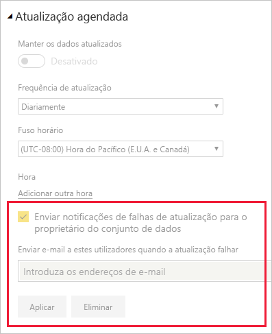

# Resolver problemas de atualização

Aqui pode encontrar informações sobre cenários diferentes que pode encontrar ao atualizar dados no serviço Power BI.

> [!NOTE]
> Caso se depare com um cenário que não esteja listado abaixo e lhe esteja a causar problemas, peça ajuda no [site da comunidade](https://community.powerbi.com/) ou crie um [pedido de suporte](https://powerbi.microsoft.com/support/).
>
>

## Notificações por e-mail

Se acedeu a este artigo a partir de uma notificação de e-mail e já não quer receber e-mails sobre problemas de atualização, contacte o seu administrador do Power BI. Peça-lhe para remover o seu e-mail ou uma lista de e-mails que tenha subscrito nos conjuntos de dados adequados no Power BI. O administrador pode fazer isto na seguinte área no portal de administração do Power BI.

## A atualização através do conector Web não funciona corretamente

Se tiver um script de conector Web que utilize a função [**Web.Page**](/powerquery-m/web-page) e tiver atualizado o seu conjunto de dados ou relatório após 18 de novembro de 2016, terá de utilizar um gateway para que a atualização funcione devidamente.

## Origem de dados não suportada para atualização

Ao configurar um conjunto de dados, pode receber um erro a indicar que o conjunto de dados utiliza uma origem de dados não suportada para atualização. Para obter detalhes, veja [Resolução de problemas de origem de dados sem suporte para atualização](service-admin-troubleshoot-unsupported-data-source-for-refresh.md).

## O dashboard não reflete as alterações após a atualização

Aguarde cerca de 10 a 15 minutos para a atualização ser aplicada nos mosaicos do dashboard. Se ainda não aparecer, afixe novamente a visualização no dashboard.

## GatewayNotReachable ao definir credenciais

Poderá deparar-se com o erro `GatewayNotReachable` ao tentar definir credenciais para uma origem de dados. A causa deste erro pode ser um gateway desatualizado. Instale o gateway mais recente e tente novamente.

## Erro de Processamento: ocorreu o erro de sistema seguinte: Erro de Correspondência de Tipo

Este pode ser um problema com o script M no seu ficheiro do Power BI Desktop ou livro do Excel. Também pode ser causado por uma versão desatualizada do Power BI Desktop.

## Erros de atualização do mosaico

Para obter uma lista de erros que podem ser encontrados em mosaicos de dashboard, bem como explicações, veja [Troubleshooting tile errors (Resolver problemas de erros de mosaico)](refresh-troubleshooting-tile-errors.md).

## A atualização falha ao atualizar dados de origens que utilizam o OAuth do AAD

O token de OAuth do Azure Active Directory (**AAD**), utilizado por muitas origens de dados diferentes, expira dentro de aproximadamente uma hora. Poderá deparar-se com situações nas quais o carregamento de dados demora mais tempo do que a expiração do token (mais do que uma hora), uma vez que o serviço Power BI aguarda até duas horas ao carregar dados. Nessa situação, o processo de carregamento de dados pode falhar com um erro de credenciais.

As origens de dados que podem utilizar o OAuth do AAD incluem o **Microsoft Dynamics CRM Online**, **SharePoint Online** (SPO), entre outros. Se se estiver a ligar a essas origens de dados e obtiver uma falha de credenciais quando o carregamento de dados demorar mais do que uma hora, este poderá ser o motivo.

A Microsoft está a investigar uma solução que permita que o processo de carregamento de dados atualize o token e continue. No entanto, se a sua instância do Dynamics CRM Online ou SharePoint Online (ou outra origem de dados OAuth do AAD) for tão grande que possa atingir o limiar de duas horas de carregamento de dados, poderá ainda exceder o tempo limite de carregamento de dados do serviço Power BI.

Note também que, para que a atualização funcione devidamente, ao ligar-se a uma origem de dados do **SharePoint Online** através do OAuth AAD, tem de utilizar a mesma conta que utiliza para iniciar sessão no **serviço Power BI**.

## Limites de dados não comprimidos para atualização

O tamanho máximo para conjuntos de dados importados para o **serviço Power BI** é 1 GB. Estes conjuntos de dados são bastante comprimidos para garantir um bom desempenho. Além disso, na capacidade partilhada, o serviço coloca um limite de 10 GB aos dados não comprimidos que são processados durante a atualização. Este limite prevê a compressão, pelo que é bastante superior a 1 GB. Os conjuntos de dados no Power BI Premium não estão sujeitos a este limite. Se a atualização no serviço Power BI falhar por este motivo, pedimos que reduza a quantidade de dados que são importados para o Power BI e tente novamente.

## Tempo limite de atualização agendada

A atualização agendada para os conjuntos de dados importados tem um tempo limite de duas horas. O tempo limite aumenta para cinco horas em conjuntos de dados em áreas de trabalho **Premium**. Caso se depare com este limite, considere reduzir o tamanho ou a complexidade do seu conjunto de dados, ou dividir o conjunto de dados em partes mais pequenas.

## Falhas da atualização agendada

Se uma atualização agendada falhar quatro vezes seguidas, o Power BI desativará a atualização. Resolva o problema e, em seguida, volte a ativar a atualização agendada.

## O acesso ao recurso é proibido  

Este erro pode ocorrer porque existem credenciais armazenadas em cache expiradas. Limpe a cache do browser da Internet ao iniciar sessão no Power BI e aceder a `https://app.powerbi.com?alwaysPromptForContentProviderCreds=true`. Esta ação força uma atualização das suas credenciais.

## Falha na atualização de dados devido à alteração de palavra-passe ou a credenciais expiradas

A atualização de dados também poderá falhar devido a credenciais armazenadas em cache que expiraram. Limpe a cache do browser da Internet ao iniciar sessão no Power BI e aceder a `https://app.powerbi.com?alwaysPromptForContentProviderCreds=true`. Esta ação força uma atualização das suas credenciais.

## Próximos passos

- [Atualização de dados no Power BI](refresh-data.md)  
- [Resolução de problemas do Gateway de dados no local](service-gateway-onprem-tshoot.md)  
- [Resolver problemas do Power BI Gateway - Personal](service-admin-troubleshooting-power-bi-personal-gateway.md)  

Mais perguntas? [Experimente perguntar à Comunidade do Microsoft Power BI](https://community.powerbi.com/)
