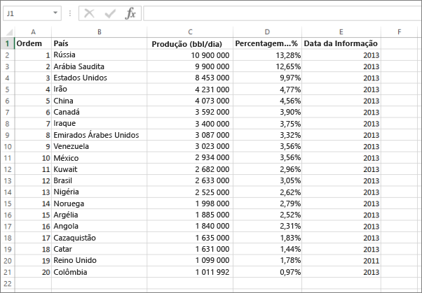
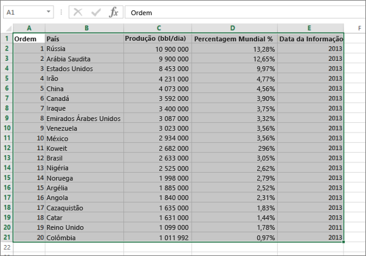
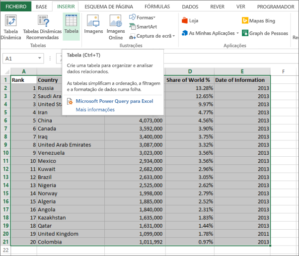
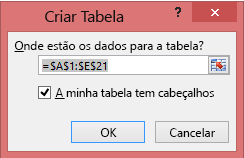
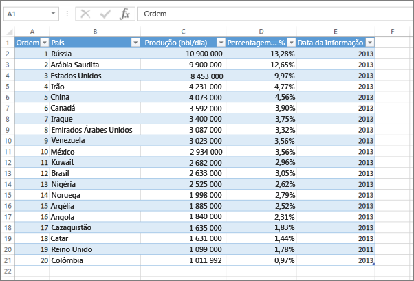

# Erro: Não conseguimos encontrar dados no seu livro do Excel

>[!NOTE]  
>Este artigo aplica-se ao Excel 2007 e posterior.

Quando importa um livro do Excel para o Power BI, poderá ver o seguinte erro:

*Erro: não conseguimos encontrar quaisquer dados formatados como uma tabela. Para importar do Excel para o serviço Power BI, tem de formatar os dados como uma tabela. Selecione todos os dados que pretende na tabela e prima Ctrl + T.*

## Solução rápida
1. Edite o seu livro no Excel.
2. Selecione o intervalo de células que contém os seus dados. A primeira linha deve conter os cabeçalhos de coluna (os nomes das colunas).
3. Prima **Alt+T** para criar uma tabela.
4. Guarde o seu livro.
5. Volte ao Power BI e importe o seu livro novamente ou, se estiver a trabalhar no Excel 2016 e tiver guardado o livro no OneDrive para Empresas, no Excel, clique em Ficheiro > Publicar.

## Detalhes
### Motivo
No Excel, pode criar uma **tabela** a partir de um intervalo de células, o que torna mais fácil ordenar, filtrar e formatar os dados.

Quando importa um livro do Excel, o Power BI procura estas tabelas e importa-as para um conjunto de dados. Se não forem encontradas tabelas, verá esta mensagem de erro.

### Solução
1. Abra o seu livro no Excel. 
    >[!NOTE]
    >As imagens são referentes ao Excel 2013. Se estiver a utilizar outra versão, pode ter um aspeto ligeiramente diferente, mas os passos são iguais.
    
    
2. Selecione o intervalo de células que contém os seus dados. A primeira linha deve conter os cabeçalhos de coluna (os nomes das colunas):
   
    
3. No friso, no separador **INSERIR**, clique em **Tabela**. (Em alternativa, como atalho, prima **Alt+T**.)
   
    
4. Verá a seguinte caixa de diálogo. Certifique-se de que a opção **A minha tabela tem cabeçalhos** está selecionada e selecione **OK**:
   
    
5. Agora os seus dados estão formatados como uma tabela:
   
    
6. Guarde o seu livro.
7. Volte ao Power BI. Selecione Obter Dados na parte inferior do painel de navegação.
   
    
8. Na caixa **Ficheiros** , selecione **Obter**.
   
    
9. Importe o seu livro do Excel novamente. Desta vez, a importação deverá localizar a tabela e ser concluída com êxito.
   
    Se a importação ainda falhar, entre em contacto connosco ao clicar em **Comunidade** no menu de ajuda:
   
    
