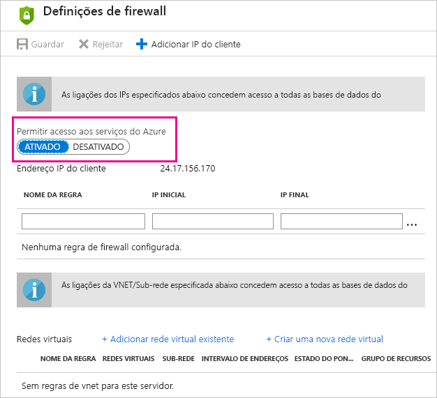

# A resolução de problemas em atualização agendada para a base de dados SQL Azure no Power BI

Para obter informações detalhadas sobre a atualização, veja [Atualizar dados no Power BI](refresh-data.md) e [Configurar a atualização agendada](refresh-scheduled-refresh.md).

Ao configurar a atualização agendada para a base de dados SQL do Azure, se receber um erro com o código de erro 400 durante a edição de credenciais, experimente o seguinte para configurar a regra de firewall adequada:

1. Inicie sessão no [portal do Azure](https://portal.azure.com).

1. Aceda à base de dados SQL do Azure na qual está a configurar a atualização.

1. Na parte superior do painel **Descrição geral**, selecione **Definir firewall do servidor**.

1. No painel **Definições de firewall**, certifique-se de que a opção **Permitir acesso aos serviços do Azure** está definida como **ATIVADO**.

      

Mais perguntas? [Pergunte à Comunidade do Power BI](https://community.powerbi.com/)
