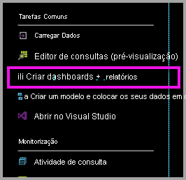
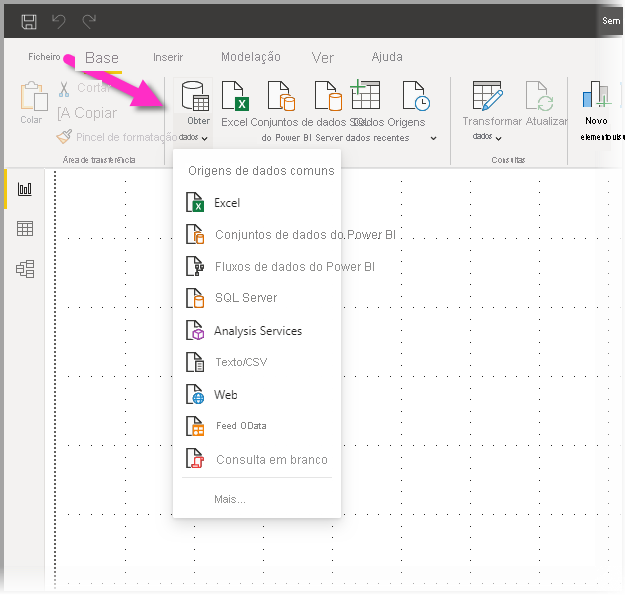
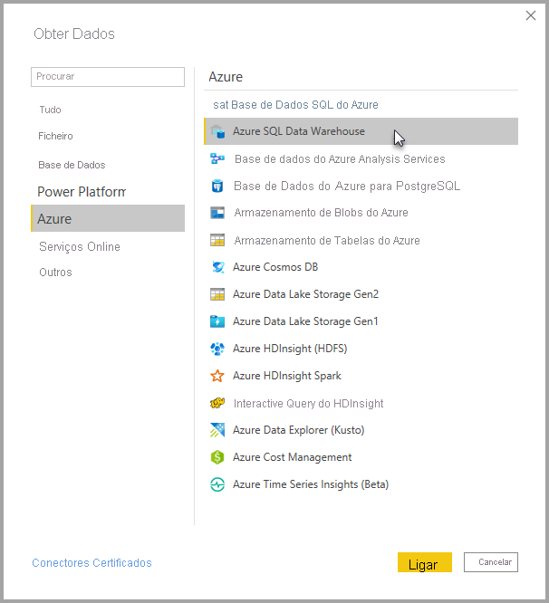
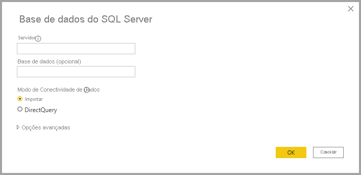
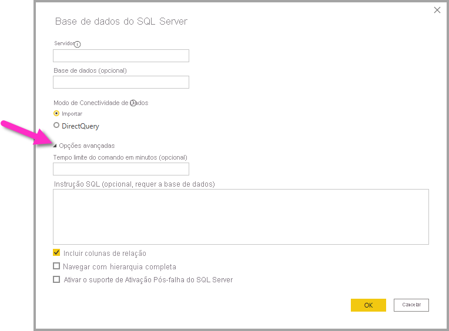
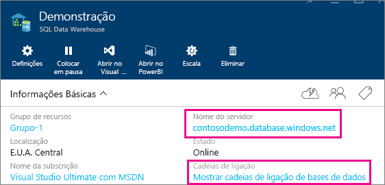

# Azure SQL Data Warehouse com DirectQuery

O Azure SQL Data Warehouse com DirectQuery permite criar relatórios dinâmicos com base nos dados e nas métricas já existentes no Azure SQL Data Warehouse. Com o DirectQuery, as consultas são enviadas de volta para o Azure SQL Data Warehouse em tempo real à medida que explora os dados. As consultas em tempo real, combinadas com o dimensionamento do SQL Data Warehouse, permitem aos utilizadores criar, em minutos, relatórios dinâmicos referentes a terabytes de dados. Além disso, a ligação **Criar dashboards + relatórios** permite que os utilizadores criem relatórios do Power BI com o SQL Data Warehouse.

Ao usar o conector do SQL Data Warehouse:

* Especifique o nome de servidor completamente qualificado quando ligar (veja abaixo para obter mais detalhes)
* Certifique-se de que as regras de firewall para o servidor estão configuradas para "Permitir acesso aos serviços do Azure"
* Cada ação, como selecionar uma coluna ou adicionar um filtro, consultará diretamente o armazém de dados
* Os mosaicos são definidos para serem atualizados aproximadamente a cada 15 minutos e a atualização não tem de ser agendada.  A atualização pode ser ajustada nas Definições avançadas quando se ligar.
* As Perguntas e Respostas não estão disponíveis para conjuntos de dados do DirectQuery
* As alterações de esquema não são selecionadas automaticamente

Estas restrições e notas poderão mudar à medida que continuamos a melhorar a experiência. Os passos para ligar são detalhados abaixo.

## Criar dashboards e relatórios no Power BI

> [!Important]
> Temos melhorado a nossa conectividade com o Azure SQL Data Warehouse. Para obter a melhor experiência para se ligar à origem de dados do Azure SQL Data Warehouse, utilize o Power BI Desktop. Assim que criar o seu modelo e relatório, pode publicá-lo no serviço Power BI. O conector direto do Azure SQL Data Warehouse anteriormente existente no serviço Power BI já não está disponível.

A forma mais fácil de se mover entre o SQL Data Warehouse e o Power BI é criar relatórios no Power BI Desktop. Pode utilizar o botão **Criar dashboards + relatórios** no portal do Azure.

1. Para começar, transfira e instale o Power BI Desktop. Veja o artigo [Obter o Power BI Desktop](../fundamentals/desktop-get-the-desktop.md) para obter informações sobre a transferência e a instalação ou passe diretamente ao próximo passo.

2. Também pode clicar na ligação **Criar dashboards + relatórios** para transferir o Power BI Desktop.

    

## Ligar pelo Power BI Desktop

Pode ligar-se a um SQL Data Warehouse com o botão **Obter Dados** no Power BI Desktop. 

1. Selecione o botão **Obter Dados** no menu **Base**.  

    

2. Selecione **Mais...** para ver todas as origens de dados disponíveis. Na janela apresentada, selecione **Azure** no painel esquerdo e, em seguida, selecione **Azure SQL Data Warehouse** na lista de conectores disponíveis no painel direito.

    

3. Na janela apresentada, introduza o seu Servidor e indique opcionalmente a Base de Dados à qual pretende ligar. Também pode selecionar o seu modo de conectividade de dados: Importar ou DirectQuery. Para ter acesso em tempo real às informações no Azure SQL Data Warehouse, utilize o modo DirectQuery.

    

4. Para obter opções avançadas para a ligação ao Azure SQL Data Warehouse, selecione a seta para baixo junto a **Opções avançadas** para ver opções adicionais para a sua ligação.

    

A secção seguinte descreve como localizar valores de parâmetro para a sua ligação. 

## Localizar Valores de Parâmetro

O nome de servidor completamente qualificado e o nome da base de dados podem ser encontrados no portal do Azure. Tenha em atenção que atualmente o SQL Data Warehouse só está presente no portal do Azure.

> [!NOTE]
> Se o seu inquilino do Power BI estiver na mesma região que o Azure SQL Data Warehouse, não existirão custos de saída. Pode saber onde o seu inquilino do Power BI se encontra com [estas instruções](../admin/service-admin-where-is-my-tenant-located.md).

[!INCLUDE [direct-query-sso](../includes/direct-query-sso.md)]

## Próximos passos

* [Acerca de utilizar o DirectQuery no Power BI](desktop-directquery-about.md)
* [O que é o Power BI?](../fundamentals/power-bi-overview.md)  
* [Obter Dados para o Power BI](service-get-data.md)  
* [Azure SQL Data Warehouse](/azure/sql-data-warehouse/sql-data-warehouse-overview-what-is/)

Mais perguntas? [Pergunte à Comunidade do Power BI](https://community.powerbi.com/)