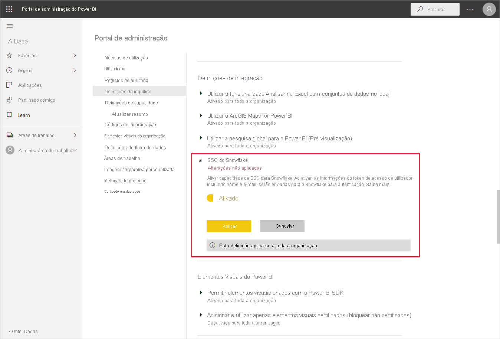
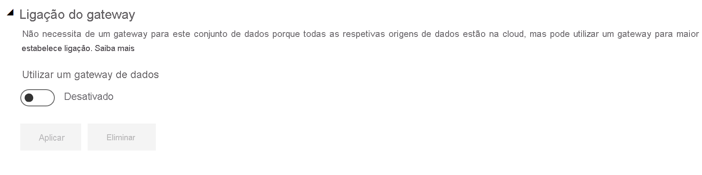
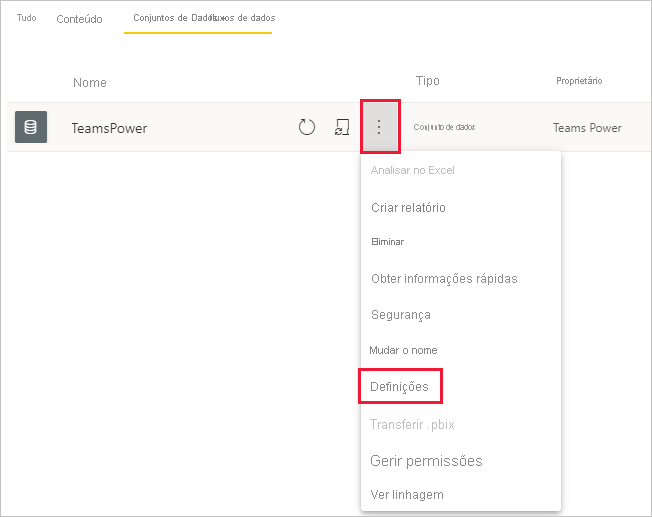
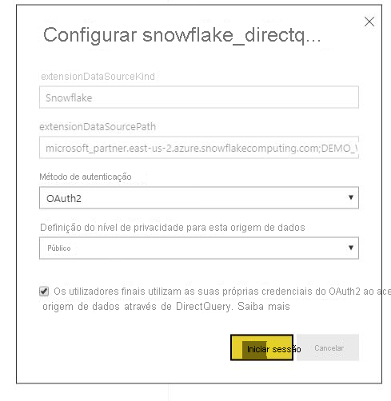

# Ligar ao Snowflake no serviço Power BI

## Introdução

A ligação ao Snowflake no serviço Power BI difere de outros conectores de uma só forma. O Snowflake tem uma capacidade adicional para o Azure Ative Directory (AAD), com uma opção para SSO. Partes da integração exigem diferentes funções administrativas no Snowflake, no Power BI e no Azure. Pode também optar por ativar a autenticação AAD sem utilizar o SSO. A autenticação básica funciona de forma semelhante a outros conectores no serviço.

Para configurar a integração do AAD e, opcionalmente, ativar o SSO, siga os passos neste artigo:

* Se for o administrador do Snowflake, leia o artigo [SSO para Snowflake no Power BI – Introdução](https://docs.snowflake.com/en/user-guide/oauth-powerbi.html) na documentação do Snowflake.
* Se for administrador do Power BI, veja [Configuração do Serviço Power BI – Portal de Administração](service-connect-snowflake.md#admin-portal) para saber como ativar o SSO.
* Se for criador de conjuntos de dados do Power BI, veja [Configuração do Serviço Power BI – Configurar um conjunto de dados com o AAD](service-connect-snowflake.md#configuring-a-dataset-with-aad) para saber como ativar o SSO.

## Configuração do Serviço Power BI

### Portal de administração

Para ativar o SSO, um administrador global tem de ativar a definição no Portal de administração do Power BI. Esta definição aprova o envio de credenciais do AAD para o Snowflake para autenticação para toda a organização. Siga estes passos para ativar o SSO:

1. [Inicie sessão no Power BI](https://app.powerbi.com) com as credenciais de administrador global.
1. Selecione **Definições** no menu do cabeçalho da página e, em seguida, selecione **Portal de administração**.
1. Selecione **Definições do inquilino** e, em seguida, desloque-se para localizar as **Definições de integração**.

   

4. Expanda **SSO do Snowflake**, alterne a definição para **Ativado** e, em seguida, selecione **Aplicar**.

Este passo é necessário para autorizar o envio do token do AAD aos servidores do Snowflake. Depois de ativar a definição, pode demorar até uma hora a entrar em vigor.

Depois de o SSO estar ativado, pode utilizar os relatórios com o SSO.

### Configurar um Conjunto de Dados com AAD

Após um relatório baseado no conector do Snowflake ser publicado no serviço Power BI, o criador do conjunto de dados tem de atualizar as definições da área de trabalho adequada para utilizar o SSO.

Devido à forma como o Power BI funciona, o SSO só funcionará quando nenhuma origem de dados for executada através do gateway de dados no local. As limitações estão listadas abaixo:

* Se estiver a utilizar apenas uma origem de Snowflake no modelo de dados, poderá utilizar o SSO se optar por não utilizar o gateway de dados no local.
* Se estiver a utilizar uma origem de Snowflake e outra origem, poderá utilizar o SSO se nenhuma das origens utilizar o gateway de dados no local.
* Se estiver a utilizar uma origem de Snowflake através do gateway de dados no local, as credenciais do AAD não serão atualmente suportadas. Esta consideração pode ser relevante no caso de estar a tentar aceder a uma VNet a partir de um único IP com o gateway instalado no mesmo, em vez de a partir de todo o intervalo de IP do Power BI.
* Se estiver a utilizar uma origem do Snowflake e outra origem que exige um gateway, será necessário utilizar o Snowflake também através do gateway de dados no local. Não poderá utilizar o SSO neste caso.

Saiba mais sobre como utilizar o gateway de dados no local, em [O que é um gateway de dados no local?](service-gateway-onprem.md)

Se não estiver a utilizar o gateway, está tudo pronto. Quando tiver credenciais do Snowflake configuradas no gateway de dados no local, mas apenas estiver a utilizar essa origem de dados no modelo, pode clicar no botão de alternar na página Definições do conjunto de dados para desligar o gateway para esse modelo de dados.

Para ligar o SSO para um conjunto de dados, siga estes passos:

1. [Inicie sessão no Power BI](https://app.powerbi.com) com as credenciais de criador do conjunto de dados.
1. Selecione a área de trabalho adequada e, em seguida, escolha **Definições** no menu mais opções localizado ao lado do nome do conjunto de dados.
  
1. Selecione **Credenciais de origem de dados** e inicie sessão. O conjunto de dados pode iniciar sessão no Snowflake com as credenciais Básica ou OAuth2 (AAD). Se utilizar o AAD, poderá ativar o SSO no passo seguinte.
1. Selecione a opção **Os utilizadores finais utilizam as suas próprias credenciais do OAuth2 ao aceder a esta origem de dados através de DirectQuery**. Esta definição ativará o SSO do AAD. Se o primeiro utilizador iniciar sessão com a autenticação Básica ou com o OAuth2 (AAD), as credenciais do AAD serão as que são enviadas para o SSO.

    

Depois de concluir estes passos, os utilizadores devem utilizar automaticamente a autenticação do AAD para se ligarem aos dados desse conjunto de dados do Snowflake.

Se optar por não ativar o SSO, os utilizadores que atualizam o relatório vão utilizar as credenciais do utilizador que iniciou sessão, como a maioria dos outros relatórios do Power BI.

### Resolução de problemas

Se tiver algum problema com a integração, veja o [guia de resolução de problemas](https://docs.snowflake.com/en/user-guide/oauth-powerbi.html#troubleshooting) do Snowflake.

## Próximos passos

* [Origens de dados para o serviço Power BI](service-get-data.md)
* [Ligar a conjuntos de dados no serviço Power BI a partir do Power BI Desktop](desktop-report-lifecycle-datasets.md)
* [Ligar a um armazém de informática do Snowflake](desktop-connect-snowflake.md)