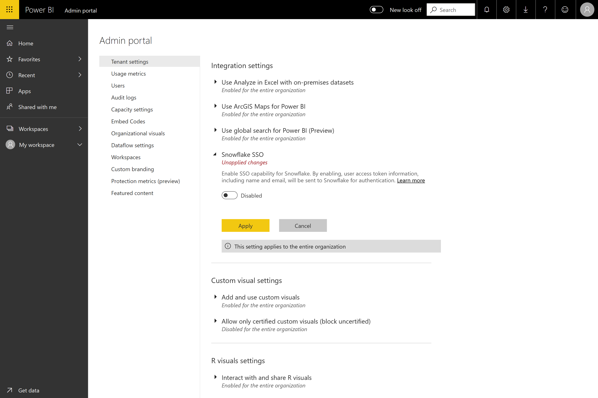
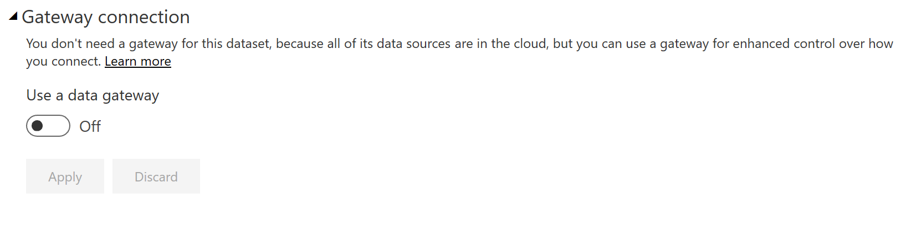

#  Ligar ao Snowflake no Serviço Power BI

## Introdução

A ligação ao Snowflake no serviço Power BI difere dos outros conectores apenas de uma forma, que é o facto de ser oferecida uma capacidade adicional para AAD (com uma opção para SSO). Diferentes partes da integração exigem diferentes funções administrativas no Snowflake, Power BI e Azure. Pode também optar por ativar a autenticação AAD sem utilizar o SSO. A autenticação básica funciona de forma semelhante a outros conectores no serviço.

Se estiver interessado em configurar a integração AAD, bem como em ativar o SSO como opção:
* Se for o administrador do Snowflake, leia o artigo [SSO para Snowflake no Power BI – Introdução](https://docs.snowflake.net/manuals/LIMITEDACCESS/oauth-powerbi.html) na documentação do Snowflake.
* (SSO) Se for um administrador do Power BI, veja a secção "Configuração do Serviço Power BI – Portal de Administração"
* (SSO) Se for um criador de conjuntos de dados do Power BI, veja a secção "Configuração do Serviço Power BI – Ativar um conjunto de dados"

## Configuração do Serviço Power BI

### Portal de Administração

Se quiser ativar o SSO, o administrador do inquilino é obrigado a ir ao Portal de Administração e aprovar o envio de credenciais AAD do Power BI para o Snowflake.

Navegue para o "Portal de Administração", selecione o item da barra lateral "Definições de Inquilinos", desloque-se até "Definições de Integração" e verá uma opção para "SSO do Snowflake".

Conforme referido, tem de permitir manualmente esta opção para consentir enviar o seu token AAD para os servidores Snowflake. Para tal, clique no comutador "Desativado", prima Aplicar e aguarde que a alteração das definições tenha efeito. O serviço pode demorar até uma hora para propagar a configuração.

Uma vez efetuada, poderá utilizar relatórios com SSO.

### Configurar um Conjunto de Dados com AAD

Assim que um relatório baseado no conector Snowflake for publicado na Web, no serviço Web Power BI, o criador de conjuntos de dados tem de navegar para a área de trabalho apropriada, selecionar "Conjuntos de Dados" e selecionar "Definições" (sob o menu "..." para ações adicionais junto ao conjunto de dados relevante).

Devido à forma como o Power BI funciona, o SSO só funcionará quando nenhuma origem de dados for executada através do gateway de dados no local.

* Se estiver a utilizar apenas uma origem de Snowflake no modelo de dados, pode utilizar o SSO se optar por não utilizar o gateway de dados no local
* Se estiver a utilizar uma origem de Snowflake juntamente com outra origem, pode utilizar o SSO se nenhuma das origens utilizar o gateway de dados no local
* Se estiver a utilizar uma origem de Snowflake através do gateway de dados no local, as credenciais AAD não são suportadas neste momento. Isto pode ser relevante no caso de estar a tentar aceder a uma VNet a partir de um único IP com o Gateway instalado no mesmo, em vez de a partir de todo o intervalo de IP do Power BI.
* Se estiver a utilizar uma origem de Snowflake juntamente com outra origem que exige um Gateway, será necessário utilizar o Snowflake também através do gateway de dados no local e não poderá utilizar o SSO.

Para saber mais sobre como utilizar o gateway de dados no local, veja o artigo [O que é um gateway de dados no local?](https://docs.microsoft.com/power-bi/service-gateway-onprem)

Se não estiver a utilizar o Gateway, está tudo pronto. Se tiver credenciais de Snowflake configuradas no gateway de dados no local, mas apenas estiver a utilizar essa origem de dados no seu modelo, pode clicar no comutador na página Definições do conjunto de dados para desligar o gateway para esse modelo de dados.

O criador do conjunto de dados tem de selecionar "Credenciais da origem de dados" e iniciar sessão. O conjunto de dados pode iniciar sessão no Snowflake com Credenciais básicas ou credenciais OAuth2 (AAD). Se optar por utilizar AAD, o conjunto de dados pode ser ativado para utilizar SSO. Quando este primeiro utilizador for iniciar sessão no Snowflake para o conjunto de dados, tem de selecionar a opção para a qual os outros utilizadores utilizaram as credenciais Oauth2 para obter dados. Esta ação irá ativar o SSO do AAD. Independentemente de o utilizador inicial iniciar sessão com Autenticação básica ou OAuth2 (AAD), as credenciais AAD são as que serão enviadas para SSO. 

Uma vez efetuado, quaisquer utilizadores adicionais devem utilizar automaticamente a sua autenticação AAD para se ligarem aos dados desse conjunto de dados do Snowflake.

Se optar por não ativar o SSO, os utilizadores que atualizam o relatório vão utilizar as credenciais do utilizador que iniciou sessão, como a maioria dos outros relatórios do Power BI.

### Troubleshooting (Resolução de problemas)

Se tiver algum problema com a integração, consulte o [guia de resolução de problemas](https://docs.snowflake.net/manuals/LIMITEDACCESS/oauth-powerbi.html#troubleshooting) do Snowflake.

