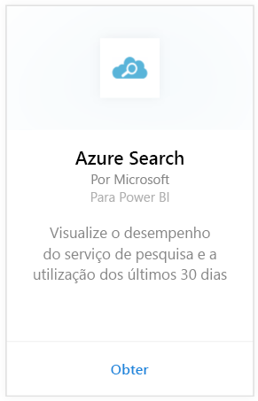

# Ligar a Azure Search ao Power BI
A Análise de Tráfego do Azure Search permite que monitorize e compreenda o tráfego para o serviço de Azure Search. O pacote de conteúdos do Azure Search para o Power BI fornece informações detalhadas sobre os seus dados de pesquisa, incluindo Search, Indexação, Estado do Serviço e a Latência dos últimos 30 dias. Podem ser encontrados mais detalhes na [mensagem de blogue do Azure](https://azure.microsoft.com/blog/analyzing-your-azure-search-traffic/).

[!INCLUDE [include-short-name](../includes/service-deprecate-content-packs.md)]

Ligue-se ao [pacote de conteúdo do Azure Search](https://app.powerbi.com/getdata/services/azure-search) para o Power BI.

## Como se ligar
1. Selecione **Obter Dados** na parte inferior do painel de navegação.
   
    
2. Na caixa **Serviços**, selecione **Obter**.
   
    
3. Selecione **Azure Search** \> **Obter**.
   
   
4. Forneça o nome da conta de armazenamento de tabelas na qual a sua análise do Azure Search está armazenada.
   
   
5. Selecione **Chave** como Mecanismo de Autenticação e forneça a chave da conta de armazenamento. Clique em **Iniciar Sessão** para iniciar o processo de carregamento.
   
   
6. Quando o carregamento estiver concluído, um novo dashboard, relatório e modelo aparecem no painel de navegação. Selecione o dashboard para ver os seus dados importados.
   
    

**O que se segue?**

* Experimente [fazer uma pergunta na caixa de Perguntas e Respostas](../consumer/end-user-q-and-a.md) na parte superior do dashboard
* [Altere os mosaicos](../create-reports/service-dashboard-edit-tile.md) no dashboard.
* [Selecione um mosaico](../consumer/end-user-tiles.md) para abrir o relatório subjacente.
* Embora o seu conjunto de dados seja agendado para atualizações diárias, pode alterar o agendamento das atualizações ou tentar atualizá-lo a pedido através da opção **Atualizar Agora**

## Requisitos de sistema
O pacote de conteúdos do Azure Search exige que a Análise de Tráfego do Azure Search esteja ativada na conta.

## Resolução de problemas
Certifique-se de que o nome da conta de armazenamento seja fornecido corretamente com a chave de acesso completo. O nome da conta de armazenamento deve corresponder à conta configurada com a Análise de Tráfego do Azure Search.

## Próximos passos
[O que é o Power BI?](../fundamentals/power-bi-overview.md)

[Conceitos básicos para designers no serviço Power BI](../fundamentals/service-basic-concepts.md)
