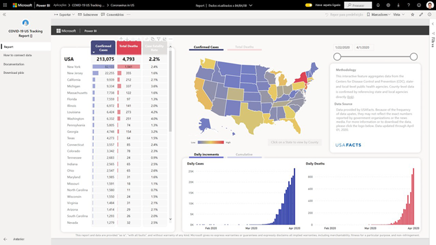
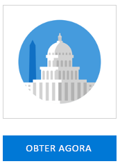
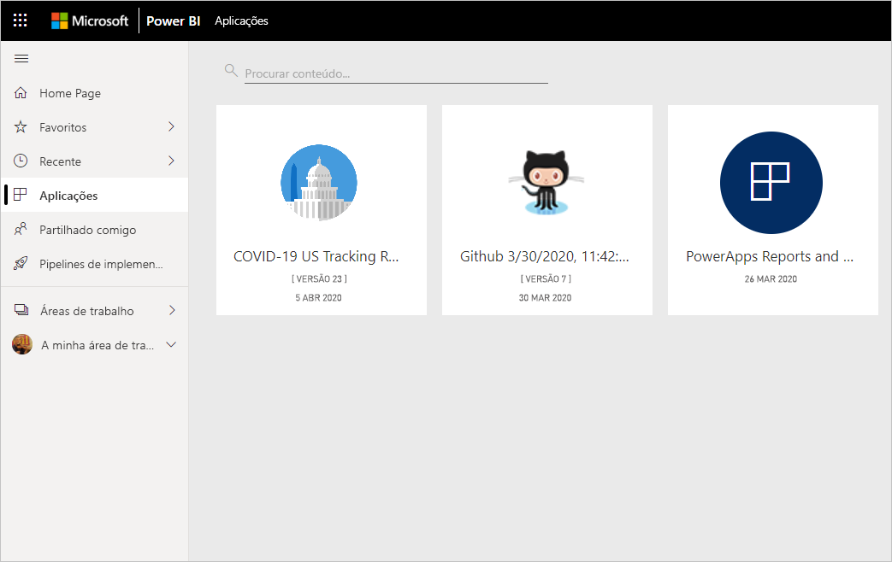
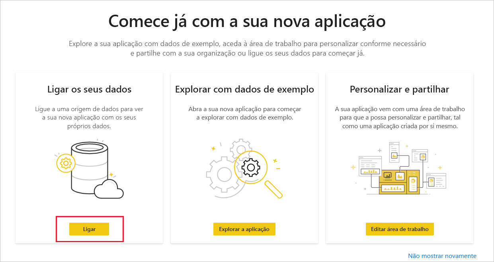
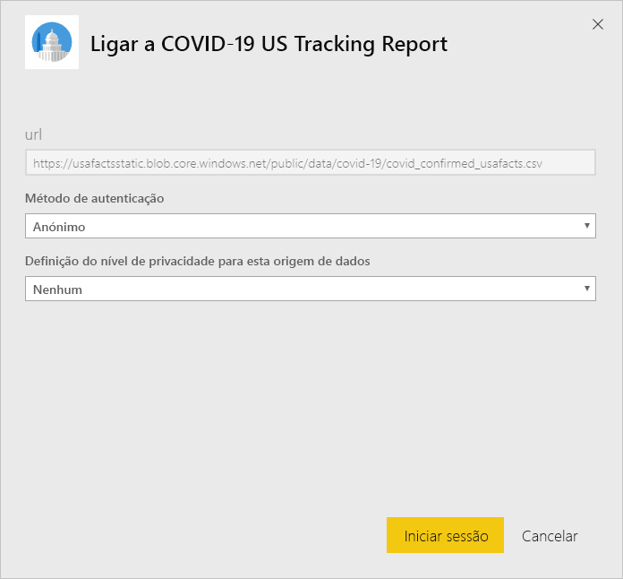
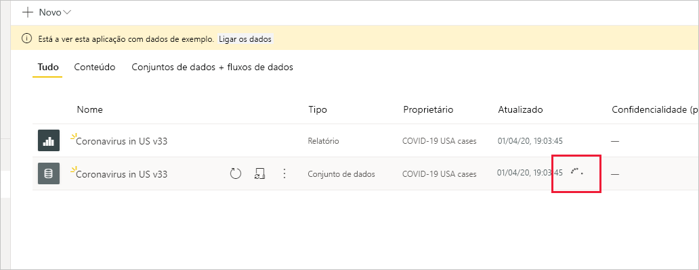

# Ligar ao COVID-19 US Tracking Report (Relatório de Rastreio da COVID-19 nos EUA)
Este artigo indica como instalar a aplicação de modelo COVID-19 US Tracking Report (Relatório de Rastreio da COVID-19 nos EUA) e como ligar às origens de dados.

Para obter informações detalhadas sobre o próprio relatório, incluindo exclusões de responsabilidade e informações sobre os dados, veja [Exemplo de controlo da COVID-19 das autoridades locais e estaduais dos EUA](../create-reports/sample-covid-19-us.md).

Depois de ter instalado a aplicação de modelo e ligado às origens de dados, pode personalizar o relatório de acordo com as suas necessidades. Em seguida, pode distribuí-la como uma aplicação aos colegas na sua organização.

## Instalar a aplicação

1. Clique na seguinte ligação para aceder à aplicação: [Aplicação de modelo COVID-19 US Tracking Report (Relatório de Rastreio da COVID-19 nos EUA)](https://appsource.microsoft.com/en-us/product/power-bi/pbi-contentpacks.covid19ms)

1. Quando estiver na página Appsource da Aplicação, clique em [**OBTER AGORA**](https://appsource.microsoft.com/en-us/product/power-bi/pbi-contentpacks.covid19ms).

    

1. Quando lhe for pedido, clique em **Instalar**. Assim que a aplicação estiver instalada, irá vê-la na página Aplicações.

   

## Ligar a origens de dados

1. Clique no ícone na página Aplicações para abrir a aplicação.

1. No ecrã inicial que é apresentado, selecione **Ligar**.

   

1. Serão apresentadas duas caixas de diálogo de início de sessão, uma após a outra. Em ambas, defina o nível de privacidade como Público.

   

   O relatório ligará às origens de dados e será preenchido com dados atualizados. Durante este tempo, o monitor de atividade será ativado.

   

## Agendar atualização do relatório

Quando a atualização de dados for concluída, estará na área de trabalho associada à aplicação. [Configure uma agenda de atualização](../connect-data/refresh-scheduled-refresh.md) para manter os dados do relatório atualizados.

## Personalizar e partilhar

Para obter detalhes, veja [Personalizar e partilhar a aplicação](../connect-data/service-template-apps-install-distribute.md#customize-and-share-the-app). Certifique-se de que revê as [isenções de responsabilidade do relatório](../create-reports/sample-covid-19-us.md#disclaimers) antes de publicar ou distribuir a aplicação.

## Próximos passos
* [Exemplo de controlo da COVID-19 das autoridades locais e estaduais dos EUA](../create-reports/sample-covid-19-us.md)
* Perguntas? [Experimente perguntar à Comunidade do Power BI](https://community.powerbi.com/)
* [O que são as aplicações de modelo do Power BI?](../connect-data/service-template-apps-overview.md)
* [Instalar e distribuir aplicações de modelo na sua organização](../connect-data/service-template-apps-install-distribute.md)
