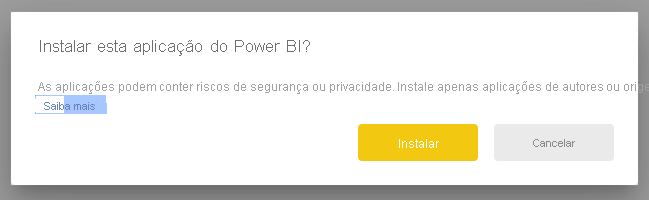
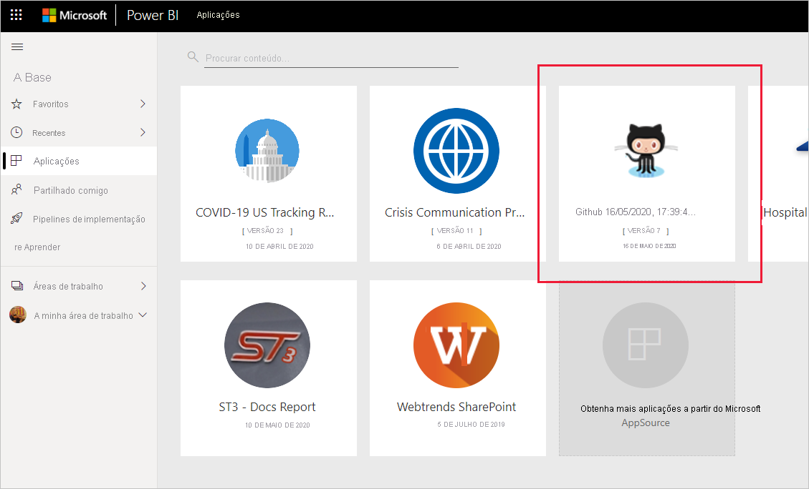
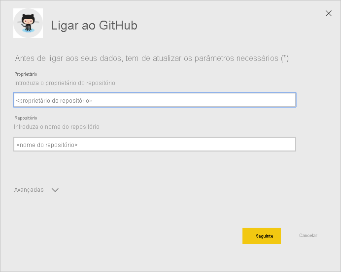
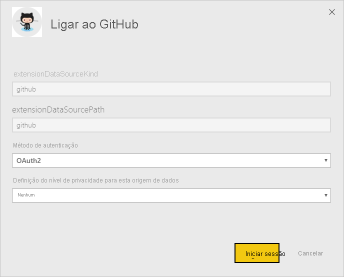
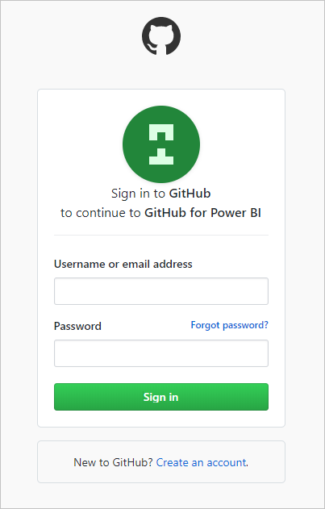
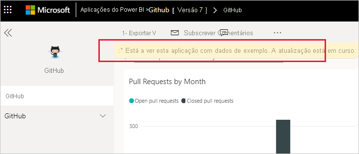
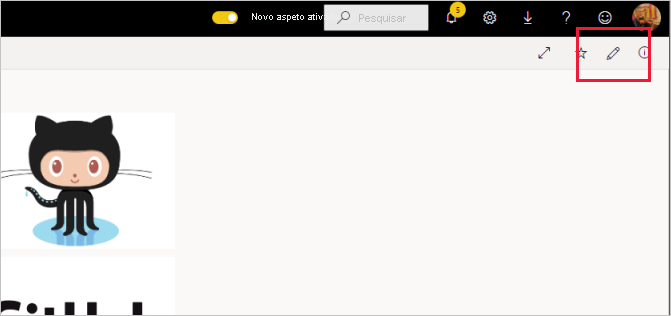
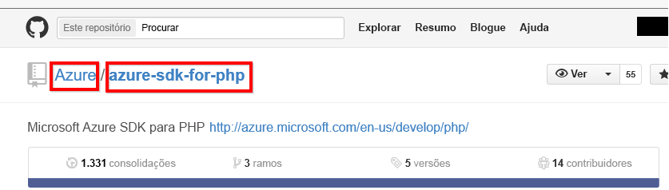

# Ligue-se ao GitHub com o Power BI
Este artigo irá orientá-lo durante a extração de dados da sua conta do GitHub através de uma aplicação de modelo do Power BI. A aplicação de modelo gera uma área de trabalho com um dashboard, um conjunto de relatórios e um conjunto de dados para que possa explorar os seus dados do GitHub. A aplicação GitHub para o Power BI mostra-lhe informações sobre o seu repositório do GitHub, com dados sobre contribuições, problemas, pedidos Pull e utilizadores ativos.

Após ter instalado a aplicação de modelo, pode alterar o dashboard e o relatório. Em seguida, pode distribuir a área de trabalho como uma aplicação pelos colegas na sua organização.

Ligue-se à [aplicação de modelo GitHub](https://app.powerbi.com/groups/me/getapps/services/pbi-contentpacks.pbiapps-github) ou leia mais sobre a [integração do GitHub](https://powerbi.microsoft.com/integrations/github) com o Power BI.

Também pode experimentar o [tutorial do GitHub](service-tutorial-connect-to-github.md). Este instala dados reais do GitHub sobre o repositório público para documentação do Power BI.

>[!NOTE]
>Esta aplicação de modelo necessita de uma conta do GitHub para ter acesso ao repositório. Mais detalhes sobre os requisitos abaixo.
>
>Esta aplicação de modelo não suporta o GitHub Enterprise.

## Instalar a aplicação

1. Clique na seguinte ligação para aceder à aplicação: [Aplicação de modelo do GitHub](https://app.powerbi.com/groups/me/getapps/services/pbi-contentpacks.pbiapps-github)

1. Na página AppSource da aplicação, selecione [**OBTER AGORA**](https://app.powerbi.com/groups/me/getapps/services/pbi-contentpacks.pbiapps-github).

    

1. Selecione **Instalar**. 

    

    Assim que a aplicação estiver instalada, irá vê-la na página Aplicações.

   

## Ligar a origens de dados

1. Selecione o ícone na página Aplicações para abrir a aplicação.

1. No ecrã inicial, selecione **Explorar a aplicação**.

   

   A aplicação é aberta e apresenta dados de exemplo.

1. Selecione a ligação **Ligar os dados** na faixa na parte superior da página.

   

1. Na caixa de diálogo apresentada, introduza o nome e o proprietário do repositório. Veja detalhes sobre [como encontrar estes parâmetros](#FindingParams) abaixo. Quando terminar, clique em **Seguinte**.

   

1. Na próxima caixa de diálogo apresentada, certifique-se de que o método de autenticação está definido como **OAuth2**. Não precisa de alterar a definição de privacidade. Quando estiver tudo pronto, clique em **Iniciar sessão**.

   

1. Introduza as suas credenciais do GitHub e siga o processo de autenticação do GitHub (pode ignorar este passo se já tiver sessão iniciada no browser).

   

Depois de iniciar sessão, o relatório liga às origens de dados e é preenchido com dados atualizados. Durante este tempo, o monitor de atividade é ativado.

Os dados de relatório serão atualizados automaticamente uma vez por dia, a não ser que desative esta funcionalidade durante o processo de início de sessão. Também pode [configurar uma agenda de atualização personalizada](./refresh-scheduled-refresh.md) para manter os dados do relatório atualizados da forma que preferir.

## Personalizar e partilhar

Para personalizar e partilhar a sua aplicação, selecione o ícone de lápis no canto superior direito da página.

Para obter mais informações sobre a edição de artefactos na área de trabalho, veja
* [Apresentação do editor de relatórios no Power BI](../create-reports/service-the-report-editor-take-a-tour.md)
* [Conceitos básicos para designers no serviço Power BI](../fundamentals/service-basic-concepts.md)

Quando concluir as alterações pretendidas aos artefactos na área de trabalho, está pronto para publicar e partilhar a aplicação. Veja [Publicar a sua aplicação](../collaborate-share/service-create-distribute-apps.md#publish-your-app) para saber como fazê-lo.

## O que está incluído na aplicação
Os dados a seguir estão disponíveis no GitHub no Power BI:     

| Nome da tabela | Descrição |
| --- | --- |
| Contributions |A tabela de contribuições apresenta o total de adições, exclusões e confirmações criadas pelo colaborador agregadas por semana. Os 100 principais colaboradores são incluídos. |
| Problemas |Lista todos os problemas do repositório selecionado e contém cálculos como os tempos total e médio para encerramento de um problema, Total de problemas em aberto e Total de problemas encerrados. Esta tabela estará vazia quando não houver nenhum problema no repositório. |
| Solicitações pull |Esta tabela contém todas as Solicitações Pull para o repositório e quem realizou o pedido. Também contém cálculos de quantos pedidos Pull abertos, fechados e totais existem, quanto tempo demorou para efetuar o Pull dos pedidos e quanto tempo levou cada pedido Pull em média. Esta tabela estará vazia quando não houver nenhum problema no repositório. |
| Utilizadores |Esta tabela fornece uma lista de colaboradores ou utilizadores do GitHub que fizeram contribuições, arquivaram problemas ou resolveram pedidos Pull para o repositório selecionado. |
| Etapas |Contém todas as Etapas para o repositório selecionado. |
| DateTable |Esta tabela contém datas do presente e de anos no passado, que permitem analisar os seus dados do GitHub por data. |
| ContributionPunchCard |Essa tabela pode ser usada como um cartão perfurado de colaborações para o repositório selecionado. Ele mostra as confirmações por dia da semana e horas do dia. Esta tabela não está conectada a outras tabelas presentes no modelo. |
| RepoDetails |Esta tabela fornece detalhes sobre o repositório selecionado. |

## Requisitos de sistema
* A conta do GitHub que tem acesso ao repositório.  
* Permissão concedida ao Power BI para o aplicativo GitHub durante o primeiro logon. Confira os detalhes abaixo para revogar o acesso.  
* Chamadas à API suficientes disponíveis para extrair e atualizar os dados.
>[!NOTE]
>Esta aplicação de modelo não suporta o GitHub Enterprise.

### Desautorizar Power BI
Para desautorizar a ligação do Power BI ao seu repositório do GitHub, pode revogar o acesso no GitHub. Para obter mais detalhes, veja este tópico da [ajuda do GitHub](https://help.github.com/articles/keeping-your-ssh-keys-and-application-access-tokens-safe/#reviewing-your-authorized-applications-oauth).

## Parâmetros de localização
Pode determinar o proprietário e o repositório ao consultar o repositório no próprio GitHub:

A primeira parte, "Azure", é o proprietário, enquanto a segunda parte, "azure-sdk-for-php", é o repositório em si.  Vê esses mesmos dois itens no URL do repositório:

    <https://github.com/Azure/azure-sdk-for-php> .

## Resolução de problemas
Se necessário, é possível verificar as suas credenciais do GitHub.  

1. Noutra janela do browser, aceda ao site do GitHub e inicie sessão no GitHub. Pode ver, no canto superior direito do site do GitHub que tem a sessão iniciar.    
2. No GitHub, navegue para o URL do repositório que quer aceder no Power BI. Por exemplo: https://github.com/dotnet/corefx.  
3. No Power BI, tente ligar-se ao GitHub. Na caixa de diálogo Configurar o GitHub, utilize os nomes e o proprietário desse mesmo repositório.  

## Próximos passos

* [Tutorial: ligar-se a um repositório do GitHub com o Power BI](service-tutorial-connect-to-github.md)
* [Create the new workspaces in Power BI](../collaborate-share/service-create-the-new-workspaces.md) (Criar as novas áreas de trabalho no Power BI)
* [Instalar e utilizar aplicações no Power BI](../consumer/end-user-apps.md)
* [Ligar-se a aplicações do Power BI para serviços externos](service-connect-to-services.md)
* Perguntas? [Experimente perguntar à Comunidade do Power BI](https://community.powerbi.com/)
