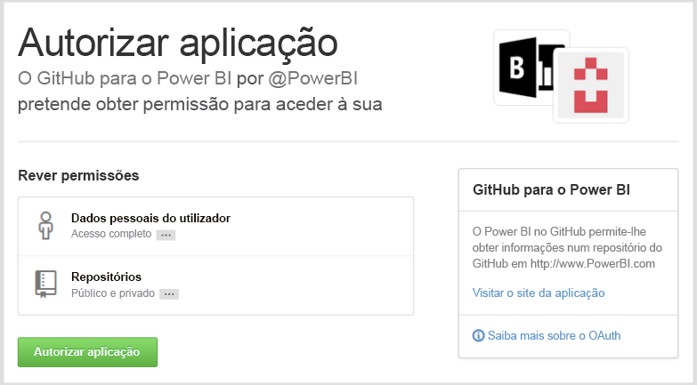
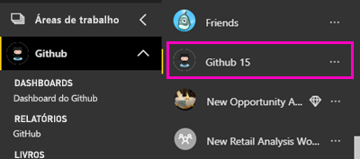
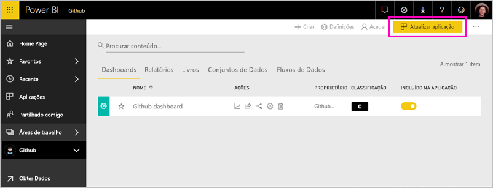

# Ligue-se ao GitHub com o Power BI
Este artigo irá orientá-lo durante a extração de dados da sua conta do GitHub através de uma aplicação de modelo do Power BI. A aplicação de modelo gera uma área de trabalho com um dashboard, um conjunto de relatórios e um conjunto de dados para que possa explorar os seus dados do GitHub. A aplicação GitHub para o Power BI mostra-lhe informações sobre o seu repositório do GitHub, com dados sobre contribuições, problemas, pedidos Pull e utilizadores ativos.

Após ter instalado a aplicação de modelo, pode alterar o dashboard e o relatório. Em seguida, pode distribuir a área de trabalho como uma aplicação pelos colegas na sua organização.

Ligue-se à [aplicação de modelo GitHub](https://app.powerbi.com/groups/me/getapps/services/pbi-contentpacks.pbiapps-github) ou leia mais sobre a [integração do GitHub](https://powerbi.microsoft.com/integrations/github) com o Power BI.

Também pode experimentar o [tutorial do GitHub](service-tutorial-connect-to-github.md). Este instala dados reais do GitHub sobre o repositório público para documentação do Power BI.

>[!NOTE]
>Esta aplicação de modelo necessita de uma conta do GitHub para ter acesso ao repositório. Mais detalhes sobre os requisitos abaixo.
>
>Esta aplicação de modelo não suporta o GitHub Enterprise. 

## Como se ligar
[!INCLUDE [powerbi-service-apps-get-more-apps](../includes/powerbi-service-apps-get-more-apps.md)]
   
3. Selecione **GitHub** \> **Obter agora**.
4. Em **Instalar esta aplicação do Power BI?** , selecione **Instalar**.
4. No painel **Aplicações**, selecione o mosaico **GitHub**.

    

6. Em **Comece já com a sua nova aplicação** , selecione **Ligar**.

    

5. Escreva o nome do repositório e também o seu proprietário. Veja detalhes sobre [como encontrar estes parâmetros](#FindingParams) abaixo.
   
    

5. Insira as suas credenciais do GitHub (este passo pode ser ignorado se já tiver iniciado a sessão com o seu browser). 
6. Para o **Método de Autenticação**, selecione **oAuth2** \> **Iniciar Sessão**. 
7. Siga os ecrãs de autenticação do GitHub. Conceda à aplicação de modelo GitHub para o Power BI permissão de acesso aos dados do GitHub.
   
   
   
    O Power BI estabelece ligação ao GitHub e aos seus dados.  Os dados são atualizados uma vez por dia. Após o Power BI importar os dados, verá os conteúdos da sua nova área de trabalho do GitHub.

## Modificar e distribuir a sua aplicação

Acabou de instalar a sua aplicação de modelo GitHub. Isso significa que criou a área de trabalho do GitHub. Na área de trabalho, pode alterar o relatório e o dashboard e, em seguida, distribuí-la como uma *aplicação* pelos colegas na sua organização. 

1. Selecione a seta junto ao nome da área de trabalho no painel de navegação. Verá que a área de trabalho contém um dashboard e um relatório.

    

8. Selecione o novo [dashboard do GitHub](https://powerbi.microsoft.com/integrations/github).    
    

3. Para ver todos os conteúdos da sua nova área de trabalho do GitHub, na painel de navegação, selecione **Áreas de trabalho** > **GitHub**.
 
   

    Esta vista é a lista de conteúdos da área de trabalho. No canto superior direito, verá a opção **Atualizar aplicação**. Quanto estiver a postos para distribuir a sua aplicação pelos seus colegas, deve começar por aí. 

    

2. Selecione **Relatórios** e **Conjuntos de dados** para ver os restantes elementos na área de trabalho.

    Leia mais sobre como [distribuir aplicações](../collaborate-share/service-create-distribute-apps.md) pelos seus colegas.

## O que está incluído na aplicação
Os dados a seguir estão disponíveis no GitHub no Power BI:     

| Nome da tabela | Descrição |
| --- | --- |
| Contributions |A tabela de contribuições apresenta o total de adições, exclusões e confirmações criadas pelo colaborador agregadas por semana. Os 100 principais colaboradores são incluídos. |
| Problemas |Lista todos os problemas do repositório selecionado e contém cálculos como os tempos total e médio para encerramento de um problema, Total de problemas em aberto e Total de problemas encerrados. Esta tabela estará vazia quando não houver nenhum problema no repositório. |
| Solicitações pull |Esta tabela contém todas as Solicitações Pull para o repositório e quem realizou o pedido. Também contém cálculos de quantos pedidos Pull abertos, fechados e totais existem, quanto tempo demorou para efetuar o Pull dos pedidos e quanto tempo levou cada pedido Pull em média. Esta tabela estará vazia quando não houver nenhum problema no repositório. |
| Utilizadores |Esta tabela fornece uma lista de colaboradores ou utilizadores do GitHub que fizeram contribuições, arquivaram problemas ou resolveram pedidos Pull para o repositório selecionado. |
| Etapas |Contém todas as Etapas para o repositório selecionado. |
| DateTable |Esta tabela contém datas do presente e de anos no passado, que permitem analisar os seus dados do GitHub por data. |
| ContributionPunchCard |Essa tabela pode ser usada como um cartão perfurado de colaborações para o repositório selecionado. Ele mostra as confirmações por dia da semana e horas do dia. Esta tabela não está conectada a outras tabelas presentes no modelo. |
| RepoDetails |Esta tabela fornece detalhes sobre o repositório selecionado. |

## Requisitos de sistema
* A conta do GitHub que tem acesso ao repositório.  
* Permissão concedida ao Power BI para o aplicativo GitHub durante o primeiro logon. Confira os detalhes abaixo para revogar o acesso.  
* Chamadas à API suficientes disponíveis para extrair e atualizar os dados.
>[!NOTE]
>Esta aplicação de modelo não suporta o GitHub Enterprise.

### Desautorizar Power BI
Para desautorizar a ligação do Power BI ao seu repositório do GitHub, pode revogar o acesso no GitHub. Para obter mais detalhes, veja este tópico da [ajuda do GitHub](https://help.github.com/articles/keeping-your-ssh-keys-and-application-access-tokens-safe/#reviewing-your-authorized-applications-oauth).

## Parâmetros de localização
Pode determinar o proprietário e o repositório ao consultar o repositório no próprio GitHub:

A primeira parte, "Azure", é o proprietário, enquanto a segunda parte, "azure-sdk-for-php", é o repositório em si.  Vê esses mesmos dois itens no URL do repositório:

    <https://github.com/Azure/azure-sdk-for-php> .

## Resolução de problemas
Se necessário, é possível verificar as suas credenciais do GitHub.  

1. Noutra janela do browser, aceda ao site do GitHub e inicie sessão no GitHub. Pode ver, no canto superior direito do site do GitHub que tem a sessão iniciar.    
2. No GitHub, navegue para o URL do repositório que quer aceder no Power BI. Por exemplo: https://github.com/dotnet/corefx.  
3. No Power BI, tente ligar-se ao GitHub. Na caixa de diálogo Configurar o GitHub, utilize os nomes e o proprietário desse mesmo repositório.  

## Próximos passos

* [Tutorial: ligar-se a um repositório do GitHub com o Power BI](service-tutorial-connect-to-github.md)
* [Create the new workspaces in Power BI](../collaborate-share/service-create-the-new-workspaces.md) (Criar as novas áreas de trabalho no Power BI)
* [Instalar e utilizar aplicações no Power BI](../consumer/end-user-apps.md)
* [Ligar-se a aplicações do Power BI para serviços externos](service-connect-to-services.md)
* Perguntas? [Experimente perguntar à Comunidade do Power BI](https://community.powerbi.com/)
