# Ligar ao Hospital Emergency Response Decision Support Dashboard (Dashboard de Suporte de Decisões de Resposta de Emergência Hospitalar)
A aplicação de modelo Hospital Emergency Response Decision Support Dashboard (Dashboard de Suporte de Decisões de Resposta de Emergência Hospitalar) é o componente de relatórios da [solução Microsoft Power Platform para resposta de emergência hospitalar](https://powerapps.microsoft.com/blog/emergency-response-solution-a-microsoft-power-platform-solution-for-healthcare-emergency-response/). O dashboard mostra dados agregados de gestores de emergências em todo o sistema de saúde para os ajudar a tomar decisões oportunas e corretas.

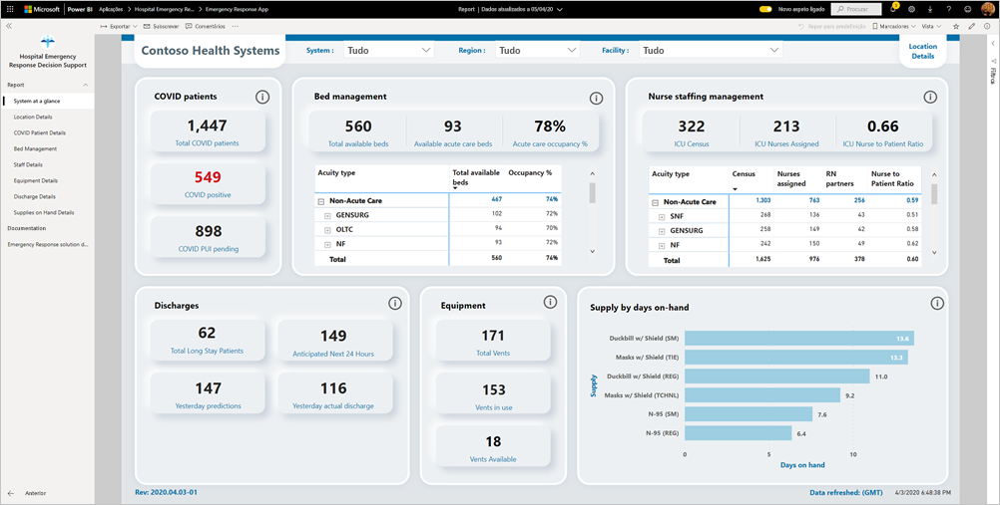

Este artigo indica como instalar a aplicação e como ligar às origens de dados. Para saber como utilizar o relatório que verá com esta aplicação, veja a [documentação do Hospital Emergency Response Decision Support Dashboard (Dashboard de Suporte de Decisões de Resposta de Emergência Hospitalar)](/powerapps/sample-apps/emergency-response/deploy-configure#view-the-power-bi-dashboard).

Depois de ter instalado a aplicação de modelo e ligado às origens de dados, pode personalizar o relatório de acordo com as suas necessidades. Em seguida, pode distribuí-la como uma aplicação aos colegas na sua organização.

## Pré-requisitos

Antes de instalar esta aplicação de modelo, tem de instalar e configurar a [solução Power Platform para Hospital Emergency Response (Resposta de Emergência Hospitalar)](/powerapps/sample-apps/emergency-response/deploy-configure). A instalação desta solução cria as referências de origem de dados necessárias para preencher a aplicação com dados.

Ao instalar a solução Power Platform para Hospital Emergency Response (Resposta de Emergência Hospitalar), anote o [URL da instância de ambiente do Common Data Service](/powerapps/sample-apps/emergency-response/deploy-configure#publish-the-power-bi-dashboard). Precisará do mesmo para ligar a aplicação de modelo aos dados.

## Instalar a aplicação

1. Clique na seguinte ligação para aceder à aplicação: [Aplicação de modelo Hospital Emergency Response Decision Support Dashboard (Dashboard de Suporte de Decisões de Resposta de Emergência Hospitalar)](https://aka.ms/AppSource_Hospital_offer)

1. Na página AppSource da aplicação, selecione [**OBTER AGORA**](https://aka.ms/AppSource_Hospital_offer).

    [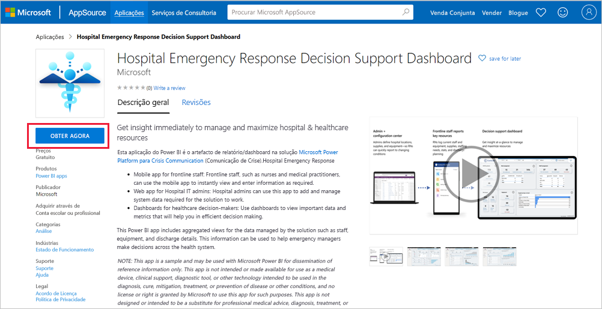](https://aka.ms/AppSource_Hospital_offer)

1. Leia as informações em **Só mais uma coisa** e selecione **Continuar**.

    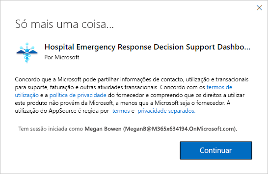

1. Selecione **Instalar**. 

    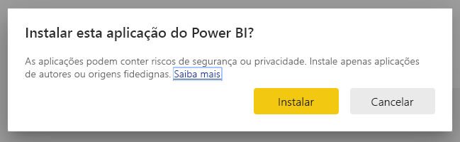

    Assim que a aplicação estiver instalada, irá vê-la na página Aplicações.

   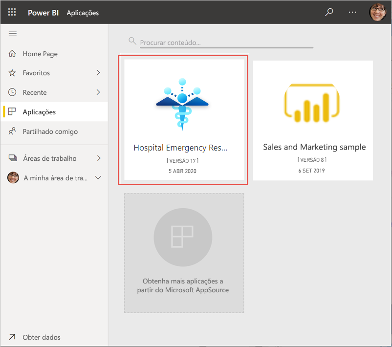

## Ligar a origens de dados

1. Selecione o ícone na página Aplicações para abrir a aplicação.

1. No ecrã inicial, selecione **Explorar**.

   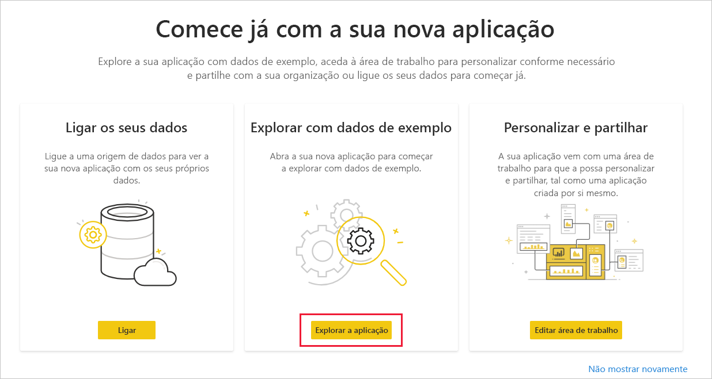

   A aplicação é aberta e apresenta dados de exemplo.

1. Selecione a ligação **Ligar os dados** na faixa na parte superior da página.

   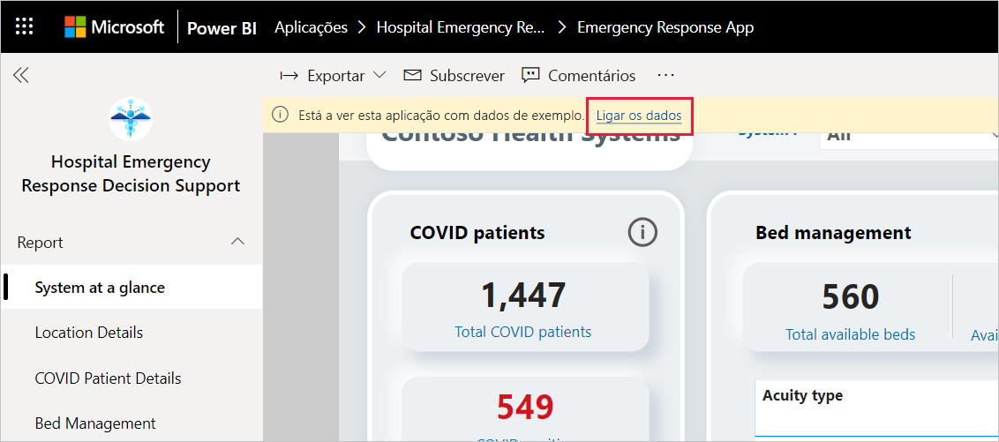

1. Na caixa de diálogo:
   1. No campo do nome da organização, introduza o nome da sua organização, por exemplo, "Contoso Health Systems". Este campo é opcional. Este nome é apresentado no canto superior esquerdo do dashboard.
   1. No campo CDS_base_solution, introduza o [URL da instância de ambiente do Common Data Service](/powerapps/sample-apps/emergency-response/deploy-configure#publish-the-power-bi-dashboard). Por exemplo: https://[myenv].crm.dynamics.com. Quando terminar, clique em **Seguinte**.

   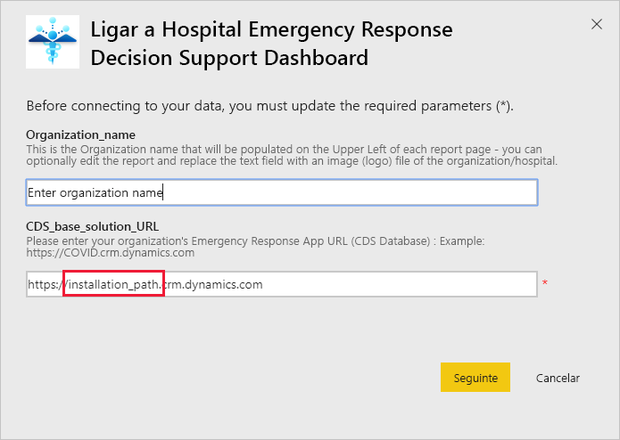

1. Na caixa de diálogo seguinte, defina o método de autenticação como **OAuth2**. Não tem de fazer nada na definição do nível de privacidade.

   Selecione **Iniciar sessão**.

   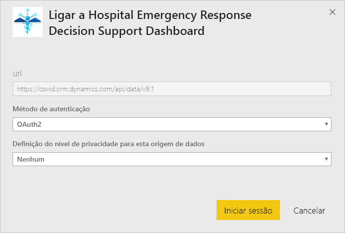

1. No ecrã de início de sessão da Microsoft, inicie sessão no Power BI.

   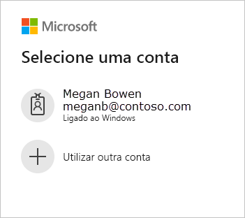

   Depois de iniciar sessão, o relatório liga às origens de dados e é preenchido com dados atualizados. Durante este tempo, o monitor de atividade é ativado.

   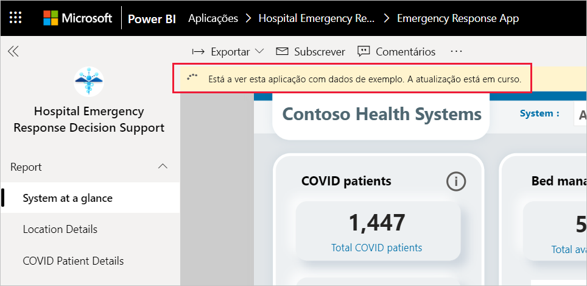

## Agendar atualização do relatório

Quando a atualização de dados for concluída, [configure uma agenda de atualização](../connect-data/refresh-scheduled-refresh.md) para manter os dados do relatório atualizados.

1. Na barra superior do cabeçalho, selecione **Power BI**.

   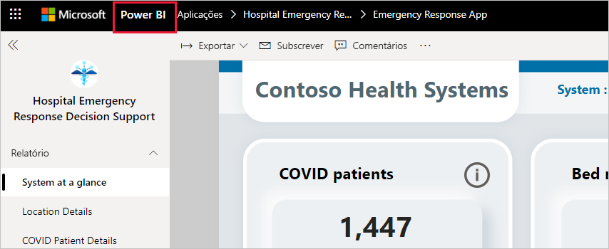

1. No painel de navegação esquerdo, procure a área de trabalho Hospital Emergency Response Decision Support Dashboard (Dashboard de Suporte de Decisões de Resposta de Emergência Hospitalar) em **Áreas de Trabalho** e siga as instruções descritas no artigo [Configurar a atualização agendada](../connect-data/refresh-scheduled-refresh.md).

## Personalizar e partilhar

Para obter detalhes, veja [Personalizar e partilhar a aplicação](../connect-data/service-template-apps-install-distribute.md#customize-and-share-the-app). Certifique-se de que revê as [isenções de responsabilidade do relatório](../create-reports/sample-covid-19-us.md#disclaimers) antes de publicar ou distribuir a aplicação.

## Próximos passos
* [Compreender o relatório Hospital Emergency Response (Resposta de Emergência Hospitalar)](/powerapps/sample-apps/emergency-response/deploy-configure#view-the-power-bi-dashboard)
* [Configurar e saber mais sobre o modelo de exemplo Crisis Communication (Comunicação de Crise) no Power Apps](/powerapps/maker/canvas-apps/sample-crisis-communication-app)
* Perguntas? [Experimente perguntar à Comunidade do Power BI](https://community.powerbi.com/)
* [O que são as aplicações de modelo do Power BI?](../connect-data/service-template-apps-overview.md)
* [Instalar e distribuir aplicações de modelo na sua organização](../connect-data/service-template-apps-install-distribute.md)