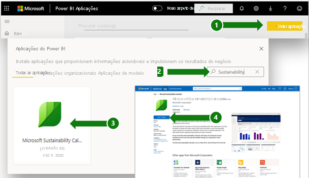
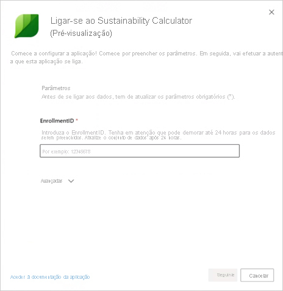
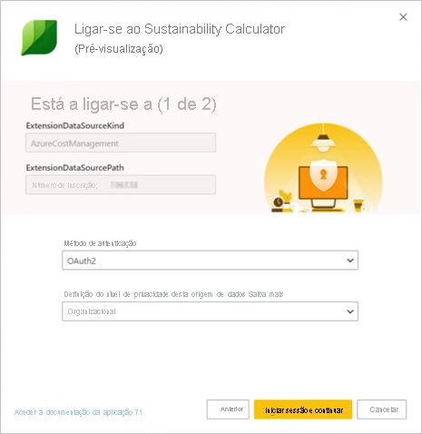
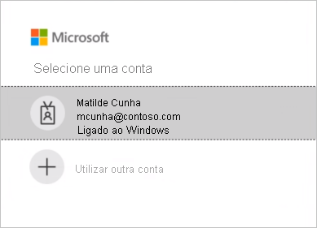
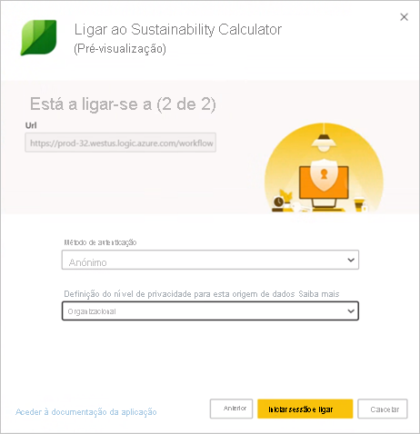

# Página de Suporte do Microsoft Sustainability Calculator

O Microsoft Sustainability Calculator proporciona novas informações sobre os dados das emissões de carbono associados aos serviços do Azure. As pessoas responsáveis por comunicar e impulsionar a sustentabilidade nas organizações podem agora quantificar o impacto das emissões de carbono de cada subscrição do Azure e ver estimativas de poupança de carbono resultantes da execução dessas cargas de trabalho no Azure versus nos datacenters no local. Estes dados podem ser utilizados para a criação de relatórios sobre a presença de gases com efeito de estufa das emissões de Âmbito 3.

> [!NOTE]
> Esta versão do conector suporta apenas inscrições do [Azure Enterprise Portal](https://ea.azure.com). Não são atualmente suportadas inscrições oriundas da China.

## Pré-requisitos

Para aceder ao Microsoft Sustainability Calculator, precisa das seguintes informações do administrador do Azure da organização:

- ID do inquilino
- Chave de acesso
- Número de inscrição
- Apenas os utilizadores com funções de administrador do Azure podem autenticar e associar a calculadora a dados empresariais. (**Apenas para a versão de pré-visualização de dezembro de 2020**)

Para localizar o número de inscrição da empresa:

1. Inicie sessão no [Azure Enterprise Portal](https://ea.azure.com) como administrador.
2. Selecione **Active Directory** ou **Gerir** na barra de navegação esquerda. O número de inscrição da empresa será apresentado.

   

Para localizar a chave de acesso da empresa:

1. Inicie sessão no [Azure Enterprise Portal](https://ea.azure.com) como administrador.
2. Selecione **Relatórios** e, em seguida, **Chave de Acesso da API** para obter a chave da conta de inscrição primária.

## Versão do Sustainability Calculator de Janeiro de 2020

### Como ligar

[!INCLUDE [powerbi-service-apps-get-more-apps](../includes/powerbi-service-apps-get-more-apps.md)]

3. Selecione **Microsoft Sustainability Calculator** e, em seguida, **Obter agora**.

4. Em **Instalar esta aplicação do Power BI?** , selecione **Instalar**.

5. No painel **Aplicações**, selecione o mosaico **Microsoft Sustainability Calculator**.

6. Em **Comece já com a sua nova aplicação** , selecione **Ligar**.

   

7. Introduza o **Nome da empresa**, o **Número de inscrição do utilizador** e o **Número de meses**. Para obter informações sobre como obter o Número de inscrição, veja os [Pré-requisitos](#prerequisites). Selecione **Seguinte**.

   

8. Introduza as seguintes informações:

   | Campo | Valor |
   | --- | --- |
   | **Método de autenticação** | Selecione **Chave**. |
   | **Chave da conta** | Introduza a chave de acesso. |
   | **Definição do nível de privacidade para esta origem de dados** | Selecione **Organizacional**. |

   

9. Selecione **Iniciar sessão**.

10. O processo de importação é iniciado automaticamente. Quando concluído, serão apresentados no **Painel de Navegação** um novo dashboard, um novo relatório e um novo modelo. Selecione o relatório para ver os dados importados.

### Utilizar a Aplicação

Para atualizar os parâmetros:

1. Navegue para as definições do **Conjunto de Dados** e aceda às definições associadas à área de trabalho da aplicação.
2. Atualize o **Nome da empresa**, o **Número de inscrição do utilizador** ou o **Número de meses**, conforme necessário.
3. Selecione **Atualizar** para recarregar os dados com os novos parâmetros aplicados.

## Versão do Sustainability Calculator (Pré-visualização) de Dezembro de 2020

Calcule ainda hoje as emissões de carbono com base na cloud com o Microsoft Sustainability Calculator.

A precisão da contabilidade do carbono requer boas informações dos parceiros e dos fornecedores. O Microsoft Sustainability Calculator proporciona-lhe transparência em relação às emissões de carbono geradas pela utilização do Azure e do Microsoft Dynamics.

A contabilidade do carbono da Microsoft abrange todos os três âmbitos de emissões com uma metodologia validada pela Universidade de Stanford em 2018. Utiliza uma contabilidade do carbono consistente e precisa para quantificar o impacto dos serviços cloud da Microsoft na pegada ecológica dos clientes. A Microsoft é o único fornecedor de serviços cloud a proporcionar este nível de transparência aos clientes, ao mesmo tempo que compila relatórios para requisitos de criação de relatórios voluntários ou estatutários.

### Antes de começar

O Microsoft Sustainability Calculator é executado no Power BI Pro. Se não tiver o Power BI Pro, [obtenha uma avaliação gratuita agora](https://powerbi.microsoft.com/power-bi-pro).

Precisará do número de inscrição do Azure. Caso não o tenha, peça ajuda ao administrador do Azure da organização. Para obter mais informações, veja os [Pré-requisitos](#prerequisites).

### Ligar a calculadora: cinco passos simples para a contabilidade do carbono

1. Transfira a aplicação do [AppSource](https://go.microsoft.com/fwlink/?linkid=2151690).

   

   Também pode procurar a aplicação no Power BI.

   

2. Abra a aplicação.

3. Introduza o número de inscrição. Selecione **Ligar os dados** e, em seguida, introduza o número de inscrição. Para obter mais informações sobre como obter o número de inscrição, veja os [Pré-requisitos](#prerequisites).

   

4. Ligar a conta:
   - Em **Está a ligar-se a (1 de 2)** , em **Método de autenticação**, selecione **OAuth2** e, em **Definição do nível de privacidade para esta origem de dados**, selecione **Organizacional**.

      
 
   - Selecione a conta do utilizador.

      
       
   - Em **Está a ligar-se a (2 de 2)** , em **Método de autenticação**, selecione **Anónimo** e, em **Definição do nível de privacidade para esta origem de dados**, selecione **Organizacional**.

     
    
5. Aguarde até que a vista seja criada, o que pode demorar até 24 horas.

### Recursos adicionais

- [Vídeo de Procedimentos](https://go.microsoft.com/fwlink/?linkid=2151608)
- [Os benefícios em termos de carbono da computação na cloud: um estudo sobre o Microsoft Cloud em parceria com a WSP](https://download.microsoft.com/download/7/3/9/739BC4AD-A855-436E-961D-9C95EB51DAF9/Microsoft_Cloud_Carbon_Study_2018.pdf)

### FAQ

#### Configuração da aplicação

**Estou a obter um erro ao ligar os meus dados com a calculadora. O que posso fazer?**

Primeiro, confirme no Azure Cost Management que tem privilégios de Administrador de TI. Se não tiver, peça acesso ao administrador. Em seguida, garanta que está a utilizar o número de inscrição correto.

**Introduzi o meu número de inscrição, mas os dados da minha empresa não estão a ser carregados. Qual é o problema?**

A Pré-visualização Pública do Sustainability Calculator pode demorar até 24 horas a carregar os dados. Regresse após 24 horas e selecione o botão **Atualizar** no Power BI.

**A Microsoft está a tentar mudar a responsabilidade de emissões da Microsoft para mim?**

N.º As emissões de carbono dos serviços do Azure são comunicadas como emissões de âmbito 1 e 2 da Microsoft, em conformidade com o [Protocolo da Presença de Gases com Efeito de Estufa (GEE)](https://ghgprotocol.org/) padrão da indústria. O Protocolo GEE define as emissões de âmbito 3 como emissões que outra entidade emite em seu nome e são inerentemente contadas duas vezes. O Microsoft Sustainability Calculator permite obter uma nova transparência no que diz respeito às emissões de âmbito 3 associadas à utilização dos serviços do Azure, especificamente a Categoria 1 do Âmbito 3 “Produtos e serviços comprados”.

**Por que motivo as minhas emissões da utilização da cloud da Microsoft são muito mais baixas do que seriam se estivesse a utilizar uma solução no local?**

A Microsoft realizou [um estudo, publicado em 2018](https://blogs.microsoft.com/on-the-issues/2018/05/17/microsoft-cloud-delivers-when-it-comes-to-energy-efficiency-and-carbon-emission-reductions-study-finds/), que avaliou a diferença entre a cloud da Microsoft e os datacenters no local ou tradicionais. Os resultados mostram que a Computação e o Armazenamento do Azure são entre 52 e 79% mais eficientes em termos energéticos do que os datacenters empresariais tradicionais, consoante a comparação específica feita em relação à alternativa no local de baixa, média e alta eficiência. Ao ter em conta as nossas compras de energia renovável, o Azure é 79-98% mais eficiente em termos de carbono. Estas poupanças devem-se a quatro funcionalidades fundamentais do Microsoft Cloud: eficiência operacional das TI, eficiência do equipamento de TI, eficiência da infraestrutura do datacenter e eletricidade renovável.

**Se as operações da Microsoft são neutras em emissões de carbono e alimentadas por energias renováveis, por que motivo as emissões dos clientes dos serviços do Azure não são zero?**

Existem dois motivos principais pelos quais as emissões dos clientes da Microsoft não são zero. O primeiro está relacionado com as práticas de contabilidade dos GEE e o segundo está relacionado com o limite desta análise. Para alcançar operações neutras em emissões de carbono, a Microsoft utiliza desvios de carbono para reduzir determinadas fontes de emissão, como a combustão de combustível no local para geradores de reserva, refrigeradores e frotas de veículos. Tal reduz as emissões *líquidas* da Microsoft para zero. A calculadora comunica as emissões dos GEE *brutas* antes da aplicação desses desvios, embora o volume dos desvios aplicados e as emissões líquidas sejam comunicados no separador **Relatórios GEE** para maior transparência. O segundo motivo é que, além da energia e das emissões associadas à operação dos datacenters da Microsoft, a pegada de emissões inclui a energia utilizada pelos Fornecedores de Serviços de Internet fora do limite operacional da Microsoft para transmitir dados entre os datacenters da Microsoft e os clientes do Azure.

**Como devo utilizar estes dados e onde os devo reportar?**

As emissões podem ser reportadas como parte das emissões de carbono indiretas de âmbito 3 da empresa. As emissões de âmbito 3 são geralmente divulgadas em relatórios de sustentabilidade, alterações climáticas da CDP e outros meios de criação de relatórios. Além dos totais de emissões, as poupanças de emissões proporcionam um exemplo claro de como a decisão da empresa de utilizar os serviços do Microsoft Azure está a contribuir para as reduções das emissões globais. Para contextualizar, a aplicação indica o equivalente dos quilómetros feitos pelos veículos evitados que correspondem à redução em emissões de GEE, com base nos fatores da calculadora de equivalência da EPA a partir de janeiro de 2020.

**O que posso fazer para reduzir ainda mais as emissões?**

Ser eficiente em termos de recursos e custos no Azure reduz o impacto ambiental da utilização do Azure. Por exemplo, as máquinas virtuais não utilizadas são desnecessárias, tanto na cloud como no local. O dimensionamento correto das máquinas virtuais para melhorar os fatores de utilização de computação (CUF) diminui a utilização de energia por saída útil, tal como acontece com os servidores físicos. O [Azure Cost Management](/azure/cost-management-billing/costs/cost-mgt-best-practices) proporciona-lhe as ferramentas para planear, analisar e reduzir os gastos de forma a maximizar o investimento na cloud.

#### Metodologia

**Qual é a metodologia subjacente da ferramenta?**

O Microsoft Sustainability Calculator reflete os serviços cloud específicos consumidos e os requisitos de energia associados, a eficiência dos datacenters que proporcionam esses serviços, as combinações de combustíveis de eletricidade nas regiões nas quais esses datacenters operam e as compras da Microsoft de energia renovável. Como parte do desenvolvimento da aplicação, a metodologia e implementação foram submetidas a uma verificação de terceiros para garantir o alinhamento com o Padrão de Criação de Relatórios e a Contabilização Empresarial do Protocolo da Presença de Gases com Efeito de Estuda do World Resources Institute (WRI)/World Business Council for Sustainable Development (WBCSD). O âmbito da verificação, conduzida em conformidade com a ISO 14064-3: Gases com Efeito de Estufa – Parte 3: Especificações com linhas de orientação ao nível da validação e verificação de declarações de gases com efeito de estufa, incluiu a estimativa de emissões dos serviços do Azure, mas excluiu a estimativa de emissões no local, com base na natureza hipotética dessa estimativa. Uma descrição mais detalhada do cálculo do carbono está documentada no separador **Metodologia de Cálculo** da ferramenta.

**Quais são os dados necessários para calcular a pegada de carbono do Azure? Acedem aos dados da minha empresa?**

Os cálculos de carbono estimados são executados com base no consumo dos serviços do Azure acedidos com as Receitas por Consumo do Azure. A Calculadora não acede aos dados armazenados do cliente. Os dados de consumo são combinados com os dados de monitorização de carbono e energia da Microsoft para calcular as emissões estimadas associadas ao consumo de serviços do Azure com base nos datacenters que proporcionam esses serviços.

**Este cálculo inclui todos os serviços do Azure e todas as regiões do Azure?**

As estimativas incluem todos os serviços do Azure em todas as regiões do Azure associadas ao ID do inquilino indicado durante a configuração.

#### Caraterização das emissões no local

**Onde é que o Microsoft Sustainability Calculator obtém os dados acerca das minhas operações e emissões no local?**

O Microsoft Sustainability Calculator não obtém quaisquer informações específicas sobre os datacenters *, exceto* as informações que introduzir. Conforme descrito nas FAQs subsequentes, o Microsoft Sustainability Calculator baseia-se na pesquisa da indústria e nas entradas do utilizador sobre a eficiência e a combinação energética das alternativas no local para desenvolver uma estimativa de emissões no local.

**Quais são as suposições relativamente às estimativas no local? As poupanças de eficiência provêm apenas de melhorias no índice PUE (Power Usage Effectiveness)?**

As eficiências associadas aos serviços cloud da Microsoft incluem muito mais do que o PUE melhorado. Apesar de os datacenters da Microsoft se esforçarem por otimizar o PUE, as principais melhorias da eficiência provêm da eficiência operacional das TI (aprovisionamento dinâmico, arquitetura “multitenancy”, utilização de servidores) e da eficiência do equipamento de TI (que adapta o hardware aos serviços, o que garante o direcionamento de mais energia para a saída útil), além da eficiência da infraestrutura do datacenter (melhorias do PUE). O nosso [estudo de 2018](https://blogs.microsoft.com/on-the-issues/2018/05/17/microsoft-cloud-delivers-when-it-comes-to-energy-efficiency-and-carbon-emission-reductions-study-finds/) quantifica estas poupanças em comparação com uma variedade de alternativas no local, desde datacenters de baixa eficiência a alta eficiência. Estas conclusões são utilizadas para estimar a utilização de energia necessária para um datacenter no local correspondente proporcionar os mesmos serviços que cada cliente consome na cloud da Microsoft.

**Qual é a combinação energética assumida para a infraestrutura no local?**

Por predefinição, o Microsoft Sustainability Calculator estima as emissões no local com base na combinação de energias renováveis e não renováveis na grelha. Supõe-se que o datacenter no local está localizado na mesma grelha que os datacenters da Microsoft. No entanto, para os clientes que comprarem eletricidade renovável *para além* do que está na grelha (por exemplo, através de Contratos de Compra de Energia), os utilizadores podem selecionar a percentagem de eletricidade renovável e o Microsoft Sustainability Calculator ajustará as emissões no local em conformidade.

**Quando devo escolher Baixa, Média ou Alta para a eficiência da infraestrutura no local?**

Os utilizadores devem selecionar a eficiência mais representativa da implementação no local que querem utilizar para a comparação, com base nas características do equipamento e do datacenter aqui:

- **Baixa**: servidores físicos e armazenamento de ligação direta em datacenter localizado pequeno (46,5 a 185,7 metros quadrados)
- **Média**: combinação de servidores físicos/virtualizados e armazenamento de ligação direta/dedicado em datacenter interno de escalão médio (185,8 a 1857 metros quadrados)
- **Alta**: servidores virtualizados e armazenamento dedicado em datacenter interno de gama alta (>1858 metros quadrados)