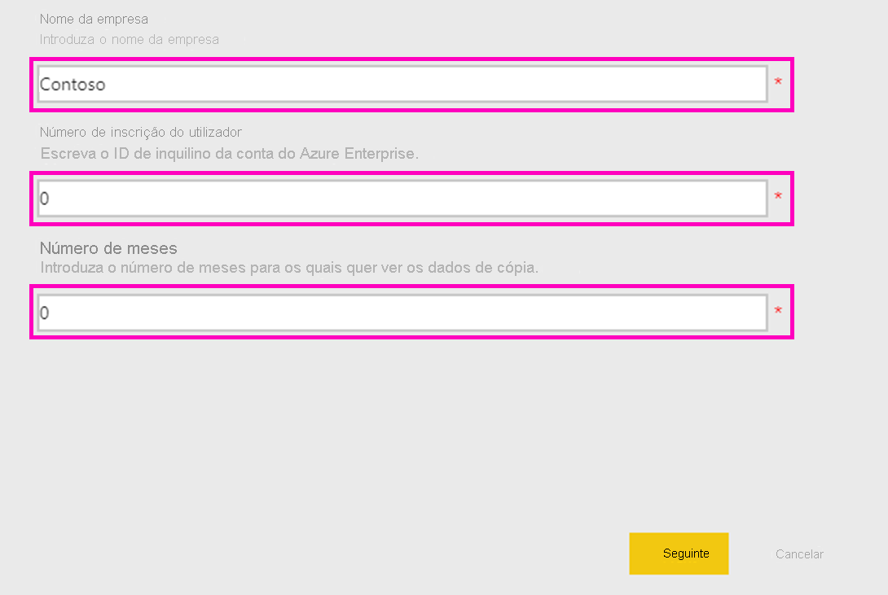
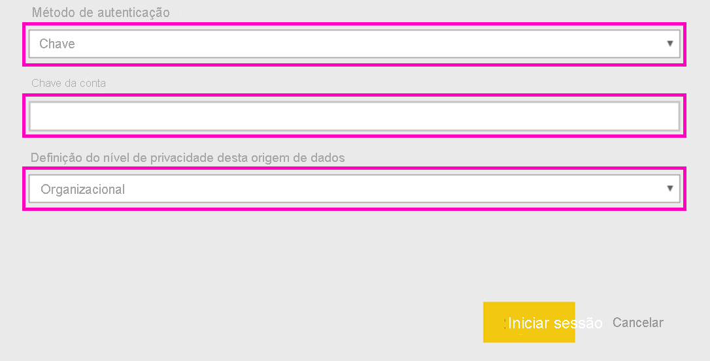

# Ligar ao Microsoft Sustainability Calculator
Obtenha informações sobre as emissões de carbono da sua infraestrutura de TI para tomar decisões de computação mais sustentáveis

O Microsoft Sustainability Calculator proporciona novas informações sobre os dados das emissões de carbono associados aos serviços do Azure. Os responsáveis por comunicar e impulsionar a sustentabilidade nas organizações têm agora a capacidade de quantificar o impacto do carbono de cada subscrição do Azure, bem como ver estimativas de poupança de carbono resultantes da execução destas cargas de trabalho no Azure versus datacenters no local. Estes dados podem ser utilizados para a criação de relatórios sobre a presença de gases com efeito de estufa das emissões de âmbito 3. Para aceder ao Microsoft Sustainability Calculator, precisará do ID do inquilino e da chave de acesso, normalmente disponível através do administrador do Azure da sua organização.

Para utilizar esta aplicação, precisará de informações do Azure Enterprise Portal. Os administradores do sistema da sua empresa podem ajudá-lo a obter essa informação. Reveja estas instruções e obtenha as informações necessárias antes da instalação da Aplicação. 

Esta versão do conector suporta apenas inscrições Enterprise provenientes de [https://ea.azure.com](https://ea.azure.com/). Não são atualmente suportadas inscrições oriundas da China.

## Como se ligar
[!INCLUDE [powerbi-service-apps-get-more-apps](../includes/powerbi-service-apps-get-more-apps.md)]

1. Selecione **Microsoft Sustainability Calculator** \> **Obter agora**.
1. Em **Instalar esta aplicação do Power BI?** , selecione **Instalar**.
1. No painel **Aplicações**, selecione o mosaico **Microsoft Sustainability Calculator**.
1. Em **Comece já com a sua nova aplicação** , selecione **Ligar**.

    

1. Introduza o **Nome da empresa, Número de inscrição do utilizador** e **Número de meses \> Iniciar Sessão.** Veja detalhes sobre [como encontrar estes parâmetros](#finding-parameters) abaixo.

    

1. Como **Método de autenticação**, selecione **Chave** e como **Nível de privacidade**, selecione **Organizacional**.
1. Para **Chave**, introduza a **Chave de Acesso \> Iniciar Sessão**.

    

1. O processo de importação é iniciado automaticamente. Quando concluído, serão apresentados no **Painel de Navegação** um novo dashboard, um novo relatório e um novo modelo. Selecione o relatório para ver os dados importados.

## Parâmetros de localização

Para localizar o **ID de inscrição** e a **Chave de acesso** da sua empresa, contacte o seu administrador do Azure para obter as informações necessárias. O administrador vai

1. Iniciar sessão no [Azure Enterprise Portal](https://ea.azure.com), clicar em **Gerir** no friso à esquerda e obter o **Número da Inscrição**, conforme mostrado abaixo
2. No [Azure Enterprise Portal](https://ea.azure.com), clicar em **Relatórios** e, em seguida, Chave de Acesso da API, conforme mostrado abaixo para obter a Chave de Conta de Inscrição Primária

## Utilizar a Aplicação

Para atualizar os parâmetros em qualquer momento, navegue até às definições **Conjunto de dados**, aceda ao que está associado à área de trabalho da aplicação e atualize o ID do inquilino, o nome da empresa ou os meses dos dados. Depois de aplicar os parâmetros, clique em **Atualizar** para recarregar os dados com os novos parâmetros aplicados.