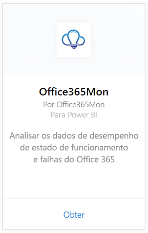
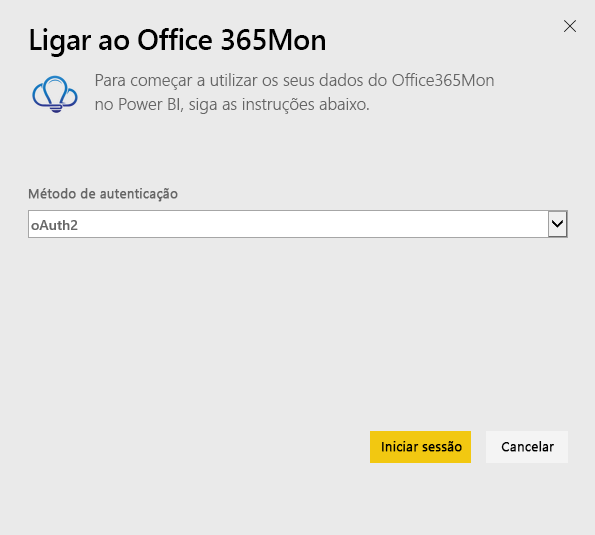
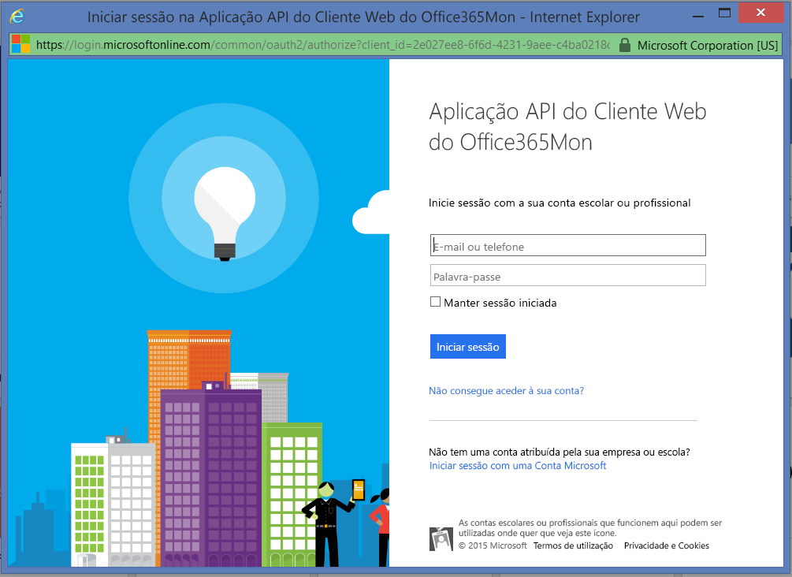
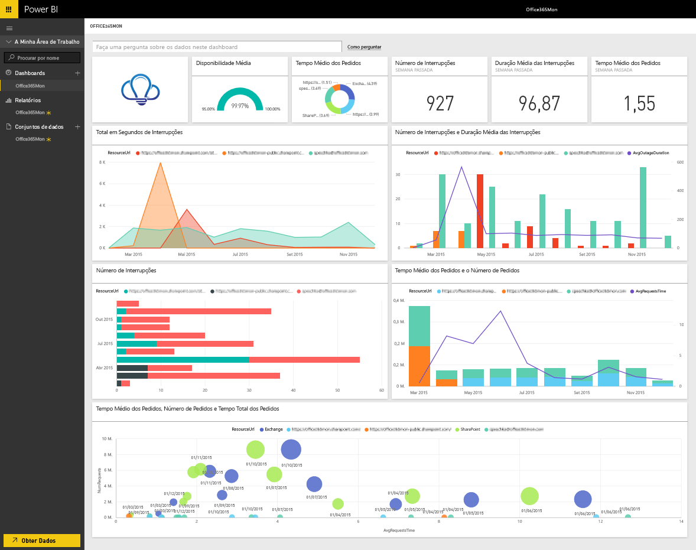

# Ligue-se ao Office365Mon com o Power BI
Com o Power BI e a aplicação de modelo Office365Mon, é fácil analisar os seus dados de desempenho de estado de funcionamento e falhas do Office 365. O Power BI recupera os seus dados, incluindo investigações de integridade e interrupções e, em seguida, compila um dashboard e relatórios prontos para uso com base nesses dados.

Ligue-se à [aplicação de modelo Office365Mon](https://msit.powerbi.com/groups/me/getapps/services/office365mon.office365mon_powerbi_v3) para Power BI.

>[!NOTE]
>É necessária uma conta de administrador do Office365Mon para ligar e carregar a aplicação de modelo do Power BI.

## Como se ligar
1. Selecione **Obter Dados** na parte inferior do painel de navegação.
   
   
2. Na caixa **Serviços**, selecione **Obter**.
   
    
3. Selecione **Office365Mon** \> **Obter**.
   
   
4. Para o Método de Autenticação, selecione **oAuth2**\> **Iniciar Sessão**.
   
   Quando solicitado, insira as suas credenciais de administrador do Office365Mon e siga o processo de autenticação.
   
   
   
   
5. Depois de o Power BI importar os dados, verá um novo dashboard, relatório e conjunto de dados no painel de navegação. Os novos itens são marcados com um asterisco amarelo \*; selecione a entrada do Office365Mon.
   
   

**O que se segue?**

* Experimente [fazer uma pergunta na caixa de Perguntas e Respostas](../consumer/end-user-q-and-a.md) na parte superior do dashboard
* [Altere os mosaicos](../create-reports/service-dashboard-edit-tile.md) no dashboard.
* [Selecione um mosaico](../consumer/end-user-tiles.md) para abrir o relatório subjacente.
* Embora o seu conjunto de dados seja agendado para atualizações diárias, pode alterar o agendamento das atualizações ou tentar atualizá-lo a pedido através da opção **Atualizar Agora**

## Resolução de problemas
Se receber um erro **"falha no inicio de sessão"** depois de usar as credenciais de subscrição do Office365Mon para iniciar sessão, a conta utilizada não tem permissões para recuperar os dados do Office365Mon da conta. Verifique se é uma conta de administrador e tente novamente.

## Próximos passos
[O que é o Power BI?](../fundamentals/power-bi-overview.md)

[Obter Dados para o Power BI](service-get-data.md)
