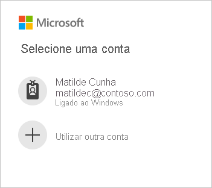
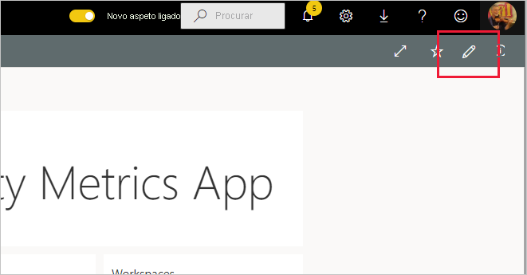

# Ligar ao Power BI Premium Capacity Metrics
A monitorização das suas capacidades é essencial para tomar decisões informadas sobre a melhor forma de utilizar os seus recursos de capacidades Premium. A aplicação Power BI Premium Capacity Metrics fornece as informações mais detalhadas sobre o desempenho das suas capacidades.

Este artigo descreve como instalar a aplicação e como ligar às origens de dados. Para obter mais informações sobre os conteúdos do relatório e como utilizá-los, veja [Monitorizar as capacidades Premium com a aplicação](../admin/service-admin-premium-monitor-capacity.md) e a [publicação de blogue sobre a aplicação Premium Capacity Metrics](https://powerbi.microsoft.com/blog/premium-capacity-metrics-app-new-health-center-with-kpis-to-explore-relevant-metrics-and-steps-to-mitigate-issues/).

Depois de ter instalado a aplicação e ligado às origens de dados, pode personalizar o relatório de acordo com as suas necessidades. Em seguida, pode distribuí-la pelos colegas na sua organização.

> [!NOTE]
> São necessárias [permissões](./service-template-apps-install-distribute.md#prerequisites) para instalar aplicações de modelo. Contacte o seu administrador de inquilinos se não tiver permissões suficientes.

## Instalar a aplicação

1. Clique na seguinte ligação para aceder à aplicação: [Aplicação de modelo do Power BI Premium Capacity Metrics](https://app.powerbi.com/groups/me/getapps/services/pbi_pcmm.capacity-metrics-dxt)

1. Na página AppSource da aplicação, selecione [**OBTER AGORA**](https://app.powerbi.com/groups/me/getapps/services/pbi_pcmm.capacity-metrics-dxt).

    

1. Selecione **Instalar**. 

    

    > [!NOTE]
    > Se já tiver a aplicação instalada, ser-lhe-á perguntado se quer [substituir a instalação](./service-template-apps-install-distribute.md#update-a-template-app) ou instalar numa nova área de trabalho.

    Assim que a aplicação estiver instalada, irá vê-la na página Aplicações.

   

## Ligar a origens de dados

1. Selecione o ícone na página Aplicações para abrir a aplicação.

1. No ecrã inicial, selecione **Explorar**.

   

   A aplicação é aberta e apresenta dados de exemplo.

1. Selecione a ligação **Ligar os dados** na faixa na parte superior da página.

   

1. Na caixa de diálogo apresentada, defina a diferença em relação à UTC. Ou seja, a diferença de tempo entre a Hora Universal Coordenada e as horas na sua localização. Em seguida, clique em **Seguinte**.
  
   
   **Nota: o formato de meia hora deve ser decimal (por exemplo, 5,5, 2,5, etc.).**

1. Na caixa de diálogo apresentada a seguir, não tem de fazer nada. Basta selecionar **Iniciar sessão**.

   

1. No ecrã de início de sessão da Microsoft, inicie sessão no Power BI.

   

   Depois de iniciar sessão, o relatório liga às origens de dados e é preenchido com dados atualizados. Durante este tempo, o monitor de atividade é ativado.

   

   Os dados de relatório serão atualizados automaticamente uma vez por dia, a não ser que desative esta funcionalidade durante o processo de início de sessão. Também pode [configurar uma agenda de atualização personalizada](./refresh-scheduled-refresh.md) para manter os dados do relatório atualizados da forma que preferir.

## Personalizar e partilhar

Para começar a personalizar a aplicação, clique no ícone de lápis no canto superior direito.

 

Para obter detalhes, veja [Personalizar e partilhar a aplicação](./service-template-apps-install-distribute.md#customize-and-share-the-app).

## Próximos passos
* [Monitorizar as capacidades Premium com a aplicação](../admin/service-admin-premium-monitor-capacity.md)
* [Publicação de blogue sobre a aplicação Premium Capacity Metrics](https://powerbi.microsoft.com/blog/premium-capacity-metrics-app-new-health-center-with-kpis-to-explore-relevant-metrics-and-steps-to-mitigate-issues/)
* [O que são as aplicações de modelo do Power BI?](./service-template-apps-overview.md)
* [Instalar e distribuir aplicações de modelo na sua organização](./service-template-apps-install-distribute.md)
* Perguntas? [Experimente perguntar à Comunidade do Power BI](https://community.powerbi.com/)