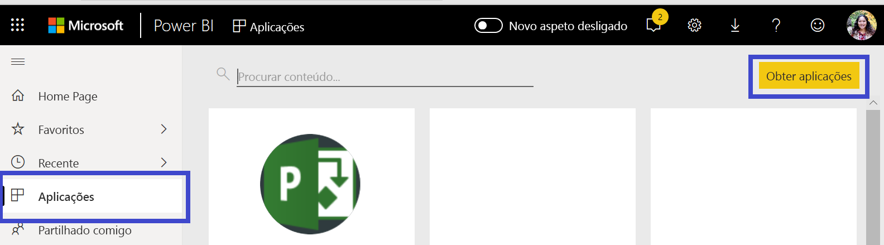
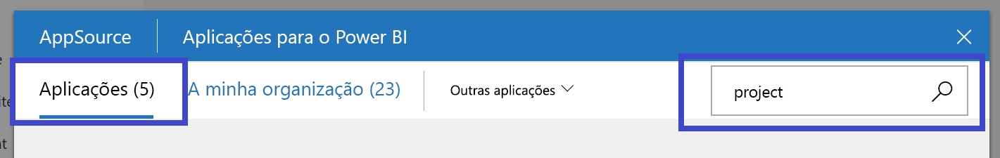
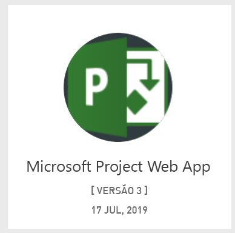
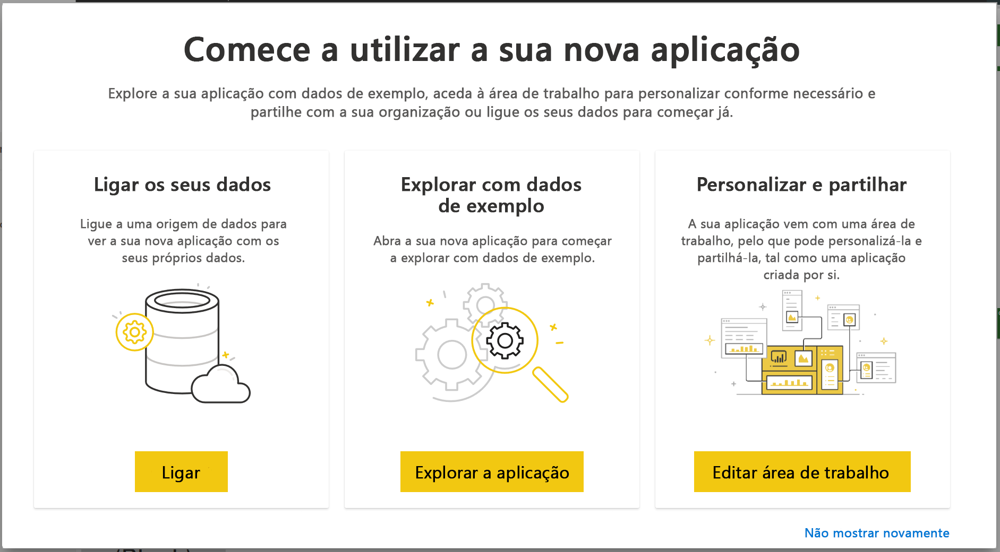
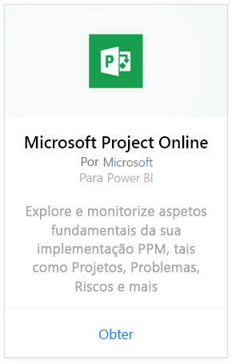
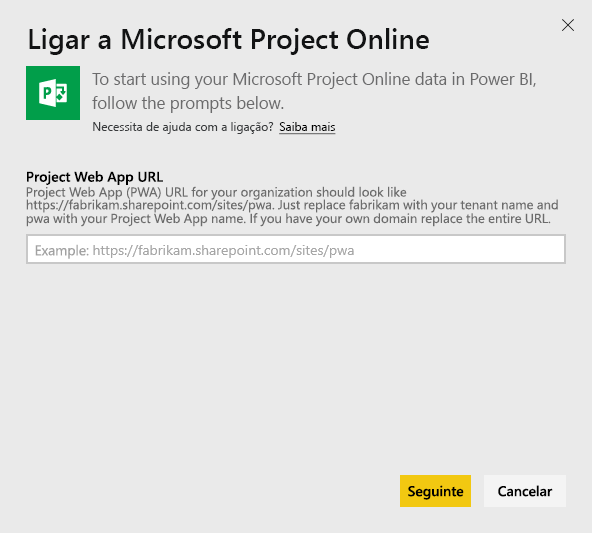
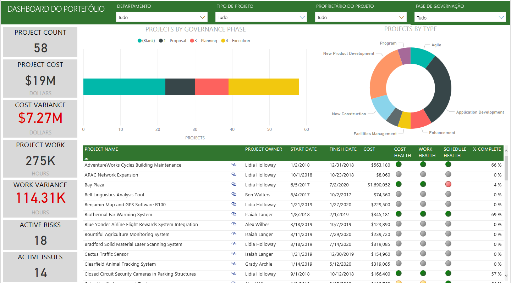
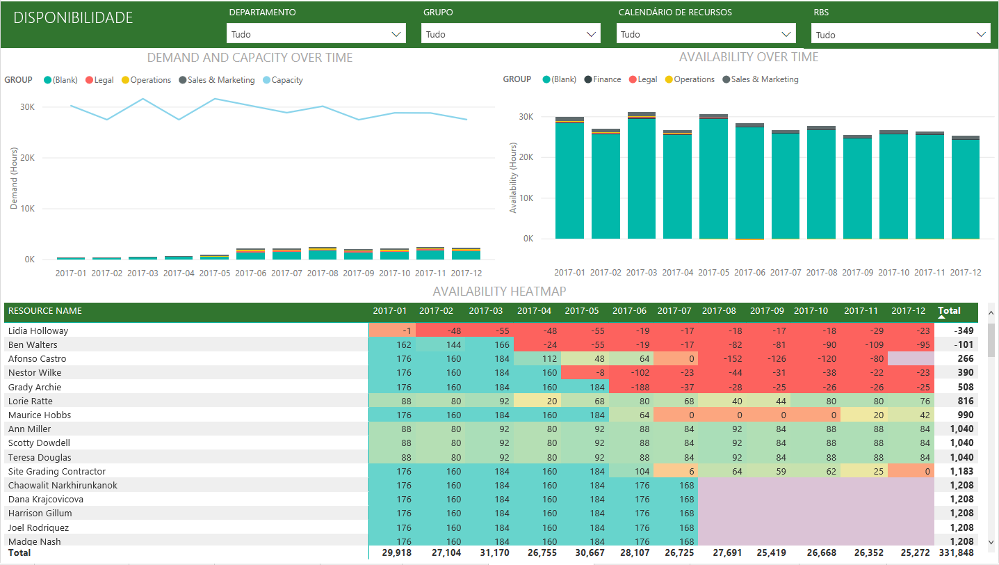
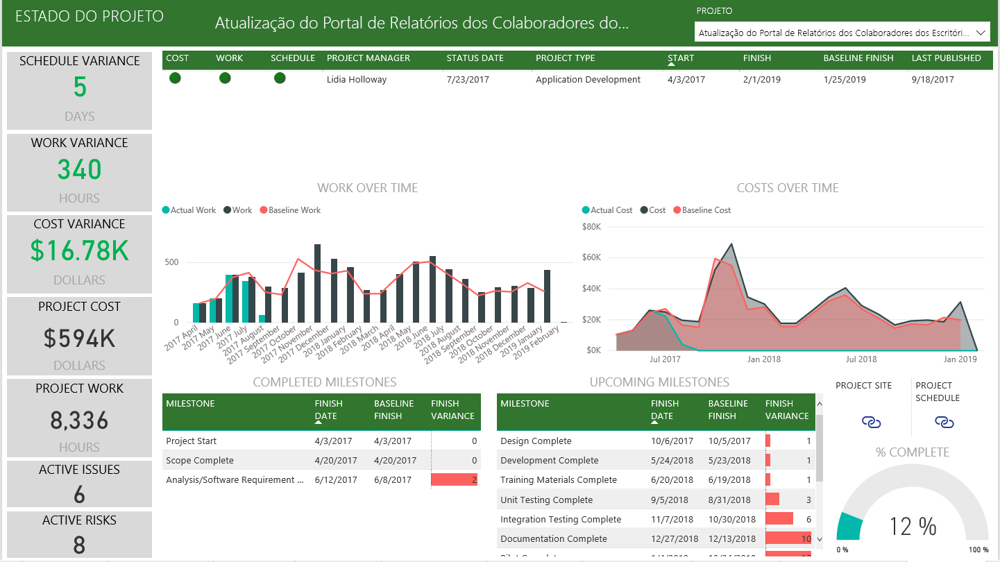

# Ligar-se ao Project Web App com o Power BI
O Microsoft Project Web App é uma solução online flexível para PPM (gestão de portefólios de projetos) e para o trabalho quotidiano. O Project Web App permite que as organizações comecem, atribuam prioridades a investimentos de portefólio de projetos e entreguem o valor comercial pretendido. A Aplicação de Modelos do Project Web App para o Power BI permite-lhe obter informações do Project Web App para ajudar na gestão de projetos, portefólios e recursos.

Ligue-se à [Aplicação de Modelos do Project Web App](https://appsource.microsoft.com/product/power-bi/pbi_msprojectonline.pbi-microsoftprojectwebapp) para o Power BI.

## Como ligar

1. Selecione **Aplicações** no painel de navegação e selecione **Obter aplicações** no canto superior direito.

    

2. Na caixa **Serviços**, selecione **Obter**.
   
   
3. No AppSource, selecione o separador **Aplicações** e procure/selecione **Microsoft Project Web App**.
   
4. Será apresentada a mensagem **Instalar esta aplicação do Power BI?** . Selecione **Instalar**. 

   
5. No painel **Aplicações**, selecione o mosaico **Microsoft Project Web App**. 
   
   
6. Em **Comece já com a sua nova aplicação** , selecione **Ligar dados**.
   
   
7. Na caixa de texto **URL do Project Web App**, introduza o URL para o PWA (Project Web App) ao qual pretende ligar-se.  Observe que isso pode ser diferente do exemplo, caso tenha um domínio personalizado. Na caixa de texto **Idioma do Site do PWA**, escreva o número que corresponde ao seu idioma do site do PWA. Escreva o dígito "1" para inglês, "2" para francês, "3" para alemão, "4" para português (Brasil), "5" para português (Portugal) e "6" para espanhol. 
   
   
8. Para o Método de Autenticação, selecione **oAuth2**\> **Iniciar Sessão**. Quando lhe for pedido, introduza as suas credenciais do Project Web App e siga o processo de autenticação.

    > [!NOTE]
    > É necessário ter permissões de Visualizador de Portefólio, Gestor de Portefólio ou Administrador para o Project Web App ao qual se está a ligar.

9. Vai ver uma notificação a indicar que os dados estão a ser carregados. Dependendo do tamanho da sua conta, pode levar algum tempo. Após o Power BI importar os dados, verá os conteúdos da sua nova área de trabalho. Poderá ter de atualizar o conjunto de dados para obter as atualizações mais recentes. 

    Após o Power BI importar os dados, verá o relatório com 13 páginas e o conjunto de dados no painel de navegação. 

10. Quando os seus relatórios estiverem prontos, pode começar a explorar os seus dados do Project Web App! A Aplicação de Modelos inclui 13 relatórios avançados e detalhados de Descrição Geral do Portefólio (6 páginas de relatórios), Descrição Geral do Recurso (5 páginas de relatórios) e Estado do Projeto (2 páginas de relatórios). 

    
   
    
   
    

**O que se segue?**

* Embora o seu conjunto de dados seja agendado para atualizações diárias, pode alterar o agendamento das atualizações ou tentar atualizá-lo a pedido através da opção **Atualizar Agora**.

**Expandir a Aplicação de Modelos**

Transfira o [ficheiro PBIT do GitHub](https://github.com/OfficeDev/Project-Power-BI-Content-Packs) para atualizar e personalizar ainda mais o Pacote de Conteúdos.

## Próximas etapas
[Introdução ao Power BI](../fundamentals/service-get-started.md)

[Obter dados no Power BI](service-get-data.md)
