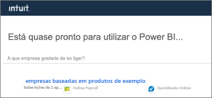
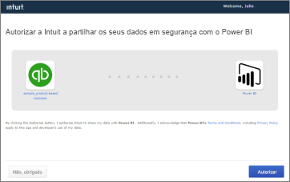
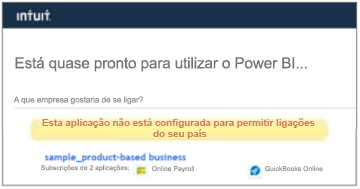

# Ligue-se ao QuickBooks Online com o Power BI
Quando se liga aos seus dados do QuickBooks Online através do Power BI, obtém imediatamente um dashboard e relatórios do Power BI que fornecem informações sobre o fluxo de caixa da sua empresa, rentabilidade, clientes e muito mais. Utilize o dashboard e os relatórios como fornecidos, ou então personalize-os para realçar as informações que mais interessam. Os dados são atualizados automaticamente uma vez por dia.

Ligue-se à [aplicação de modelo do QuickBooks Online](https://dxt.powerbi.com/getdata/services/quickbooks-online) para o Power BI.

>[!NOTE]
>Para importar dados do QuickBooks Online para o Power BI, é necessário ser um administrador da conta do QuickBooks Online e entrar com as credenciais da conta de administrador. Não pode utilizar este conector com o software QuickBooks Desktop. 

## Como se ligar

[!INCLUDE [powerbi-service-apps-get-more-apps](../includes/powerbi-service-apps-get-more-apps.md)]

3. Selecione **QuickBooks Online** e selecione **Obter**.
   
   

4. Em **Instalar esta aplicação do Power BI?** , selecione **Instalar**.

    

4. No painel **Aplicações**, selecione o mosaico **QuickBooks**.

   

6. Em **Comece já com a sua nova aplicação** , selecione **Ligar**.

    

4. Selecione **oAuth2** como Método de Autenticação e selecione **Iniciar Sessão**. 
5. Quando solicitado, insira as suas credenciais do QuickBooks Online e siga o processo de autenticação do QuickBooks Online. Se já tiver a sessão iniciada no QuickBooks Online no seu browser, talvez as suas credenciais não sejam solicitadas.
   >[!NOTE]
   >É necessário ter credenciais de administrador para a conta do QuickBooks Online.
6. Selecione a empresa a que seja deseja ligar ao Power BI no próximo ecrã.
   
   

7. Selecione **Autorizar** no próximo ecrã para iniciar o processo de importação. O processo pode levar alguns minutos, consoante o tamanho dos dados da sua empresa. 
   
   
   
8. Depois de o Power BI importar os dados, verá a lista de conteúdos da aplicação QuickBooks: um novo dashboard, relatório e conjunto de dados.
9. Selecione o dashboard QuickBooks para iniciar o processo de exploração. O Power BI criou automaticamente este dashboard para mostrar os dados importados.

    

**O que se segue?**

* Experimente [fazer uma pergunta na caixa de Perguntas e Respostas](../consumer/end-user-q-and-a.md) na parte superior do dashboard
* [Altere os mosaicos](../create-reports/service-dashboard-edit-tile.md) no dashboard.
* [Selecione um mosaico](../consumer/end-user-tiles.md) para abrir o relatório subjacente.
* Embora o seu conjunto de dados seja agendado para atualizações diárias, pode alterar o agendamento das atualizações ou tentar atualizá-lo a pedido através da opção **Atualizar Agora**

## Resolução de problemas
**"Ups! Ocorreu um erro.”**

Se receber esta mensagem depois de selecionar **Autorizar**:

“Ups! Ocorreu um erro.” Feche esta janela e tente novamente.

A aplicação já foi assinada para esta empresa por outro utilizador. Entre em contacto com [e-mail do administrador] para fazer alterações a essa subscrição.”

... este erro significa que outro administrador na sua empresa já se ligou aos dados da empresa com o Power BI. Peça ao admin que partilhe o dashboard consigo. Atualmente, apenas um utilizador administrador pode ligar a um determinado conjunto de dados empresariais do QuickBooks Online para o Power BI. Depois do Power BI criar o dashboard, o administrador pode partilhá-lo com vários colegas no mesmos inquilinos do Power BI.

**"Esta aplicação não está configurada para permitir ligações do seu país"**

Atualmente o Power BI só dá suporte às edições dos EUA do QuickBooks Online. 

## Próximos passos
[O que é o Power BI?](../fundamentals/power-bi-overview.md)

[Conceitos básicos para designers no serviço Power BI](../fundamentals/service-basic-concepts.md)
