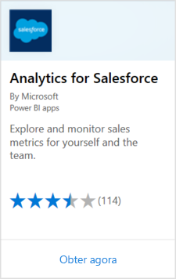
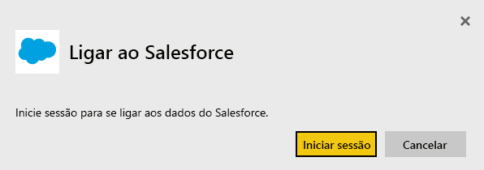
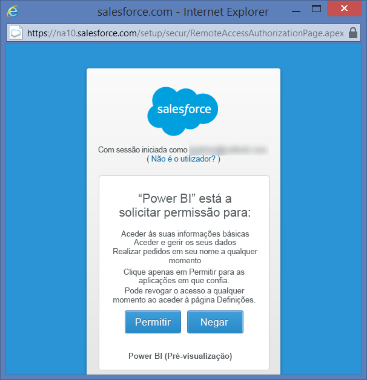
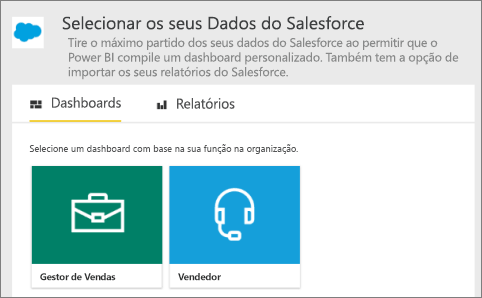
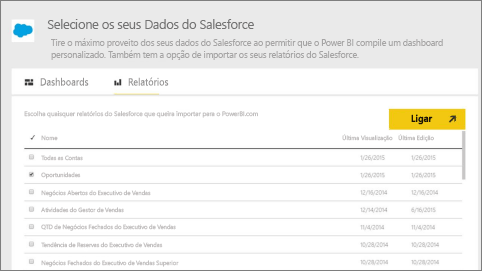
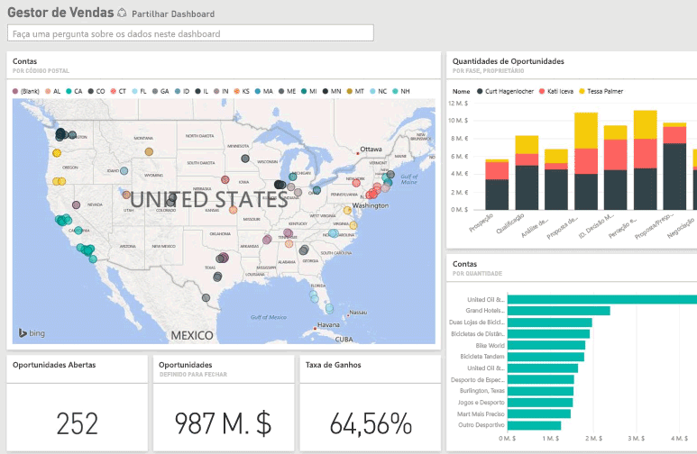

# Ligar-se ao Salesforce com o Power BI
Com o Power BI, pode ligar-se facilmente à sua conta do Salesforce.com. Com esta ligação, pode obter os seus dados do Salesforce, bem como receber automaticamente um dashboard e relatórios.

Leia mais sobre a [Integração do Salesforce](https://powerbi.microsoft.com/integrations/salesforce) no Power BI.

## Como se ligar
1. No Power BI, selecione **Obter Dados** na parte inferior do painel de navegação.
   
    
2. Na caixa **Serviços**, selecione **Obter**.
   
    
3. Selecione **Analytics for Salesforce** (Análise para Salesforce) e selecione **Obter**.  
   
   
4. Selecione **Iniciar Sessão** para começar o fluxo de início de sessão.
   
    
5. Quando pedido, insira as suas credenciais do Salesforce. Selecione **Permitir** para que o Power BI possa aceder aos seus dados e informações básicos do Salesforce.
   
   
6. Configure o que pretende importar para o Power BI com a opção de lista pendente:
   
   * **Dashboard**
     
     Selecione um dashboard predefinido com base numa persona (como **Gestor de Vendas**). Estes dashboards obtêm um conjunto específico de dados padrão do Salesforce, que não incluem campos personalizados.
     
     
   * **Relatórios**
     
     Selecione um ou mais relatórios personalizados da conta do Salesforce. Esses relatórios correspondem às suas visualizações no Salesforce e podem incluir dados de objetos ou campos personalizados.
     
     
     
     Se não vir quaisquer relatórios, adicione ou crie-os em sua conta do Salesforce e tente ligar-se novamente.

7. Clique em **Ligar** para iniciar o processo de importação. Durante a importação, verá uma notificação a indicar que a importação está em curso. Quando a importação for concluída, verá um dashboard, um relatório e um conjunto de dados para os seus dados do Salesforce listados no painel de navegação.
   
   

Pode alterar o dashboard para apresentar os seus dados da forma pretendida. Pode colocar perguntas com a funcionalidade de Perguntas e Respostas ou [selecionar um mosaico](../consumer/end-user-tiles.md) para abrir o relatório subjacente e [editar ou remover mosaicos do dashboard](../create-reports/service-dashboard-edit-tile.md).

**O que se segue?**

* Experimente [fazer uma pergunta na caixa de Perguntas e Respostas](../consumer/end-user-q-and-a.md) na parte superior do dashboard
* [Editar ou remover um mosaico](../create-reports/service-dashboard-edit-tile.md) no dashboard
* [Selecionar um bloco](../create-reports/service-dashboard-tiles.md) para abrir o relatório subjacente
* Apesar de o seu conjunto de dados estar agendado para atualizações diárias, pode alterar a atualização agendada ou tentar atualizá-la a pedido através da opção **Atualizar Agora**

## Requisitos de sistema e considerações

- Estar conectado a uma conta do Salesforce que tenha acesso ativado à API

- Permissão concedida à aplicação Power BI durante o início de sessão

- A conta ter chamadas à API suficientes disponíveis para efetuar pull dos dados e atualizá-los

- Um token de autenticação válido é necessário para a atualização. O Salesforce tem um limite de cinco tokens de autenticação por aplicação, pelo que deve garantir que só importa até cinco conjuntos de dados do Salesforce.

- A API Relatórios do Salesforce tem uma restrição para suportar até 2000 linhas de dados.

## Resolução de problemas

Caso se depare com erros, veja os requisitos acima. 

Atualmente, não é suportado iniciar sessão num domínio personalizado ou do sandbox.

### Mensagem "Não é possível ligar ao servidor remoto"

Se for apresentada a mensagem "Não é possível ligar ao servidor remoto" quando tentar ligar-se à sua conta do Salesforce, veja esta solução no seguinte fórum: [Salesforce Connector sign in Error Message: Unable to connect to the remote server](https://www.outsystems.com/forums/Forum_TopicView.aspx?TopicId=17674&TopicName=log-in-error-message-unable-to-connect-to-the-remote-server&) (Mensagem de erro de início de sessão do Conector do Salesforce: não é possível ligar ao servidor remoto).

## Próximos passos
[O que é o Power BI?](../fundamentals/power-bi-overview.md)

[Origens de dados para o serviço Power BI](service-get-data.md)
