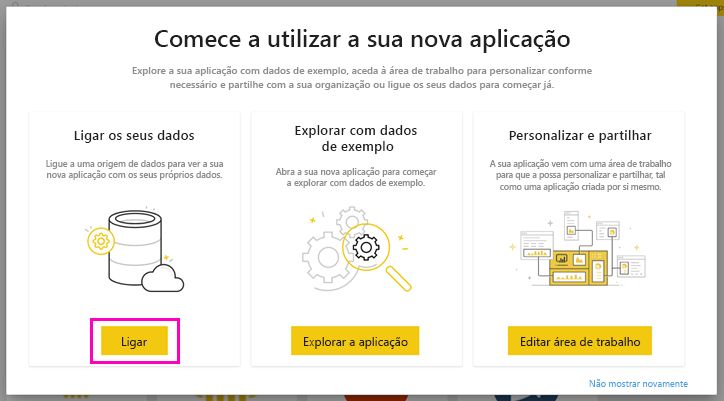

# Ligue-se ao Smartsheet com o Power BI
Este artigo vai orientá-lo durante a extração de dados da conta do Smartsheet através de uma aplicação de modelo do Power BI. O Smartsheet oferece uma plataforma fácil para colaboração e partilha de ficheiros. A aplicação de modelo Smartsheet para Power BI proporciona um dashboard, relatórios e o conjunto de dados que mostra uma visão geral da conta do Smartsheet. Também pode utilizar o [Power BI Desktop](desktop-connect-to-data.md) para se ligar diretamente às folhas individuais na conta. 

Após ter instalado a aplicação de modelo, pode alterar o dashboard e o relatório. Em seguida, pode distribuir a área de trabalho como uma aplicação pelos colegas na sua organização.

Ligue-se à [aplicação de modelo Smartsheet](https://app.powerbi.com/groups/me/getapps/services/pbi-contentpacks.pbiapps-smartsheet) para Power BI.

>[!NOTE]
>É preferível utilizar uma conta de administrador do Smartsheet para ligar e carregar a aplicação de modelo do Power BI, visto que tem acesso adicional.

## Como se ligar

[!INCLUDE [powerbi-service-apps-get-more-apps](../includes/powerbi-service-apps-get-more-apps.md)]

3. Selecione **Smartsheet**  \> **Obter agora**.
4. Em **Instalar esta aplicação do Power BI?** , selecione **Instalar**.
4. No painel **Aplicações**, selecione o mosaico **Smartsheet**.

    

6. Em **Comece já com a sua nova aplicação** , selecione **Ligar**.

    

4. Para o Método de Autenticação, selecione **oAuth2 \> Iniciar Sessão**.
   
   Quando solicitado, insira as suas credenciais do Smartsheet e siga o processo de autenticação.
   
   
   
   

5. Após o Power BI importar os dados, é apresentado o painel Smartsheet.
   
   

## Modificar e distribuir a sua aplicação

Acabou de instalar a aplicação de modelo Smartsheet, o que significa que também criou uma área de trabalho Smartsheet. Na área de trabalho, pode alterar o relatório e o dashboard e, em seguida, distribuí-la como uma *aplicação* pelos colegas na sua organização. 

1. Para ver todos os conteúdos da nova área de trabalho Smartsheet, no painel de navegação, selecione **Áreas de trabalho** > **Smartsheet**. 

    

    Esta vista é a lista de conteúdos da área de trabalho. No canto superior direito, verá a opção **Atualizar aplicação**. Quanto estiver a postos para distribuir a sua aplicação pelos seus colegas, deve começar por aí. 

    

2. Selecione **Relatórios** e **Conjuntos de dados** para ver os restantes elementos na área de trabalho.

    Leia mais sobre como [distribuir aplicações](../collaborate-share/service-create-distribute-apps.md) pelos seus colegas.

## O que está incluído
A aplicação de modelo Smartsheet para o Power BI inclui uma descrição geral da conta do Smartsheet, como o número de áreas de trabalho, os relatórios e os livros existentes, as datas de modificação, etc. Os utilizadores administradores também podem ver algumas informações sobre os utilizadores no sistema deles, como os principais criadores de livros.  

Para se ligar diretamente a planilhas livros na sua conta, é possível utilizar o conector do Smartsheet no [Power BI Desktop](desktop-connect-to-data.md).  

## Próximos passos

* [Create the new workspaces in Power BI](../collaborate-share/service-create-the-new-workspaces.md) (Criar as novas áreas de trabalho no Power BI)
* [Instalar e utilizar aplicações no Power BI](../consumer/end-user-apps.md)
* [Ligar a aplicações do Power BI para serviços externos](service-connect-to-services.md)
* Perguntas? [Experimente perguntar à Comunidade do Power BI](https://community.powerbi.com/)