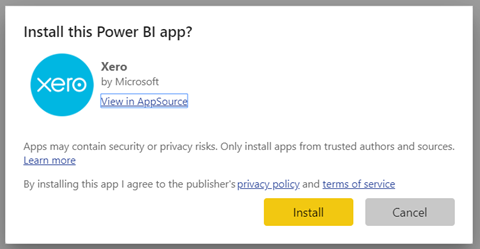

# Ligar-se ao Xero com o Power BI
O Xero é um software de contabilidade online fácil de utilizar e especificamente concebido para as pequenas empresas. Crie visualizações apelativas com base nos dados financeiros do Xero com esta aplicação de modelo do Power BI. O dashboard predefinido inclui muitas métricas para pequenas empresas, como fundo de maneio, receita versus despesa, tendência de perda de lucro, dias de vencimento e retorno sobre o investimento.

Ligue-se à [aplicação de modelo Xero](https://app.powerbi.com/getdata/services/xero) para Power BI ou saiba mais sobre a integração do [Xero e Power BI](https://help.xero.com/Power-BI).

## Como se ligar

[!INCLUDE [powerbi-service-apps-get-more-apps](../includes/powerbi-service-apps-get-more-apps.md)]

3. Selecione **Xero** \> **Obter agora**.
4. Em **Instalar esta aplicação do Power BI?** , selecione **Instalar**.

    

4. No painel **Aplicações**, selecione o mosaico **Xero**.

   

6. Em **Comece já com a sua nova aplicação** , selecione **Ligar**.

    

4. Introduza uma alcunha para a organização associada à sua conta do Xero. Qualquer uma serve, trata-se de uma forma de ajudar os utilizadores com múltiplas organizações Xero a saber onde estão. Veja mais detalhes sobre como [localizar parâmetros](#FindingParams) posteriormente neste artigo.

    

5. Como **Método de Autenticação**, selecione **OAuth**. Quando lhe for pedido, inicie sessão na conta do Xero e selecione a organização à qual se quer ligar. Quando o início de sessão for concluído, selecione **Iniciar sessão** para iniciar o processo de carregamento.
   
    
   
    
6. Após a aprovação, o processo de importação será iniciado automaticamente. Quando concluído, um novo dashboard, relatório e modelo aparecerão no painel de navegação. Selecione o dashboard para ver os seus dados importados.
   
     

**O que se segue?**

* Experimente [fazer uma pergunta na caixa de Perguntas e Respostas](../consumer/end-user-q-and-a.md) na parte superior do dashboard
* [Altere os mosaicos](../create-reports/service-dashboard-edit-tile.md) no dashboard.
* [Selecione um mosaico](../consumer/end-user-tiles.md) para abrir o relatório subjacente.
* Embora o seu conjunto de dados seja agendado para atualizações diárias, pode alterar o agendamento das atualizações ou tentar atualizá-lo a pedido através da opção **Atualizar Agora**

## O que está incluído
O dashboard da aplicação de modelo inclui mosaicos e métricas que abrangem uma variedade de áreas, com relatórios correspondentes para saber mais:  

| Área | Mosaicos de Dashboard | Relatório |
| --- | --- | --- |
| Dinheiro |Fluxo de caixa diário  Entrada de caixa  Saída de caixa  Saldo de encerramento por conta  Saldo de encerramento de hoje |Contas Bancárias |
| Cliente |Vendas faturadas  Vendas faturadas por cliente  Tendência de crescimento de vendas faturadas  Faturas por liquidar  Montantes por receber pendentes  Montantes por receber em atraso |Cliente  Inventário |
| Fornecedor |Compras faturadas  Compras faturadas por fornecedor  Tendência de crescimento de compras faturadas   Faturas em dívida  Montantes a pagar pendentes  Montantes a pagar em atraso |Fornecedores  Inventário |
| Inventário |Montante de vendas mensais por produto |Inventário |
| Lucro e perda |Lucro e perda mensal  Lucro líquido no ano fiscal atual  Lucro líquido no mês atual  Principais contas de despesas |Lucro e perda |
| Balanço |Ativos totais  Passivo total  Capital |Balanço |
| Estado de Funcionamento |Rácio atual  Percentagem de lucro bruto   Retorno total sobre ativos  Rácio de passivo total para capital |Solidez  Glossário e Notas Técnicas |

Este conjunto de dados inclui também as seguintes tabelas para personalizar os seus relatórios e dashboards:  

* Endereços  
* Alertas  
* Saldo Diário de Extrato Bancário  
* Extratos Bancários  
* Contactos  
* Pedidos de Reembolso por Despesas  
* Itens de Linha de Faturas  
* Faturas  
* Itens  
* Fim do Mês  
* Organização  
* Balancete  
* Contas Xero

## Requisitos de sistema
As seguintes funções são necessárias para ter acesso à aplicação de modelo Xero: "Padrão + Relatórios" ou "Assistente".

## Parâmetros de localização
Indique o nome da sua organização para a controlar no Power BI. Um nome específico permite-lhe ligar-se a múltiplas organizações diferentes. Não se pode ligar à mesma organização várias vezes, pois irá interferir com a atualização agendada.   

## Resolução de problemas
* Os utilizadores Xero têm de ter as seguintes funções para acederem à aplicação de modelo Xero para Power BI: "Padrão + Relatórios" ou "Assistente". A aplicação de modelo serve-se de permissões baseadas em utilizadores para aceder aos dados de relatórios através do Power BI.
* Durante o carregamento, os mosaicos no dashboard permanecem num estado genérico de carregamento. Permanecem assim até o carregamento ser totalmente concluído. Se receber uma notificação a indicar que o seu carregamento foi concluído, mas os mosaicos continuam a carregar, experimente atualizar os mosaicos do dashboard através das reticências no canto superior direito do dashboard.
* Se a aplicação de modelo não for atualizada, verifique se se ligou mais do que uma vez à mesma organização no Power BI. O Xero só permite uma única ligação ativa a uma organização, pelo que se se ligar mais de uma vez à mesma organização, poderá ver um erro a indicar que as credenciais são inválidas.  
* Se tiver problemas na ligação da aplicação de modelo Xero para Power BI, como mensagens de erro ou tempos de carregamento lentos, comece por limpar a cache e os cookies ou reiniciar o browser e, em seguida, ligue-se novamente ao Power BI.  

Para outros problemas, envie um pedido em https://support.powerbi.com se o problema persistir.

## Próximos passos
[Introdução ao Power BI](../fundamentals/service-get-started.md)

[Obter dados no Power BI](service-get-data.md)
