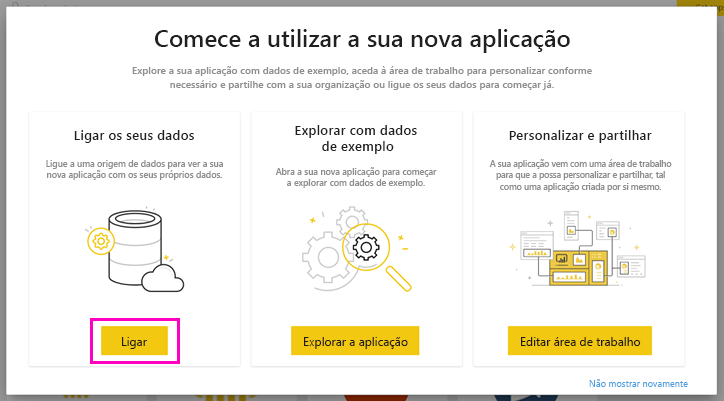
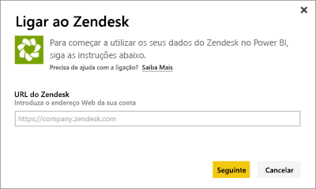
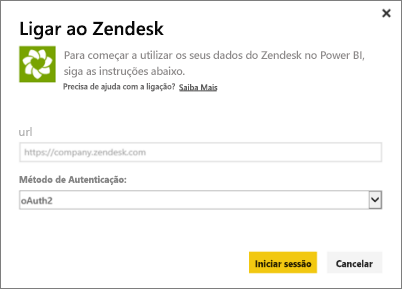
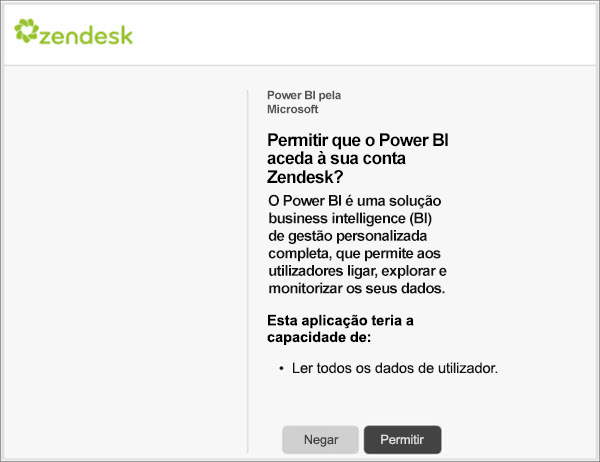
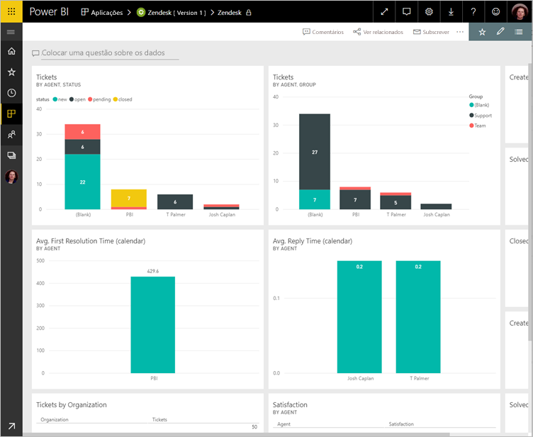
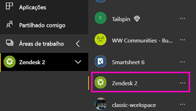
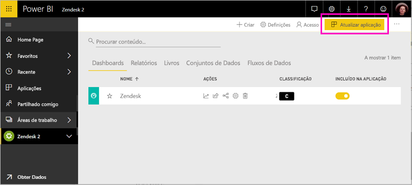

# Ligue-se ao Zendesk com Power BI

Este artigo vai orientá-lo durante a extração de dados da conta do Zendesk através de uma aplicação de modelo do Power BI. A aplicação Zendesk oferece um dashboard e um conjunto de relatórios do Power BI que proporcionam informações sobre os volumes de pedidos e o desempenho do agente. Os dados são atualizados automaticamente uma vez por dia. 

Após ter instalado a aplicação de modelo, poderá personalizar o dashboard e criar relatórios para realçar informações importantes. Em seguida, pode distribuir a área de trabalho como uma aplicação pelos colegas na sua organização.

Ligue-se à [aplicação de modelo Zendesk](https://app.powerbi.com/getdata/services/zendesk) ou leia mais sobre a [Integração do Zendesk](https://powerbi.microsoft.com/integrations/zendesk) com o Power BI.

Após ter instalado a aplicação de modelo, pode alterar o dashboard e o relatório. Em seguida, pode distribuir a área de trabalho como uma aplicação pelos colegas na sua organização.

>[!NOTE]
>Precisa de uma Conta de administrador do Zendesk para se ligar. Mais detalhes sobre os [requisitos](#system-requirements) abaixo.

>[!WARNING]
>Antes de 15 de outubro de 2019, a API Pesquisa de Apoio permitia que fosse recebido um total de 200 000 resultados através da paginação de consultas grandes. Para alinhar a utilização da pesquisa com o seu âmbito pretendido, o Zendesk agora limita o número máximo de resultados devolvidos a 1000 resultados totais, com um máximo de 100 resultados por página. No entanto, o atual conector Zendesk do Power BI ainda pode criar chamadas à API que excedam estes novos limites, o que pode levar a resultados enganadores.

## Como se ligar

[!INCLUDE [powerbi-service-apps-get-more-apps](../includes/powerbi-service-apps-get-more-apps.md)]

3. Selecione **Zendesk** \> **Obter agora**.
4. Em **Instalar esta aplicação do Power BI?** , selecione **Instalar**.
4. No painel **Aplicações**, selecione o mosaico **Zendesk**.

    

6. Em **Comece já com a sua nova aplicação** , selecione **Ligar**.

    

4. Forneça o URL associado à sua conta. O URL tem o formato **https://company.zendesk.com** . Veja detalhes sobre [como encontrar estes parâmetros](#finding-parameters) abaixo.
   
   

5. Quando solicitado, insira as suas credenciais do Zendesk.  Selecione **oAuth 2** como o Mecanismo de Autenticação e clique em **Entrar**. Siga o fluxo de autenticação do Zendesk. (Se já tiver iniciado sessão no Zendesk no browser, poderão não lhe ser pedidas as credenciais).
   
   > [!NOTE]
   > Esta aplicação de modelo requer a ligação com uma Conta de administrador do Zendesk. 
   > 
   
   
6. Clique em **Permitir** para permitir que o Power BI aceda aos seus dados do Zendesk.
   
   
7. Clique em **Conectar** para iniciar o processo de importação. 
8. Depois de o Power BI importar os dados, verá a lista de conteúdos da aplicação Zendesk: um novo dashboard, relatório e conjunto de dados.
9. Selecione o dashboard para iniciar o processo de exploração.

    
   
## Modificar e distribuir a sua aplicação

Acabou de instalar a aplicação de modelo Zendesk, o que significa que também criou uma área de trabalho Zendesk. Na área de trabalho, pode alterar o relatório e o dashboard e, em seguida, distribuí-la como uma *aplicação* pelos colegas na sua organização. 

1. Para ver todos os conteúdos da nova área de trabalho Zendesk, no painel de navegação, selecione **Áreas de trabalho** > **Zendesk**. 

    

    Esta vista é a lista de conteúdos da área de trabalho. No canto superior direito, verá a opção **Atualizar aplicação**. Quanto estiver a postos para distribuir a sua aplicação pelos seus colegas, deve começar por aí. 

    

2. Selecione **Relatórios** e **Conjuntos de dados** para ver os restantes elementos na área de trabalho.

    Leia mais sobre como [distribuir aplicações](../collaborate-share/service-create-distribute-apps.md) pelos seus colegas.

## Requisitos de sistema
É necessária uma Conta de administrador do Zendesk para aceder à aplicação de modelo Zendesk. Se for um agente ou um utilizador final e estiver interessado em ver os dados do Zendesk, adicione uma sugestão e examine o conector Zendesk no [Power BI Desktop](desktop-connect-to-data.md).

## Parâmetros de localização
O URL do Zendesk vai ser igual ao URL que utiliza para se ligar à sua conta do Zendesk. Se não se lembrar do URL do Zendesk, utilize a [ajuda de início de sessão](https://www.zendesk.com/login/) do Zendesk.

## Resolução de problemas
Se estiver com problemas de ligação, verifique o URL do Zendesk e confirme que está a utilizar uma conta de administrador do Zendesk.

## Próximos passos

* [Create the new workspaces in Power BI](../collaborate-share/service-create-the-new-workspaces.md) (Criar as novas áreas de trabalho no Power BI)
* [Instalar e utilizar aplicações no Power BI](../consumer/end-user-apps.md)
* [Ligar a aplicações do Power BI para serviços externos](service-connect-to-services.md)
* Perguntas? [Experimente perguntar à Comunidade do Power BI](https://community.powerbi.com/)
