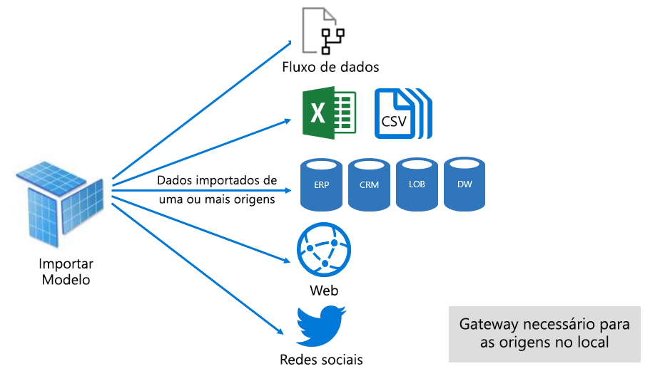
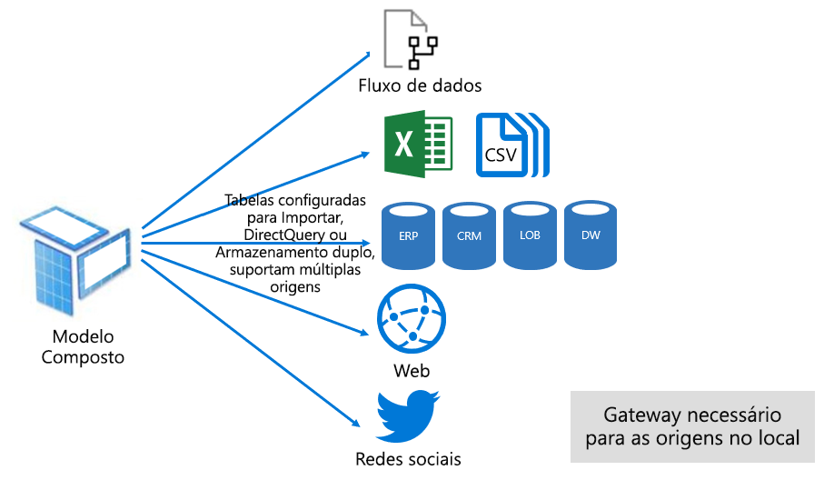

# Modos dos conjuntos de dados no serviço Power BI

Este artigo fornece uma explicação técnica sobre os modos dos conjuntos de dados do Power BI. Aplica-se aos conjuntos de dados que representam uma ligação em direto para um modelo dos Analysis Services alojado externamente e também para modelos desenvolvidos no Power BI Desktop. O artigo realça a lógica de cada modo e os possíveis efeitos nos recursos da capacidade do Power BI.

Os três modos dos conjuntos de dados são:

- [Importação](#import-mode)
- [DirectQuery](#directquery-mode)
- [Composto](#composite-mode)

## Modo de importação

O modo _Importação_ é o modo mais comum utilizado para desenvolver modelos. Este modo proporciona um desempenho extremamente rápido graças à consulta na memória. Também oferece flexibilidade de design para modeladores e suporte para funcionalidades específicas do serviço Power BI (Perguntas e Respostas, Informações Rápidas, etc.). Devido a estes pontos fortes, este é o modo predefinido ao criar uma nova solução do Power BI Desktop.

É importante entender que os dados importados são sempre armazenados no disco. Quando consultados ou atualizados, os dados devem ser totalmente carregados na memória da capacidade do Power BI. Uma vez na memória, os modelos de Importação podem obter resultados de consulta muito rápidos. Também é importante entender que não há nenhum conceito de um modelo de Importação a ser parcialmente carregado na memória.

Quando atualizados, os dados são comprimidos, otimizados e, em seguida, armazenados num disco pelo motor de armazenamento VertiPaq. Quando carregados do disco para a memória, é possível observar uma compressão de 10x. Portanto, é razoável esperar que 10 GB de dados de origem possam ser comprimidos para um tamanho de cerca de 1 GB. O tamanho do armazenamento no disco pode atingir uma redução de 20% do tamanho comprimido (a diferença no tamanho pode ser determinada ao comparar o tamanho do ficheiro do Power BI Desktop com a utilização de memória do Gestor de Tarefas do ficheiro).

A flexibilidade do design pode ser obtida de três formas. Os modeladores de dados podem:

- Integrar dados ao armazená-los em cache a partir de fluxos de dados e origens de dados externas, independentemente do tipo ou formato da origem de dados
- Tirar partido de todo o conjunto de funções da [Linguagem de Fórmula do Power Query](/powerquery-m/) (informalmente denominado como M) ao criar consultas de preparação de dados
- Tirar partido de todo o conjunto de funções de [Data Analysis Expressions (DAX)](/dax/) ao melhorar o modelo com lógica de negócio. Há suporte para colunas calculadas, tabelas calculadas e medidas.

Conforme mostrado na imagem a seguir, um modelo de Importação pode integrar dados de qualquer número de tipos de origens de dados suportadas.

No entanto, embora haja vantagens apelativas associadas aos modelos de Importação, também há desvantagens:

- O modelo inteiro deve ser carregado na memória para que o Power BI o possa consultar, o que pode colocar os recursos da capacidade disponíveis sobre tensão, especialmente à medida que o número e o tamanho dos modelos de Importação crescem.
- Os dados dos modelos são tão atuais quanto a atualização mais recente e, portanto, os modelos de Importação precisam de ser atualizados, normalmente de forma agendada.
- A atualização completa removerá todos os dados de todas as tabelas e voltará a recarregá-los a partir da origem de dados. Esta operação pode ser custosa em termos de tempo e de recursos para o serviço Power BI e as origens de dados.

    > [!NOTE]
    > O Power BI pode obter uma atualização incremental para evitar truncar e recarregar tabelas inteiras. No entanto, este recurso é apenas suportado quando o conjunto de dados é alojado em áreas de trabalho nas capacidades Premium. Para obter mais informações, veja o artigo [Atualização incremental no Power BI Premium](../admin/service-premium-incremental-refresh.md).

De uma perspetiva dos recursos do serviço Power BI, os modelos de Importação requerem:

- Memória suficiente para carregar o modelo quando este é consultado ou atualizado
- Recursos de processamento e recursos de memória adicionais para atualizar dados

## Modo DirectQuery

O modo _DirectQuery_ é uma alternativa ao modo de Importação. Os modelos desenvolvidos no modo DirectQuery não importam os dados. Em vez disso, são compostos apenas por metadados que definem a estrutura do modelo. Quando o modelo é consultado, as consultas nativas são utilizadas para obter os dados da origem de dados subjacente.

Há dois motivos principais para considerar o desenvolvimento de um modelo DirectQuery:

- Quando os volumes de dados são muito grandes, mesmo quando são aplicados [métodos de redução de dados](../guidance/import-modeling-data-reduction.md), para carregar num modelo ou realizar praticamente uma atualização.
- Quando os relatórios e dashboards precisam de fornecer dados “quase em tempo real”, além do que pode ser obtido dentro dos limites da atualização agendada (os limites de atualização agendada são oito vezes por dia para a capacidade partilhada e 48 vezes por dia para uma capacidade Premium).

Há várias vantagens associadas aos modelos DirectQuery:

- Não se aplicam los imites de tamanho do modelo de Importação.
- Os modelos não requerem atualização.
- Os utilizadores de relatórios têm acesso aos dados mais recentes ao interagir com segmentações e filtros de relatórios. Além disso, os utilizadores de relatórios podem atualizar o relatório inteiro para recuperar os dados atuais.
- Os relatórios em tempo real podem ser desenvolvidos com a funcionalidade [Atualização automática da página](../create-reports/desktop-automatic-page-refresh.md).
- Os mosaicos do dashboard, quando baseados em modelos DirectQuery, podem ser atualizados automaticamente, com uma frequência de 15 minutos

No entanto, há algumas limitações associadas aos modelos DirectQuery:

- As fórmulas DAX estão limitadas apenas a funções que podem ser transpostas para consultas nativas compreendidas pela origem de dados. As tabelas calculadas não são suportadas.
- As funcionalidades de Insights Rápidos não são suportadas

Da perspetiva dos recursos do serviço Power BI, os modelos DirectQuery exigem:

- Memória mínima para carregar o modelo (apenas metadados) quando este é consultado
- Por vezes, o serviço Power BI deve utilizar recursos significativos do processador para gerar e processar consultas enviadas à origem de dados. Quando essa situação ocorre, o débito pode ser afetado, especialmente quando vários utilizadores consultam o modelo em simultâneo.

Para obter mais informações, veja [Utilizar o Direct Query no Power BI Desktop](desktop-use-directquery.md).

## Modo Composto

O modo _Composto_ pode misturar os modos de Importação e DirectQuery ou integrar várias origens de dados do DirectQuery. Os modelos desenvolvidos no modo Composto suportam a configuração do modo de armazenamento para cada tabela de modelo. Este modo também suporta tabelas calculadas (definidas com DAX).

O modo de armazenamento da tabela pode ser configurado como Importação, DirectQuery ou ambos. Uma tabela configurada como o modo de Armazenamento duplo pode utilizar o modo Importação e DirectQuery e essa definição permite que o serviço Power BI determine o modo mais eficiente a ser utilizado numa base de consulta a consulta.

Os modelos Compostos esforçam-se para fornecer o melhor dos modos de Importação e DirectQuery. Quando configurados adequadamente, podem combinar o alto desempenho da consulta de modelos na memória com a capacidade de recuperar dados quase em tempo real da origem de dados.

Os modeladores de dados que desenvolvem modelos Compostos vão provavelmente configurar tabelas de tipo dimensional no modo de Importação ou de Armazenamento duplo e as tabelas de factos no modo DirectQuery. Para obter mais informações acerca das funções da tabela do modelo, veja [Compreender o que é um esquema de estrela e qual a importância para o Power BI](../guidance/star-schema.md).

Por exemplo, considere um modelo com uma tabela de tipo dimensional **Produto** no modo Duplo e uma tabela de factos **Vendas** no modo DirectQuery. A tabela **Produto** pode ser consultada de forma eficiente e rápida na memória para compor uma segmentação de relatório. A tabela **Vendas** também pode ser consultada no modo DirectQuery com a tabela **Produto** relacionada. A última consulta pode ativar a criação de uma única consulta SQL nativa eficiente que une as tabelas **Produto** e **Vendas** e filtra pelos valores da segmentação.

Para obter mais informações, veja [Utilizar modelos compostos no Power BI Desktop](../transform-model/desktop-composite-models.md).

## Passos seguintes

- [Conjuntos de dados no serviço Power BI](service-dataset-modes-understand.md)
- [Modo de armazenamento no Power BI Desktop](../transform-model/desktop-storage-mode.md)
- [Utilizar o DirectQuery no Power BI](desktop-directquery-about.md)
- [Utilizar modelos compostos no Power BI Desktop](../transform-model/desktop-composite-models.md)
- Mais perguntas? [Experimente perguntar à Comunidade do Power BI](https://community.powerbi.com/)
