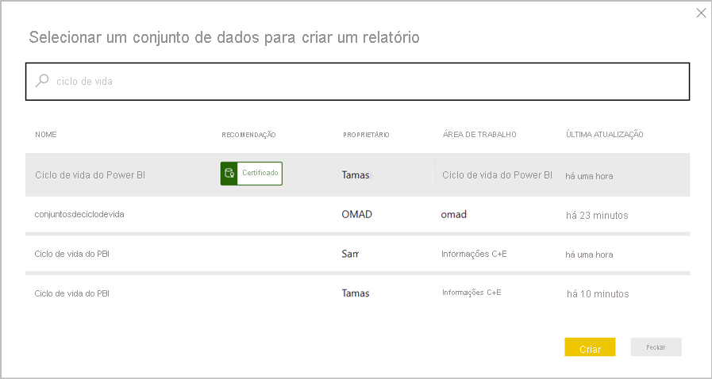

# Introdução aos conjuntos de dados em áreas de trabalho (Pré-visualização)

O business intelligence é uma atividade de colaboração. É importante estabelecer conjuntos de dados padronizados para servirem como as únicas versões dos dados. Assim sendo, a deteção e reutilização destes conjuntos de dados padronizados é vital. Quando os modeladores de dados da sua organização criam e partilham conjuntos de dados otimizados, os criadores de relatórios podem utilizá-los como ponto de partida para compilarem relatórios precisos. Assim, a sua organização tem dados consistentes para a tomada de decisões e uma boa cultura de dados.

No Power BI, os criadores de conjuntos de dados podem controlar quem tem acesso aos seus dados através da [permissão de compilação](service-datasets-build-permissions.md). Os criadores de conjuntos de dados também podem *certificar* ou *promover* os mesmos, para que outras pessoas possam detetá-los. Desta forma, os autores de relatórios sabem quais são os conjuntos de dados oficiais e de alta qualidade e podem utilizá-los onde quer que criem no Power BI. Os administradores de inquilinos têm uma nova definição de inquilino para [controlar a utilização de conjuntos de dados em várias áreas de trabalho](service-datasets-admin-across-workspaces.md).

## Partilha de conjuntos de dados e a nova experiência de área de trabalho

A compilação de relatórios baseados em conjuntos de dados em diferentes áreas de trabalho e a cópia de relatórios para diferentes áreas de trabalho estão fortemente relacionadas com a [nova experiência de área de trabalho](../collaborate-share/service-create-the-new-workspaces.md):

- No serviço, quando abre o catálogo de conjuntos de dados numa nova experiência de área de trabalho, são apresentados conjuntos de dados em A Minha Área de Trabalho e em outras novas experiências de área de trabalho. 
- Quando abre o catálogo de conjuntos de dados numa área de trabalho clássica, são apenas apresentados conjuntos de dados nessa área de trabalho, e não noutras.
- No Power BI Desktop, pode publicar relatórios do Live Connect em diferentes áreas de trabalho, desde que os seus conjuntos de dados estejam em novas experiências de área de trabalho.
- Ao copiar relatórios em diferentes áreas de trabalho, a área de trabalho de destino tem de ser uma nova experiência de área de trabalho.

## Detetar conjuntos de dados (Pré-visualização)

Ao compilar um relatório com base num conjunto de dados existente, o primeiro passo é ligar ao conjunto de dados no serviço Power BI ou Power BI Desktop. Saiba mais sobre a [deteção de conjuntos de dados de diferentes áreas de trabalho (Pré-visualização)](service-datasets-discover-across-workspaces.md)

## Copiar um relatório

Quando encontrar um relatório do seu agrado numa área de trabalho ou numa aplicação, poderá fazer uma cópia do mesmo e depois modificá-lo para que este se ajuste às suas necessidades. Não tem de se preocupar com a criação do modelo de dados. Já terá sido criado automaticamente. Além disso, é muito mais fácil modificar um relatório existente do que começar do zero. Saiba mais sobre a [cópia de relatórios](service-datasets-copy-reports.md).

## Permissão de compilação de conjuntos de dados

Com o tipo de Permissão de compilação, se for um criador de conjuntos de dados, poderá determinar quem na sua organização pode compilar novos conteúdos nos seus conjuntos de dados. As pessoas com Permissão de compilação também podem compilar novo conteúdo no conjunto de dados, como folhas do Excel, fora do Power BI, através da funcionalidade Analisar no Excel, de XMLA e de exportação. Saiba mais sobre a [permissão de compilação](service-datasets-build-permissions.md).

## Promoção e certificação

Se criar um conjunto de dados de que outras pessoas podem tirar partido, poderá facilitar a sua deteção ao [promover o seu conjunto de dados](service-datasets-promote.md). Também pode pedir que os peritos na sua organização [certifiquem o seu conjunto de dados](service-datasets-certify.md).

## Licensing

As funcionalidades e experiências específicas baseadas nas capacidades de conjuntos de dados partilhados são licenciadas de acordo com os respetivos cenários existentes. Por exemplo:

- Geralmente, a deteção e a ligação a conjuntos de dados partilhados está disponível para todas as pessoas – não é uma funcionalidade reservada ao Premium.
- Os utilizadores sem licenças Pro só poderão utilizar os conjuntos de dados entre áreas de trabalho para a criação de relatórios se esses conjuntos de dados residirem em A Minha Área de Trabalho pessoal dos utilizadores ou numa área de trabalho com suporte Premium. A mesma restrição de licenciamento aplica-se quer criem relatórios no Power BI Desktop, quer no serviço Power BI.
- A cópia de relatórios entre áreas de trabalho exige uma licença Pro.
- A cópia de relatórios de uma aplicação exige uma licença Pro, tal como era necessário para pacotes de conteúdos organizacionais.
- A promoção e a certificação de conjuntos de dados exige uma licença Pro.

## Considerações e limitações

- Enquanto publicador de aplicações, tem de garantir que o seu público tem acesso aos conjuntos de dados fora da área de trabalho. Caso contrário, os utilizadores encontrarão problemas quando interagirem com a aplicação: os relatórios não abrirão sem o acesso aos conjuntos de dados e os mosaicos do dashboard serão mostrados como bloqueados. Além disso, os utilizadores não poderão abrir a aplicação se o primeiro item na navegação for um relatório sem acesso ao conjunto de dados.
- A compilação de um relatório baseado num conjunto de dados numa área de trabalho diferente exige a nova experiência de área de trabalho a ambos os níveis: tanto o relatório como o conjunto de dados têm de estar numa nova experiência de área de trabalho. Só pode copiar relatórios numa nova experiência de área de trabalho para outra nova experiência de área de trabalho. Não é possível copiar relatórios para áreas de trabalho clássicas nem para A Minha Área de Trabalho. 
- Numa área de trabalho clássica, ao detetar conjuntos de dados, apenas são apresentados os conjuntos nessa área de trabalho.
- Por predefinição, a opção “Publicar na Web” não funciona para um relatório baseado num conjunto de dados partilhado.
- Se duas pessoas forem membros de uma área de trabalho que está a aceder a um conjunto de dados partilhado, é possível que apenas uma delas consiga ver o conjunto de dados relacionado na área de trabalho. Apenas as pessoas com pelo menos acesso de leitura ao conjunto de dados podem ver o conjunto de dados partilhado. 

## Próximos passos

- [Promote datasets](service-datasets-promote.md) (Promover conjuntos de dados)
- [Certify datasets](service-datasets-certify.md) (Certificar conjuntos de dados)
- [Govern the use of datasets across workspaces](service-datasets-admin-across-workspaces.md) (Controlar a utilização de conjuntos de dados em várias áreas de trabalho)
- Perguntas? [Experimente perguntar à Comunidade do Power BI](https://community.powerbi.com/)
