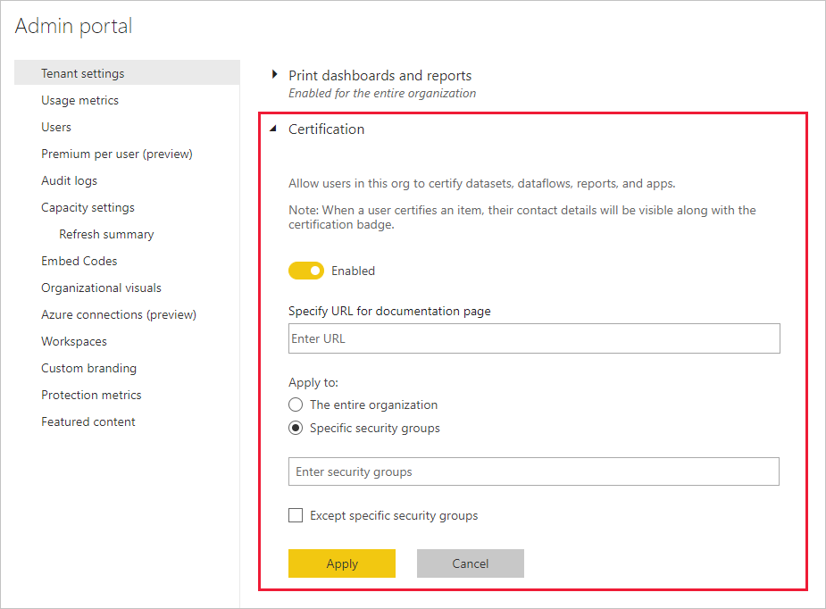

# Controlar a utilização de conjuntos de dados em áreas de trabalho

A utilização de conjuntos de dados em áreas de trabalho é uma excelente forma de fomentar a cultura e a democratização de dados numa organização. Ainda assim, se for um administrador do Power BI, poderá querer restringir o fluxo de informações no seu inquilino do Power BI. Com a definição de inquilinos **Utilizar conjuntos de dados em áreas de trabalho**, poderá restringir total ou parcialmente a reutilização de conjuntos de dados por grupos de segurança.

Se desativar esta definição, serão estes os efeitos nos criadores de relatórios:

- O botão para copiar relatórios em áreas de trabalho não estará disponível. 
- Num relatório baseado num conjunto de dados partilhado, o botão **Editar relatório** não estará disponível.
- No serviço Power BI, a experiência de deteção só apresentará conjuntos de dados na área de trabalho atual.
- No Power BI Desktop, a experiência de deteção só apresentará conjuntos de dados de áreas de trabalho das quais é membro.
- No Power BI Desktop, se os utilizadores abrirem um ficheiro .pbix com uma ligação em direto a um conjunto de dados fora de quaisquer áreas de trabalho das quais sejam membros, verão uma mensagem de erro a pedir-lhe para ligarem a um conjunto de dados diferente.

## Fornecer uma ligação para o processo de certificação

Enquanto administrador do Power BI, pode fornecer um URL para a ligação **Saiba mais** na página de definições **Recomendação**.  Para obter detalhes, veja [Ativar a certificação de conteúdo](../admin/service-admin-setup-certification.md). Esta ligação pode direcionar os utilizadores para documentação acerca do seu processo de certificação. Se não fornecer um destino para a ligação **Saiba mais**, esta irá direcionar os utilizadores, por predefinição, para o artigo [Endossar os seus conteúdos](../collaborate-share/service-endorse-content.md).

## Próximos passos

- [Utilizar conjuntos de dados em áreas de trabalho](service-datasets-across-workspaces.md)
- Perguntas? [Experimente perguntar à Comunidade do Power BI](https://community.powerbi.com/)
