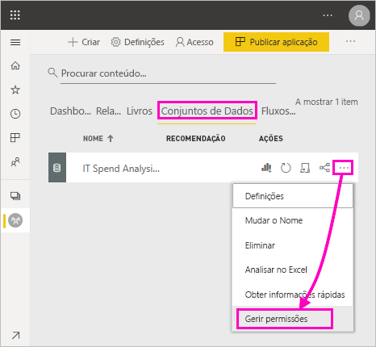
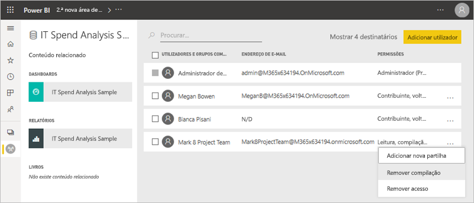
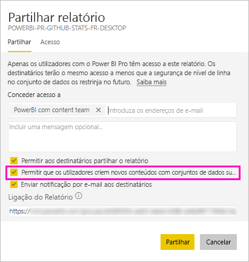
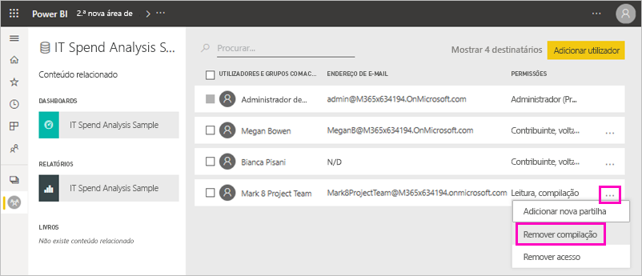
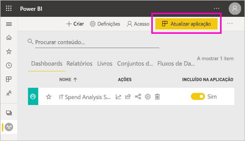
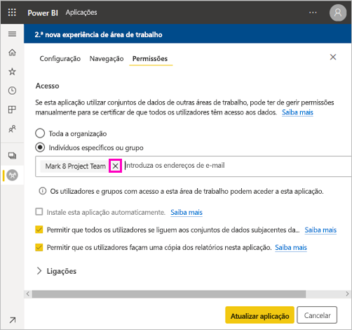
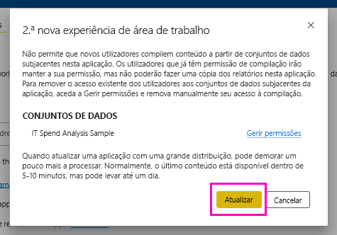

# Permissão de criação para conjuntos de dados partilhados

Ao criar um relatório no Power BI Desktop, os dados nesse relatório são armazenados num *modelo de dados*. Ao publicar os seus relatórios no serviço Power BI, está também a publicar os dados como um *conjunto de dados*. Pode conceder a outras pessoas *permissão de compilação* para esse relatório, para que possam descobrir e reutilizar o conjunto de dados que partilhou. Este artigo explica como pode controlar o acesso aos dados com a permissão de compilação.

A permissão de compilação aplica-se aos conjuntos de dados. Quando concede aos utilizadores a permissão de compilação, os mesmos podem compilar novos conteúdos no conjunto de dados, como relatórios, dashboards, mosaicos afixados das Perguntas e Respostas e Deteção de Informações. 

Os utilizadores também precisam de obter permissões de compilação para trabalhar com os dados *fora* do Power BI:

- Para exportar os dados subjacentes.
- Para criar novos conteúdos no conjunto de dados, tal como com a função [Analisar no Excel](../collaborate-share/service-analyze-in-excel.md).
- Para aceder aos dados através do ponto final de XMLA.

## Formas de conceder a Permissão de compilação

Pode conceder a Permissão de compilação para um conjunto de dados de várias formas diferentes:

- Os membros de uma área de trabalho com, pelo menos, uma função de Contribuidor têm automaticamente Permissão de compilação para os conjunto de dados nessa área de trabalho e permissão para copiar um relatório. Leia mais sobre as [funções nas novas áreas de trabalho](../collaborate-share/service-new-workspaces.md#roles-in-the-new-workspaces).
 
- Os membros da área de trabalho em que o conjunto de dados reside podem atribuir a permissão a utilizadores ou grupos de segurança específicos no Centro de permissões. Se for um membro da área de trabalho, selecione **Mais opções** (…) junto a um conjunto de dados > **Gerir Permissões**.

    

    Será apresentado o centro de permissões deste conjunto de dados, em que poderá definir e alterar as permissões.

    

- Um administrador ou membro da área de trabalho em que o conjunto de dados reside pode decidir, durante a publicação da aplicação, dar também aos utilizadores com permissão para a aplicação a permissão de compilação dos conjuntos de dados subjacentes. Veja [Partilhar um conjunto de dados](service-datasets-share.md) para obter mais informações.

- Imagine que tem as permissões para Compilar e Partilhar novamente num conjunto de dados. Quando partilhar um relatório ou dashboard compilado nesse conjunto de dados, poderá especificar que os destinatários também obtêm a Permissão de compilação no conjunto de dados subjacente.

    

Pode remover a Permissão de compilação atribuída a uma pessoa num conjunto de dados. Se o fizer, estas ainda irão poder ver o relatório compilado com o conjunto de dados partilhado, mas já não poderão editá-lo. Veja a secção seguinte para obter mais informações.

## Remover a Permissão de compilação num conjunto de dados

No futuro, talvez seja necessário remover a Permissão de compilação para alguns utilizadores de um conjunto de dados partilhado. 

1. Numa área de trabalho, aceda à página da lista **Conjuntos de dados**. 
1. Selecione **Mais opções** (...) junto ao conjunto de dados > **Gerir permissão**.

    

1. Selecione **Mais opções** (...) junto a um nome > **Remover compilação**.

    

    Os utilizadores ainda poderão ver o relatório compilado com o conjunto de dados partilhado, mas já não poderão editá-lo.

### Remover a Permissão de compilação num conjunto de dados numa aplicação

Imagine que distribuiu uma aplicação de uma área de trabalho para um grupo de pessoas. Mais tarde, decide remover o acesso à aplicação para algumas pessoas. Remover o acesso à aplicação não remove automaticamente as permissões para compilar e partilhar novamente. Esse é um passo adicional. 

1. Na página da lista de uma área de trabalho, selecione **Atualizar aplicação**. 

    

1. No separador **Permissões**, selecione o **X** para eliminar a pessoa ou o grupo. 

    
1. Selecione **Atualizar aplicação**.

    Verá uma mensagem a explicar que precisa de aceder a **Gerir permissões** para remover a Permissão de compilação para os utilizadores com atual acesso. 

    

1. Selecione **Atualizar**.

1. Numa área de trabalho, aceda à pagina da lista **Conjuntos de dados**. 
1. Selecione **Mais opções** (...) junto ao conjunto de dados > **Gerir permissão**.

    

1. Selecione **Mais opções** (...) junto ao nome > **Remover compilação**.

    

    Os utilizadores ainda poderão ver o relatório compilado com o conjunto de dados partilhado, mas já não poderão editá-lo.

## Permissões mais granulares

A Permissão de compilação foi introduzida no Power BI em junho de 2019, como um complemento das permissões existentes, Leitura e Partilhar novamente. Todos os utilizadores que já tinham a Permissão de leitura nos conjuntos de dados nessa altura, através das permissões da aplicações, partilha ou acesso a áreas de trabalho, também receberam a Permissão de compilação nestes conjuntos de dados. Os utilizadores obtiveram a permissão de compilação automaticamente, porque a permissão de leitura já lhes concedia o direito de compilação de novos conteúdos com base no conjunto de dados, através da funcionalidade Analisar no Excel ou Exportar.

Com esta permissão de compilação mais granular, pode selecionar quem apenas pode ver os conteúdos no relatório ou dashboard existente e quem pode criar conteúdos ligados aos conjuntos de dados subjacentes.

Se o seu conjunto de dados estiver a ser utilizado por um relatório fora da área de trabalho do mesmo, não poderá eliminá-lo. Se tentar eliminar o conjunto de dados, será apresentada uma mensagem de erro.

Pode remover a Permissão de compilação. Se o fizer, as pessoas a quem revogar permissões ainda irão poder ver o relatório, mas já não irão poder editá-lo ou exportar dados subjacentes. Os utilizadores com permissão só de leitura continuarão a poder exportar dados resumidos. 

## Próximos passos

- [Utilizar conjuntos de dados em áreas de trabalho](service-datasets-across-workspaces.md)
- Perguntas? [Experimente perguntar à Comunidade do Power BI](https://community.powerbi.com/)
