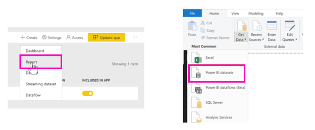
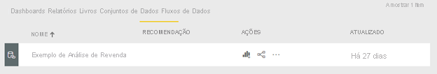

# Criar relatórios baseados em conjuntos de dados de diferentes áreas de trabalho

Aprenda a criar relatórios nas suas próprias áreas de trabalho, com base em conjuntos de dados noutras áreas de trabalho. Pode criar um relatório com base num conjunto de dados existente a partir do Power BI Desktop ou do serviço Power BI, em A Minha Área de Trabalho ou numa [nova experiência de área de trabalho](../collaborate-share/service-create-the-new-workspaces.md).

- No serviço Power BI: **Obter dados** > **Conjuntos de dados publicados**.
- No Power BI Desktop: **Obter dados** > **Conjuntos de dados do Power BI**.

    
   
Em ambos os casos, a experiência de deteção de conjuntos de dados é iniciada na caixa de diálogo **Selecionar um conjunto de dados para criar um relatório**. Serão apresentados todos os conjuntos de dados a que tem acesso, independentemente da respetiva localização:

Irá reparar que o primeiro conjunto de dados é etiquetado como **Promovido**. Iremos explicar o motivo para tal mais tarde, na secção [Encontrar um conjunto de dados recomendado](#find-an-endorsed-dataset) deste artigo.

Os conjuntos de dados apresentados nesta lista cumprem pelo menos uma das seguintes condições:

- O conjunto de dados está numa das novas experiências de área de trabalho e é um membro dessa área de trabalho. Veja a secção [Considerations and limitations](service-datasets-across-workspaces.md#considerations-and-limitations) (Considerações e limitações).
- Tem permissão de compilação para o conjunto de dados, que está numa nova experiência de área de trabalho.
- O conjunto de dados está em A Minha Área de Trabalho.

> [!NOTE]
> Se for um utilizador gratuito, só serão apresentados conjuntos de dados em A Minha Área de Trabalho ou só serão apresentados conjuntos de dados para os quais tem permissão de compilação e que estão em áreas de trabalho de capacidade Premium.

Ao clicar em **Criar**, cria uma ligação em direto ao conjunto de dados e a experiência de criação de relatórios é apresentada com todo o conjunto de dados disponível. Se não tiver feito uma cópia do conjunto de dados, este irá permanecer na sua localização original. Pode utilizar todas as tabelas e medidas presentes no conjunto de dados para criar os seus próprios relatórios. As restrições de segurança ao nível da linha (RLS) no conjunto de dados estarão em vigor, pelo que apenas serão apresentados dados que tem permissão para ver com base na sua função de RLS.

Pode guardar o relatório na área de trabalho atual no serviço Power BI ou publicar o relatório numa área de trabalho do Power BI Desktop. O Power BI irá criar automaticamente uma entrada na lista de conjuntos de dados, se o relatório for baseado num conjunto de dados fora da área de trabalho. O ícone deste conjunto de dados é diferente do ícone dos conjuntos de dados na área de trabalho: 

Desta forma, os membros da área de trabalho podem perceber quais os relatórios e dashboards que utilizam conjuntos de dados fora da mesma. A entrada apresenta informações sobre o conjunto de dados e algumas ações de seleção.

## Encontrar um conjunto de dados recomendado

Há dois tipos de conjuntos de dados recomendados. Os proprietários de conjuntos de dados podem *promover* um conjunto de dados que lhe recomendam. Além disso, o administrador de inquilinos do Power BI pode nomear peritos para *certificarem* conjuntos de dados para todos utilizarem na sua organização. Os conjuntos de dados promovidos e certificados apresentam *destaques* que vê ao procurar um conjunto de dados e na lista de conjuntos de dados numa área de trabalho. O nome da pessoa que certificou um conjunto de dados é apresentado numa descrição durante a experiência de deteção do conjunto de dados; paire o cursor sobre a etiqueta **Certificado** e veja-o.

- No serviço Power BI: **Obter dados** > **Conjuntos de dados publicados**.
- No Power BI Desktop: **Obter dados** > **Conjuntos de dados do Power BI**.

    Na caixa de diálogo **Selecionar um conjunto de dados**, os conjuntos de dados recomendados estão no topo da lista por predefinição. 

    

## Próximos passos

- [Utilizar conjuntos de dados em áreas de trabalho](service-datasets-across-workspaces.md)
- Perguntas? [Experimente perguntar à Comunidade do Power BI](https://community.powerbi.com/)
