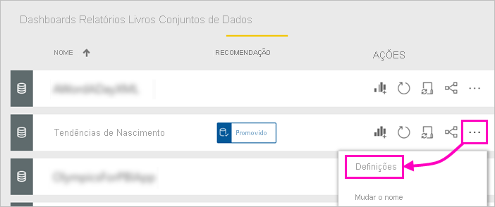

# Promover o seu conjunto de dados (Pré-visualização)

Agora, os criadores de relatórios do Power BI podem ter acesso a muitos conjuntos de dados diferentes, pelo que as empresas têm de os orientar na obtenção de conjuntos de dados fiáveis e de alta qualidade. O Power BI fornece duas formas de *recomendar* conjuntos de dados:

- **Promoção**: Enquanto proprietário de um conjunto de dados, pode promover os seus próprios conjuntos de dados quando estiverem prontos para serem disponibilizados para o público. Qualquer membro da área de trabalho com permissões de Escrita pode promover um conjunto de dados. Não existem restrições sobre quem pode promover um conjunto de dados. A promoção apoia a divulgação colaborativa dos conjuntos de dados nas organizações. Este artigo aborda a promoção do seu conjunto de dados.
- **Certificação**: pode pedir a certificação de um conjunto de dados promovido. Um determinado grupo de utilizadores definido na definição de administração de inquilinos **Certificação de Conjunto de Dados** decide quais são os conjuntos de dados a certificar. Veja [Certify datasets (Preview)](service-datasets-certify.md) (Certificar conjuntos de dados [Pré-visualização]) para obter mais informações.

## Promover um conjunto de dados

O seu conjunto de dados terá de estar numa nova experiência de área de trabalho no serviço Power BI, quando estiver pronto para o promover.

1. Aceda à lista de conjuntos de dados na área de trabalho.
 
1. Selecione **Mais opções** (...) e selecione **Definições**.

    

1. Expanda **Recomendação** > selecione **Promovido**.

    

1. Selecione **Aplicar**.

## Pedir a certificação do conjunto de dados

O seu administrador de inquilinos identificou pessoas que podem certificar conjuntos de dados na sua organização. Pode pedir a estas pessoas que certifiquem o seu conjunto de dados.

1. Dê permissões de membro para a área de trabalho em que o conjunto de dados se encontra ao certificador.

1. Na secção **Recomendação** das **Definições**, **Certificado** está a cinzento.

1. Selecione a ligação **Saiba mais**.

    O seu administrador de inquilinos do Power BI pode configurar a ligação **Saiba mais** para aceder a uma localização especificada com detalhes acerca do processo de certificação no seu inquilino.   Se o administrador não tiver personalizado a ligação **Saiba mais**, esta irá direcionar os utilizadores para o artigo de [certificação de conjuntos de dados](service-datasets-certify.md) por predefinição.

## Próximos passos

* Leia o artigo [Using datasets across workspaces](service-datasets-across-workspaces.md) (Utilizar conjuntos de dados em áreas de trabalho)
* Perguntas? [Experimente perguntar à Comunidade do Power BI](https://community.powerbi.com/)
