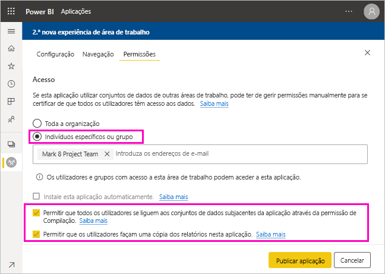
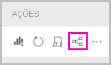
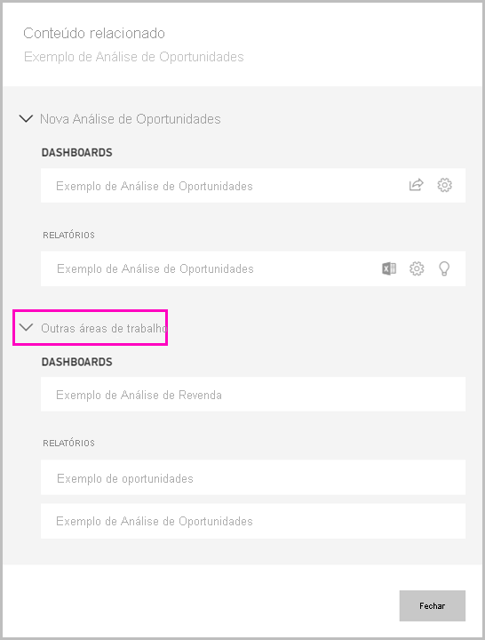

# Partilhar um conjunto de dados (pré-visualização)

Enquanto criador de *modelos de dados* no Power BI Desktop, está a criar *conjuntos de dados* que pode distribuir no serviço Power BI. Em seguida, outros criadores de relatórios podem utilizar os seus conjuntos de dados como base para os seus próprios relatórios. Neste artigo, ficará a saber como partilhar os conjuntos de dados. Para saber como conceder e remover acesso aos conjuntos de dados partilhados, leia sobre a [Permissão de compilação](service-datasets-build-permissions.md).

## Passos para partilhar o seu conjunto de dados

1. Comece por criar um ficheiro .pbix com um modelo de dados no Power BI Desktop. Se planear dar este conjunto de dados a outras pessoas para compilarem relatórios, não terá de criar um relatório no ficheiro .pbix.

    A melhor prática é guardar o ficheiro .pbix num grupo do Office 365.

1. Publique o ficheiro .pbix numa [nova experiência de área de trabalho](../collaborate-share/service-create-the-new-workspaces.md) no serviço Power BI.
    
    Assim, outros membros desta área de trabalho poderão criar relatórios noutras áreas de trabalho, com base neste conjunto de dados.

1. Também pode [publicar uma aplicação](../collaborate-share/service-create-distribute-apps.md) a partir desta área de trabalho. Quando o fizer, irá especificar quem tem permissões e o que estas pessoas podem fazer na página **Permissões**.

    > [!NOTE]
    > Se selecionar **Toda a organização**, nenhuma pessoa na organização terá Permissão de compilação. Este problema já é conhecido. Em vez disto, especifique os endereços de e-mail em **Pessoas ou grupos específicos**.  Se quiser que toda a organização tenha Permissão de compilação, especifique um alias de e-mail para toda a organização.

    

1. Selecione **Publicar aplicação** ou **Atualizar aplicação**, se a aplicação já estiver publicada.

## Controlar a utilização do seu conjunto de dados

Quando tiver um conjunto de dados partilhado na sua área de trabalho, poderá ter de saber que relatórios noutras áreas de trabalho se baseiam no mesmo.

1. Na vista de lista Conjuntos de dados, selecione **Ver relacionados**.

    

1. A caixa de diálogo **Conteúdos relacionados** apresenta todos os itens relacionados. Nesta lista, são apresentados os itens relacionados nesta área de trabalho e em **Outras áreas de trabalho**.
 
    

## Próximas etapas

- [Use datasets across workspaces (Preview)](service-datasets-across-workspaces.md) (Utilizar conjuntos de dados em várias áreas de trabalho [Pré-visualização])
- Dúvidas? [Experimente perguntar à Comunidade do Power BI](https://community.powerbi.com/)
