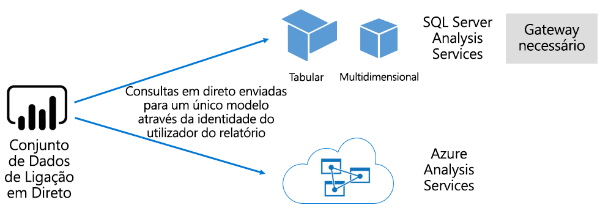

# Conjuntos de dados no serviço Power BI

Este artigo fornece uma explicação técnica dos conjuntos de dados do Power BI.

## Tipos de conjuntos de dados

Os conjuntos de dados do Power BI representam uma origem de dados pronta para relatórios e visualização. Há cinco tipos de conjuntos de dados diferentes, criados das seguintes maneiras:

- Ligar a um modelo de dados existente que não está alojado numa capacidade do Power BI
- Carregar um ficheiro do Power BI Desktop que contém um modelo
- Carregar um livro do Excel (com uma ou mais tabelas do Excel e/ou um modelo de dados do livro) ou carregar um ficheiro CSV (valores separados por vírgula)
- Utilizar o serviço Power BI para criar um [conjunto de dados push](../developer/automation/walkthrough-push-data.md)
- Utilizar o serviço Power BI para criar um [conjunto de dados de transmissão em fluxo ou transmissão em fluxo híbrida](service-real-time-streaming.md)

Exceto para os conjuntos de dados de transmissão em fluxo, o conjunto de dados representa um modelo que tira partido das tecnologias de modelação avançadas do [Analysis Services](/analysis-services/analysis-services-overview).

> [!NOTE]
> Na nossa documentação, os termos _conjuntos de dados_ e _modelos_ são por vezes utilizados de forma intercambiável. Por norma, do ponto de vista de um serviço Power BI, é referido como um **conjunto de dados** e, de um ponto de vista de desenvolvimento, é referido como um **modelo**. No contexto da nossa documentação, ambos significam a mesma coisa.

### Modelos alojados externamente

Há dois tipos de modelos alojados externamente: O SQL Server Analysis Services e o [Azure Analysis Services](/azure/analysis-services/analysis-services-overview).

Ligar-se a um modelo do SQL Server Analysis Services implica a instalação do [gateway de dados no local](service-gateway-onprem.md), seja no local ou na infraestrutura como serviço (IaaS) alojada na VM. O Azure Analysis Services não exige um gateway.

Muitas vezes, ligar-se ao Analysis Services faz sentido quando há investimentos de modelos existentes, normalmente, fazem parte de um armazém de dados empresarial (EDW). O Power BI pode fazer uma _ligação em direto_ para o Analysis Services, ao impor permissões de dados com a identidade do utilizador do relatório do Power BI. No SQL Server Analysis Services, tantos os modelos multidimensionais (cubos) como os modelos tabulares são suportados. Conforme mostrado na imagem a seguir, um conjunto de dados de ligação em direto transmite consultas aos modelos alojados externamente.

### Modelos desenvolvidos no Power BI Desktop

O Power BI Desktop, uma aplicação cliente destinada ao desenvolvimento do Power BI, pode ser utilizado para desenvolver um modelo. O modelo é efetivamente um modelo tabular do Analysis Services. Os modelos podem ser desenvolvidos através da importação de dados dos fluxos de dados, que podem ser integrados a origens de dados externas. Embora os detalhes da forma como a modelação pode ser obtida estejam fora do âmbito deste artigo, é importante compreender que há três tipos diferentes, ou _modos_, de modelos que podem ser desenvolvidos com o Power BI Desktop. Estes modos determinam se os dados são importados para o modelo ou se permanecem na origem de dados. Os três modos são: Importar, DirectQuery e Composto. Para obter mais informações sobre cada modo, veja o artigo [Modos dos conjuntos de dados no serviço Power BI](service-dataset-modes-understand.md).

Os modelos alojados externamente e os modelos de ambiente de trabalho do Power BI podem impor a RLS (segurança ao nível da linha) para limitar os dados que são recuperados para um determinado utilizador. Por exemplo, os utilizadores atribuídos ao grupo de segurança **Vendedores** apenas podem ver os dados de relatórios para as regiões de vendas às quais estão atribuídos. As funções RLS são _dinâmicas_ ou _estáticas_. As funções dinâmicas são filtradas pelo utilizador do relatório, enquanto as funções estáticas aplicam os mesmos filtros para todos os utilizadores atribuídos à função. Para obter mais informações, veja [Segurança ao nível da linha (RLS) com o Power BI](../admin/service-admin-rls.md).

### Modelos dos livros do Excel

Criar conjuntos de dados com base em [livros do Excel](service-excel-workbook-files.md) ou [ficheiros CSV](service-comma-separated-value-files.md) resulta na criação automática de um modelo. As tabelas do Excel e os dados CSV são importados para criar tabelas de modelos, enquanto um modelo de dados do livro do Excel é transposto para criar um modelo do Power BI. Em todos os casos, os dados dos ficheiros são importados para um modelo.

## Resumo

As distinções, em seguida, podem ser feitas em relação aos conjuntos de dados do Power BI que representam modelos:

- Estão alojados na serviço Power BI ou são alojados externamente pelo Analysis Services.
- Podem armazenar dados importados, emitir pedidos de consulta pass-through para origens de dados subjacentes ou utilizar uma combinação de ambos.

Veja a seguir um resumo dos factos importantes sobre os conjuntos de dados do Power BI que representam modelos:

- Os modelos alojados do SQL Server Analysis Services requerem um gateway para executar as consultas de ligação em direto.
- Os modelos alojados do Power BI que importam dados:
  - Têm de ser totalmente carregados para a memória para que possam ser consultados.
  - Requerem uma atualização para manter os dados atuais e devem envolver gateways quando os dados de origem não estiverem acessíveis diretamente pela Internet.
- Os modelos alojados do Power BI que utilizam o modo de armazenamento do [DirectQuery](desktop-directquery-about.md) requerem conectividade com os dados de origem. Quando o modelo é consultado, o Power BI emite consultas para os dados de origem para recuperar os dados atuais. Este modo deve envolver gateways quando os dados de origem não estiverem acessíveis diretamente pela Internet.
- Os modelos podem impor regras RLS ao impor filtros para limitar o acesso aos dados por parte de determinados utilizadores.

## Considerações

Para implementar e gerir com êxito o Power BI, é importante compreender onde é que os modelos são alojados, o modo de armazenamento, as dependências nos gateways, o tamanho dos dados importados e o tipo de atualização e a sua frequência. Estas configurações podem ter um impacto significativo nos recursos de capacidade do Power BI. Além disso, o próprio design do modelo, incluindo as consultas de preparação de dados, as relações e os cálculos, tudo isto vem aumentar a combinação de considerações.

Também é importante compreender que os modelos de Importação alojados do Power BI podem ser atualizados de acordo com uma agenda ou acionados a pedido por um utilizador no serviço Power BI.

## Próximos passos

- [Modos dos conjuntos de dados no serviço Power BI](service-dataset-modes-understand.md)
- Mais perguntas? [Experimente perguntar à Comunidade do Power BI](https://community.powerbi.com/)
