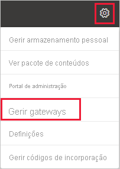
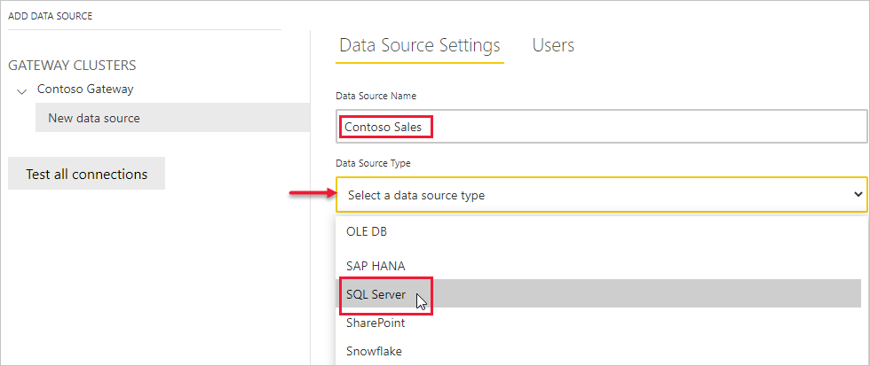
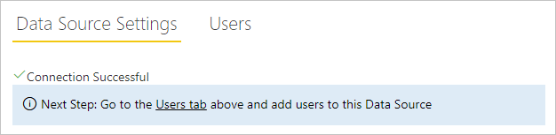
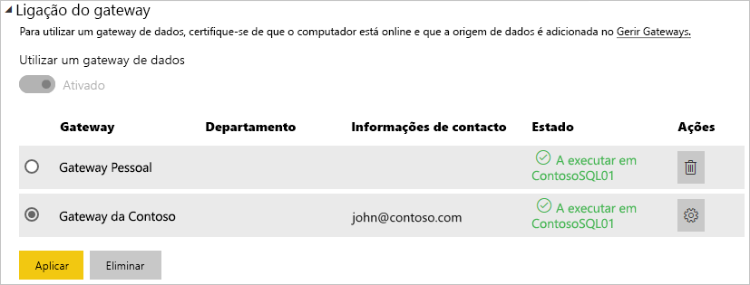
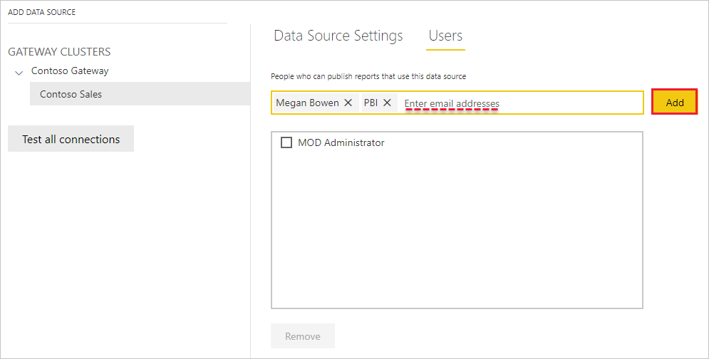
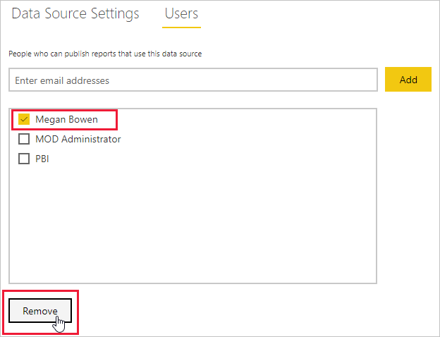

# Adicionar ou remover uma origem de dados do gateway

[!INCLUDE [gateway-rewrite](../includes/gateway-rewrite.md)]

O Power BI suporta várias [origens de dados no local](power-bi-data-sources.md), sendo que cada uma delas tem os seus próprios requisitos. Pode utilizar um gateway para uma única origem de dados ou para múltiplas origens de dados. Neste exemplo, mostramos-lhe como pode adicionar o SQL Server como uma origem de dados. Os passos são semelhantes para outras origens de dados.

A maioria das operações de gestão de origens de dados também pode ser executada com APIs. Para obter mais informações, veja [APIs REST (Gateways)](/rest/api/power-bi/gateways).

Se ainda não tiver um gateway instalado, veja [Instalar um gateway de dados no local](/data-integration/gateway/service-gateway-install) para começar a trabalhar.

## Adicionar uma origem de dados

1. No cabeçalho da página no serviço Power BI, selecione **Definições**  > **Gerir gateways**.

    

2. Selecione um gateway e, em seguida, **Adicionar origem de dados**. Pode selecionar o texto do cabeçalho **ADICIONAR ORIGEM DE DADOS** ou pairar o cursor junto à entrada do gateway para revelar o menu com mais opções.

    

3. Atribua um nome à sua origem de dados e, em seguida, selecione o **Tipo de Origem de Dados**. Neste exemplo, vamos selecionar SQL Server.

    

4. Introduza informações sobre a origem de dados. Para o SQL Server, forneça o **Servidor** e a **Base de dados**.

    

5. Selecione um **Método de Autenticação** para utilizar ao ligar à origem de dados. Para o SQL Server, selecione **Windows** ou **Básica** (Autenticação do SQL). Introduza as credenciais da sua origem de dados.

   :::image type="content" source="media/service-gateway-data-sources/basic-auth.png" alt-text="Definições de autenticação Básica.":::

    > [!NOTE]
    > Se o método de autenticação selecionado for o OAuth, qualquer consulta que esteja em execução durante mais tempo do que a política de expiração do token de OAuth pode falhar.

6. Em **Definições avançadas**, pode configurar o [Início de Sessão Único (SSO)](service-gateway-sso-overview.md) para a sua origem de dados. 

    

    Pode configurar **Utilizar SSO através de Kerberos para consultas de DirectQuery** ou **Utilizar SSO através de Kerberos para consultas de DirectQuery e Importação** para Relatórios baseados no DirectQuery e **Utilizar SSO através de Kerberos para consultas de DirectQuery e Importação** para Relatórios baseados na Atualização.

    Se utilizar a opção **Utilizar SSO através de Kerberos para consultas de DirectQuery** e utilizar esta origem de dados para um Relatório baseado no DirectQuery, serão utilizadas as credenciais do utilizador que inicia sessão no serviço Power BI. Para um Relatório baseado na Atualização, utilizará as credenciais que introduzir nos campos **Nome de utilizador** e **Palavra-passe**.

    Ao utilizar a opção **Utilizar SSO através de Kerberos para consultas de DirectQuery e Importação**, não precisa de fornecer quaisquer credenciais. Se utilizar esta origem de dados para um Relatório baseado no DirectQuery, será utilizado o utilizador que está mapeado ao utilizador do Azure Active Directory que inicia sessão no serviço Power BI.  Para um Relatório baseado na Atualização, utilizará o contexto de segurança do proprietário do conjunto de dados

    > [!NOTE]
    >O SSO para Consultas de Importação só está disponível para a lista de origens de dados SSO através da [delegação restrita de Kerberos](service-gateway-sso-kerberos.md).

7. Em **Advanced settings** (Definições avançadas), configure opcionalmente o [privacy level](https://support.office.com/article/Privacy-levels-Power-Query-CC3EDE4D-359E-4B28-BC72-9BEE7900B540) (nível de privacidade) da sua origem de dados (não se aplica ao [DirectQuery](desktop-directquery-about.md)).

    :::image type="content" source="media/service-gateway-data-sources/privacy-level.png" alt-text="Seleções de nível de privacidade.":::

8. Selecione **Adicionar**. Aparece a mensagem *Ligação Efetuada com Êxito* se o processo for bem-sucedido.

    

Agora, pode utilizar esta origem de dados para incluir dados do SQL Server nos seus dashboards e relatórios do Power BI.

## Remover uma origem de dados

Pode remover uma origem de dados se já não a utilizar. A remoção de uma origem de dados interrompe todos os dashboards e relatórios que dependem da mesma.

Para remover uma origem de dados, aceda à origem de dados e, em seguida, selecione **Remover** no menu com mais opções. O menu com mais opções é apresentado quando paira o cursor junto ao nome da origem de dados.

## Utilizar a origem de dados para a atualização agendada ou o DirectQuery

Depois de criar a origem de dados, esta fica disponível para utilização com as ligações do DirectQuery ou através da atualização agendada. Pode saber mais sobre a configuração da atualização agendada em [Configurar a atualização agendada](refresh-scheduled-refresh.md).

> [!NOTE]
>Os nomes do servidor e da base de dados têm de corresponder entre o Power BI Desktop e a origem de dados adicionada ao gateway de dados no local.

A ligação entre o conjunto de dados e a origem de dados no gateway é baseada no nome do servidor e no nome da base de dados. Estes nomes têm de corresponder. Por exemplo, se fornecer um endereço IP ao nome do servidor, no Power BI Desktop, terá de utilizar o endereço IP para a origem de dados na configuração do gateway. Se utilizar *SERVIDOR\INSTÂNCIA*, no Power BI Desktop, terá de utilizar o mesmo na origem de dados configurada para o gateway.

Se estiver listado no separador **Utilizadores** da origem de dados configurada no gateway e o nome do servidor e da base de dados corresponderem, verá o gateway como uma opção a utilizar com a atualização agendada.

> [!WARNING]
> Se o conjunto de dados contiver múltiplas origens de dados, cada origem de dados terá de ser adicionada ao gateway. Se uma ou mais origens de dados não forem adicionadas ao gateway, não verá o gateway como disponível para a atualização agendada.

### Limitações

O OAuth é um esquema de autenticação suportado apenas para conectores personalizados com o gateway de dados no local. Não é possível adicionar outras origens de dados que exigem o OAuth. Se o seu conjunto de dados tiver uma origem de dados que exige o OAuth e a mesma não for um conector personalizado, não conseguirá utilizar o gateway para a atualização agendada.

## Gerir utilizadores

Depois de adicionar uma origem de dados a um gateway, pode dar aos utilizadores e aos grupos de segurança com o e-mail ativado acesso a origens de dados específicas (não a todo o gateway). A lista de acesso da origem de dados controla apenas quem está autorizado a publicar relatórios que incluam dados da origem de dados. Os proprietários de relatórios podem criar dashboards, pacotes de conteúdos e aplicações e, em seguida, partilhar esses itens com outros utilizadores.

Também pode conceder aos utilizadores e grupos de segurança acesso administrativo ao gateway.

> [!NOTE]
> Os utilizadores com acesso à origem de dados podem associar conjuntos de dados à origem de dados e ligar-se, com base nas opções de segurança (credenciais armazenadas ou SSO) selecionadas enquanto criam uma origem de dados.

### Adicionar utilizadores a uma origem de dados

1. No cabeçalho da página no serviço Power BI, selecione **Definições**  > **Gerir gateways**.

2. Selecione a origem de dados à qual quer adicionar utilizadores.

3. Selecione **Utilizadores** e introduza os utilizadores e grupos de segurança com capacidade para correio da sua organização que vão aceder à origem de dados selecionada. Selecione **Adicionar** e o nome do membro adicionado será acrescentado à lista de pessoas que podem publicar relatórios que utilizam esta origem de dados.

    

Lembre-se de que tem de adicionar utilizadores a cada uma das origens de dados às quais quer conceder acesso. Cada origem de dados tem uma lista de utilizadores separada. Adicione utilizadores a cada origem de dados separadamente.

### Remover utilizadores de uma origem de dados

No separador **Utilizadores** da origem de dados, pode remover utilizadores e grupos de segurança que utilizam esta origem de dados.

## Armazenar credenciais encriptadas na cloud

Ao adicionar uma origem de dados ao gateway, tem de fornecer credenciais para essa origem de dados. Todas as consultas à origem de dados serão executadas com estas credenciais. As credenciais são encriptadas com segurança. Estas utilizam encriptação simétrica, para que não possam ser desencriptadas na cloud antes de serem armazenadas na mesma. As credenciais são enviadas para o computador que executa o gateway no local, onde são desencriptadas quando as origens de dados são acedidas.

## Relação dos tipos de origens de dados disponíveis

Para obter mais informações sobre que origens de dados são suportadas no gateway de dados no local, veja [origens de dados do Power BI](power-bi-data-sources.md).

## Próximos passos

* [Gerir a sua origem de dados – Analysis Services](service-gateway-enterprise-manage-ssas.md)
* [Gerir a sua origem de dados – SAP HANA](service-gateway-enterprise-manage-sap.md)
* [Gerir a sua origem de dados – SQL Server](service-gateway-enterprise-manage-sql.md)
* [Gerir a sua origem de dados – Oracle](service-gateway-onprem-manage-oracle.md)
* [Gerir a origem de dados – atualização importada/agendada](service-gateway-enterprise-manage-scheduled-refresh.md)
* [Diretrizes para implementar um gateway de dados](service-gateway-deployment-guidance.md)

Mais perguntas? Experimente perguntar à [Comunidade do Power BI](https://community.powerbi.com/).
