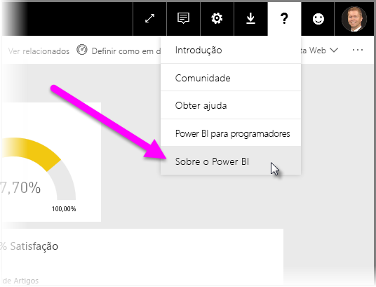

# Diretrizes para implementar um gateway de dados para o Power BI

[!INCLUDE [gateway-rewrite](../includes/gateway-rewrite.md)]

Este artigo fornece orientações e considerações para implementar um gateway de dados para o Power BI no seu ambiente de rede.

Para obter informações sobre como transferir, instalar, configurar e gerir o gateway de dados no local, veja [O que é um gateway de dados no local?](/data-integration/gateway/service-gateway-onprem). Também pode saber mais sobre o gateway de dados no local e sobre o Power BI ao aceder ao [Blogue do Microsoft Power BI](https://powerbi.microsoft.com/blog/) e ao site da [Comunidade do Microsoft Power BI](https://community.powerbi.com/).

## Considerações sobre a instalação do gateway de dados no local

Antes de instalar o gateway de dados no local para o seu serviço cloud do Power BI, existem algumas considerações que deve ter em atenção. As seguintes secções descrevem essas considerações.

### Número de utilizadores

O número de utilizadores que utilizam um relatório que execute o gateway é uma métrica importante para decidir o local de instalação do gateway. Eis algumas questões a considerar:

* Os utilizadores utilizam estes relatórios em períodos diferentes do dia?
* Que tipos de ligações utilizam (DirectQuery ou Importação)?
* Todos os utilizadores utilizam o mesmo relatório?

Se todos os utilizadores acederem a um determinado relatório ao mesmo tempo todos os dias, certifique-se de que instala o gateway num computador capaz de lidar com todos os pedidos. Veja as secções seguintes sobre contadores de desempenho e requisitos mínimos que podem ajudar a determinar se um computador é adequado.

Uma restrição no Power BI permite apenas *um* gateway por *relatório*. Mesmo que um relatório se baseie em múltiplas origens de dados, todas estas origens de dados têm de passar por um único gateway. Se um dashboard se basear em *múltiplos* relatórios, pode utilizar um gateway dedicado para cada relatório. Deste modo, pode distribuir a carga de gateway entre os múltiplos relatórios que contribuem para esse dashboard individual.

### Tipo de ligação

O Power BI oferece dois tipos de ligações: DirectQuery e Importação. Nem todas as origens de dados suportam os dois tipos de ligação. Muitos fatores podem contribuir para escolher um em detrimento de outro, tais como requisitos de segurança, desempenho, limites de dados e tamanhos de modelos de dados. Para saber mais sobre os tipos de ligações e as origens de dados suportadas, veja a [lista de tipos de origens de dados disponíveis](service-gateway-data-sources.md#list-of-available-data-source-types).

A utilização do gateway pode variar consoante o tipo de ligação utilizada. Por exemplo, tente separar as origens de dados do DirectQuery de origens de dados de atualização agendada sempre que possível. A suposição é que estão em relatórios diferentes e podem ser separadas. Separar as origens impede que o gateway tenha milhares de pedidos DirectQuery em fila ao mesmo tempo que a atualização agendada de um modelo de dados de grande dimensão utilizado para o dashboard principal da empresa. 

Eis o que considerar para cada opção:

* **Atualização agendada**: consoante o tamanho da consulta e o número de atualizações que ocorrem por dia, pode optar por manter os requisitos mínimos de hardware recomendados ou atualizar para um computador de desempenho superior. Se uma determinada consulta não estiver dividida, as transformações ocorrem no computador do gateway. Como resultado, o computador do gateway tem mais RAM disponível.

* **DirectQuery**: deve ser enviada uma consulta sempre que qualquer utilizador abrir o relatório ou analisar os dados. Se prever que um número superior a 1000 utilizadores vai aceder aos dados em simultâneo, certifique-se de que o seu computador tem componentes de hardware robustos e capazes. Um maior número de núcleos de CPU irá resultar num melhor débito de uma ligação DirectQuery.

Para obter os requisitos de instalação do computador, veja os [requisitos de instalação](/data-integration/gateway/service-gateway-install#requirements) do gateway de dados no local.

### Localização

A localização da instalação do gateway pode ter um impacto considerável no desempenho da sua consulta. Tente certificar-se de que o gateway, as localizações da origem de dados e o inquilino do Power BI estão o mais próximo possível entre si para minimizar a latência de rede. Para determinar a localização de inquilino do Power BI, no serviço Power BI, selecione o ícone **?** no canto superior direito. Em seguida, selecione **Sobre o Power BI**.

Se tenciona utilizar o gateway do Power BI com o Azure Analysis Services, certifique-se de que as regiões de dados em ambos correspondem. Para obter mais informações sobre como definir regiões de dados para múltiplos serviços, veja [este vídeo](https://guyinacube.com/2018/01/power-bi-azure-analysis-services-gateway-data-region/).

## Próximos passos

* [Configurar definições de proxy](/data-integration/gateway/service-gateway-proxy)  
* [Resolver problemas de gateways – Power BI](service-gateway-onprem-tshoot.md)  
* [FAQ do gateway de dados no local – Power BI](service-gateway-power-bi-faq.md)  

Mais perguntas? Experimente perguntar à [Comunidade do Power BI](https://community.powerbi.com/).
