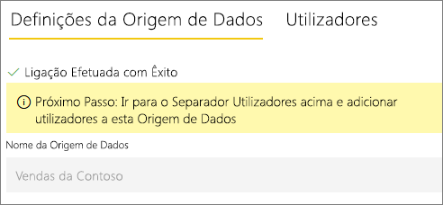

# Gerir a sua origem de dados – SAP HANA

[!INCLUDE [gateway-rewrite](../includes/gateway-rewrite.md)]

Depois de [instalar o gateway de dados no local](/data-integration/gateway/service-gateway-install), tem de [adicionar origens de dados](service-gateway-data-sources.md#add-a-data-source) que podem ser utilizadas com o gateway. Este artigo aborda como trabalhar com gateways e origens de dados do SAP HANA que são utilizados para uma atualização agendada ou para o DirectQuery.

## Adicionar uma origem de dados

Para obter mais informações sobre como adicionar uma origem de dados, veja [Adicionar uma origem de dados](service-gateway-data-sources.md#add-a-data-source). Em **Tipo de Origem de Dados**, selecione **SAP HANA**.

Após selecionar o tipo de origem de dados SAP HANA, preencha as informações **Servidor**, **Nome de utilizador** e **Palavra-passe** referentes à origem de dados.

> [!NOTE]
> Todas as consultas à origem de dados serão executadas com essas credenciais. Para saber mais sobre a forma como as credenciais são armazenadas, veja [Armazenar credenciais encriptadas na cloud](service-gateway-data-sources.md#store-encrypted-credentials-in-the-cloud).

Depois de preencher todos os campos, selecione **Adicionar.** Pode agora utilizar esta origem de dados para a atualização agendada ou para o DirectQuery num servidor SAP HANA no local. Verá *Ligação Estabelecida com Êxito* se tiver êxito.

### Definições avançadas

Opcionalmente, pode configurar o nível de privacidade da sua origem de dados. Esta definição controla a forma como os dados podem ser combinados. É utilizada apenas para a atualização agendada. A definição do nível de privacidade não se aplica ao DirectQuery. Para saber mais sobre os níveis de privacidade da sua origem de dados, veja [Níveis de privacidade (Power Query)](https://support.office.com/article/Privacy-levels-Power-Query-CC3EDE4D-359E-4B28-BC72-9BEE7900B540).

## Utilizar a origem de dados

Depois de criar a origem de dados, esta fica disponível para utilização com as ligações do DirectQuery ou através da atualização agendada.

> [!NOTE]
> Os nomes do servidor e da base de dados têm de corresponder entre o Power BI Desktop e a origem de dados no gateway de dados no local.

A ligação entre o conjunto de dados e a origem de dados no gateway baseia-se no nome do servidor e no nome da base de dados. Estes nomes têm de corresponder. Por exemplo, se fornecer um endereço IP ao nome do servidor, no Power BI Desktop, terá de utilizar o endereço IP para a origem de dados na configuração do gateway. Se utilizar *SERVIDOR\INSTÂNCIA* no Power BI Desktop, também terá de o utilizar na origem de dados configurada para o gateway.

Este requisito aplica-se ao DirectQuery e à atualização agendada.

### Utilizar a origem de dados com ligações do DirectQuery

Certifique-se de que os nomes do servidor e da base de dados no Power BI Desktop e na origem de dados configurada para o gateway correspondem. Também terá de se certificar de que o utilizador está listado no separador **Utilizadores** da origem de dados para publicar conjuntos de dados do DirectQuery. Para o DirectQuery, a seleção ocorre no Power BI Desktop quando importa dados pela primeira vez. Para obter mais informações sobre como utilizar o DirectQuery, veja [Utilizar o DirectQuery no Power BI Desktop](desktop-use-directquery.md).

Depois de publicar, a partir do Power BI Desktop ou de **Obter Dados**, os seus relatórios devem começar a funcionar. Poderá demorar vários minutos, depois de criar a origem de dados no gateway, para a ligação ser utilizável.

### Utilizar a origem de dados com a atualização agendada

Se estiver listado no separador **Utilizadores** da origem de dados configurada no gateway e o nome do servidor e da base de dados corresponderem, verá o gateway como uma opção a utilizar com a atualização agendada.

## Próximas etapas

* [Resolução de problemas do gateway de dados no local](/data-integration/gateway/service-gateway-tshoot)
* [Resolver problemas de gateways – Power BI](service-gateway-onprem-tshoot.md) 

Mais perguntas? Experimente perguntar à [Comunidade do Power BI](https://community.powerbi.com/).
