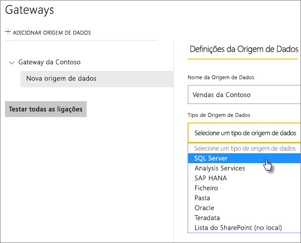
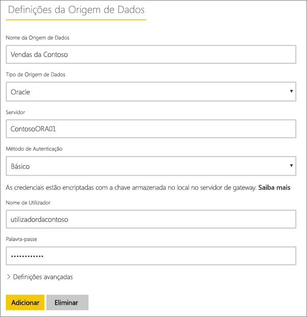
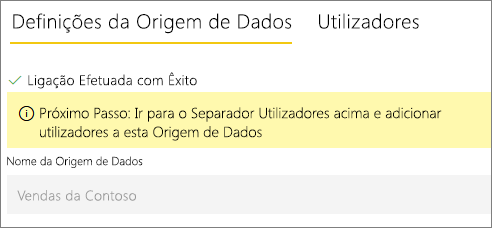
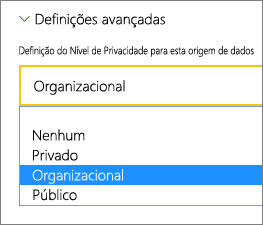
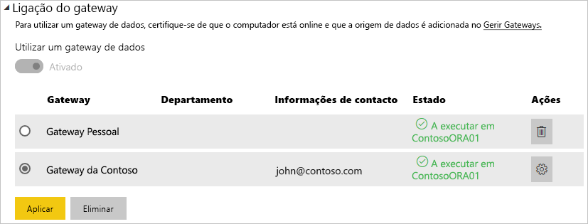

# Gerir a origem de dados – Atualização importada/agendada

[!INCLUDE [gateway-rewrite](../includes/gateway-rewrite.md)]

Depois de [instalar o gateway de dados no local](/data-integration/gateway/service-gateway-install), tem de [adicionar origens de dados](service-gateway-data-sources.md#add-a-data-source) que podem ser utilizadas com o gateway. Este artigo analisa como trabalhar com gateways e origens de dados utilizadas para atualização agendada em vez do DirectQuery ou de ligações dinâmicas.

## Adicionar uma origem de dados

Para obter mais informações sobre como adicionar uma origem de dados, veja [Adicionar uma origem de dados](service-gateway-data-sources.md#add-a-data-source). Selecione um tipo de origem de dados.

Todos os tipos de origens de dados relacionadas podem ser utilizadas para a atualização agendada com o gateway de dados no local. O Analysis Services, o SQL Server e o SAP HANA podem ser utilizados para a atualização agendada ou o DirectQuery/ligações em direto.

Em seguida, preencha as informações sobre a origem de dados, que incluem as informações de origem e as credenciais utilizadas para aceder à origem de dados.

> [!NOTE]
> Todas as consultas à origem de dados irão ser executadas ao utilizar estas credenciais. Para saber mais sobre a forma como as credenciais são armazenadas, veja [Armazenar credenciais encriptadas na cloud](service-gateway-data-sources.md#store-encrypted-credentials-in-the-cloud).

Para obter uma lista dos tipos de origens de dados que podem ser utilizados com as atualizações agendadas, veja [Lista de tipos de origens de dados disponíveis](service-gateway-data-sources.md#list-of-available-data-source-types).

Depois de preencher todos os campos, selecione **Adicionar.** Pode agora utilizar esta origem de dados para atualização agendada com os seus dados no local. Verá *Ligação Estabelecida com Êxito* se tiver êxito.

### Definições avançadas

Opcionalmente, pode configurar o nível de privacidade da sua origem de dados. Esta definição controla a forma como os dados podem ser combinados. É utilizada apenas para a atualização agendada. Para saber mais sobre os níveis de privacidade da sua origem de dados, veja [Níveis de privacidade (Power Query)](https://support.office.com/article/Privacy-levels-Power-Query-CC3EDE4D-359E-4B28-BC72-9BEE7900B540).

## Utilizar a origem de dados para a atualização agendada

Depois de criar a origem de dados, esta fica disponível para utilização com as ligações do DirectQuery ou através da atualização agendada.

> [!NOTE]
> Os nomes do servidor e da base de dados têm de corresponder entre o Power BI Desktop e a origem de dados no gateway de dados no local.

A ligação entre o conjunto de dados e a origem de dados no gateway baseia-se no nome do servidor e no nome da base de dados. Estes nomes têm de corresponder. Por exemplo, se fornecer um endereço IP ao nome do servidor, no Power BI Desktop, terá de utilizar o endereço IP para a origem de dados na configuração do gateway. Se utilizar *SERVIDOR\INSTÂNCIA* no Power BI Desktop, também terá de o utilizar na origem de dados configurada para o gateway.

Se estiver listado no separador **Utilizadores** da origem de dados configurada no gateway e o nome do servidor e da base de dados corresponderem, verá o gateway como uma opção a utilizar com a atualização agendada.

> [!WARNING]
> Se o conjunto de dados contém várias origens de dados, cada origem de dados tem de ser adicionada ao gateway. Se uma ou mais origens de dados não forem adicionadas ao gateway, não verá o gateway como disponível para a atualização agendada.

## Limitações

O OAuth não é um esquema de autenticação suportado com o gateway de dados no local. Não é possível adicionar origens de dados que exigem o OAuth. Se o conjunto de dados tiver uma origem de dados que exige o OAuth, não poderá utilizar o gateway para a atualização agendada.

## Próximas etapas

* [Resolução de problemas do gateway de dados no local](/data-integration/gateway/service-gateway-tshoot)
* [Resolver problemas de gateways – Power BI](service-gateway-onprem-tshoot.md)

Mais perguntas? Experimente perguntar à [Comunidade do Power BI](https://community.powerbi.com/).
