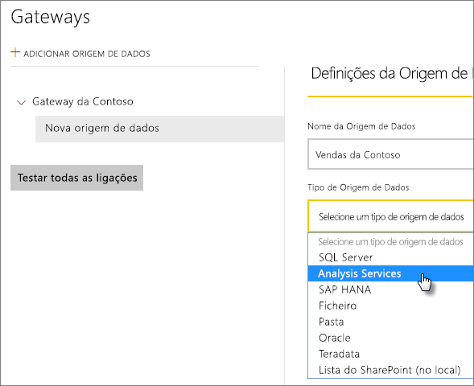
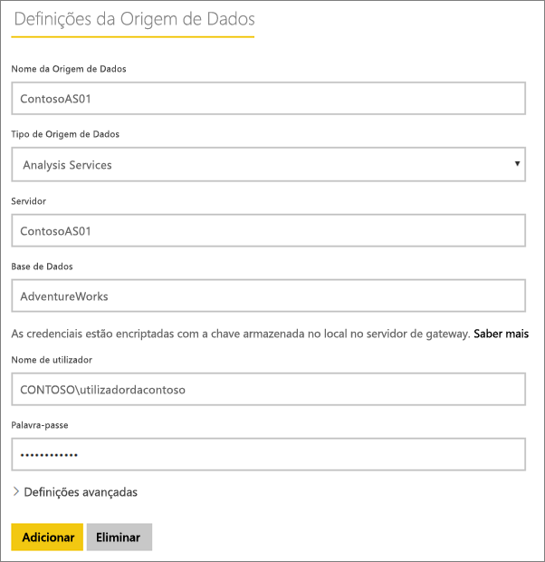
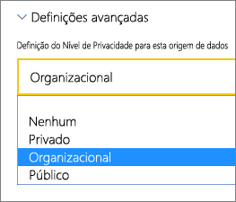
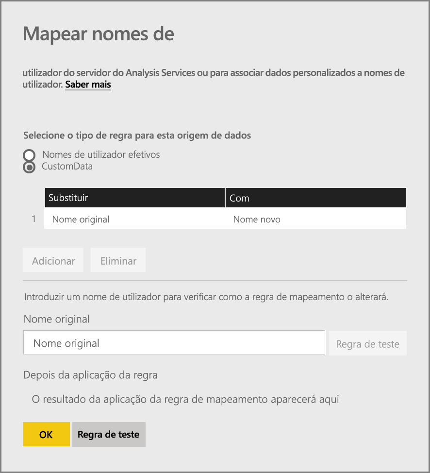
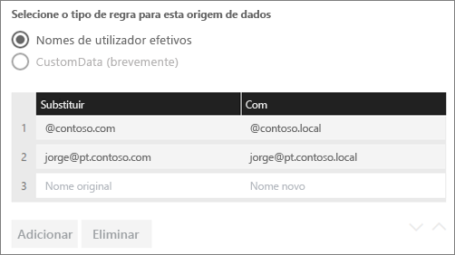
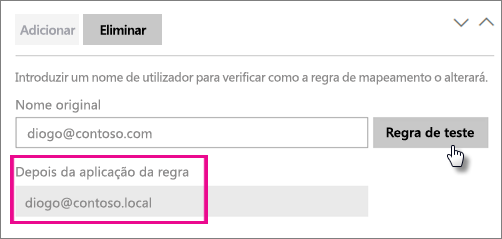
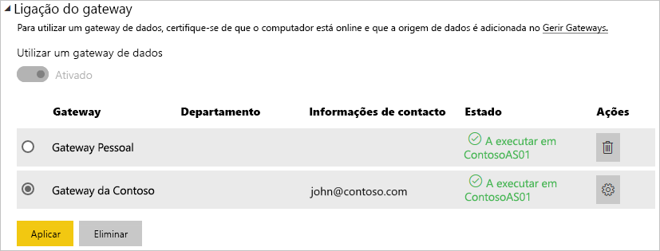

# <a name="manage-your-data-source---analysis-services"></a>Gerir a sua origem de dados – Analysis Services

[!INCLUDE [gateway-rewrite](../includes/gateway-rewrite.md)]

Depois de [instalar o gateway de dados no local](/data-integration/gateway/service-gateway-install), tem de [adicionar origens de dados](service-gateway-data-sources.md#add-a-data-source) que podem ser utilizadas com o gateway. Este artigo aborda como trabalhar com gateways e origens de dados do SQL Server Analysis Services (SSAS) que são utilizados para uma atualização agendada ou ligações em direto.

Para saber mais sobre como configurar uma ligação em direto ao Analysis Services, [veja este vídeo.](https://www.youtube.com/watch?v=GPf0YS-Xbyo&feature=youtu.be)

> [!NOTE]
> Se tiver uma origem de dados do Analysis Services, terá de instalar o gateway num computador associado ao mesmo domínio que o seu servidor do Analysis Services.

## <a name="add-a-data-source"></a>Adicionar uma origem de dados

Para obter informações sobre como adicionar uma origem de dados, veja [Adicionar uma origem de dados](service-gateway-data-sources.md#add-a-data-source). Se estiver a ligar a um servidor multidimensional ou de tabela, selecione **Analysis Services** para o **Tipo de Origem de Dados**.



Preencha as informações sobre a origem de dados, que incluem o **Servidor** e a **Base de Dados**. As informações que introduzir em **Nome de Utilizador** e **Palavra-passe** serão utilizadas pelo gateway para ligar à instância do Analysis Services.

> [!NOTE]
> A conta do Windows inserida deve ter permissões de Administrador do Servidor para a instância à qual está a ligar. Se a palavra-passe desta conta estiver configurada para expirar, os utilizadores poderão receber um erro de ligação se a palavra-passe não estiver atualizada para a origem de dados. Para saber mais sobre a forma como as credenciais são armazenadas, veja [Armazenar credenciais encriptadas na cloud](service-gateway-data-sources.md#store-encrypted-credentials-in-the-cloud).



Depois de preencher todos os campos, selecione **Adicionar.** Agora, pode utilizar esta origem de dados para uma atualização agendada ou ligações em direto numa instância no local do Analysis Services. Verá *Ligação Estabelecida com Êxito* se tiver êxito.


### <a name="advanced-settings"></a>Definições avançadas

Opcionalmente, pode configurar o nível de privacidade da sua origem de dados. Esta definição controla a forma como os dados podem ser combinados. É utilizada apenas para a atualização agendada. A definição do nível de privacidade não se aplica às ligações dinâmicas. Para saber mais sobre os níveis de privacidade da sua origem de dados, veja [Níveis de privacidade (Power Query)](https://support.office.com/article/Privacy-levels-Power-Query-CC3EDE4D-359E-4B28-BC72-9BEE7900B540).



## <a name="user-names-with-analysis-services"></a>Nomes de utilizador com o Analysis Services

<iframe width="560" height="315" src="https://www.youtube.com/embed/Qb5EEjkHoLg" frameborder="0" allowfullscreen></iframe>

Sempre que um utilizador interage com um relatório ligado ao Analysis Services, o nome do utilizador efetivo é transmitido ao gateway e, em seguida, para o seu servidor no local do Analysis Services. O endereço de e-mail que utiliza para iniciar sessão no Power BI é transmitido ao Analysis Services como sendo o utilizador efetivo. É transmitido na propriedade de ligação [EffectiveUserName](/analysis-services/instances/connection-string-properties-analysis-services#bkmk_auth). 

O endereço de e-mail tem de corresponder a um nome principal de utilizador (UPN) definido dentro do domínio do Active Directory local. O UPN é uma propriedade de uma conta do Active Directory. A conta do Windows tem de estar presente numa função do Analysis Services. Se não for encontrada nenhuma correspondência no Active Directory, o início de sessão não será bem-sucedido. Para saber mais sobre o Active Directory e a nomenclatura de utilizador, veja [User naming attributes](/windows/win32/ad/naming-properties) (Atributos de nomenclatura de utilizador).

Também pode [mapear o seu nome de início de sessão do Power BI com um UPN de diretório local](service-gateway-enterprise-manage-ssas.md#map-user-names-for-analysis-services-data-sources).

## <a name="map-user-names-for-analysis-services-data-sources"></a>Mapear nomes de utilizador a origens de dados do Analysis Services

<iframe width="560" height="315" src="https://www.youtube.com/embed/eATPS-c7YRU" frameborder="0" allowfullscreen></iframe>

O Power BI permite o mapeamento de nomes de utilizador a origens de dados do Analysis Services. Pode configurar regras para mapear um nome de utilizador com sessão iniciada no Power BI a um nome transmitido ao EffectiveUserName na ligação do Analysis Services. A funcionalidade de mapear nomes de utilizador é uma excelente forma de contornar o problema quando o seu nome de utilizador no Azure Active Directory (Azure AD) não corresponde a um UPN na sua instância do Active Directory no local. Por exemplo, se o seu endereço de e-mail for nancy@contoso.onmicrsoft.com, pode mapeá-lo a nancy@contoso.com e esse valor é transmitido ao gateway.

Pode mapear os nomes de utilizador para o Analysis Services de duas formas diferentes:

* Remapeamento manual de utilizador
* Pesquisa de propriedade no local do Active Directory para remapear UPNs do Azure AD a utilizadores do Active Directory (mapeamento de pesquisa do Active Directory)

Embora seja possível proceder ao mapeamento manual com recurso à segunda abordagem, este processo é moroso e difícil de manter. É especialmente difícil quando a correspondência de padrões não é suficiente. Por exemplo, quando os nomes de domínio são diferentes entre o Azure AD e o Active Directory no local ou quando os nomes das contas de utilizadores são diferentes entre o Azure AD e o Active Directory. É por este motivo que o mapeamento manual com a segunda abordagem não é recomendado.

Iremos descrever estas duas abordagens, por ordem, nas duas secções seguintes.

### <a name="manual-user-name-remapping"></a>Remapeamento manual do nome de utilizador

Para origens de dados do Analysis Services, pode configurar regras personalizadas do UPN. As regras personalizadas ajudam-no se os nomes de início de sessão do serviço Power BI não corresponderem ao UPN no diretório local. Por exemplo, se iniciar sessão no Power BI com john@contoso.com, mas o seu UPN no diretório local for john@contoso.local, pode configurar uma regra de mapeamento para que john@contoso.local seja transmitido ao Analysis Services.

Para aceder ao ecrã de mapeamento de UPN, siga os passos abaixo.

1. Vá para o ícone de engrenagem e selecione **Gerir Gateways**.
2. Expanda o gateway que contém a origem de dados do Analysis Services. Em alternativa, se ainda não tiver criado a origem de dados do Analysis Services, pode fazê-lo neste momento.
3. Selecione a origem de dados e selecione o separador **Utilizadores**.
4. Selecione **Mapear nomes de utilizador**.

    

Verá as opções para adicionar regras e testar um determinado utilizador.

> [!NOTE]
> Poderá, inadvertidamente, alterar um utilizador. Por exemplo, se **Substituir (Valor original)** for contoso.com e **Por (Novo nome)** for @contoso.local, todos os utilizadores com um início de sessão que contenha @contoso.com serão então substituídos por @contoso.local. Da mesma forma, se **Substituir (Nome original)** for dave@contoso.com e **Por (Novo nome)** for dave@contoso.local, um utilizador com o início de sessão de v-dave@contoso.com é enviado como v-dave@contoso.local.

### <a name="active-directory-lookup-mapping"></a>Mapeamento de pesquisa do Active Directory

Para executar uma pesquisa de propriedade do Active Directory no local para remapear UPNs do Azure AD a utilizadores do Active Directory, siga os passos nesta secção. Para começar, vamos rever como funciona.

No serviço Power BI, ocorre o seguinte:

* Para cada consulta efetuada por um utilizador do Azure AD do Power BI para um servidor SSAS no local, é transmitida uma cadeia UPN, tal como      firstName.lastName@contoso.com.

> [!NOTE]
> Todos os mapeamentos manuais de utilizadores de UPN definidos na configuração da origem de dados do Power BI continuam a ser aplicados *antes* do envio da cadeia do nome de utilizador para o gateway de dados no local.

No gateway de dados no local com o mapeamento de utilizador personalizado configurável, siga os passos abaixo.

1. Localize o Active Directory para procurar. Pode utilizar a pesquisa automática ou configurável.
2. Procure o atributo da pessoa do Active Directory, tal como o e-mail, a partir do serviço Power BI. O atributo baseia-se numa cadeia UPN de entrada como firstName.lastName@contoso.com.
3. Se a pesquisa do Active Directory falhar, este tenta utilizar o UPN transmitido como o EffectiveUser para o SSAS.
4. Se a pesquisa do Active Directory for bem-sucedida, obtém o UserPrincipalName dessa pessoa do Active Directory.
5. Transmite o e-mail do UserPrincipalName como EffectiveUser para o SSAS, tal como Alias@corp.on-prem.contoso.

Para configurar o gateway de forma a efetuar a pesquisa do Active Directory:

1. [Transfira e instale o gateway mais recente](/data-integration/gateway/service-gateway-install).

2. No gateway, altere o serviço do gateway de dados no local para que seja executado com uma conta de domínio em vez de uma conta de serviço local. Caso contrário, a pesquisa do Active Directory não funcionará corretamente no tempo de execução. Aceda à [aplicação do gateway de dados no local](/data-integration/gateway/service-gateway-app) no seu computador e, em seguida, aceda a **Definições de serviço** > **Alterar conta do serviço**. Certifique-se de que tem a chave de recuperação deste gateway, uma vez que terá de restaurá-lo no mesmo computador, a menos que pretenda criar um novo gateway. Reinicie o serviço de gateway para a alteração produzir efeito.

3. Aceda à pasta de instalação do gateway, *C:\Program Files\On-premises data gateway* como administrador para ter a certeza de que tem permissões de escrita. Abra o ficheiro *Microsoft.PowerBI.DataMovement.Pipeline.GatewayCore.dll.config*.

4. Edite os seguintes dois valores de configuração, em conformidade com as *suas* configurações de atributo do Active Directory para os seus utilizadores do Active Directory. Os seguintes valores de configuração são apenas exemplos. Especifique os valores com base na sua configuração do Active Directory. Estas configurações são sensíveis às maiúsculas e minúsculas, por isso certifique-se de que correspondem aos valores no Active Directory.

    

    Se não for fornecido nenhum valor para a configuração de ADServerPath, o gateway utilizará o catálogo global predefinido. Também pode especificar múltiplos valores para o ADServerPath. Cada valor tem de ser separado por um ponto e vírgula, tal como no seguinte exemplo:

    ```xml
    <setting name="ADServerPath" serializeAs="String">
        <value> >GC://serverpath1; GC://serverpath2;GC://serverpath3</value>
    </setting>
    ```

    O gateway analisa os valores para ADServerPath da esquerda para a direita até encontrar uma correspondência. Se não for encontrada nenhuma correspondência, será utilizado o UPN original. Certifique-se de que a conta que executa o serviço de gateway (PBIEgwService) tem permissões de consulta para todos os servidores do Active Directory que especificou no ADServerPath.

    O gateway suporta dois tipos de ADServerPath, tal como nos seguintes exemplos:

    **WinNT**

    ```xml
    <value="WinNT://usa.domain.corp.contoso.com,computer"/>
    ```

    **GC**

    ```xml
    <value> GC://USA.domain.com </value>
    ```

5. Reinicie o serviço de gateway de dados no local para que a alteração da configuração produza efeito.

### <a name="work-with-mapping-rules"></a>Trabalhar com regras de mapeamento

Para criar uma regra de mapeamento, introduza um valor para **Nome original** e **Novo nome** e, em seguida, selecione **Adicionar**.

| Campo | Descrição |
| --- | --- |
| Substituir (Nome original) |O endereço de e-mail que utilizou para iniciar sessão no Power BI. |
| Por (novo nome) |O valor pelo qual pretende substituí-lo. O resultado da substituição é o que é transmitido à propriedade EffectiveUserName para a ligação do Analysis Services. |



Quando seleciona um item na lista, pode optar por reordená-la com os ícones de divisa. Em alternativa, pode eliminar a entrada.


### <a name="use-a-wildcard"></a>Utilizar um caráter universal

Pode utilizar um caráter universal (*) para a sua cadeia **Substituir (Nome original)** . Só pode ser utilizado isoladamente e não com qualquer outra parte da cadeia. Utilize um caráter universal se quiser aceitar todos os utilizadores e transmitir um valor único à origem de dados. Esta abordagem é útil quando quiser que todos os utilizadores na sua organização utilizem o mesmo utilizador no seu ambiente local.

### <a name="test-a-mapping-rule"></a>Testar uma regra de mapeamento

Para validar a substituição de um nome original, introduza um valor para **Nome original**. Selecione **Testar regra**.



> [!NOTE]
> O serviço demora alguns minutos para começar a utilizar as regras que foram guardadas. A regra funciona imediatamente no browser.

### <a name="limitations-for-mapping-rules"></a>Limitações das regras de mapeamento

O mapeamento destina-se à origem de dados específica que está a ser configurada. Não é uma definição global. Se tiver múltiplas origens de dados do Analysis Services, terá de mapear os utilizadores a cada origem de dados.

## <a name="authentication-to-a-live-analysis-services-data-source"></a>Autenticação numa origem de dados dinâmicos do Analysis Services

Sempre que um utilizador interage com o Analysis Services, o nome de utilizador efetivo é transmitido ao gateway e, em seguida, ao servidor do Analysis Services no local. O UPN, que é normalmente o endereço de e-mail que utiliza para iniciar sessão na cloud, é transmitido ao Analysis Services como sendo o utilizador efetivo. O UPN é transmitido na propriedade de ligação EffectiveUserName. 

Este endereço de e-mail deve corresponder a um UPN definido no domínio do Active Directory local. O UPN é uma propriedade de uma conta do Active Directory. Essa conta do Windows tem de estar presente numa função do Analysis Services para ter acesso ao servidor. O início de sessão não será efetuado com êxito se não for encontrada nenhuma correspondência no Active Directory.

O Analysis Services também pode fornecer a filtragem com base nesta conta. A filtragem pode ocorrer com segurança baseada em funções ou segurança ao nível da linha.

## <a name="role-based-security"></a>Segurança baseada em funções

Os modelos fornecem uma segurança baseada nas funções de utilizadores. As funções são definidas para um determinado projeto modelo durante a criação de conteúdos no SQL Server Data Tools – Business Intelligence ou, após a implementação de um modelo, com o SQL Server Management Studio. As funções contêm membros por nome de utilizador do Windows ou grupo do Windows. As funções definem as permissões que um utilizador tem para consultar ou realizar ações no modelo. A maioria dos utilizadores pertence a uma função com permissões de leitura. As outras funções são destinadas a administradores com permissões para processar itens, gerir bases de dados e gerir outras funções.

## <a name="row-level-security"></a>Segurança ao nível da linha

A segurança ao nível da linha é específica do Analysis Services. Os modelos podem fornecer uma segurança dinâmica ao nível da linha. A segurança dinâmica não é necessária num modelo de tabela, ao contrário do que acontece quando existe pelo menos uma função à qual os utilizadores pertencem. Num nível elevado, a segurança dinâmica define o acesso de leitura de um utilizador aos dados diretamente para uma linha específica numa determinada tabela. De forma semelhante às funções, a segurança dinâmica ao nível da linha depende do nome de utilizador do Windows de um utilizador.

A capacidade de o utilizador consultar e ver dados de modelo é determinada pelos seguintes pontos:

- As funções às quais a respetiva conta de utilizador do Windows pertence como membro.
- Segurança dinâmica ao nível da linha (se estiver configurada).

A implementação de segurança baseada em funções e a segurança ao nível da linha dinâmica em modelos ultrapassa o âmbito deste artigo. Para saber mais, veja [Roles (SSAS tabular)](/analysis-services/tabular-models/roles-ssas-tabular) (Funções [Tabela do SSAS]) e [Security roles (Analysis Services - Multidimensional data)](/analysis-services/multidimensional-models/olap-logical/security-roles-analysis-services-multidimensional-data) (Funções de segurança [Analysis Services – Dados multidimensionais]) no MSDN. Para compreender mais detalhadamente a segurança do modelo de tabela, transfira e leia o documento técnico [Securing the tabular BI semantic model](https://download.microsoft.com/download/D/2/0/D20E1C5F-72EA-4505-9F26-FEF9550EFD44/Securing%20the%20Tabular%20BI%20Semantic%20Model.docx) (Proteger o modelo semântico tabular do BI).

## <a name="what-about-azure-ad"></a>E quanto ao Azure AD?

Os serviços cloud da Microsoft utilizam o [Azure AD](/azure/active-directory/fundamentals/active-directory-whatis) para lidar com a autenticação dos utilizadores. O Azure AD é o inquilino que contém nomes de utilizador e grupos de segurança. Normalmente, o endereço de e-mail de início de sessão de um utilizador é o mesmo que o UPN da conta.

## <a name="what-is-the-role-of-my-local-active-directory-instance"></a>Qual é a função da minha instância do Active Directory local?

Para o Analysis Services determinar se um utilizador que esteja a ligar ao mesmo pertence a uma função com permissões de leitura de dados, o servidor tem de converter o nome de utilizador efetivo transmitido do Azure AD ao gateway e, em seguida, ao servidor do Analysis Services. O servidor do Analysis Services transmite o nome de utilizador efetivo a um controlador de domínio (DC) do Windows Active Directory. O DC do Active Directory valida depois se o nome de utilizador efetivo é um UPN válido numa conta local. Devolve o nome de utilizador do Windows desse utilizador ao servidor do Analysis Services.

Não é possível utilizar EffectiveUserName num servidor do Analysis Services não associado a um domínio. O servidor do Analysis Services tem de estar associado a um domínio para evitar erros de início de sessão.

## <a name="how-do-i-tell-what-my-upn-is"></a>Como posso saber qual é o meu UPN?

Poderá não saber qual é o seu UPN nem ser um administrador do domínio. Pode utilizar o seguinte comando da sua estação de trabalho para descobrir o UPN da sua conta.

    whoami /upn

O resultado é semelhante a um endereço de e-mail, mas trata-se do UPN que está na sua conta do domínio. Se utilizar uma origem de dados do Analysis Services para ligações em direto e se este UPN não corresponder ao endereço de e-mail que utilizou para iniciar sessão no Power BI, é recomendado que veja como [mapear nomes de utilizador](#map-user-names-for-analysis-services-data-sources).

## <a name="synchronize-an-on-premises-active-directory-with-azure-ad"></a>Sincronizar uma conta do Active Directory no local com o Azure AD

Se tencionar utilizar as ligações em direto do Analysis Services, as suas contas do Active Directory local têm de corresponder ao Azure AD. O UPN tem de fazer a correspondência entre as contas.

Os serviços cloud só conhecem as contas no Azure AD. É irrelevante se adicionou uma conta na sua instância do Active Directory local. Se a conta não existir no Azure AD, não pode ser utilizada. Existem várias formas de fazer correspondência entre as contas do Active Directory local e o Azure AD, tais como:

- Pode adicionar contas manualmente ao Azure AD.

   Pode criar uma conta no portal do Azure ou no centro de administração do Microsoft 365 e o nome da conta tem de corresponder ao UPN da conta do Active Directory local.

- Pode utilizar a ferramenta [Azure AD Connect](/azure/active-directory/hybrid/how-to-connect-sync-whatis) para sincronizar as contas locais no inquilino do Azure AD.

   A ferramenta Azure AD Connect fornece opções de sincronização de diretórios e configuração de autenticação. As opções incluem a sincronização de hash de palavra-passe, autenticação pass-through e federação. Se não for administrador de inquilinos ou administrador do domínio local, contacte o seu administrador de TI para obter ajuda com a configuração.

   A utilização do Azure AD Connect assegura que o UPN terá correspondência entre o Azure AD e a instância do Active Directory local.

> [!NOTE]
> A sincronização de contas com a ferramenta Azure AD Connect cria novas contas no inquilino do Azure AD.

## <a name="use-the-data-source"></a>Utilizar a origem de dados

Depois de criar a origem de dados, esta fica disponível para utilização com as ligações em direto ou através da atualização agendada.

> [!NOTE]
> Os nomes do servidor e da base de dados têm de corresponder entre o Power BI Desktop e a origem de dados no gateway de dados no local.

A ligação entre o conjunto de dados e a origem de dados no gateway baseia-se no nome do servidor e no nome da base de dados. Estes nomes têm de corresponder. Por exemplo, se fornecer um endereço IP ao nome do servidor, no Power BI Desktop, terá de utilizar o endereço IP para a origem de dados na configuração do gateway. Se utilizar *SERVIDOR\INSTÂNCIA* no Power BI Desktop, também terá de o utilizar na origem de dados configurada para o gateway.

Este requisito aplica-se tanto às ligações em direto como à atualização agendada.

### <a name="use-the-data-source-with-live-connections"></a>Utilizar a origem de dados com ligações em direto

Certifique-se de que os nomes do servidor e da base de dados no Power BI Desktop e na origem de dados configurada para o gateway correspondem. Também terá de se certificar de que o utilizador está listado no separador **Utilizadores** da origem de dados para poder publicar conjuntos de dados de ligação em direto. Para ligações em direto, a seleção ocorre no Power BI Desktop quando importa dados pela primeira vez.

Depois de publicar, a partir do Power BI Desktop ou de **Obter Dados**, os seus relatórios devem começar a funcionar. Poderá demorar vários minutos, depois de criar a origem de dados no gateway, para a ligação ser utilizável.

### <a name="use-the-data-source-with-scheduled-refresh"></a>Utilizar a origem de dados com a atualização agendada

Se estiver listado no separador **Utilizadores** da origem de dados configurada no gateway e o nome do servidor e da base de dados corresponderem, verá o gateway como uma opção a utilizar com a atualização agendada.



### <a name="limitations-of-analysis-services-live-connections"></a>Limitações das ligações em direto do Analysis Services

Pode utilizar uma ligação em direto contra instâncias em tabela ou multidimensionais.

| **Versão do servidor** | **SKU necessário** |
| --- | --- |
| 2012 SP1 CU4 ou posterior |Business Intelligence e SKU Enterprise |
| 2014 |Business Intelligence e SKU Enterprise |
| 2016 |SKU Standard ou superior |

* As funcionalidades de conversão e formatação ao nível da célula não são suportadas.
* As ações e os conjuntos com nome não são expostos ao Power BI. No entanto, pode continuar a ligar a cubos multidimensionais que também contêm ações ou conjuntos com nome e criar elementos visuais e relatórios.

## <a name="next-steps"></a>Próximas etapas

* [Resolução de problemas do gateway de dados no local](/data-integration/gateway/service-gateway-tshoot)
* [Resolver problemas de gateways – Power BI](service-gateway-onprem-tshoot.md)

Mais perguntas? Experimente perguntar à [Comunidade do Power BI](https://community.powerbi.com/).
