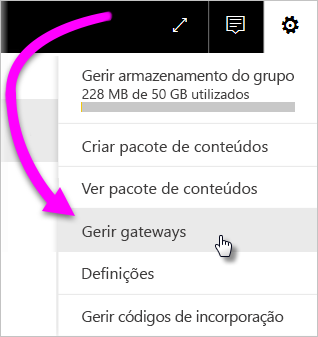
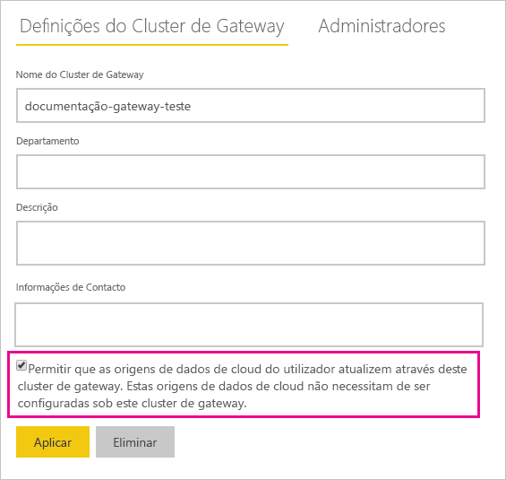
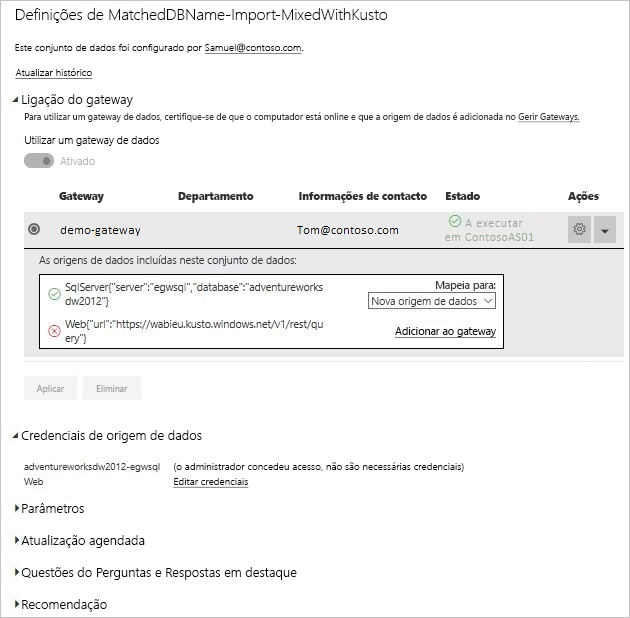

# Intercalar ou anexar origens de dados na cloud e no local

[!INCLUDE [gateway-rewrite](../includes/gateway-rewrite.md)]

Pode utilizar o gateway de dados no local para intercalar ou anexar origens de dados no local e na cloud na mesma consulta. Esta solução é útil quando quer combinar dados de múltiplas origens sem ter de utilizar consultas separadas.

>[!NOTE]
>Este artigo só se aplica a conjuntos de dados que têm origens de dados no local e na cloud intercaladas ou acrescentadas numa única consulta. No caso dos conjuntos de dados que incluem consultas separadas (uma ligada a uma origem de dados no local e outra a uma origem de dados na cloud), o gateway não executa a consulta que utiliza a origem de dados na cloud.

## Pré-requisitos

- Um [gateway instalado](/data-integration/gateway/service-gateway-install) num computador local.
- Um ficheiro do Power BI Desktop com consultas que combinem origens de dados no local e na cloud.

>[!NOTE]
>Para aceder a qualquer origem de dados na nuvem, tem de garantir que o gateway tem acesso a essas origens de dados.

1. No canto superior direito do serviço Power BI, selecione o ícone de engrenagem  > **Gerir gateways**.

    

2. Selecione o gateway que pretende configurar.

3. Em **Definições do Cluster de Gateway**, selecione **Permitir que as origens de dados na cloud do utilizador atualizem através deste cluster de gateway** > **Aplicar**.

    

4. Neste cluster de gateway, adicione todas as [origens de dados no local](service-gateway-enterprise-manage-scheduled-refresh.md#add-a-data-source) utilizadas nas suas consultas. Não precisa de adicionar as origens de dados na cloud aqui.

5. Carregue o seu ficheiro do Power BI Desktop para o serviço Power BI com as consultas que combinam origens de dados no local e na cloud.

6. Na página **Definições do conjunto de dados** para o novo conjunto de dados:

   - Para a origem no local, selecione o gateway associado a esta origem de dados.
   - Em **Credenciais da origem de dados**, edite as credenciais de origem de dados na cloud, conforme necessário.

    Certifique-se de que os níveis de privacidade das origens de dados no local e na cloud estão devidamente definidos para assegurar que as associações são tratadas de forma segura.

     

7. Com as credenciais da cloud definidas, pode atualizar o conjunto de dados através da opção **Atualizar agora**. Em alternativa, pode agendá-la para ser atualizada periodicamente.

## Próximas etapas

Para saber mais sobre a atualização dos dados dos gateways, veja [Utilizar a origem de dados para a atualização agendada](service-gateway-enterprise-manage-scheduled-refresh.md#use-the-data-source-for-scheduled-refresh).
